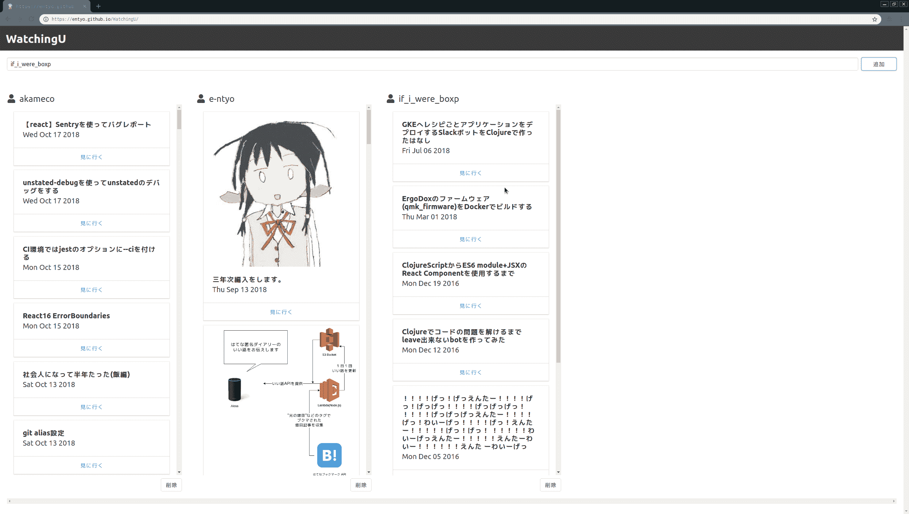
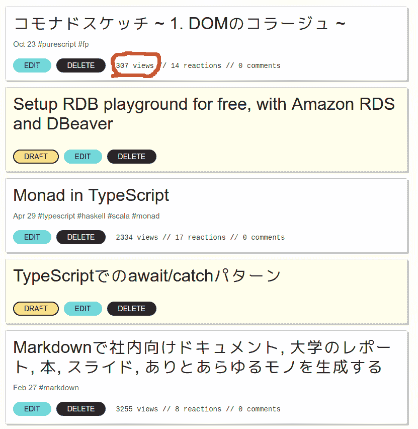

# 康莫纳德素描~ 2.大改造！ ！ 戏剧性的售后服务~

> 原文：<https://dev.to/e_ntyo/--2--13im>

# 康莫纳德素描~ 2.大改造！ ！ 戏剧性的售后服务~

[e_ntyo](https://entyo.github.io) 。 [距离上次的投稿](https://dev.to/e_ntyo/--1-dom--p1n)已经有很多时间了，大家过得怎么样？ 我前几天迎来了生日，[从 Twitter 的粉丝那里收到了很多不太清楚的东西](https://twitter.com/i/moments/1068313344715575296)。

那么，这个连载是用 PureScript 改写用 Angular 写的 SPA。 上次用划痕做了 APP 展览的框架，以此为例对 purescript-halogen (虽然很粗略)进行了解说。

下次(这次)以后预定写异步处理和 Typed CSS

## 连载结束的通知

是的。 结束。

理由有两个，一是找不到写这次报道的时机，前几天终于完成了**[改写](https://github.com/entyo/WatchingU)。 [已经部署在这里](https://entyo.github.io/WatchingU)了。**

那就把从上次的投稿到现在为止都写成报道吧，很遗憾我是个初学者，代码(特别是 API 请求周围)很脏… [Justin](https://github.com/justinwoo) 给了我[的建议 我希望这一带能另外做报道。](https://twitter.com/jusrin00/status/1060142090854850561)

> 闲话不多说，我试着使用了在 WatchingU 的 CI 环境中很久以前就很在意的[Nix Package Manager](https://nixos.org/nix/) 。 关于如何使用 Nix 构建 pure script APP 应用程序的构建环境，Justin 的[这边](https://qiita.com/kimagure/items/de2a4ff45dd8fe8be4b1)的文章很详细。 [如果使用 psc-package2nix](https://github.com/justinwoo/psc-package2nix) 的话，非常容易就能得到最小的 PureScript 的构建环境，我很高兴。

另一个原因是 Halogen 的[realworld example](https://github.com/thomashoneyman/purescript-halogen-realworld) 即将诞生。 这是[purescript-Halogen-formless](https://github.com/thomashoneyman/purescript-halogen-formless) 的作者，也是在实务中大猩猩使用 halogen 的程序员 thomashoneyman。 虽然主体还在 WIP 上，但是大部分指南(像是用这样的指南来设计 APP 演示的家伙)都可以在[这里](https://thomashoneyman.com/guides/real-world-halogen/)阅读(虽然不久前还和源代码在同一个资源库里，但是好像已经被分离了)。 比起读我的报道，读这里绝对更好。 没错。

在指南中主要是定义 APP 模式以避免发生奇怪的事情，以及包含纯粹函数(只是接收登录中的用户名并返回 header 和 footer 等`HTML p i`视图的人们)和`Effect`的组件 虽然只有最后一个项目还是 WIP，但是在主体完成的时候可能会看懂。

正因为如此，反正大家都没看……可以再到终点了吧……

## times

[虽然在 WatchingU 上还有很多没能做好的事情](https://github.com/entyo/WatchingU/issues)，但无论如何，我还是想在读了上述的 realworld example 之后再着手，因为已经有了其他想做的东西，所以我想优先做那个 接下来用[Three.js 的绑定](https://github.com/aqui18/purescript-three)制作玩具。 如果可以的话，我会做报道的。 那么再见。