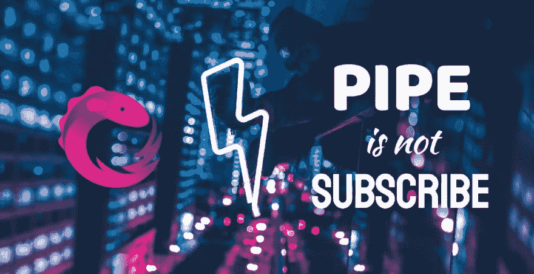

# ⚡闪电战提示 rxjs 管道不是订阅！⚡

> 原文：<https://dev.to/tomastrajan/-blitz-tipsrxjs-pipe-is-not-a-subscribe-2f9d>

### ⚡闪电战小贴士— RxJs 管不了订阅！⚡

<figure> 

<figcaption>快看！闪电提示！(原文📸由[Max Bender](https://unsplash.com/photos/iF5odYWB_nQ?utm_source=unsplash&utm_medium=referral&utm_content=creditCopyText)</figcaption>

</figure>

> 这篇文章是针对试图深入 RxJs 知识的初学者的，但也可以作为快速刷新或参考，以展示给更有经验的开发人员！

今天我们将长话短说，直奔主题！

目前我在一个相当大的组织中工作，有大量的团队和项目(超过 40 个 spa ),他们正在迁移到 Angular，因此也是 RxJs。

这代表了一个接触 RxJs 中令人困惑的部分的好机会，一旦掌握了 API 并专注于特性的实现，就很容易忘记这些部分。

[阅读更多...](https://medium.freecodecamp.org/blitz-tips-rxjs-pipe-is-not-a-subscribe-125c89437a2c)