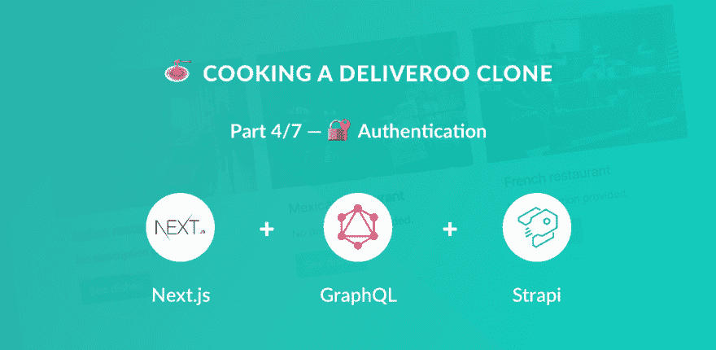

# 🍝用 Next.js (React)、GraphQL、Strapi 和 Stripe 制作一个 Deliveroo 克隆🔐认证(第 4/7 部分)

> 原文：<https://dev.to/ryanaz/-cooking-a-deliveroo-clone-with-nextjs-react-graphql-strapi-and-stripe----authentication-part-47-eho>

[](https://res.cloudinary.com/practicaldev/image/fetch/s--igaezjwU--/c_limit%2Cf_auto%2Cfl_progressive%2Cq_auto%2Cw_880/https://thepracticaldev.s3.amazonaws.com/i/wuj0bbwm4jn31muigkgm.png)

本教程是用 Next.js (React)、GraphQL、Strapi 和 Stripe 制作 Deliveroo 克隆教程系列的一部分。

**目录**

*   [设置](https://dev.to/ryanrez/-cooking-a-deliveroo-clone-with-nextjs-react-graphql-strapi-and-stripe----setup-part-17-ked)(第 1 部分)
*   🏠[餐馆](https://dev.to/ryanrez/-cooking-a-deliveroo-clone-with-nextjs-react-graphql-strapi-and-stripe----restaurants-list-part-27-10ce)(第二部分)
*   🍔[菜肴](https://dev.to/ryanrez/-cooking-a-deliveroo-clone-with-nextjs-react-graphql-strapi-and-stripe----dishes-list-part-37-5eh/)(第三部分)
*   🔐[认证](https://dev.to/ryanrez/-cooking-a-deliveroo-clone-with-nextjs-react-graphql-strapi-and-stripe----authentication-part-47-eho)(第四部分)**-当前**
*   🛒 [购物车](https://dev.to/ryanrez/-cooking-a-deliveroo-clone-with-nextjs-react-graphql-strapi-and-stripe----shopping-cart-part-57-2h1e)(第五部分)
*   💵[订购和结账](https://dev.to/ryanrez/-cooking-a-deliveroo-clone-with-nextjs-react-graphql-strapi-and-stripe----order-and-checkout-part-67-fph)(第六部分)
*   🚀[奖励:部署](https://dev.to/ryanrez/-cooking-a-deliveroo-clone-with-nextjs-react-graphql-strapi-and-stripe----bonus-deploy---part-77-1i8e)(第七部分)-

*注:* *源代码* *在 GitHub 上有**:[https://GitHub . com/strapi/strapi-examples/tree/master/nextjs-react-strapi-deliver oo-clone-tutorial *](https://github.com/strapi/strapi-examples/tree/master/nextjs-react-strapi-deliveroo-clone-tutorial*)。**

## 🔐证明

对于身份验证，我们可以使用 Strapi SDK 来注册和登录我们的用户。Strapi 将返回一个 JWT 令牌，该令牌可用于验证服务器上的事务(尽管我们不会在本教程中设置服务器验证，但您应该在实际应用程序中设置)。

关于用户的 strapi 文档可以在这里找到:[https://strapi.io/documentation/1.x.x/users.html](https://strapi.io/documentation/1.x.x/users.html)。

### 认证

对于身份验证，我们将使用 2 个高阶组件`defaultPage.js`和`securePage.js`来包装我们的页面，并将一个经过身份验证的 prop 向下传递给必要的组件。

在项目的根目录下新建一个目录:

```
mkdir hocs
cd hocs
touch defaultPage.js
touch securePage.js 
```

路径:`/frontend/components/hocs/defaultPage.js`