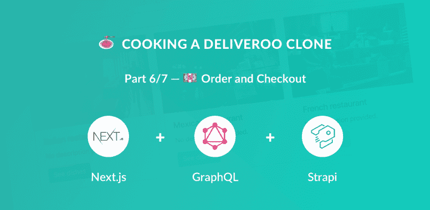
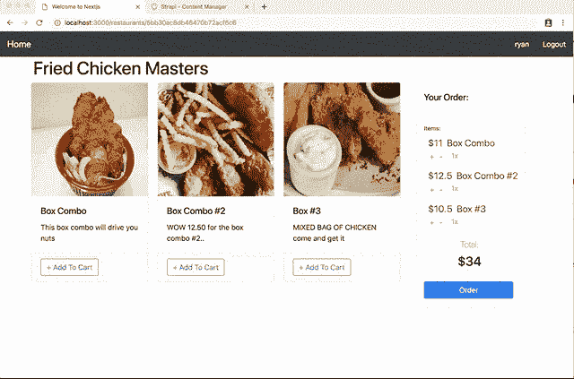
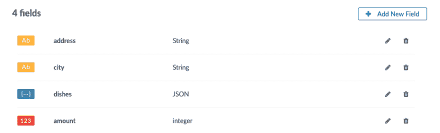

# 🍝用 Next.js (React)、GraphQL、Strapi 和 Stripe 制作一个 Deliveroo 克隆💵订购和结账(第 6/7 部分)

> 原文：<https://dev.to/ryanaz/-cooking-a-deliveroo-clone-with-nextjs-react-graphql-strapi-and-stripe----order-and-checkout-part-67-fph>

本教程是用 Next.js (React)、GraphQL、Strapi 和 Stripe 制作 Deliveroo 克隆教程系列的一部分。

**目录**

*   [设置](https://dev.to/ryanrez/-cooking-a-deliveroo-clone-with-nextjs-react-graphql-strapi-and-stripe----setup-part-17-ked)(第 1 部分)
*   🏠[餐馆](https://dev.to/ryanrez/-cooking-a-deliveroo-clone-with-nextjs-react-graphql-strapi-and-stripe----restaurants-list-part-27-10ce)(第二部分)
*   🍔[菜肴](https://dev.to/ryanrez/-cooking-a-deliveroo-clone-with-nextjs-react-graphql-strapi-and-stripe----dishes-list-part-37-5eh/)(第三部分)
*   🔐[认证](https://dev.to/ryanrez/-cooking-a-deliveroo-clone-with-nextjs-react-graphql-strapi-and-stripe----authentication-part-47-eho)(第四部分)
*   🛒 [购物车](https://dev.to/ryanrez/-cooking-a-deliveroo-clone-with-nextjs-react-graphql-strapi-and-stripe----shopping-cart-part-57-2h1e)(第五部分)
*   💵[订购和结账](https://dev.to/ryanrez/-cooking-a-deliveroo-clone-with-nextjs-react-graphql-strapi-and-stripe----order-and-checkout-part-67-fph)(第六部分) **-当前**
*   🚀[奖励:部署](https://dev.to/ryanrez/-cooking-a-deliveroo-clone-with-nextjs-react-graphql-strapi-and-stripe----bonus-deploy---part-77-1i8e)(第七部分)-

注:**源代码**是 GitHub 上的**:[https://GitHub . com/strapi/strapi-examples/tree/master/nextjs-react-strapi-deliver oo-clone-tutorial *](https://github.com/strapi/strapi-examples/tree/master/nextjs-react-strapi-deliveroo-clone-tutorial*)。**

## 💵订购和结账

你一定开始饿了...我相信你希望能够订购！

### 定义内容类型

我们需要在数据库中存储订单，因此我们将在 API 中创建一个新的内容类型。

与往常一样的流程:

*   导航到内容类型构建器([http://localhost:1337/admin/plugins/Content-Type-Builder](http://localhost:1337/admin/plugins/content-type-builder))。
*   点击`Add Content Type`。
*   将`order`设置为名称。
*   点击`Add New Field`并创建以下字段:
    *   `address`同类型`String`。
    *   `city`同类型`String`。
    *   `dishes`同类型`JSON`。
    *   `amount`同类型`Integer`(十进制)。
*   点击保存。

### 允许访问

为了从客户端创建新订单，我们将点击`order` API 的`create`端点。要允许访问，导航到角色&权限部分([http://localhost:1337/admin/plugins/users-Permissions](http://localhost:1337/admin/plugins/users-permissions)，选择`authenticated`角色，勾选`order/create`复选框并保存。

### 条纹设置

在本节中，您将需要条带 API 密钥。要获得它们，创建一个 Stripe 帐户并导航到[https://dashboard.stripe.com/account/apikeys](https://dashboard.stripe.com/account/apikeys)。

### 添加逻辑

如果你已经使用 Stripe，你可能知道信用卡信息不会通过你的后端服务器。相反，信用卡信息被发送到 Stripe API(理想情况下使用他们的 SDK)。然后，您的前端收到一个令牌，可用于信用卡收费。必须将`id`发送到您的后端，这将产生条带费用。

不通过您的服务器传递信用卡信息减轻了您满足复杂的数据处理合规性的责任，并且比担心安全地存储敏感数据要容易得多。

为了集成条带逻辑，我们需要更新 Strapi API 中的`create` charge 端点。为此，编辑`backend/api/order/controllers/order.js`,将其内容替换为:

*路径:`/backend/api/order/controllers/order.js`*