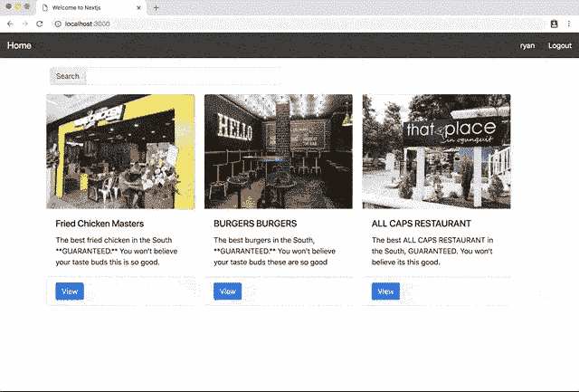
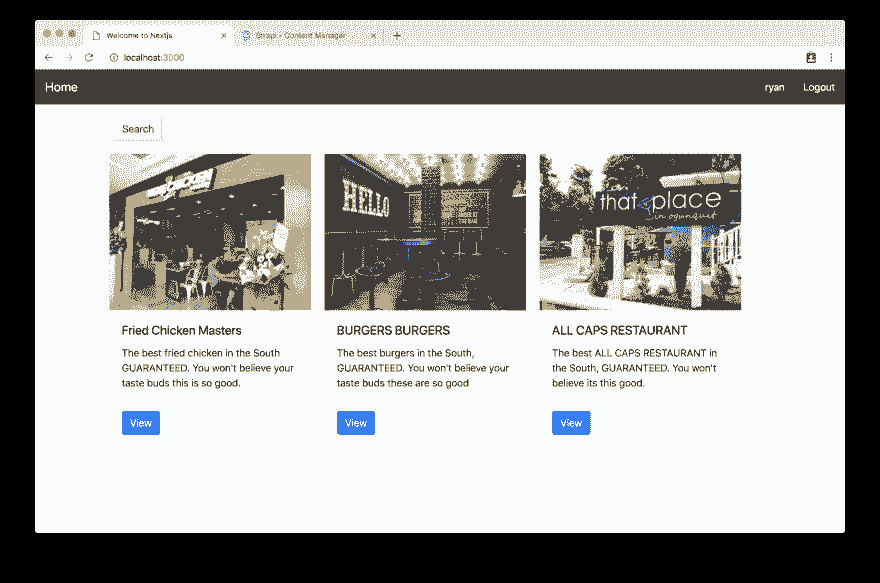
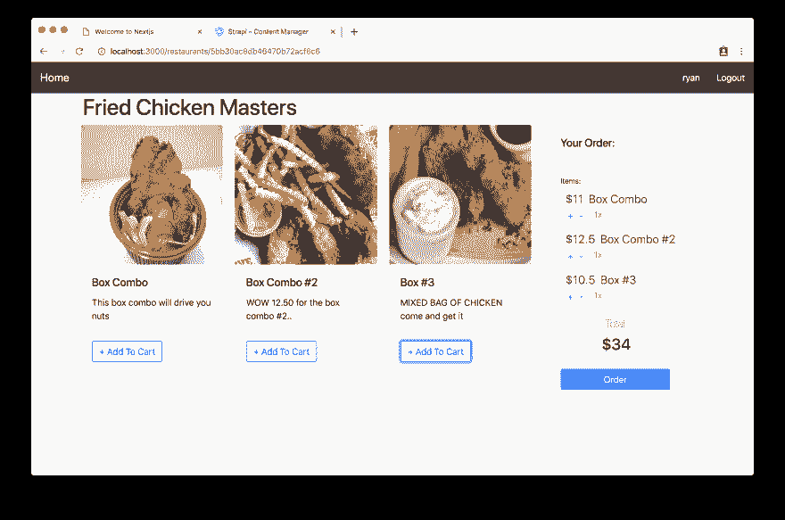
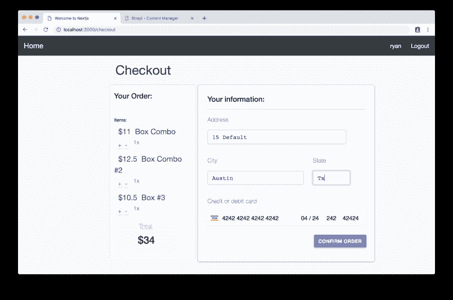

# 🍝用 Next.js (React)、GraphQL、Strapi 和 Stripe 制作一个 Deliveroo 克隆🏗️设置(第 1/7 部分)

> 原文：<https://dev.to/ryanaz/-cooking-a-deliveroo-clone-with-nextjs-react-graphql-strapi-and-stripe----setup-part-17-ked>

本教程将在前端使用**next . js**(React)over Nuxt(Vue)，完成 **GraphQL、Stripe、Strapi 和 React Context** 。

准备开发一个 **Deliveroo 克隆人，使用令人惊叹的技术: [Next.js](https://nextjs.org) ( [React](https://reactjs.org) )、 [GraphQL](https://graphql.org) 、 [Stripe](http://stripe.com/) 和 [Strapi](https://strapi.io/)** ！从注册到点餐，你将让用户发现餐馆、菜肴并选择他们的快乐套餐。

[](https://res.cloudinary.com/practicaldev/image/fetch/s--eN2cRkH5--/c_limit%2Cf_auto%2Cfl_progressive%2Cq_auto%2Cw_880/https://thepracticaldev.s3.amazonaws.com/i/d0llou78vh8qc9jzynpd.png)

最终结果的**演示应该让你饿了:**

[](https://res.cloudinary.com/practicaldev/image/fetch/s--oGvuruzt--/c_limit%2Cf_auto%2Cfl_progressive%2Cq_66%2Cw_880/https://thepracticaldev.s3.amazonaws.com/i/tbmklb7jcsr2766gba0p.gif)

*注:* *源代码* *在 GitHub 上有**:[https://GitHub . com/strapi/strapi-examples/tree/master/nextjs-react-strapi-deliver oo-clone-tutorial *](https://github.com/strapi/strapi-examples/tree/master/nextjs-react-strapi-deliveroo-clone-tutorial*)。**

最终产品截图:
[](https://res.cloudinary.com/practicaldev/image/fetch/s--9l4Vkts9--/c_limit%2Cf_auto%2Cfl_progressive%2Cq_auto%2Cw_880/https://thepracticaldev.s3.amazonaws.com/i/gtjlxaou10zxlw8ym9t8.png)
[](https://res.cloudinary.com/practicaldev/image/fetch/s--a33I3bRt--/c_limit%2Cf_auto%2Cfl_progressive%2Cq_auto%2Cw_880/https://thepracticaldev.s3.amazonaws.com/i/hduqy4dqy6zg4w0ause7.png)
[](https://res.cloudinary.com/practicaldev/image/fetch/s--xkb6ROzs--/c_limit%2Cf_auto%2Cfl_progressive%2Cq_auto%2Cw_880/https://thepracticaldev.s3.amazonaws.com/i/6v35vzh4kf97um3z266u.png)

### 斯特拉皮:

[**Strapi**](https://github.com/strapi/strapi) 是最先进的开源 **Node.js 无头内容管理系统**用于快速高效地构建可扩展、安全、生产就绪的 api，节省开发人员无数的开发时间。

凭借其可扩展的插件系统，它提供了大量的内置功能:管理面板、认证和权限管理、内容管理、API 生成器等。与在线 CMS 不同， **Strapi 是 100%开源的**(看看 [GitHub 库](https://github.com/strapi/strapi))，这意味着:

*   strapi**完全自由**。
*   你可以**在你自己的服务器**上托管它，所以你拥有数据。
*   多亏了插件系统，它完全是可定制和可扩展的。

### Next.js:

[**下一个**](https://github.com/zeit/next.js/) 是一个轻量级开发框架，在 **React** 中创建静态的、服务器渲染的应用。Next.js 将负责应用程序的繁重工作，如*代码分割、HMR(热模块替换)和 SSR(服务器端渲染)*，并允许我们专注于应用程序。

### 反应过来:

[**React**](https://github.com/facebook/react) 是最受欢迎的前端 Javascript 框架之一，由 facebook 开发，被包括*网飞、Airbnb 和 Github* 在内的无数科技公司用于构建应用。React 是一个声明性的库，它使创建交互式用户界面变得容易，通过其基于组件的架构保持代码库的组织性。

### GraphQL:

[**GraphQL**](https://github.com/graphql) 也是脸书开发的一种查询语言，允许应用的前端轻松查询应用的 API。每个查询只请求当前视图需要呈现的数据。这使得开发者能够在*多种设备和屏幕尺寸*上打造出色的用户体验。

### 条纹:

**是当今应用的支付处理器之一(如果不是最大的)。Stripe 开发了工具和 SDK，允许开发人员轻松地将*安全、合规的支付处理*集成到任何应用中。**

 **## 目录

*   🏗️ [设置](https://dev.to/ryanrez/-cooking-a-deliveroo-clone-with-nextjs-react-graphql-strapi-and-stripe----setup-part-17-ked)(第一部分)**-当前**
*   🏠[餐馆](https://dev.to/ryanrez/-cooking-a-deliveroo-clone-with-nextjs-react-graphql-strapi-and-stripe----restaurants-list-part-27-10ce)(第二部分)
*   🍔[菜肴](https://dev.to/ryanrez/-cooking-a-deliveroo-clone-with-nextjs-react-graphql-strapi-and-stripe----dishes-list-part-37-5eh/)(第三部分)
*   🔐[认证](https://dev.to/ryanrez/-cooking-a-deliveroo-clone-with-nextjs-react-graphql-strapi-and-stripe----authentication-part-47-eho)(第四部分)
*   🛒 [购物车](https://dev.to/ryanrez/-cooking-a-deliveroo-clone-with-nextjs-react-graphql-strapi-and-stripe----shopping-cart-part-57-2h1e)(第五部分)
*   💵[订购和结账](https://dev.to/ryanrez/-cooking-a-deliveroo-clone-with-nextjs-react-graphql-strapi-and-stripe----order-and-checkout-part-67-fph)(第六部分)
*   🚀[奖励:部署](https://dev.to/ryanrez/-cooking-a-deliveroo-clone-with-nextjs-react-graphql-strapi-and-stripe----bonus-deploy---part-77-1i8e)(第七部分)##🏗️设置

### 接下来

要设置 Next.js，我们需要一个空目录来安装库并托管我们的项目根目录。

我们将把我们的项目分成两部分，一部分用于前端(Next.js 代码)，一部分用于后端(Strapi 代码)。

```
mkdir strapi-deliveroo
cd strapi-deliveroo
mkdir frontend
cd frontend

yarn add next react react-dom 
```

*注意:我使用 yarn 作为我的包管理器，你也可以使用 npm 并执行`npm install --save next react react-dom`* 。

将以下内容添加到您的`package.json`文件中:

```
"scripts": {
  "dev": "next",
  "build": "next build",
  "start": "next start"
} 
```

因此您的文件看起来像这样(您的包依赖项可能有不同的版本，这取决于安装的时间):

```
{
  "dependencies": {
    "next": "^7.0.2",
    "react": "^16.6.1",
    "react-dom": "^16.6.1",
  },
  "scripts": {
    "dev": "next",
    "build": "next build",
    "start": "next start"
  }
} 
```

Next.js 使用`/pages`目录中的任何 JavaScript 文件作为应用程序的路径。要进行设置，只需创建`/pages`目录并添加一个带有
的`index.js`文件

```
mkdir pages
cd pages
touch index.js 
```

现在我们有了我们的主路径(index.js)，它将在每次浏览器 URL 位于根目录时被加载(即[www.yourapp.com](http://www.yourapp.com))。为了测试这一点，您可以将以下代码插入 index.js 文件:

```
export default () => <div>Welcome to next.js!</div> 
```

要查看正在运行的应用程序，请使用:
启动本地开发服务器

```
yarn dev 
```

您的应用程序现在应该在 [http://localhost:3000](http://localhost:3000) 上可见。

确保在项目根目录下创建一个`.gitignore`，并在其中添加`.next`和`node_modules`目录:

```
cd ..
touch .gitignore 
```

```
/* .gitignore */
node_modules
.next 
```

**添加引导程序**

对于本教程，我们将使用 [react-strap](https://reactstrap.github.io/) 在我们的应用程序中实现 Bootstrap 4。对于 CSS 样式，我们将直接从 CDN 导入。

首先安装 Reactstrap:

```
yarn add reactstrap bootstrap 
```

reactstrap 只是一个前端库，可以轻松创建引导组件和样式。

为了导入 CSS 并在所有页面间共享布局组件，我们将在**页面目录**中使用一个自定义的`_app.js`文件。

这个文件将覆盖 Next 使用的默认 App.js，并呈现在每个页面上，允许我们在一个地方设置全局样式/共享组件。

你可以在这里阅读更多关于`_app.js`处理:[https://nextjs.org/docs/#custom-app](https://nextjs.org/docs/#custom-app)。

这将使我们能够导入一个`<Head>`组件，并在标题中全局设置样式表。

```
cd pages
touch _app.js 
```

路径:`/frontend/pages/_app.js`**