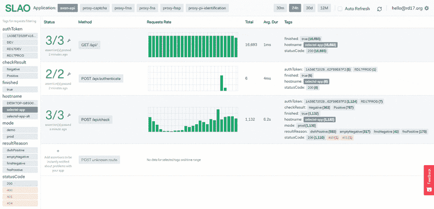

# 📊SLAO: Node.js +快递监控工具

> 原文：<https://dev.to/sochix/-slao-nodejs--express-monitoring-tool-48de>

我已经创建了一个工具，可以从一个仪表板监控 REST API 的性能和正确性。与其他超载的杀伤人员地雷不同，SLAO 是必需品。

在这里试一试👉 [https://slao.io](https://slao.io)