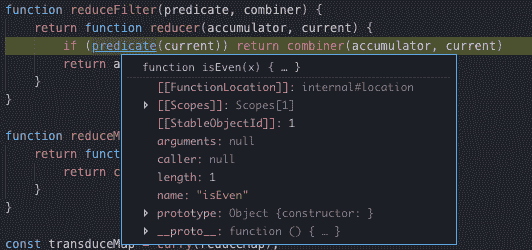
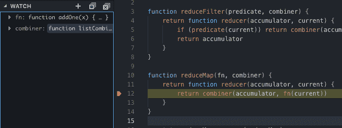

# “为什么传感器很酷”

> 原文：<https://dev.to/copperwall/-why-transducers-are-cool-1a7f>

我写这篇文章的灵感主要来自于阅读了 Functional-Light JavaScript 的附录 A，它解释了转换器的概念。这是我第三次或第四次浏览那个附录，我觉得我实际上开始掌握这个概念了，所以我想我应该写下它来更好地掌握它。

这篇文章将包括一些函数式编程概念，如函数组合和 currying，以及一些常见的列表操作，如 map、filter 和 reduce。我将尝试介绍一些背景知识，但这主要是假设您熟悉这些概念。

## 信用

这主要是对[Functional-Light JavaScript](https://www.amazon.com/Functional-Light-JavaScript-Balanced-Pragmatic-FP/dp/1981672346/ref=sr_1_fkmrnull_1?crid=2IONLW0KNDAEN&keywords=functional+light+javascript&qid=1552939990&s=gateway&sprefix=functional+light%2Caps%2C192&sr=8-1-fkmrnull)的附录 A 的重复，这是一本关于实用 JavaScript 函数式编程的超级棒的书。如果你对这本书感兴趣，我绝对推荐你去买。此外，如果这篇文章不完全有意义，这本书应该是一个很好的资源，可能会更好地解释这些概念。

## 功能组成

功能组合是通过组合、合并或链接多个其他功能来创建新功能的思想。你可以把它想象成使用多种功能作为积木或乐高积木，通过把那些小块组合在一起创造一个新的结构。组合也是 shell 脚本中经常使用的一种思想，在这种思想中，具有特定目的的多个命令可以很容易地组合在一起，从而生成非常强大的程序。

在这篇文章中，我们将看一下 *compose* ，一个高阶函数，它接受一个变量函数列表作为参数，并返回一个新函数，这样，返回函数的输入被传递给参数列表中的最后一个函数，该函数的返回值作为输入被传递给参数中的倒数第二个函数，依此类推。

这里举个小例子来说明。

```
import { compose } from 'lodash/fp'
const addOne = x => x + 1
const isEven = x => x % 2 == 0

const isPlusOneEven = x => isEven(addOne(x))
const composed = compose(isEven, addOne) 
```

Enter fullscreen mode Exit fullscreen mode

在上面的例子中，*isplusoneven*和 *composed* 是等价的函数，它们都取一个数，加 1，然后返回一个布尔值，如果结果是偶数或者不是。使用*构图*时，功能从右向左执行。可视化它们在*isplusoneven*实现中的显示顺序很有帮助。

## 构成映射功能

组合函数的一个有趣的特性是，它们可以用来合并对数组上的 *map* 的多次调用。

```
const resourceIds = [1,2,3,4,5];

const buildResourceURL = id => `https://api.example.com/${id}`
const fetchResource = url => fetch(url)

let responses = resourceIds.map(buildResourceUrl).map(fetchResource)

// This an intermediate list returned from the first map can be avoided by composing the two mappers
// The result should be the same as before (barring any side effects)
const getResourceFromId = compose(fetchResource, buildResourceUrl)
responses = resourceIds.map(getResourceFromId) 
```

Enter fullscreen mode Exit fullscreen mode

通过组合这两个映射器， *resourceIds* 可以仅迭代一次而不是两次，并且避免了通过分离映射步骤创建的任何中间列表。因此，任何时候在一个数组上有多个链接的映射调用，您都可以将其压缩为一个映射调用，将所有的映射函数组合在一起。

映射函数可以合成，因为它们具有相同的“形状”。映射器函数接受单个参数并返回单个新值。一个映射函数的返回值很容易被接受为另一个映射函数的参数。

## 试图构成过滤和减少

其他一些常见的列表操作包括*过滤*和*减少*。*过滤器*接受一个谓词函数(一个返回 true 或 false 的函数)并返回一个新的列表，该列表只包含在向其传递值时导致谓词函数返回 true 的元素。 *reduce* 取一个 reducer 函数和一个可选的初始值。reducer 函数接受一个累加器参数和一个当前元素参数，并在调用 reduce 的数组的每个成员上调用。 *reduce* 的特殊之处在于，当对数组中的下一个项目调用 reducer 函数时，它获取前一次调用 reducer 函数的结果，并将返回值作为*累加器*参数传递。 *reduce* 的一些常见用法包括获取一个项目列表并将它们“缩减”成一个结果。

```
// Filter example

const isGreaterThanTen = x => x > 10
const isEven = x => x % 2 == 0

[5,12,2,13,10].filter(isGreaterThanTen) // [12,13]
[5,12,2,13,10].filter(isGreaterThanTen).filter(isEven) // [12] 
```

Enter fullscreen mode Exit fullscreen mode

```
// Reduce Example

// Sum doesn't need an initial value, because the first element in the array can be used as the initial value.
const sum = [1,2,3,4].reduce((accumulator, current) => accumulator + current); // 10

// The flattened reduce call uses an empty list as the initial value, because the accumulator needs to always be an array
// and the first element doesn't match that type. Calling accumulator.concat when accumulator is 0 would cause an error.
const flattened = [0, [1,2], [3,4]].reduce((accumulator, current) => accumulator.concat(current), []) // [0,1,2,3,4] 
```

Enter fullscreen mode Exit fullscreen mode

如果我们可以组成映射函数，也许我们可以组成相邻的过滤器和减少。

```
// Compose filters example

const isGreaterThanTen = x => x > 10
const isEven = x => x % 2 == 0

const isGreaterThanTenAndEven = compose(isEven, isGreaterThanTen)

// Uh oh, doesn't work :(
[5,12,2,13,10].filter(isGreaterThanTenAndEven) 
```

Enter fullscreen mode Exit fullscreen mode

在上面的例子中，组合函数*是 greaterthanten，甚至*与组成它的两个函数没有相同的形状。 *isEven* 和 *isGreaterThanTen* 都期望一个数字作为输入并返回一个布尔值。当试图组合它们时，当将*的结果作为*的输入传递给*时，会出现问题。此时 *isEven* 期望一个数字，但是被给了一个布尔值，它丢失了它应该运行的元素的上下文。对于 *reduce* 也有类似的问题，reducer 函数返回单个值，但是接受两个参数作为输入，因此一个 reducer 函数的输出不能简单地传递给另一个 reducer 函数。*

这篇文章的剩余部分是关于如何组成映射、过滤器和归约，这样你就可以把多个映射、过滤器和归约合并成一个归约。

## 输入传感器

### 使用 reduce 进行贴图和滤镜

*reduce* 的一个有趣的性质是*贴图*和*滤镜*可以用 *reduce* 来表示。

```
function reduceMap(fn) {
    return function reducer(accumulator, current) {
        accumulator.push(fn(current))
        return accumulator
    }
}

[1,2,3].reduce(reduceMap(x => x + 1)) // [2,3,4]

function reduceFilter(predicate) {
    return function reducer(accumulator, current) {
        if (predicate(current)) accumulator.push(current)
        return accumulator
    }
}

[1,2,3,4].reduce(reduceFilter(x => x > 2)) // [3,4]

[1,2,3,4]
.reduce(reduceFilter(x => x > 2))
.reduce(reduceMap(x => x + 1))
// [4,5] 
```

Enter fullscreen mode Exit fullscreen mode

既然我们可以表达映射、过滤器和多个链式 reduce 调用，也许我们可以做些什么来组合这些 reduce 函数。

与此同时，我们可以做的事情是抽象出将结果组合在 *reduceMap* 和 *reduceFilter* 中的功能。在这些例子中，我们总是追加到一个列表并返回该列表，我们可以传递累积值和新值来组合并返回结果。

```
function reduceFilter(predicate, combiner) {
    return function reducer(accumulator, current) {
        if (predicate(current)) return combiner(accumulator, current)
        return accumulator
    }
}

function reduceMap(fn, combiner) {
    return function reducer(accumulator, current) {
        return combiner(accumulator, fn(current))
    }
}

function listCombine(list, value) {
    list.push(value)
    return list
}

function sumCombine(sum, number) {
    return sum + number
}

[1,2,3,4].reduce(reduceFilter(x => x > 2, listCombine), []) // [3,4]
[1,2,3,4].reduce(reduceMap(x => x + 1, sumCombine), 0) // 14 
```

Enter fullscreen mode Exit fullscreen mode

在上例中，我们定义了一个 *listCombine* 和一个 *sumCombine* 。这两个函数都可以用作组合函数，因为它们接受*一个累加器和一个项，并返回一个新值*。如果你看看那些函数，它们和 reducer 函数的形状是一样的。也许我们可以找到一种方法，用我们的 map reducers 和 filter reducers 组合函数！如果我们想到第二个参数 *reduceFilter* 和 *reduceMap* 以及下一个 reducer，也许我们可以将这些函数链接在一起。

```
const addOne = x => x + 1
const isEven = x => x % 2 == 0
const sumCombine = (sum, number) => sum + number

const chainedReducer = reduceFilter(isEven,
                            reduceMap(addOne,
                                sumCombine))

[1,2,3].reduce(chainedReducer); 
```

Enter fullscreen mode Exit fullscreen mode

我们创建了一个名为 *chainedReducer* 的函数，它创建了一个过滤器 Reducer 来检查给它的值是否是偶数。如果值是偶数，它将累加器和值传递到给 *reduceFilter* 的*合并器*，这种情况下是 *reduceMap* 返回的 addOne reducer。然后 *addOne* 缩减器将调用 *addOne* 的结果传递给值，并将累加器和新值传递给其*组合器*参数，即 *sumCombine* 。

我们获取一个 reduceMap 函数的输出并将其作为 reduceFilter 的输入的方式类似于组合函数在代码中的样子。

```
const chainedReducer = reduceFilter(isEven,
                            reduceMap(addOne,
                                sumCombine))
const chainedFunctions = arg => x(y(z(arg))) 
```

Enter fullscreen mode Exit fullscreen mode

唯一的问题是 *reduceFilter* 和 *reduceMap* 接受两个参数，这使得它们比一元函数或接受单个参数的函数更难组合。我们可以通过使用 *reduceFilter* 和 *reduceMap* 处理函数来解决这个问题，这样我们就可以传递映射器和谓词函数，然后组合部分应用的函数。这是一切开始汇集的地方。

```
import { curry, compose } from 'lodash/fp'
const transduceMap = curry(reduceMap)
const transduceFilter = curry(reduce)

const addOne = transduceMap(function addOne(x) { return x + 1 })
const isEven = transduceFilter(function isEven(x) { return x % 2 == 0 })

let transducer = combiner => isEven(addOne(combiner))
// OR
transducer = compose(
    isEven,
    addOne
)

[1,2,3,4].reduce(transducer(listCombine), []) // [3,5]
[1,2,3,4].reduce(transducer(sumCombine)) // 8 
```

Enter fullscreen mode Exit fullscreen mode

在上面的例子中，*转换器*是我们的*还原过滤器*和*还原映射*的组合，它将*组合器*作为单个参数。

需要注意的是，数据从左到右流过组合的 reducer 函数，这与通常使用 compose 时从右到左相反。所以每个值将首先通过 *isEven* ，如果通过谓词，那么将被传递给 *addOne* ，最终传递给 *listCombine* 或 *sumCombine* 。

### 为什么反了？

isEven 是一个部分应用的函数，它接受一个组合器函数作为参数。调用它的结果是一个 reducer 函数，它具有词法范围内可用的谓词函数和组合函数。通过使用组合器参数调用组合函数，从右到左传递的值是 reducer 函数，它们作为参数传递给下一个最左边的函数。

所以当我们调用 *transducer(listCombine)* 时， *listCombine* 首先被传递给 *addOne* ，这是一个 *reduceMap* 调用，它已经部分应用了一个 mapper 函数。由于 *listCombine* 实现了已定义/部分应用的函数的最后一个参数，因此调用了最初的 *reduceMap* 函数，并返回一个接受累加器和当前参数的 reducer 函数，但在词法范围内具有映射器函数和组合器函数。然后将返回的 reducer 函数作为 *isEven* 的*组合器*参数传递给 *isEven* ，这导致 *isEven* 返回一个 reducer 函数，该函数接受累加器和当前参数，并将来自 *addOne* 的谓词函数和 reducer 作为其范围内的组合器。转换器的结果值是一个 reduce 函数，可以插入到任何 reduce 函数中，无论是 *Array.prototype.reduce* ，还是来自任何其他函数编程库的 *reduce* 。

### 踏过它

如果你想更好地了解它是如何工作的，我真的建议在一个编辑器中放置一些调试断点，比如 VS Code 或 Atom，并逐步完成 reducer 调用。

我在 reduceFilter 和 reduceMap 返回的 reducer 函数中放置了断点，并逐步查看它们被调用的顺序、谓词和映射器函数的值以及组合器函数的值。在第一张图中，reduceFilter 断点首先被触发，谓词函数值是传递给*transducer filter*的已命名 *isEven* 函数，组合器函数是由 *addOne* 函数传递的匿名 reducer 函数。传递给它的第一个值是 **1** ，它没有传递谓词，所以没有调用组合器函数。

[](https://res.cloudinary.com/practicaldev/image/fetch/s--pclTFDIo--/c_limit%2Cf_auto%2Cfl_progressive%2Cq_auto%2Cw_880/https://s3-us-west-2.amazonaws.com/copperwall-blog-images/copperwall-dev/debug1.png)

用 **2** 再次调用过滤归约器，过滤归约器调用合并器，合并器触发*归约映射*中的断点。此时，映射器函数是传递给*transducer map*的已命名的 *addOne* 函数，本例中的组合器是 *listCombine* 函数。

[](https://res.cloudinary.com/practicaldev/image/fetch/s--501qNKVo--/c_limit%2Cf_auto%2Cfl_progressive%2Cq_auto%2Cw_880/https://s3-us-west-2.amazonaws.com/copperwall-blog-images/copperwall-dev/debug2.png)

## 库

如果你想在你的代码中使用它，Clojure 和 ClojureScript 的开发者有一个 [transducers-js](https://github.com/cognitect-labs/transducers-js) 库。这些文件也很棒，我真的推荐你看一看。

## 感谢阅读！

写这篇文章既是为了你的理解，也是为了我对这些概念的理解，所以如果有什么不清楚，或者有什么可以更好地解释，或者有什么不对，请让我知道。我是推特上的[@铜墙铁壁](https://twitter.com/copperwall)。