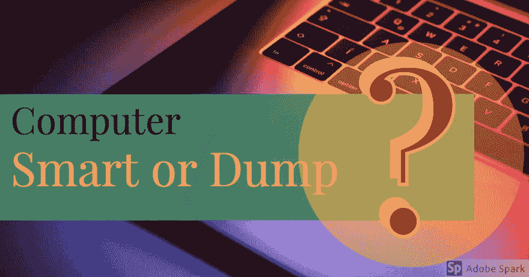
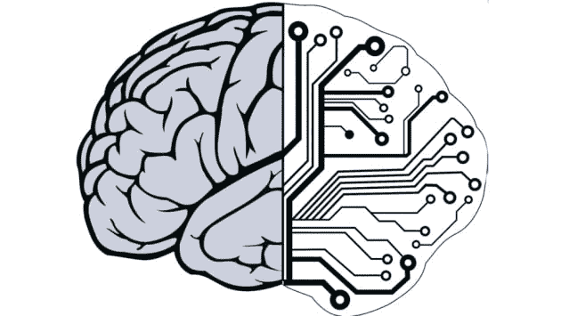
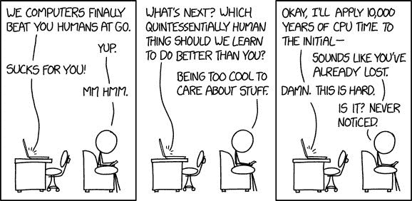

# 0 或 1！！！

> 原文：<https://dev.to/abhishekalbert/0-or-1--4g8n>

你好。！你有没有想过为什么我们的计算机只能理解二进制语言？？只有二进制，而不是任何其他语言，如英语，印地语，乌尔都语，西班牙语或十六进制，十八进制等。不是一件奇怪的事情吗？？？你想过吗？？

有一次我问教授这个问题，他真诚地回答:

我问:

> 先生，我有一个问题，也许你认为这是一个愚蠢的问题，但我想和你讨论一下为什么计算机只能理解二进制语言？？？

然后他说:

> 没有问题是愚蠢的。这只是一个理解和解释基础知识的问题。关键是计算机是一种电子设备，它的工作是基于二进制信号的开或关，这就是为什么计算机工作在二进制 0 和 1 的低电平上。计算机可以用任何语言编程，但在低级语言中，它只能理解二进制信号。首先每个信息被翻译成 1 和 0，然后微处理器根据特定的任务执行指令。

在目前的计算机中，它们被认为是智能的，计算速度快，但在我看来，它们也是垃圾。你怎么想呢?？

> “电脑没用。他们只能给你答案”。帕布罗·毕加索

但是他们既聪明又愚蠢是有原因的....

**原因**他们是哑巴:

原因是他们可以做一些特定的任务，当我们给他们一个命令，比如点击这个 PC 图标，或者为了得到想要的输出，我们给他们一些特定语言的代码行，比如 C，JAVA，Python 等。之后，他们将这些命令转换成二进制语言，然后理解之后，他们会给你你想要的输出。你不能像想象一台计算机叫史密斯，你想开你的 facebook 账户或者想添加一长串数字，然后你不能像史密斯那样说开我的 facebook 账户或者像我们对其他人那样添加这些数字。有了他们，我们必须发号施令。因为他们只懂二进制语言。

让我们回到我们的话题为什么只有 0 和 1？？

我将用一个我们人体的例子来解释这个。如果我们把我们的人体结构比作一台电脑，我们会发现两者的结构几乎是一样的。现在的问题是怎么做？？现在我再次建议你在仔细阅读我的话之前想一想。

现在时间到了，轮到我了。我们工作、思考等的能量来源是什么？？？是的，你是正确的食物。我们吃的能给我们能量的食物。同样，计算机的能源也是电力。希望你明白了。像命令一样思考怎么样，比如你需要睡觉，现在你饿了，或者只是用你的右手或左手写字。是的，你明白了，大脑，你的大脑给你的身体所有的指令。同样，CPU 被认为是我们计算机的大脑。为了处理或完成任何工作，CPU 也像我们的大脑一样需要一些能量。但是我们的大脑有大量的半膜来通过神经信号发送和接收信息，但是我们的大脑没有半膜，他只有值，即真或假。“真”表示 CPU 收到电信号，即处于“开”状态,“假”表示 CPU 没有收到任何电信号，即处于“关”状态。而当你试图去了解计算机的逻辑结构意味着他是如何进行计算的？？
那么理性就是逻辑门，它总是只给出两个值，即真或假。0 表示假，1 表示真。
这就是为什么他总是将每一行和命令转换成二进制，然后用我们想要的语言给出结果。

<figure>

<figcaption></figcaption>

</figure>

所以说的都是他为什么那么倾倒，只懂 0 和 1。现在回到他有多聪明？？

**为什么计算机如此聪明** :
原因很简单，他能做但对我们来说不可能的事情，即*一秒钟数十亿次计算/任务。*它们总是给出理想的输出，直到算法出错或者你写的代码没有错误。

> “技术已经永远改变了我们生活的世界。我们整天都在网上，以这样或那样的方式。我们的手机和电脑已经成为我们个性、兴趣和身份的反映。他们拥有很多对我们来说很重要的东西。”
> 詹姆斯·科米

更多信息，你可以阅读 time.com 的文章[电脑比人聪明吗](http://time.com/4960778/computers-smarter-than-humans/)。

就这些了，希望你喜欢。如果您有任何疑问，请在下方评论。

下一篇文章再见。

编码快乐！！！