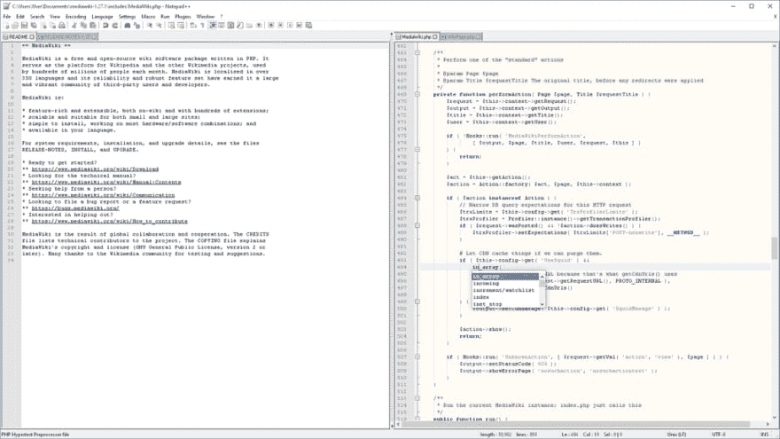

# eclipse vs Netbeans vs vs code——你用哪个编码？

> 原文：<https://dev.to/prahladyeri/eclipse-vs-netbeans-vs-vscode-which-one-do-you-use-for-coding-1mld>

他们都是优秀的 ide，而 Java 编码人员在 ide 方面的选择也很古怪。我已经很多年没碰过 eclipse 和 netbeans 了，这些天它们变好了还是变坏了😄？

对于全职来说，我使用一个非常古老和可悲的编辑器 Notepad++来处理几乎所有的事情，但主要是 HTML/CSS/JS，因为这是我大部分时间做的事情。人们不时地试图说服我使用 VSCode，但我对 NPP 太习惯了，也许有一天我会尝试进行这种转换😉。

