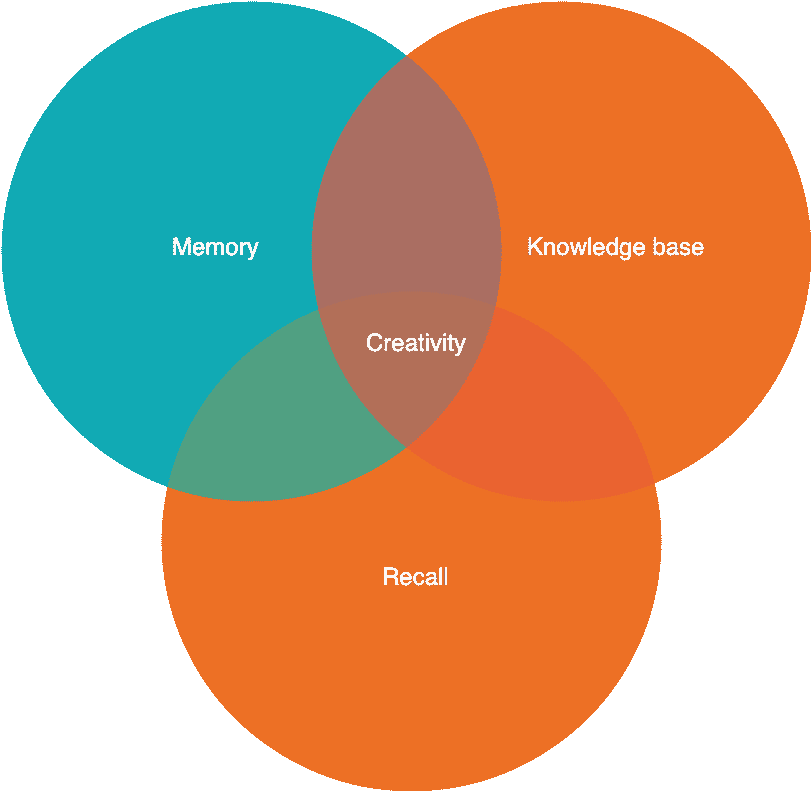

# 通过有意识的练习来提高你的创造力

> 原文：<https://dev.to/yloganathan/five-tips-to-get-your-creative-juices-flowing-181o>

我叫尤瓦，是一名软件工程师。我从事工程和产品工作已经 14 年了。我从来不认为我是一个有创造力的人。

`I looked at people playing music that are in their element, eyes closed and their face full of joy, completely immersed in what they are doing. They are in creative flow!`

我渴望那种创造性流动的感觉。实际上，我在我的软件工程生涯中经历过几次这种感觉。我的第一次是在 2007 年，我用一种非常有创意的方式解决了一个问题。我满心欢喜。我把手举在空中，打了几拳。我和每个经过我身边的人击掌。当时我是一个非常害羞的开发人员，所以这是一件大事。这些经历很少。我想经常体验创意的爆发。

我知道一件事是肯定的。我努力工作，并决心学习任何必要的技能来反复体验那种情绪状态。

`Do you think you are creative?`

如果你不相信，我会试着让你相信你是。如果你认为你有创造力，我会给你一些对我有用的工具。

## 天赋和创造力

我学到的第一件事是，我把天赋和创造力混为一谈。天赋是我们与生俱来的能力。有些天赋是有用的，比如 NBA 传奇人物张伯伦。当你在高中身高 7 英尺时，你还不如去打篮球。

有些天赋不是那么有用。我可以靠墙坐 10 分钟。

就像古谚所说的
`Talent is like an asshole, everyone has one`

等等！？这听起来不对。哦！好吧，我要用它。

天赋和创造力不是一回事。创造力不是只有少数人才能拥有的难以捉摸的东西。创造力属于我们所有人，我们每天都会做出许多创造性的决定，但往往不是有意识的。

## 什么是创意？

科学家将创造力解释为将我们大脑中储存的知识库中看似奇怪或不同的想法联系起来，以解决一个新问题或创造出新奇、美好和有用的东西。

华盛顿大学的研究科学家迈克尔·格里布科说

我想我得到了这个。我开始到处看`The Eureka Moment`。娱乐业给了我们这么多发挥创造力的天才的例子。就像理查德·亨德里克斯(*、硅谷*)从看似不相关的谈话中得到的著名的中间压缩算法思想。我看不到它。这几乎已经变得可以预测了。有一个团队努力解决一个复杂的问题，主角会看着某人做一些很正常的事情，如`pouring a coffee`、`bouncing a ball`、`fighting with a vending machine`，主角的眼睛会发光。提示灵光一现。

如果创造力是一种自然的大脑活动？为什么我每天都没有产生很多创造性的想法？

在我试图找出答案之前，让我们打破更多的神话。

## 神话破灭的时刻

*   我必须右脑思考
    这是[生理时尚](https://www.verywellmind.com/left-brain-vs-right-brain-2795005)中的一种，它被过分夸大了，就像 Myers briggs 的性格类型一样。创造力需要大脑的两侧。

*   我需要毒品

    *   我太希望这是真的了。我说服自己，当我服用止痛剂或迷幻药时，所有的真相都会被揭露。不幸的是，科学并不支持这种说法。我试过 CBD，到目前为止它只让我睡着了。
    *   迷幻药和大麻大多与创意有关。这是一本把相关性误认为因果关系的书。
*   我得等苹果砸到我头上

    *   即使没有非常努力，我在生活中也经历过几次创造性的时刻。神经科学的进步让我相信，我不必坐等下一个好主意降临。

我已经觉得很有教养了。我理解科学和电视描述的创造力。我打破了我长期以来的一些神话。我觉得已经为下一步做好了准备。如何刻意产生创意？

我知道我的大脑一直在建立联系。我梦见我在工作中遇到了一个问题，我的猫，催眠曲，正在我的梦中解决它。她是一只非常聪明的猫，但我不认为我可以在现实生活中使用这个想法。

## 创造力去神秘化

我们来分解一下创意的定义。
[T3】](https://res.cloudinary.com/practicaldev/image/fetch/s--He2YIsZ5--/c_limit%2Cf_auto%2Cfl_progressive%2Cq_auto%2Cw_880/https://thepracticaldev.s3.amazonaws.com/i/q7kgj7rlvpzfktilujpi.png)

1.  记忆

    我记忆中的东西越多，就越有可能联系起来。我过去常常在记忆中记住所有朋友和亲戚的电话号码。我们的大脑不断收集信息，并对其进行编码，以创造短期记忆。当事情重复时，大脑会跳过对细节的记忆。当存在关联或影响时，我们更有可能将短期记忆转化为长期记忆。我们大多数人都清楚地记得 9/11 发生时我们在哪里，甚至记得我们穿什么或者和谁在一起。
    长期陈述性记忆是我们保存信息的地方，这对激发创造力非常重要。

2.  知识库
    创造力的下一个难题是知识。为了在松散耦合的事物之间建立联系，我们需要了解这些事物。如果我对我工作的领域一无所知，我很难想出创造性的解决方案。

3.  回想一下,
    这是大脑将松散相关的话题联系起来以产生创造性想法的部分。这是变得有创意的最重要也是最困难的部分。

## 开始提高我们进行创造性神经连接能力的五种实用方法。

1.  改善陈述性记忆

    *   重庆技术

        尽管组块技术与改善工作记忆有关，但组块涉及搜索要组块的模式，注意模式并记住它们是有价值的练习，有助于改善陈述性记忆和回忆。

         `Consciousness and chunking allow us to turn the dull sludge of independent episodes in our lives into a shimmering, dense web, interlinked by all the myriad patterns we spot. It becomes a positive feedback loop, making the detection of new connections even easier, and creates a domain ripe for understanding how things actually work, of reaching that supremely powerful realm of discerning the mechanism of things. At the same time, our memory system becomes far more efficient, effective — and intelligent — than it could ever be without such refined methods to extract useful structure from raw data.` 

        [模式识别深度阅读](https://www.theatlantic.com/health/archive/2012/09/using-pattern-recognition-to-enhance-memory-and-creativity/261925/)

    *   记忆宫殿技术
        记忆宫殿是大脑中储存记忆图像的一个假想位置。记忆宫殿最常见的类型是在一个人们熟知的地方旅行，比如一座建筑或一个城镇。

    *   利用人际关系
        教别人或参与关于任何随机话题的辩论。这也有助于提供另一个数据点，用于将该信息放入声明性内存。

2.  改善知识库

    *   对周围的世界充满好奇。在场。当我散步时，我开始注意到一些事情，并问一些简单的为什么的问题。这将引导我进入漫长的维基百科之路，我保留了一些。我最终与妻子分享了我所学到的东西。我最近了解到我们的神经系统只有 5 亿岁，而生命已经存在了 40 亿年。太棒了。对吗？
    *   看书/听播客。选择一些与主要兴趣领域无关或关系较远的书籍和播客。除了软件工程，心理学和经济学相关的播客和书籍是我的兴趣所在。
3.  在转换上下文或学习新东西之前，先散散步

    *   在参加任何重要会议，尤其是头脑风暴会议之前，散散步来理清思路，深呼吸，思考会议的主题。这看起来很简单，但是已经有实验证明了在接受挑战性任务时增加血液流动和改变环境的好处。我将日历设置为总是将我的会议安排在一个小时之前的 10 分钟结束。尽管我们喜欢分组开会，但一定要在会议之间留出至少 10 分钟的休息时间，出去散散步。
4.  在较慢的阶段进行多任务处理

    *   我做这个已经有一段时间了。一开始，我选择了两个有期限的项目。这是做这件事的错误方法。有一个有截止日期的活动项目，即工作中的工程项目，并选择另一个我可以在闲暇时做的项目。写作、做午餐和学习报告已经成为我一段时间的副业，我玩得很开心。我发现我真的很喜欢写作，每次我需要休息的时候，我就开始研究我的写作主题或者开始写作/编辑。有时候错误的答案会被印在脑海里。改变上下文有助于冲洗卡住的解决方案。
    *   `Easy to think outside of the box if you can move from one box to the other`
    *   许多成功的创意人士都有严肃的爱好。理查德·费曼痴迷于撬开保险箱，查理斯·达尔文痴迷于蚯蚓。
5.  消化这些想法

    *   清晨和睡前是神经连接的黄金时间。我喜欢在早上 5:30 醒来，但在思考我的演讲或表达复杂想法的方式或思考一天要做的事情时，保持清醒的状态。
    *   在你入睡前或完全醒来前，想想你正在处理的问题。大脑还需要接受大量感官信息的轰炸，才能更容易地处理手头的问题。

## 团队创意

创造力可以来自群体，而不仅仅是个人。如果我们想成为一个有创造力的团队，我们也应该一起练习提高创造力的策略。

头脑风暴是公司探索群体创造力的常用工具之一。

### 提高头脑风暴的技巧:

1.  有一些坏主意，我们需要把它们说出来。不是羞辱提供想法的人，而是为正在产生的想法设定一个标准。只有在成员之间有了深刻的理解，并且每个人都觉得可以放心地抛出不成熟的想法，同时也愿意接受批评，这才有可能。结构和安全是进行一次富有成效的头脑风暴会议的两个最重要的因素。
2.  追求想法的数量而不是质量
3.  基于彼此的想法。团队拥有他们产生的所有想法，将产生和验证分开有助于消除偏见。产生这个想法的人可能与拥护这个想法的人不是同一个人。这样，一个想法就会得到关注，不管这个想法是由房间里一个非常害羞的内向者产生的，还是由一个通过沟通技巧吸引注意力的人产生的。

感谢您的阅读！我很乐意收到任何意见或反馈，以改善内容或我的写作风格。如果你想让我写另一篇关于团队创造力的文章，请留下你的评论。