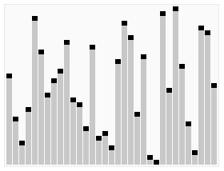

# 在 JavaScript 中实现快速排序

> 原文：<https://dev.to/charlesstover/implementing-quicksort-in-javascript-57k4>

快速排序是计算机科学中对数组排序的最有效的方法之一。为了更彻底的分析，它有自己的维基百科文章。

本文将介绍如何用 JavaScript 实现快速排序。快速排序不是 JavaScript 内置的。由于数组原型上的`sort`方法，排序在语言中很少被质疑或优化。尽管如此，快速排序仍然是一个重要的算法，至少可以让*理解*，不管你是否使用它。

# 它是如何工作的？🤔

快速排序的工作原理是从数组中选取一个元素，并将其指定为“轴心”数组中的所有其他元素被分为两类——它们或者小于或者大于这个 pivot 元素。

然后，两个结果数组(小于透视值的数组和大于透视值的数组)中的每一个都经过完全相同的算法。选择一个枢纽，所有其他值被分成小于和大于值的两个数组。

最终，一个子数组将只包含一个值，或者根本不包含任何值，因为没有更多的值可以与之进行比较。其余的值都被表示为某个先前点的“支点”,并且没有向下渗透到这个最低的子数组。此时，将对这些值进行排序，因为所有值现在都被声明为小于或大于数组中的所有其他值。

# 我们如何实现？💡

由于数组原型方法`sort`使用它自己的排序算法，我们不能用它来实现快速排序。我们必须创建一个函数，它接收要排序的数组作为参数，并返回排序后的数组。

```
const quickSort = (unsortedArray) => {
  const sortedArray = TODO(unsortedArray);
  return sortedArray;
}; 
```

Enter fullscreen mode Exit fullscreen mode

由于数组中项的“值”可能不是很明显，我们应该为比较器提供一个可选参数。对字符串或数字进行排序是 JavaScript 的内置功能，但对对象进行排序却不是。我们可能希望按照年龄对用户对象(`{ name: 'Charles', age: 21 }`)的集合进行排序。

```
const defaultComparator = (a, b) => {
  if (a < b) {
    return -1;
  }
  if (a > b) {
    return 1;
  }
  return 0;
};

const quickSort = (
  unsortedArray,
  comparator = defaultComparator
) => {
  const sortedArray = TODO(unsortedArray);
  return sortedArray;
}; 
```

Enter fullscreen mode Exit fullscreen mode

因为我们将数组分成小于/大于两半的次数可以无限变化，所以我们想递归地定义我们的逻辑，这样我们就不会重复我们的代码(“选择一个支点，分割，重复”)。

您可以使用任何索引作为轴心位置:第一、中间、最后、随机。假设数据是随机排序的，轴心的位置不会影响时间复杂度。我将使用最后一个索引，因为这是维基百科在其演示图形中使用的，并且有一个与代码一致的视觉效果是很好的。

[](https://res.cloudinary.com/practicaldev/image/fetch/s--bou9tHuf--/c_limit%2Cf_auto%2Cfl_progressive%2Cq_66%2Cw_880/https://thepracticaldev.s3.amazonaws.com/i/izvdb1hgadjj43arjy9w.gif)

枢轴前面的数组一分为二:小于前面的枢轴，大于末端的枢轴。最后，枢轴本身在两个子数组之间移动，然后子数组通过相同的快速排序算法排序。

```
const quickSort = (
  unsortedArray,
  comparator = defaultComparator
) => {

  // Create a sortable array to return.
  const sortedArray = [...unsortedArray];

  // Recursively sort sub-arrays.
  const recursiveSort = (start, end) => {

    // If this sub-array is empty, it's sorted.
    if (end - start < 1) {
      return;
    }
    const pivotValue = sortedArray[end];
    let splitIndex = start;
  };

  // Sort the entire array.
  recursiveSort(0, unsortedArray.length - 1);
  return sortedArray;
}; 
```

Enter fullscreen mode Exit fullscreen mode

我们将`sortedArray`创建为一个新数组，这样就不会改变原来的数组。这不是必须的，但是这是一个很好的实践。

我们将`recursiveSort`创建为递归函数，它将接受一个子数组(从开始索引到结束索引)并对其进行快速排序，同时改变`sortedArray`。整个数组是传递给这个递归函数的第一个数组。

最后，返回排序后的数组。

`recursiveSort`函数有一个`pivotValue`变量来表示数据透视表的值，还有一个`splitIndex`变量来表示限定小于和大于数组的索引。从概念上讲，所有小于数值将位于小于`splitIndex`的索引处，所有大于数值将位于大于`splitIndex`的索引处。`splitIndex`被初始化为子数组的开始，但是当我们发现值小于中枢值时，我们将相应地调整`splitIndex`。

我们将遍历所有非 pivot 值，将小于 pivot 值的值移动到开始索引之前。

```
const quickSort = (
  unsortedArray,
  comparator = defaultComparator
) => {

  // Create a sortable array to return.
  const sortedArray = [ ...unsortedArray ];

  // Recursively sort sub-arrays.
  const recursiveSort = (start, end) => {

    // If this sub-array is empty, it's sorted.
    if (end - start < 1) {
      return;
    }

    const pivotValue = sortedArray[end];
    let splitIndex = start;
    for (let i = start; i < end; i++) {
      const sort = comparator(sortedArray[i], pivotValue);

      // This value is less than the pivot value.
      if (sort === -1) {

        // If the element just to the right of the split index,
        //   isn't this element, swap them.
        if (splitIndex !== i) {
          const temp = sortedArray[splitIndex];
          sortedArray[splitIndex] = sortedArray[i];
          sortedArray[i] = temp;
        }

        // Move the split index to the right by one,
        //   denoting an increase in the less-than sub-array size.
        splitIndex++;
      }

      // Leave values that are greater than or equal to
      //   the pivot value where they are.
    }

    // Move the pivot value to between the split.
    sortedArray[end] = sortedArray[splitIndex];
    sortedArray[splitIndex] = pivotValue;

    // Recursively sort the less-than and greater-than arrays.
    recursiveSort(start, splitIndex - 1);
    recursiveSort(splitIndex + 1, end);
  };

  // Sort the entire array.
  recursiveSort(0, unsortedArray.length - 1);
  return sortedArray;
}; 
```

Enter fullscreen mode Exit fullscreen mode

我们将所有小于 pivot 值的值移动到`splitIndex`，所有其他值保留在原来的位置(默认情况下，大于`splitIndex`，因为拆分索引从子数组的开头开始)。

一旦子数组被重新排序，我们就将轴心本身移动到拆分处，因为我们知道它位于所有小于和大于或等于值的之间的*。*

左边的所有值(从`start`到`splitIndex - 1`)递归排序，右边的所有值(从`splitIndex + 1`到`end`)递归排序。`splitIndex`本身现在就是枢纽值，不再需要排序。

# 结论🔚

你可以在 GitHub 上找到这篇发表在 *TypeScript* [中的代码。](https://github.com/CharlesStover/quicksort-js)

您也可以将这段代码添加到来自 NPM 的项目[中。](https://www.npmjs.com/package/@charlesstover/quicksort)

如果你喜欢这篇文章，请随意给它一颗心或一只独角兽。又快又简单，还免费！如果您有任何问题或相关见解，请留下评论。

要阅读我的更多专栏或联系我，你可以在 [LinkedIn](https://www.linkedin.com/in/charles-stover) 、 [Medium](https://medium.com/@Charles_Stover) 和 [Twitter](https://twitter.com/CharlesStover) 上找到我，或者在 CharlesStover.com 上查看我的作品集。