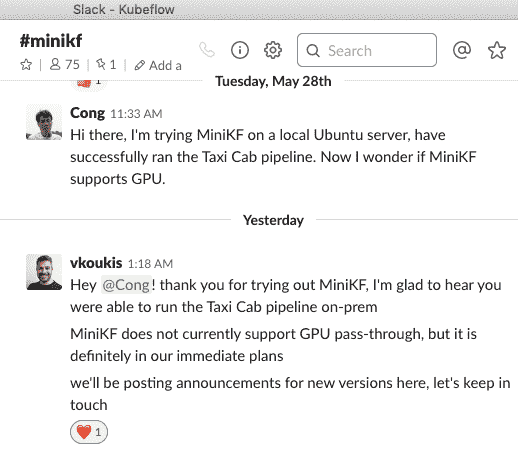

# 在 MiniKF 上进行机器学习基础

> 原文：<https://dev.to/vochicong/minikf-41pd>

[Kubeflow](https://www.kubeflow.org/) 是基于[Kubernetes](https://kubernetes.io/) 的正式机器学习基础。 在谷歌的大力推进下，可以用[、](https://deploy.kubeflow.cloud/#/)一键部署到 GCP 中。 当然也可以设置在 AWS 和 Azure 上。

这次是[MiniKF](https://www.kubeflow.org/docs/started/getting-started-minikf/) 的新登场，可以在平时的开发机器和现场服务器上简单地安装正式的机器学习基础 Kubeflow 了。

# Ready

需要的东西

*   无赖
*   VirtualBox(虚拟方块)

## Mac 的情况

使用 Brew 很轻松。

```
brew cask install vagrant virtualbox 
```

Virtualbox 的安装因`The Installation Failed`错误而失败时，请在 Mac 的“安全与隐私”设定中，将“Oracle America，Inc .”的软件授权为。

## Ubuntu 的情况

VirtualBox 用 apt 输入。

```
sudo apt install virtualbox 
```

但是，vagrant 用 apt 进入的版本很旧，不支持 virtualbox，所以[下载](https://www.vagrantup.com/downloads.html)安装吧。

```
https://releases.hashicorp.com/vagrant/2.2.4/vagrant_2.2.4_x86_64.deb 
```

# MiniKF 启动访问

```
mkdir -p ~/w/minikf
cd ~/w/minikf
vagrant init arrikto/minikf
vagrant up 
```

在第一个 up 中，下载虚拟机映像需要 20 分钟左右，但虚拟机启动完成后，接下来将启动 MiniKF

```
vagrant ssh
minikf # vagrant 内 
```

minikf 命令成功后，可以访问
Kubeflow 画面[http://10.10.10.10:8080](http://10.10.10.10:8080)
。

## Mac 的情况

2019/06/06 当前，VM 内的`minikf`命令以失败告终。

```
An unexpected exception has occured
Line: build/bdist.linux-x86_64/egg/rok_common/cmdutils.py:936
Type: CommandExecutionError
Reason: Command `<ExtCommand `systemctl start data.mount', status=FINISHED (ret: 1), PID=12176, shell=False>' failed: 'Job for data.mount failed. See "systemctl status data.mount" and "journalctl -xe" for details.\n'

The logfile `/home/vagrant/provision.log' may contain more information on this error, including a backtrace.

*** MiniKF provisioning tool terminated. Press Enter to restart, Ctrl-C to exit... 
```

## 放入 Ubuntu 等面上服务器时

从 Mac 等连接 SSH 隧道吧。
在服务器`ai.local`上移动 MiniKF 的话，

ssh-NL 8080:10 . 10 . 10:8080 ai . local &
open[http://localhost:8080](http://localhost:8080)

可以通过进入 Kubeflow 画面。

## URL、密码

设定信息用本类文档[确认吧](https://www.kubeflow.org/docs/started/getting-started-minikf/)。

# GPU

> MiniKF 目前不支持 GPU 直通，但它肯定在我们近期的计划中

[](https://res.cloudinary.com/practicaldev/image/fetch/s--Msj3LSxg--/c_limit%2Cf_auto%2Cfl_progressive%2Cq_auto%2Cw_880/https://cdn-images-1.medium.com/max/800/1%2AS82eDLKDWSAFdCpjXanuWw.png)

虽然还不支持 GPU，但是最近的开发计划中包含了[的](https://kubeflow.slack.com/archives/CGRKM3N0G/p1559146765015500)。

# 在结尾

以上，考虑到在实际生产中运用 Kubeflow 的话，在开发的时候使用 MiniKF，缩小实际生产和开发的差距吧。

本文是来自[Medium](https://medium.com/@vochicong/minikf%E3%81%A7%E3%82%AA%E3%83%B3%E3%83%97%E3%83%AC%E6%A9%9F%E6%A2%B0%E5%AD%A6%E7%BF%92%E5%9F%BA%E7%9B%A4-2604a992fd6) 和[Qiita](https://qiita.com/vochicong/items/0e0180a129f8c15d6a9c) 的交叉发表。