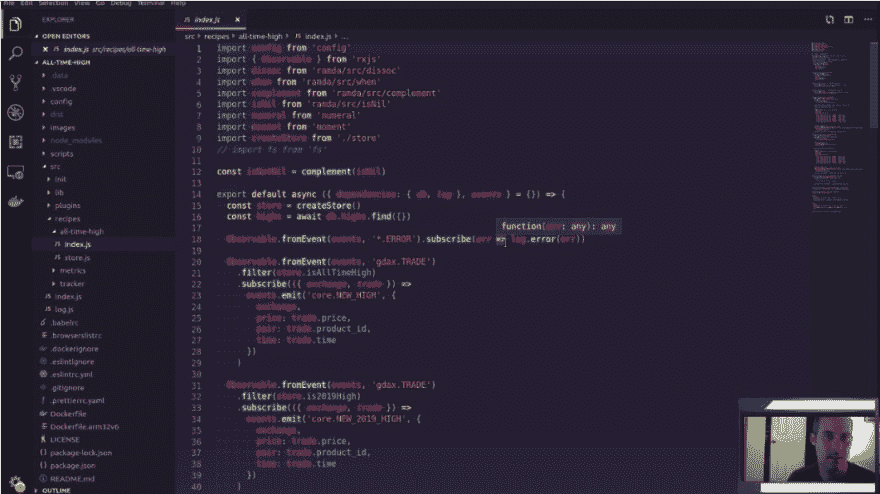

# 对 Twitch 上的 Node.js (JavaScript)比特币 Twitter 机器人进行重构

> 原文：<https://dev.to/joelnet/live-coding-a-refactoring-of-a-node-js-javascript-bitcoin-twitter-bot-on-twitch-29f5>

万一你错过了，这是我在 Twitch 上现场编码的录音！

我将一个大文件从 75 行代码缩减到大约 25 行。我创建了一个插件系统来动态加载事件，我抱怨键盘！

手表:[https://www.twitch.tv/videos/434707544](https://www.twitch.tv/videos/434707544)

之前:[https://github . com/Joel net/bit coin-all-time-high/blob/342398 b 80996610072d 998754 F8 df 672007 B6 EAF/src/recipes/all-time-high/index . js](https://github.com/joelnet/bitcoin-all-time-high/blob/342398b80996610072d998754f8df672007b6eaf/src/recipes/all-time-high/index.js)

之后:[https://github . com/Joel net/bit coin-all-time-high/blob/33e 71 f 421 EB 679 BFA 99 F8 f 28 c 2860 e5be 028 CD 01/src/recipes/all-time-high/index . js](https://github.com/joelnet/bitcoin-all-time-high/blob/33e71f421eb679bfa99f8f28c2860e5be028cd01/src/recipes/all-time-high/index.js)

干杯！

# 🍻