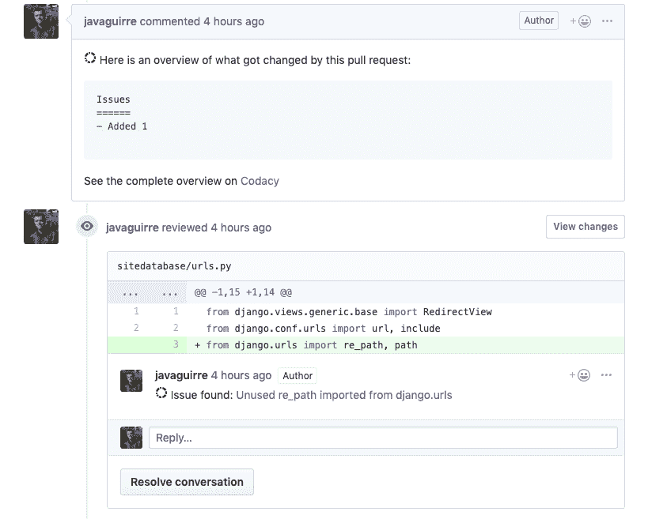
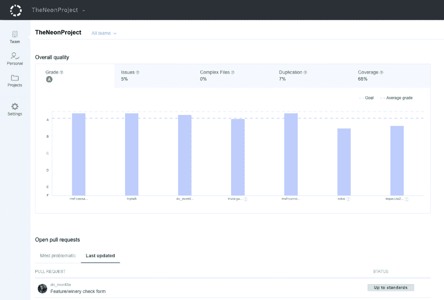
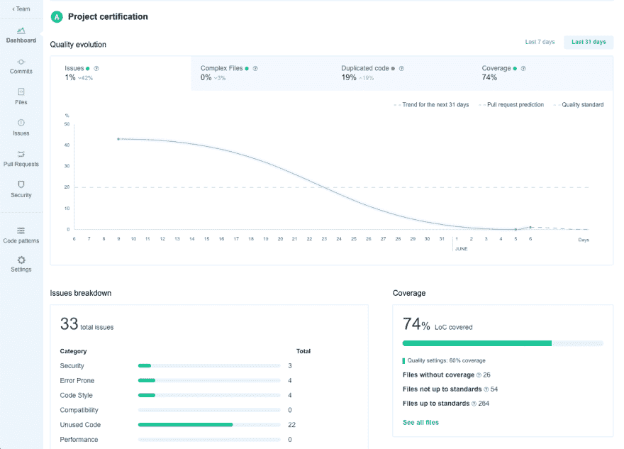
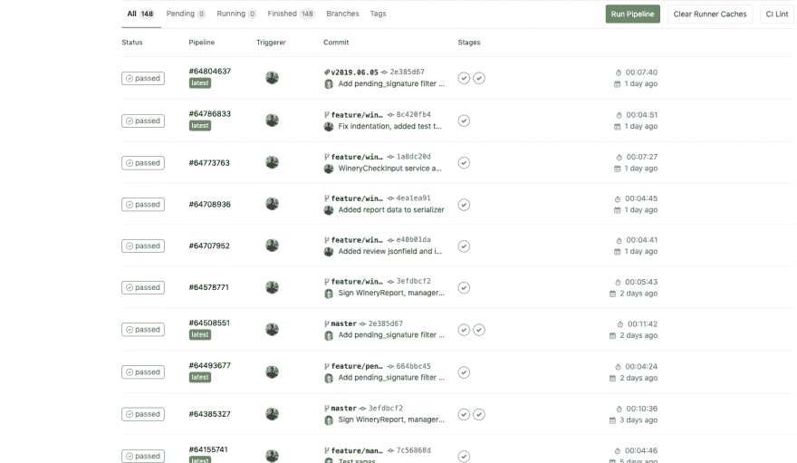

# 控制代码质量的旅程

> 原文：<https://dev.to/wealize/the-journey-to-control-code-quality-4njl>

编码，编程，开发，说出你的行动！如此有趣和令人兴奋的娱乐，有时会在压力下或缺乏某项技术经验时出错。

# 挑战

我们有时需要写一些我们并不引以为豪的代码，但是现在我们有了量化这些代码并提高其质量的机制。像童子军一样，我们可以回去打扫营地，做更多的测试，因为我们没有足够的覆盖率，我们可能没有捕捉到所有可能的错误。

当我回过头来读我以前的代码时，我感到惭愧，这是一件好事，它意味着我们在成长。否则，我们不会注意到。

我一直走在提高代码质量的道路上，我知道项目和初创公司需要实现他们的目标，否则，我们都可能会失业，但这就是为什么拥有适当的过程和良好的 CI/CD、控制代码质量以及测量遗留代码以使其不会增长太多如此重要。

我多年来一直倡导测试。我知道我们应该测试什么，测试什么更具挑战性，如果我们的测试太复杂，因为我们有一个架构问题，我们为什么要重构，哪些部分更可能有问题。尽管如此，通常还是会有怀疑、风险和恐惧。

然而，当你在像我这样的小机构中时，你需要有指标，你需要依靠优秀的服务，所以你尽可能地节省时间来做对公司有价值的事情。我们每次都需要改进流程(否则总是以同样的方式做每件事有什么意思呢？:-)).

# 旅途

我们追求更好的代码的旅程从评审开始，我们定义了用户故事并估算了开发成本(在下一篇文章中会有更多的介绍)，团队的一名成员着手于此，实现了它并在 GitHub 上创建了一个 PR。

在这种情况下，第一步是确保在 PR 中通过两项检查:

*   Gitlab CI 会进行测试，并告诉我们是否通过。
*   **Codacy** 告诉我们在代码复杂性、代码重复、标准和代码覆盖率方面是否有显著的退步。

如果检查通过，团队中至少有一名开发人员会审查 PR 代码的清晰性、良好的模式和功能。如果一切顺利，代码会被合并到发布分支，当 sprint 结束时，会被合并到 master。由于代码模式、架构和命名如此依赖于应用程序的领域和上下文，因此我们永远无法消除人类的交互。

与其他竞争者相比，Codacy 给我们带来了更多的功能，比如 [Danger](https://danger.systems/) 或者 [Code Climate](https://codeclimate.com/) ，但是如果你不喜欢它，你可以看看这些。我们选择了 Codacy，因为它给了我们更好的进度反馈，而且他们有很好的代码覆盖集成，比 Code Climate(例如)更容易设置。它给我们的不仅仅是危险，因为危险通常更多地被用作 linter，但没有得到任何关于代码覆盖率的信息。

当我们开始使用 Codacy 时，发生了一些很棒的事情，因为每个人都试图最小化他们增加的技术债务，所以 Codacy 也将我们的拉请求游戏化了。:-)

Codacy 集成了很多语言，我们通常使用 Python Pylint，Bandit，Prospector，和 ESLint for Node。Codacy 将读取您的存储库中的这些库配置，并使用该配置(如果存在的话)。否则，您可以从特定工具的项目设置视图中检查您想要的配置项。

在这一点上，我们的 CI 被触发(因为我们合并到了 master ),如果测试通过，代码被自动部署到我们的登台环境，通常是 Heroku，但也包括 AWS/Kubernetes。

当我们想要部署到生产时，我们创建一个新的标签，比如 **vYYYY。MM.DD** 并且 CI/CD 触发生产部署。

# 天命

当代码进入生产阶段时，我们有两个服务为我们提供输入，这样我们就可以知道是否有问题或者是否触发了警报。

*   在控制生产中的错误方面，Sentry 多年来一直是我的最爱，它易于使用、标记和区分不同的环境(后端、前端和移动),而且效果非常好！
*   [New Relic](https://newrelic.com/) 功能强大，我们用它来检测出现的瓶颈和性能问题(如果您配置好警报，还不算太晚！).能够监控您的查询并查看它们的行为以防止将来出现问题是非常好的，New Relic 在这方面非常出色。

你最喜欢什么？有什么推荐？让我知道！