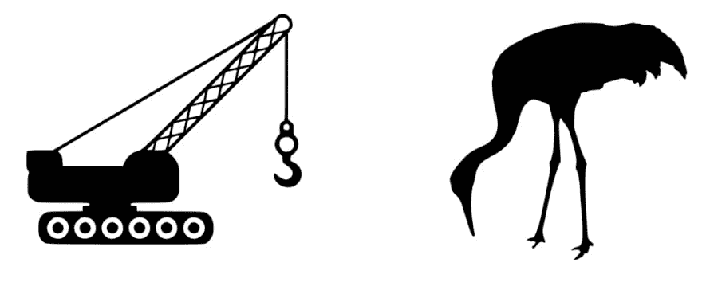
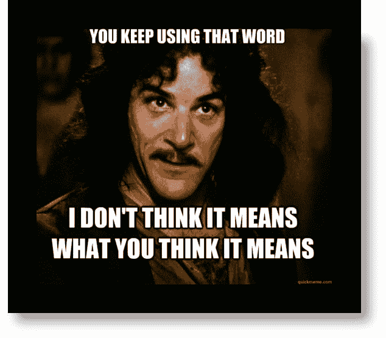

# 上下文为王:通过语言寻找服务边界

> 原文：<https://dev.to/codeopinion/context-is-king-finding-service-boundaries-through-language-4e8h>

我发现找到服务边界的最重要的方法之一是通过与我们正在工作的系统的不同部分的不同终端用户的对话。真正关注他们使用的词语有助于找到服务边界。

这篇博文是一个系列。要赶上进度，请查看以下其他帖子:

*   [上下文为王:寻找服务边界](https://codeopinion.com/context-is-king-finding-service-boundaries/)
*   [语言](https://codeopinion.com/context-is-king-finding-service-boundaries-through-language/)
*   [自主服务](https://codeopinion.com/autonomous-services/)
*   [关注服务能力，而不是实体](https://codeopinion.com/focus-on-service-capabilities-not-entities/)
*   [4+1 建筑视图模型](https://codeopinion.com/41-architectural-view-model/)

## 断章取义

> 如果一个 ***语句*** 或 ***备注*** 被断章取义**引用，其所说的情况没有被正确报道，以至于它似乎意味着与原本的*不同的*。****

 ****如果我在和我儿子谈话，你无意中听到这样一句话:

> 起重机很大。

你会想到哪种起重机？

如果没有更多的上下文，你真的没有办法知道我指的是哪种类型的起重机。

## 一个产品不是一个产品

作为一个更实际的例子，让我们使用一个分销公司。

高层次是公司从供应商那里购买**产品**，将它们接收到他们的仓库，然后将这些产品销售给客户。

当你谈论一个**产品**时，它可能对不同的人有不同的含义，这取决于他们所处的环境。

如果你向销售人员谈论一种产品，当他们使用**价格**时，他们指的是**销售价格**。销售以客户为中心。

当你与采购人员讨论产品时，他们会将产品的**价格**称为**供应商价格**，因为采购是以供应商为中心的。

在与会计部门的人谈论同样的产品时，他们会将**价格**称为**销售价格**，将**成本**称为**卖方价格**。

## 上下文

通过了解系统最终用户的上下文，您可以确定一个单词何时对不同的人有不同的含义。如果是的话，那么你可能已经找到了一个边界。

## 博客系列

关于所有这些话题的更多内容将在其他帖子中详细讨论。如果您有任何问题或意见，请在评论区或 Twitter 上联系我。

*   [上下文为王:寻找服务边界](https://codeopinion.com/context-is-king-finding-service-boundaries/)
*   [语言](https://codeopinion.com/context-is-king-finding-service-boundaries-through-language/)
*   [自主服务](https://codeopinion.com/autonomous-services/)
*   [关注服务能力，而不是实体](https://codeopinion.com/focus-on-service-capabilities-not-entities/)
*   [4+1 建筑视图模型](https://codeopinion.com/41-architectural-view-model/)

[关注@codeopinion](https://twitter.com/codeopinion?ref_src=twsrc%5Etfw)

帖子[上下文为王:通过语言寻找服务边界](https://codeopinion.com/context-is-king-finding-service-boundaries-through-language/)最早出现在[共同意见](https://codeopinion.com)上。****