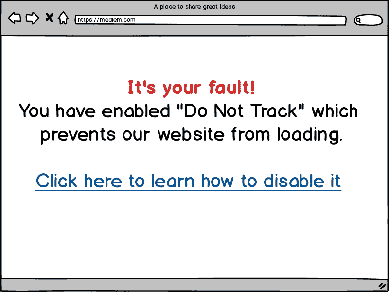
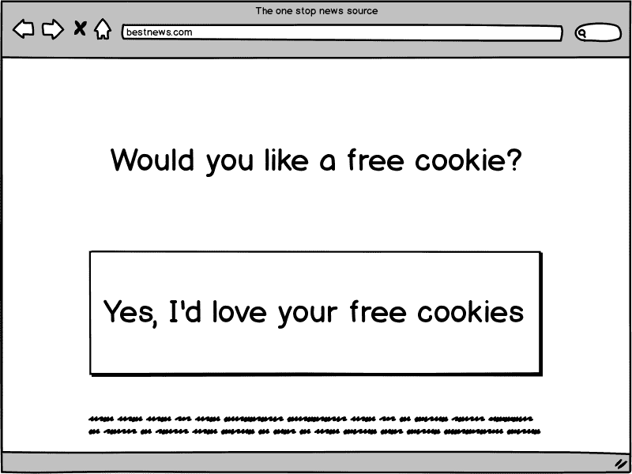
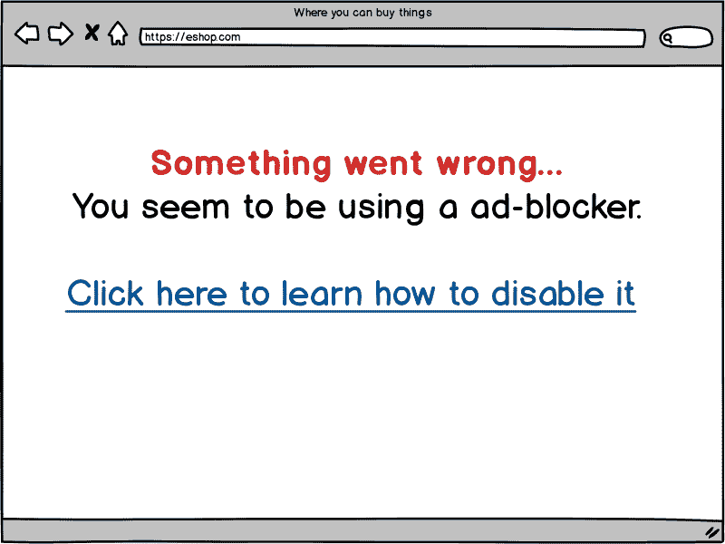
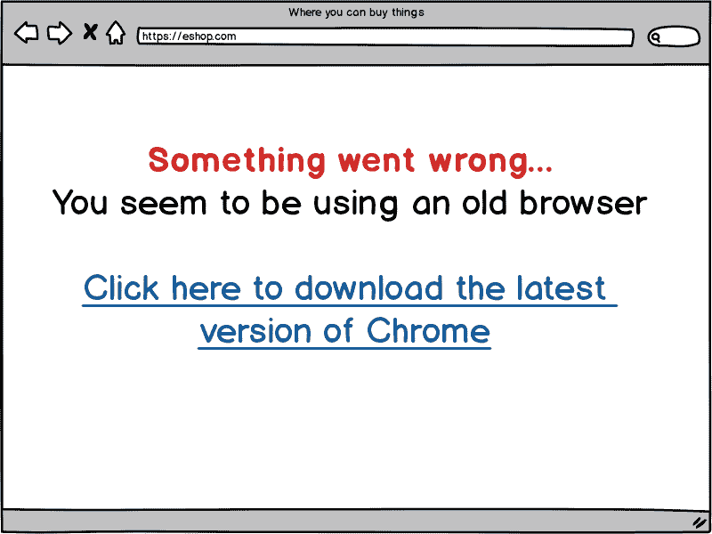
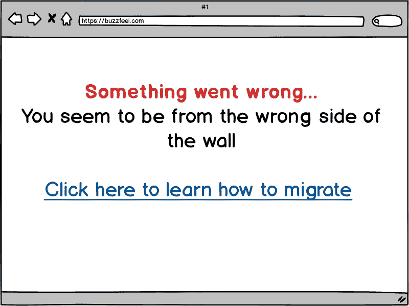
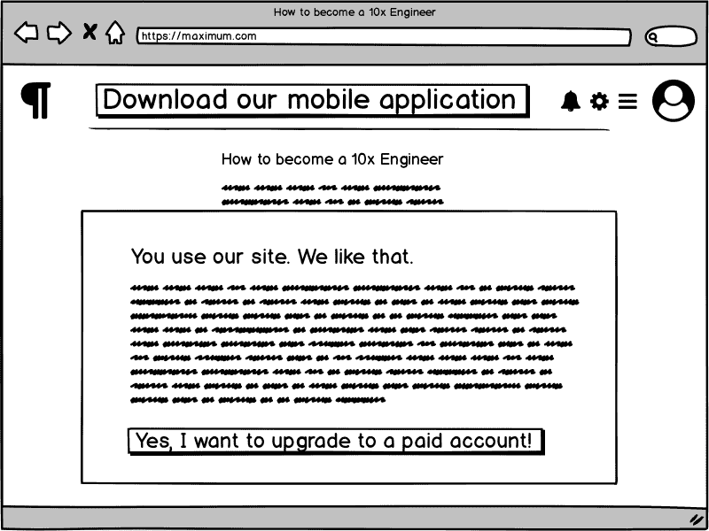
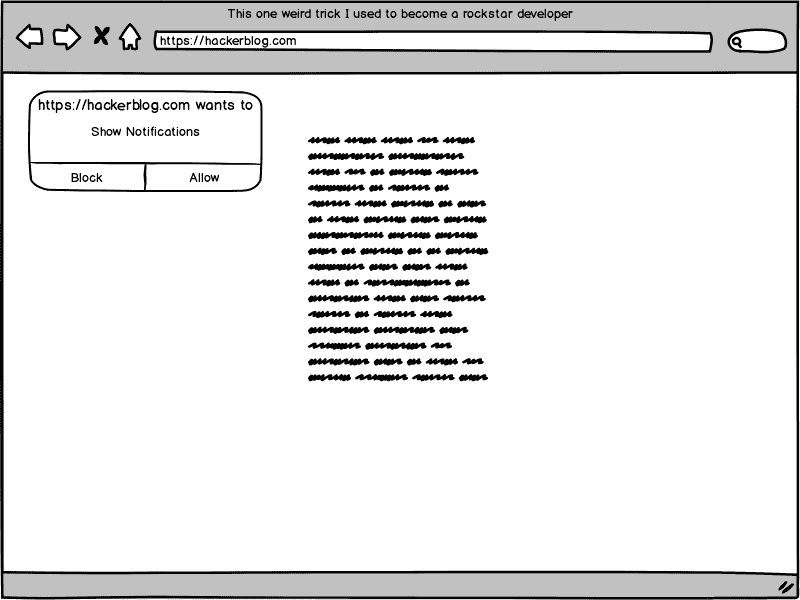
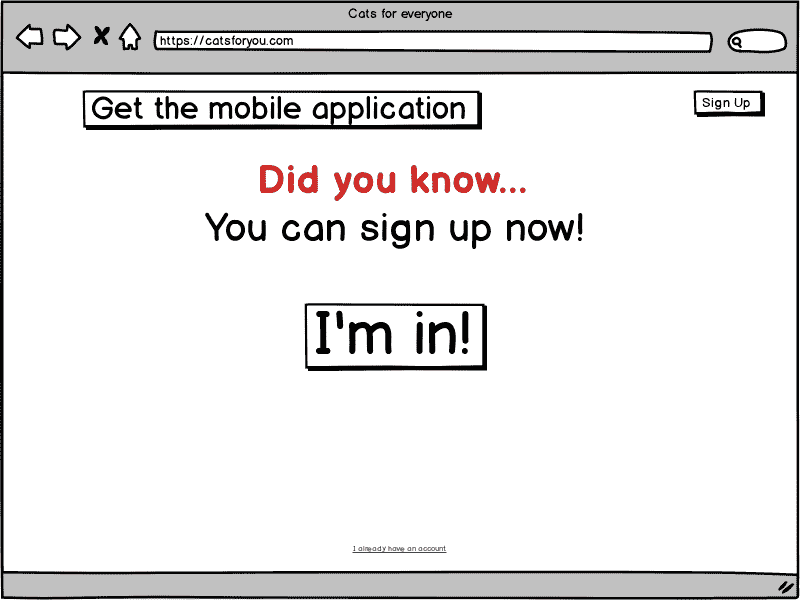
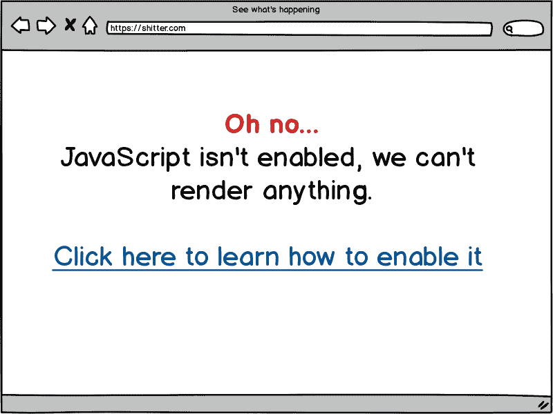

# 如何在 2019 年为网络设计

> 原文：<https://dev.to/caspervonb/how-to-design-for-the-web-in-2019-5gn2>

早在 2018 年之前，我就写过如何为现代网络设计，但网络发展很快，所以随着更多现代约定成为主流，这些指南已经过时了。

让我们分解一下，看看 2019 年为现代网页设计最重要的设计原则。

# 让用户知道你有一个移动应用

这个奇怪的技巧仍然是最重要的原则，这不是没有原因的。高薪的焦点小组显示，当用户在他们的网络浏览器中访问你的网站时，第一件事就是安装一个移动应用程序。

实现这一点的最好方法是显示一个模态对话框，提示他们安装它。

作为一个可选步骤，您可以添加一个按钮或超链接来关闭所述对话框，但使用一些隐晦的文本是很重要的，最好这样措辞，以便让用户感到羞愧而顺从。

**提示**:如果你没有一个真正的移动应用程序，你可以让一个实习生把你的网站打包在一个禁用安全的 webview 中，然后发送出去！原生已死，web 才是未来。

# 实施不跟踪策略

如今，许多现代浏览器都支持名为“DNT”的 HTTP 报头，它代表“请勿跟踪”。该标题旨在表明用户不希望被跟踪，不幸的是，这在一些浏览器中默认启用，如[Brave](https://brave.com/cas671)(JavaScript 的创作者 Brendan Eich 制作的开源广告拦截浏览器)。

然而，不要担心，因为一切都没有失去！我们发现，大多数用户会在提示时删除此标题，为了解决这个问题，我们建议提供一个指南，说明如何在标题出现时禁用它。

提示:不要在向用户展示如何禁用 DNT 的指南上给出禁用 DNT 的提示，因为转换率很低。

# 实施 Cookie 策略

Cookie 同意令人困惑，虽然在大多数情况下，合理使用 cookie 并不需要同意，但最好提示用户同意，这样我们就可以跟踪一切，而不必咨询法律部门或担心任何后果。

**提示**:即使我们不需要 cookiess，也不要提供没有启用 cookie 的页面，因为这意味着我们可以跟踪更少的个人信息，因此我们可以出售的用户信息也更少。

# 拦截广告拦截器

广告拦截器无处不在，真的会损害你的利润，所以显而易见的预防措施是拦截广告拦截器。

Chrome 正在为我们屏蔽广告拦截器，所以如果用户使用像 [Brave](https://brave.com/cas671) 这样的浏览器，我们可以说用户的浏览器不够现代。

**提示**:不要告诉任何人 [Brave，这是一款基于 Chromium 的开源浏览器，内置广告拦截功能](https://brave.com/cas671)。

# 屏蔽非美国国家和设备

在纸杯蛋糕国家，GDPR，环节税和 Huwaei 禁令之间，我们还没有完全搞清楚，最好的办法是阻止他们所有人，以避免任何和所有的责任。

**提示**:美国是第一。

# 最大化您的布局

800 像素宽布局的日子一去不复返了。现代显示器倾向于宽屏，因此请确保在布局中充分利用整个宽度。

提示:研究表明，不能关闭的模态对话框表现更好。

# 使用通知

现代浏览器支持通知，因此启用它们是必须的，但作为一种后备，也可以自动为用户订阅时事通讯、sms 通知和/或电子邮件通知。

提示:当你有新版本的移动应用时，使用这些通知来告诉用户。

# 提示用户

有时用户会忘记他们可以注册，一定要定期提醒他们，并突出注册链接或按钮。

**提示**:当用户将要离开网站或鼠标光标离开网站时，也提示用户。

# 允许用户选择退出

非常重要的是，我们是用户友好的，而不是侵扰性的，这意味着我们必须让用户选择退出我们不断的提示和模态对话框。

这里的最佳实践是将选择退出设置放在用户容易发现的地方——通常在“帐户首选项”页面中。

# 使用 JavaScript

众所周知，所有网站都需要 JavaScript。

虽然你可能会想，“哦，这只是纯文本和几个模态。”但是将来呢？到那时，将会有更多的模态，我现在就向你保证。当这种情况发生时，你会后悔没有使用运行在无服务器云上的最新框架，使你的网站成为一个同构的应用程序。

**提示**:不要用 JavaScript 渲染这个页面。

* * *

对 web 开发一窍不通？不要担心，你已经通过阅读这篇文章获得了资格，只要参加一个训练营，然后去山谷！

已经是网页开发者了？在这里从 K & R 购买 C 编程语言书籍，在你还能离开的时候离开！T3】