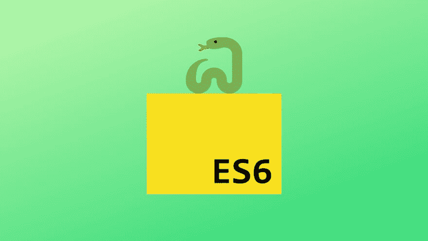
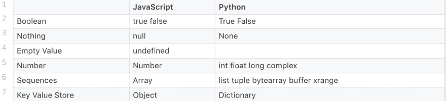
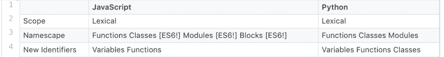

# Python 如何帮助你学习 ES6

> 原文：<https://dev.to/bnevilleoneill/how-python-can-help-you-learn-es6-k5l>

[](https://res.cloudinary.com/practicaldev/image/fetch/s--RjyZJMsF--/c_limit%2Cf_auto%2Cfl_progressive%2Cq_auto%2Cw_880/https://thepracticaldev.s3.amazonaws.com/i/xmamm1718jvwj8bwlso5.png)

“你学过 ES6 或者 ES2015 了吗？”

哦。以前人们问我这个问题时，我会感到一种压力。最终在 Python 的帮助下学会了 ES6。奇怪吧。事实证明，这两种语言有很多语法是相同的，所以它们在某种程度上是紧密相连的。

在这篇文章中，我们将看看 Python 如何帮助你学习 ES6。

## **Python 和 ES6 的基本区别**

在我们讨论 JavaScript 和 Python 有多么相似之前，我首先想谈谈一些关键的区别。例如，JavaScript 中的空格在编译时无关紧要，但在 Python 中却很重要。Python 依靠缩进来确定语句的分组。

JavaScript 和 Python 中的原语也有很大不同。查看下表，其中详细列出了这两种语言的原语。你会发现它们在布尔表达式上有些重叠，但除此之外，它们是不同的。

<figure>

[](https://res.cloudinary.com/practicaldev/image/fetch/s--R8YwP0o3--/c_limit%2Cf_auto%2Cfl_progressive%2Cq_auto%2Cw_880/https://i0.wp.com/blog.logrocket.com/wp-content/uploads/2019/06/jsvspython-5.png%3Fresize%3D1383%252C314%26ssl%3D1)

<figcaption>Table of primitives in JavaScript versus Python</figcaption>

</figure>

关于 JavaScript 和 Python 需要注意的最后一个基本区别是 JavaScript 允许类型强制。下面的代码块演示了在 JavaScript 中将一个数字强制转换成一个字符串，但在 Python 中是不可能的！

```
// You can coerce an integer into string in JavaScript
let coerced = 1;
let concatenated = coerced + 'string'; 
```

Enter fullscreen mode Exit fullscreen mode

<figure>

```
# You can't coerce an integer into a string in Python
not_coerced = 1
concatenated = str(not_coerced) + 'string' 
```

Enter fullscreen mode Exit fullscreen mode

<figcaption>Coercion demonstrated in JavaScript and in Python</figcaption>

</figure>

[](https://logrocket.com/signup/)

## **职能或..方法？**

JavaScript 和 Python 中的函数和条件具有极其相似的结构。例如:

```
function drSeuss(catInTheHat, thing1, thing2) {
  if (catInTheHat == true &&
    thing1 == true &&
    thing2 == true) {
    console.log('is cray');
  } else if (catInTheHat != true) {
    console.log('boring');
  } else {
    console.log('so boring');
  }
} 
```

Enter fullscreen mode Exit fullscreen mode

```
def dr_seuss(cat_in_the_hat, thing1, thing2):
  if cat_in_the_hat == True and
    thing2 == True and
    thing2 == True:
    print 'is cray'
  elif cat_in_the_hat != True:
    print 'boring'
  else:
    print 'so boring' 
```

Enter fullscreen mode Exit fullscreen mode

我没有想太多，但是在 JavaScript 中,“方法”的概念通常是指内置于语言规范中的方法，例如`Function.prototype.apply()`。

来自 MDN:

> 在大多数方面，功能和方法是相同的，除了两个关键区别:
> 
> 方法被隐式传递给调用它的对象。
> 
> 方法能够对包含在类中的数据进行操作。

因为 JavaScript 中并不存在真正的类，所以下面的函数和方法示例只用 Python 来表示(本文后面会详细介绍 ES6 类)。

<figure>

```
def fish_and_chips():
  ingredients = ['fish', 'potatoes', 'batter']
  print 'cooking %s together' % (', '.join(ingredients))

# cooking fish, potatoes, batter

class Baking(object):
  def __init__(self, supplies):
    self.supplies = supplies

  def bakewell_tart(self):
    ingredients = ['almonds', 'raspberry', 'icing sugar']
    print self
    print 'baking %s' % (', '.join(ingredients))

# <__main__.Baking object at 0x10d6e0510> 
```

Enter fullscreen mode Exit fullscreen mode

<figcaption>A function versus a method in Python</figcaption>

</figure>

好了，Python 推动我学习更多关于 ES6 的一些方法！

## **封锁范围**

当我第一次开始学习 JavaScript 时(回到“古代”的 ES5 时代)，我认为语言中的许多结构创建了作用域。我认为条件语句中的块创建了作用域。我发现在 JavaScript 中只有函数创建作用域。

加上 ES6 的`const`和`let`，我们得到了块范围！

```
function simpleExample(value) {
  if (value) {
    var varValue = value;
    let letValue = value;
    console.log(varValue, letValue); // value value
  }

  // varValue is available even though it was defined
  // in if-block because it was "hoisted" to function scope
  console.log(varValue); // value

  // letValue is a ReferenceError because 
  // it was defined within the if-block
  console.log(letValue); // Uncaught ReferenceError: letValue is not defined 
```

Enter fullscreen mode Exit fullscreen mode

JavaScript、ES6 和 Python 中还有什么创建作用域？他们用什么样的瞄准镜？请查看下表:

[](https://res.cloudinary.com/practicaldev/image/fetch/s--UZAFPyKY--/c_limit%2Cf_auto%2Cfl_progressive%2Cq_auto%2Cw_880/https://i0.wp.com/blog.logrocket.com/wp-content/uploads/2019/06/jspythonscope.png%3Fresize%3D1416%252C182%26ssl%3D1)

## **模板文字**

我经常认为模板文字是疯狂的库。如果你不是在疯狂文库中长大的，它们是你可以用自己的内容填充的短篇故事。句子缺少单词，你可以在这些空格里写任何你想写的东西。你只需要符合指定的单词类型:名词、代词、动词、形容词、感叹词。

疯狂的 Libs 读着这样的东西:

> 母亲们坐在一起打嗝。去年夏天，我的小弟弟掉进了一个发式里，屁股上全是毒棕榈树。我的家人要去威斯康辛，我也会去..

与 Mad Libs 类似，模板文字是允许嵌入表达式的字符串文字。在 ES2015 规范的早期版本中，它们最初被称为“模板字符串”。

是的，这些在 ES6 发布之前就已经存在于 Python 中了。我实际上已经学习了 Python 中的[文字字符串插值，这让我理解 ES6 中的模板文字更加容易。它们很棒，因为您不再需要旧版本 JavaScript 中的连接，这可能有点荒谬，并会将其他类型强制转换为字符串。](https://pyformat.info/) 

```
let exclamation = 'Whoa!';
let sentence = `They are really similar to Python.`;

console.log(`Template Literals: ${exclamation}  ${sentence}`);
// Template Literals: Whoa! They are really similar to Python. 
```

Enter fullscreen mode Exit fullscreen mode

```
print '.format(): {} {}'.format('Yup.', 'Quite!')
# .format(): Yup. Quite! 
```

Enter fullscreen mode Exit fullscreen mode

## **默认参数**

是的，Python 也一直拥有这些。默认参数设置函数参数的默认值。这对于避免参数丢失时出现的错误是最有效的。随着 ES6 的出现，JavaScript 也获得了默认参数。

```
function nom(food="ice cream") {
  console.log(`Time to eat ${food}`);
}

nom(); // Time to eat ice cream 
```

Enter fullscreen mode Exit fullscreen mode

```
def nom(food="ice cream"):
  print 'Time to eat {}'.format(food)

nom() # Time to eat ice cream 
```

Enter fullscreen mode Exit fullscreen mode

## **其余参数& *args**

Rest 参数语法允许我们将不定数量的参数表示为一个数组。在 Python 中，它们被称为*args，我在 ES6 之前已经学过了！你感觉到这里有一种模式吗？

看看每种语言是如何将参数打包成简洁的小软件包的:

```
function joke(question, ...phrases) {
  console.log(question);
  for (let i = 0; i > phrases.length; i++) {
    console.log(phrases[i]);
  }
}

let es6Joke = "Why does JS single out one parameter?"
joke(es6Joke, "Because it doesn't", 'really like', 'all the REST of them!');

// Why does JS single out one parameter?
// Because it doesn't
// really like
// all the REST of them! 
```

Enter fullscreen mode Exit fullscreen mode

```
def pirate_joke(question, *args):
  print question
  for arg in args:
    print arg

python_joke = "What's a Pyrate's favorite parameter?"

pirate_joke(python_joke, "*args!", "*arrgs!", "*arrrgs!")

# What's a Pyrate's favorite parameter?
# *args!
# *arrgs!
# *arrrgs! 
```

Enter fullscreen mode Exit fullscreen mode

## **类**

现在，让我们看看原型继承！ES6 类实际上是语法糖，基于 ES5 和以前 JavaScript 版本中的原型链。所以，我们用 ES6 类所能做的和我们用 ES5 原型所能做的并没有太大的不同。

Python 有内置的类，允许快速简单的面向对象编程。我总是发现 JavaScript 中的原型链非常混乱，但是将 Python 和 ES6 类放在一起看对我来说很有意义。

为了解释 JavaScript 原型是什么，这里引用 MDN 的一段话:

> 谈到继承，JavaScript 只有一个构造:对象。每个对象都有一个到另一个对象的内部链接，称为其原型。该原型对象有自己的原型，依此类推，直到到达一个以 null 作为其原型的对象。根据定义，null 没有原型，并且充当这个原型链中的最后一环。

让我们来看看这些基于原型链的 ES6“类”:

```
class Mammal {
  constructor() {
    this.neocortex = true;
  }
}

class Cat extends Mammal {
  constructor(name, years) {
    super();
    this.name = name;
    this.years = years;
  }

  eat(food) {
    console.log('nom ' + food);
  }
}

let fryCat = new Cat('Fry', 7);
fryCat.eat('steak'); 
```

Enter fullscreen mode Exit fullscreen mode

```
class Mammal(object):
  neo_cortex = True

class Cat(Mammal):
  def __init__(self, name, years):
    self.name = name
    self.years = years

  def eat(food):
    print 'nom %s' % (food)

fry_cat = Cat('Fry', 7)
fry_cat.eat('steak') 
```

Enter fullscreen mode Exit fullscreen mode

ES6 类和 ES5 原型的一个很大的区别是:使用类比使用原型链更容易继承。这和 Python 的结构很像。整洁！

所以你有它。一堆 Python 如何帮助我了解 ES6 的例子。编程语言通常存在许多差异，但也存在许多相似之处。正是在这些相似之处，我们可以更容易地学习新的语言！

* * *

### Plug: [LogRocket](https://logrocket.com/signup/) ，一款适用于网络应用的 DVR

<figure>

### [T4】](https://logrocket.com/signup/)

<figcaption>[https://logrocket.com/signup/](https://logrocket.com/signup/)</figcaption>

</figure>

LogRocket 是一个前端日志工具，可以让你回放问题，就像它们发生在你自己的浏览器中一样。LogRocket 不需要猜测错误发生的原因，也不需要向用户询问截图和日志转储，而是让您重放会话以快速了解哪里出错了。它可以与任何应用程序完美配合，不管是什么框架，并且有插件可以记录来自 Redux、Vuex 和@ngrx/store 的额外上下文。

除了记录 Redux 操作和状态，LogRocket 还记录控制台日志、JavaScript 错误、堆栈跟踪、带有头+正文的网络请求/响应、浏览器元数据和自定义日志。它还使用 DOM 来记录页面上的 HTML 和 CSS，甚至为最复杂的单页面应用程序重新创建像素级完美视频。

[免费试用](https://logrocket.com/signup/)。

* * *

帖子[Python 如何帮助你学习 ES6](https://blog.logrocket.com/how-python-can-help-you-learn-es6/) 最先出现在 [LogRocket 博客](https://blog.logrocket.com)上。