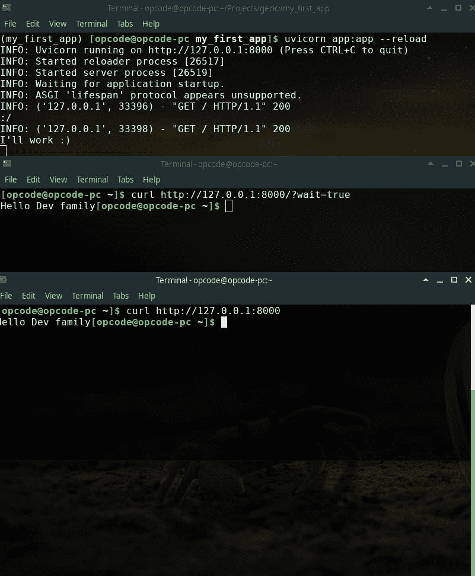

# Bocadillo:又一个 Python 框架

> 原文：<https://dev.to/itachiuchiha/bocadillo-yet-another-python-framework-57ii>

大家好。在这篇文章中，我将介绍 Bocadillo 框架。如你所知，Python 中有很多 web 框架。

在过去的日子里，我一直在寻找新的技术来提高自己。我在 GitHub 上看到了 Bocadillo。

## 什么是博卡迪略？

[](https://res.cloudinary.com/practicaldev/image/fetch/s--oPBPTi9Z--/c_limit%2Cf_auto%2Cfl_progressive%2Cq_auto%2Cw_880/https://thepracticaldev.s3.amazonaws.com/i/9hymvcqp618nt6n6pcd7.png)

Bocadillo 是一个充满异步 salsa 的现代 Python web 框架。

您可以使用以下链接访问博卡迪略的网站:[https://bocadilloproject.github.io/](https://bocadilloproject.github.io/)

你可以在 GitHub 上找到博卡迪略:[https://github.com/bocadilloproject/bocadillo](https://github.com/bocadilloproject/bocadillo)

其主要特点是:

*   多产的
*   实时能力
*   灵活的
*   性能
*   授权
*   透明的

透明:所有代码都是用类型注释开发的。

也可以开发 WebSocket 应用。实际上，我认为，它最大的卖点是 WebSockets。

## 安装

Bocadillo 有一个 CLI 工具来创建项目。但是不需要安装 CLI 工具。

### CLI 安装

```
pip install bocadillo-cli 
```

Enter fullscreen mode Exit fullscreen mode

### 框架安装

```
pip install bocadillo 
```

Enter fullscreen mode Exit fullscreen mode

### 使用 virtualenv

```
mkdir my_first_app

cd my_first_app

virtualenv .

source bin/activate

pip install bocadillo 
```

Enter fullscreen mode Exit fullscreen mode

现在，我们安装了博卡迪洛。

## 首款博卡迪罗 App

您可以使用最喜欢的编辑器或 IDE。我将创建一个名为 app.py
的文件

```
touch app.py 
```

Enter fullscreen mode Exit fullscreen mode

我将使用 **nano** 编辑器编辑 app.py 文件。是的这是嬉皮士风格:)

```
# app.py file from bocadillo import App

app = App()

@app.route("/")
async def index(req, res):
  res.text = "Hello Dev Family" 
```

Enter fullscreen mode Exit fullscreen mode

仅此而已。Bocadillo 与 Flask 框架高度相似。为了运行我们的第一个应用程序，我们将使用[uvicon](https://www.uvicorn.org/)。

别担心它会和博卡迪洛一起出现。不需要再装了。

`uvicorn app:app --reload`

我们将使用上述命令运行我们的第一个应用程序。在这个命令之后，您会看到如下输出:

```
INFO: Uvicorn running on http://127.0.0.1:8000 (Press CTRL+C to quit)
INFO: Started reloader process [24076]
INFO: Started server process [24078]
INFO: Waiting for application startup.
INFO: ASGI 'lifespan' protocol appears unsupported. 
```

Enter fullscreen mode Exit fullscreen mode

这意味着，我们的 web 应用程序在端口 8000 上工作。干得好，我们创建了第一个应用程序。我们换个 app，用后台任务。

```
from asyncio import sleep
from bocadillo import App

app = App()

@app.route("/")
async def index(req, res):

  try:
    if req.query_params["wait"] == "true":
      @res.background
      async def waitForTest():
        await sleep(15)
        print("I'll work :)")
  except:
    print(":/")

  res.text = "Hello Dev family" 
```

Enter fullscreen mode Exit fullscreen mode

后台任务是一种轻量级机制，用于在发送请求后执行处理，而无需让客户端等待结果。典型的例子包括发送电子邮件或向远程系统发送日志。

当在响应中注册时，后台任务不会立即运行。相反，视图将照常终止，并发送响应。只有这样，后台任务才会执行。

这可以防止客户端在获得响应之前等待后台任务完成。 [*](https://bocadilloproject.github.io/guide/background-tasks.html)

如果您尝试不执行后台任务，则需要等待睡眠方法完成。首先你应该试试上面的代码。

1-)打开两个端子。

在第一个终端中运行此命令。

`curl http://127.0.0.1:8000/?wait=true`

立即在第二个终端中运行该命令。

`curl http://127.0.0.1:8000/`

您将在所有终端中看到“Hello Dev family”输出。您还需要查看运行第一个应用程序的原始终端。

[](https://res.cloudinary.com/practicaldev/image/fetch/s--66e8wYYP--/c_limit%2Cf_auto%2Cfl_progressive%2Cq_auto%2Cw_880/https://thepracticaldev.s3.amazonaws.com/i/oon9y5xl1m8qotr88opm.png)

15 秒后，你会看到**“我来工作”**输出。

如果你不使用异步后台任务，你需要等待睡眠方法完成。

```
import time
from bocadillo import App

app = App()

@app.route("/")
async def index(req, res):

  try:
    if req.query_params["wait"] == "true":
      time.sleep(15)
      print("I'll work :)")
  except:
    print(":/")

  res.text = "Hello Dev family" 
```

Enter fullscreen mode Exit fullscreen mode

别忘了，**后台任务必须是非阻塞的。**。因为后台任务是一个协程，所以它必须是非阻塞的，以避免阻塞主线程和阻止请求被处理。

目前就这些。

你应该看看博卡迪略指南的其他功能。我介绍了博卡迪洛。

**导读**:【https://bocadilloproject.github.io/guide/】T2

感谢阅读。