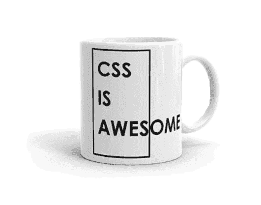
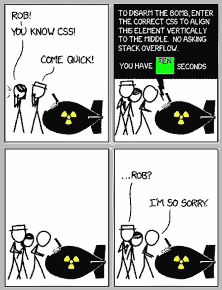

# CSS:一切都坏了。我能做什么来修复它？

> 原文：<https://dev.to/rfornal/css-everything-is-broken-what-can-i-do-to-fix-it-22nf>

如果你想掌握 CSS，不要担心细节，相反，要学习关于坏掉的东西的 5 个 W:

1.  谁撰写了变更...遗留代码可能需要更多的准备。
2.  最近发生了什么变化，它如何反映在代码中？
3.  规范是什么时候变成现实的...实现的样式有多稳定？
4.  受影响的 HTML 和 CSS 在哪里？
5.  为什么会发生变化？...代码的一些其他部分；规范实施；HTML？

> "今天的惊人想法变成了明天的问题。"未知

## 成为更快乐的 CSS 开发者的六种方法

或者，当接近 CSS 开发时的六个重要基础...

1.  不要等到 IE 死了。

    IE6 运行时间为 2001 年 8 月 27 日至 2016 年 1 月 12 日(距离其最初发布已超过 14 年)。

2.  专注于现在；通过犯错误来学习。

    使用像[http://www.caniuse.com](http://www.caniuse.com)这样的网站和其他现有资源来看看浏览器是如何应用这些标准的。

3.  限制开发环境。

    使用像[http://www.jsfiddle.net](http://www.jsfiddle.net)这样的网站来找出不正确的代码，并在一个隔离的环境中工作。

4.  让编写糟糕的代码变得更加困难。

    有严格的规则集和代码审查，同时记住“编辑器继承”(复制/粘贴)复制会导致错误。

5.  了解工具。

    浏览器开发工具；可以做些什么来控制环境以解决问题。

6.  消除噪音。

    有效使用工具；注意“出血边缘”代码。

CSS 是“黑箱理论”的顶峰；我们正在定义什么样的参数进入，并且**希望**正确的风格从不同的盒子里出来(Chrome，IE，FF，等等)。

记住:“最好的”不一定是最好的...
为了处理 CSS 固有的复杂性，各种不同的最佳实践被建立起来。问题是，对于哪些最佳实践实际上是最好的，还没有任何强有力的共识，而且许多实践似乎完全相互矛盾。

## CSS 心态

有些人“明白了”...其他人没有。

### 是什么让 CSS 与众不同

它很有弹性...
HTML 和 CSS 被特别设计成容错的。如果有问题，浏览器不会抛出错误；相反，它会忽略那部分代码，继续前进(删除一些 JavaSCript，看看会发生什么)。

1.  Jen Simmons (Mozilla)半开玩笑地称之为“量子 CSS”。你可以利用 CSS 的一个特性“同时使用它和不使用它”。它可以工作，也可以不工作。”

这是陈述性的...
告诉浏览器你想让它发生什么，它会想出办法。[定义一些约束。让语言解决细节问题。]

1.  如果你理解错了，你将会违背语言的本质，你将会处处受挫。
2.  编写 CSS 实际上是建立了一个约束系统。不要告诉浏览器把页面上的每个元素放在哪里；你告诉它应该在它们之间放多少空间，让它自己选择它们的归属。
3.  要考虑的变量太多了。CSS 的目的是让你不用担心所有的问题。

这是上下文相关的...
CSS 不是 100%模块化的，也不应该是。

1.  该应用程序应该有一些全球风格。您几乎总是希望在页面级别设置默认字样和字体大小。这些值将被所有没有显式覆盖它们的后代元素继承。您还希望设计的某些方面在整个页面中重复应用，例如主题颜色、边框半径、框阴影和常见的边距大小。页面上更多的本地化样式将假定这些全局样式已经存在。
2.  CSS 和您的样式决定是由页面的周围环境决定的。改变设计的一部分会对屏幕上的其他项目产生影响。

## 黑客入侵用户感知

休斯顿机场出了点问题...

> “人们对时间的感知是不同的，这取决于他们的焦虑程度，以及他们是在路上还是在家。在我们在谷歌进行的研究中，我们发现 75%的用户在家时觉得网站很快，但当他们外出时，这一比例下降到 52%。年轻用户也觉得网站加载速度比老用户慢。总的来说，我们感觉加载延迟比实际情况多 80 毫秒。因此，如果你被留在一旁等待，事情会变得更漫长。”

**加载**
加载时间感觉更长，因为用户要等待内容。

> 此外，它显示应用程序处于“思考”状态，而不是“工作”状态。

填充屏幕
骨架内容:虽然这更好，但单独使用它来代替预加载器并不好。因为它仍然给人一种出错的感觉，并且没有显示即将到来的内容类型的任何上下文。

使用骨架屏幕、上下文元数据和部分加载的像素化图像的混合，可以占用用户的大量时间，并使整个体验感觉更快。这个想法是为了让用户知道将要发生的事情，并尽可能快地载入内容。

脸书、RedBooth、Spotify 和 Google Plus 的研究表明，隐藏菜单项意味着用户不会点击它们。脸书还发现，切换到底部导航让应用程序对速度的感知似乎更快了。因为眼不见心不烦，快速看到一个项目会让体验感觉更快。因此，让你的主要行动号召随时可见会有所帮助。底部导航在移动设备上也更符合人体工程学，因为用户可以用一只手够到按钮，这也有助于保持快速和自然的体验。

让用户知道将要发生什么是至关重要的，但是通知他们已经触发的动作也有助于让你的应用和网站感觉更快。使用动作、悬停状态和涟漪，你可以让用户放心，他们采取的行动正在进行中。

## 网络标准:朋友还是敌人？

W3C(万维网联盟)不“制定”标准。

根据机构群体的意见，标准委员会简单地批准或不批准提议的措辞。当在浏览器中应用这些时，这经常导致基于解释的混乱。

CSS3、CSS 4 和其他神秘的生物

*   第一章(1996 年，68 页)
*   第二章(1998 年，480 页)
*   ...展望未来，委员会将 CSS 分解成独立版本的模块；没有“CSS 3”或者超越。

CSS 麻烦的历史主要来自于这样一个事实，即开发新手通过蛮力学习是如此简单，而且在项目中很容易出现糟糕的结构。

## 厂商前缀:朋友还是敌人？

标准小组需要开发人员的输入来创建规范。开发人员对创造不能用于生产的东西不感兴趣。

实验技术在生产中得到广泛应用，WG 被迫将这些技术纳入规范中。

*   供应商前缀(-moz-，-ms-，-o-，-webkit-)...(史诗般的失败)
*   开始被到处使用。
*   所有可能的变化开始被添加到代码库。
*   维护工具(自动修复工具)

实验功能现在开始要求打开**配置标志**。

## CSS 方法论

所有的 CSS 开发都建立在方法论之上。CSS 很难维护，写得不好的 CSS 会很快变成一场噩梦。

*   预处理器
*   后处理器
*   面向对象的 CSS

    好的指导方针，但方法的细节有限。

    *   分离结构和皮肤(布局和颜色、字体等。)
    *   分离容器和内容
*   SMACSS(CSS 的可扩展和模块化架构)

    与 OOCSS 相比，它的方法有更多的细节，但是在决定什么样的 CSS 规则应该归入哪个类别时，它仍然需要一些仔细的思考。

    *   按类别编写 CSS:基本规则、布局规则、模块、状态规则和主题规则。
    *   命名约定(前缀和状态规则，即 is-折叠)
*   BEM(块、元素、修改器)

    简单易懂，有一个特定的命名约定，允许新人应用它，而不必做出复杂的决定。一些方法的缺点是类名可能非常冗长，并且不遵循编写语义类名的传统规则。

    *   独立块
*   原子 CSS(或函数 CSS)

    *   创建小型的、单一用途的类，其名称基于视觉功能。搜索
*   JS 中的 CSS

    *   不在单独的样式表中定义 CSS 样式，而是直接在每个组件本身中定义(请参见 React)。

...请记住，没有唯一正确的方法。

## CSS 编码提示

**一般...**

1.  教程提供知识...不是体验。
2.  正确排列和嵌套 HTML。
3.  如果你喜欢的网站，检查布局。
4.  不要害怕尝试新事物。
5.  学习选择器(和特异性)；有效使用类和 id(最不特定的选择器)。
6.  使用外部样式表；避免内部和内联(异常？).

**亲吻和层叠...还记得“蝴蝶效应”吗**

*   最小化代码重复(进行更改的编辑量)。
*   可维护性与简洁性；可维护的代码实际上可能需要更多的代码行。
*   “currentColor”(解析为 Color 属性)。
*   遗产

    经常被遗忘的是,“inherit”关键字可以被任何 CSS 属性使用，它总是对应于父元素的计算值。
    输入，选择，按钮{ font:inherit；}

相信你的眼睛，而不是数字...

*   视错觉在任何形式的视觉设计中都很常见。具有相等填充的盒子看起来顶部和底部更少，因为字母形式是矩形的。

响应式网页设计...
RWD 经常变成以各种分辨率测试，然后附加 CSS 来修复(增加开销)。媒体查询阈值应由设计决定，而不是由特定设备决定。如果有大量的媒体查询要使设计适应更小(或更大)的屏幕，后退一步，重新检查代码结构，因为很可能响应不是问题。

*   关于好的 RWD 需要什么，还有很多没说的。
*   媒体查询使用的权利是不可或缺的。
*   争取媒体查询断点之间的流动布局和相对大小。

明智地使用短工...

*   使用 shorthands 是一种很好的防御性编码和未来防护，除非有意将级联属性用于其他任何事情(最小化代码重复)

预处理器的使用...

*   在开始一个新项目时，使用预处理器需要是一个有意识的决定，而不是盲目的默认。
*   LESS、Sass 或 Stylus(作为开始)为创作 CSS 提供了几种便利:变量、混合、函数、规则嵌套、颜色处理等等。
*   如果使用得当，它们有助于在大型项目中保持代码的灵活性。

## 纯 CSS(而非框架)

许多受预处理器启发的特性正在成为纯粹的 CSS:

*   类似变量:级联变量的 CSS 自定义属性
*   calc(): CSS 值和单位级别 3...(很好的支持)
*   color(): Css 颜色级别 4...(指操纵颜色)
*   关于嵌套的一些讨论。

像这样的原生特性的强大之处在于，它们比预处理器提供的特性更加强大，因为它们是动态的。

## CSS 框架(超过纯 CSS)

编写伟大的 CSS 代码可能是痛苦的(这是我们从来不喜欢的部分)。

> “当一个工具很好时，很容易陷入将该工具视为最终答案的陷阱。更糟糕的是，当你认为没有它你就做不好工作。”未知

**底片**

*   普通的设计
*   难以定制
*   能力和理解(知识差距)
*   自动预混合器

*   失去对文件大小和复杂性的跟踪。

*   调试变得更加困难。

*   开发潜伏期。

*   漏抽象法则:有自己的缺陷。

**阳性**

*   变量(可重用性)
*   嵌套(可读性)
*   分部和导入(可维护和可读)
*   Mixins 和其他指令

> “我想，如果你唯一的工具是一把锤子，那么把一切都当作钉子是很有诱惑力的。”——亚伯拉罕·马斯洛

## 处理遗留 CSS

> "一个糟糕的程序员一年可以轻松创造两个新工作."未知

**代码库的种类...**

*   再也没有人真正理解了。
*   几年来有十几个不同的贡献者。
*   从未进行过全面的重构或改革。
*   它随着时间的推移而有机地成长，并随着新的技术、风格和趋势而改变。

**看看什么中断了**

确定代码库的一部分，并对它进行试验:弯曲它，破坏它，改变它，看看它会发生什么。记下任何奇怪或不寻常的事情；如果在代码库中的其他地方再次发生这种情况，可能会有一些意义。

**确定入口点**

建立哪个文件导入哪个其他文件的概念；谁把什么传给谁；什么从哪里继承；依赖树是什么样子的？构建代码库拓扑的心理模型。

**了解发生了什么变化**

查看最后更改的文件:任何一年多没有更改的文件对当前工作来说可能不太重要。

**确定使用了什么**

Chrome 的 Coverage 工具是一个很好的方式，可以从很高的层次上看到当前页面使用的 CSS。这种非常不科学的检查代码使用的方法应该给出一个大概的概念，什么可能是死代码，或者什么可以简单地被忽略。

**有机学习代码库**

别没事找事。如果您从来不需要接触帮助和支持部分，那就没有必要特意去研究它。努力保持专注，学习代码库中最重要和最及时的部分。

**设置回归测试**

理想情况下，我们应该有一个永久的回归测试套件。

Parker 是一个静态分析工具。使用它来获取关于 CSS 的整体构成和健康状况的有用信息:多少个 id，意味着特异性，有多少！重要事项等。

> "不要因为你花了很多时间去犯一个错误，就抓住不放."未知

## 结论

要回答如何处理做了不寻常的事情的 CSS 的问题，了解关于什么被破坏的 5w，我们可以总结如下:

1.  **谁**发起了变更...遗留代码可能需要更多的准备。
2.  **最近**有什么变化，如何在代码中体现出来？
3.  **什么时候**规范变成了现实...实现的样式有多稳定？
4.  **受影响的 HTML 和 CSS 在哪里**？
5.  **为什么会发生**变化？...代码的一些其他部分；规范实施；HTML？