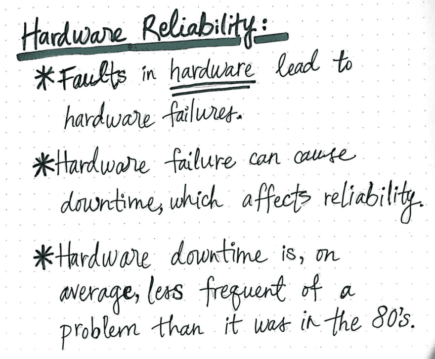
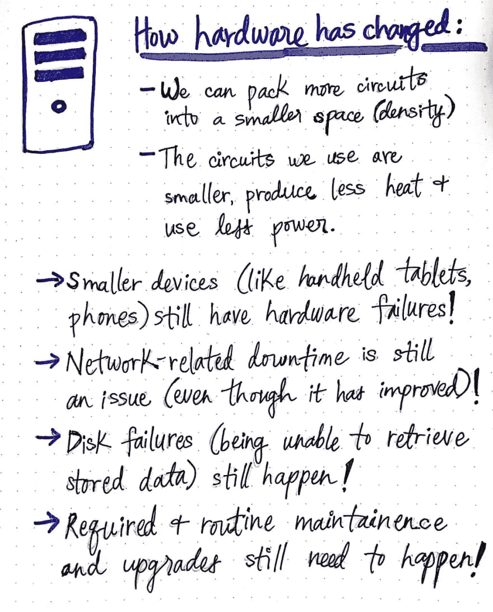
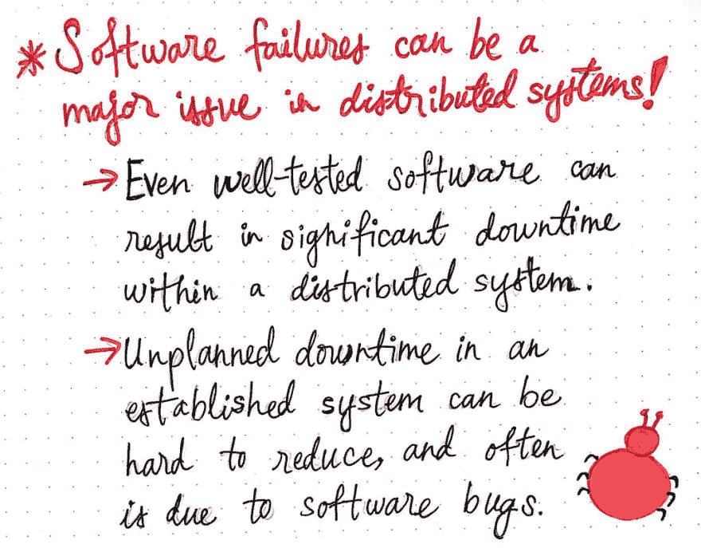
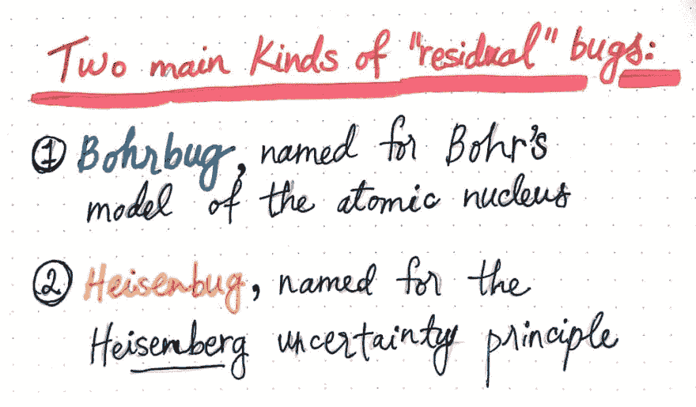
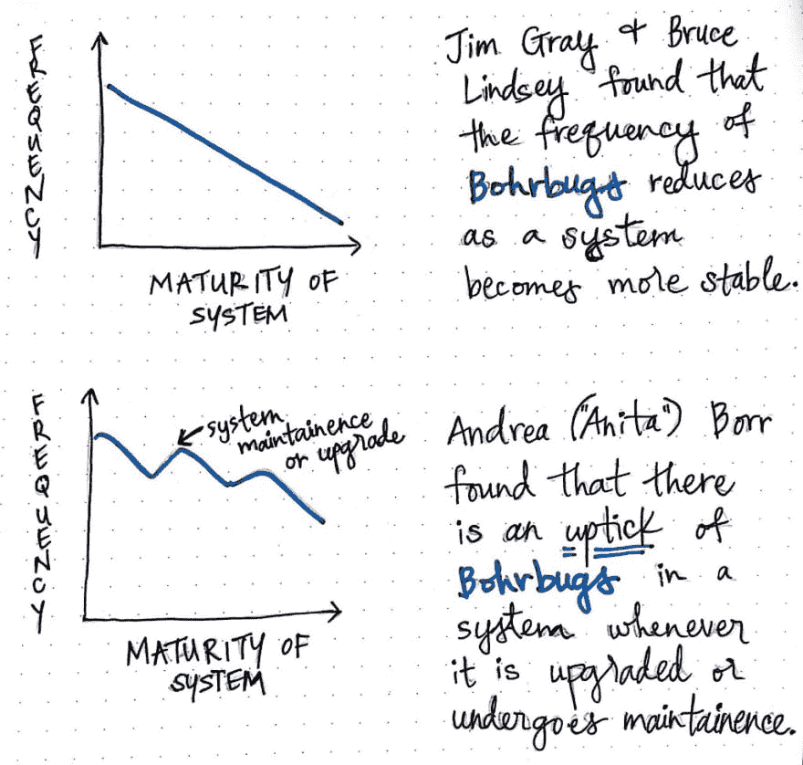
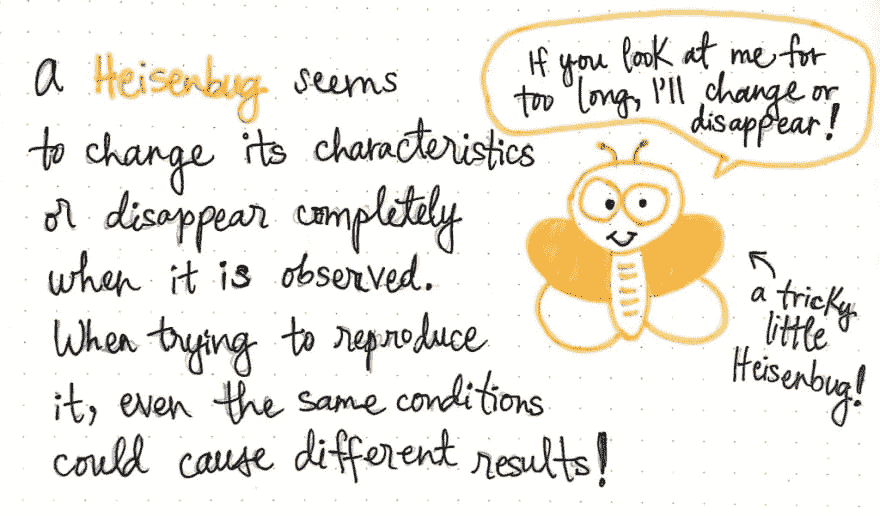
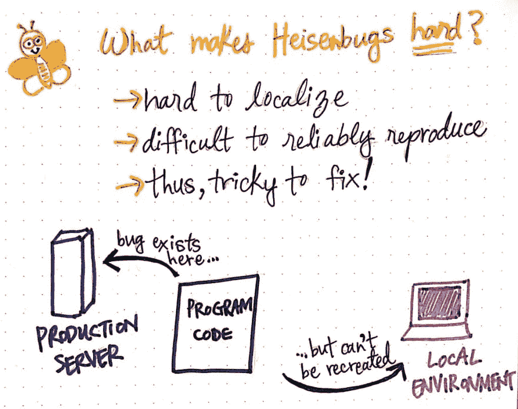
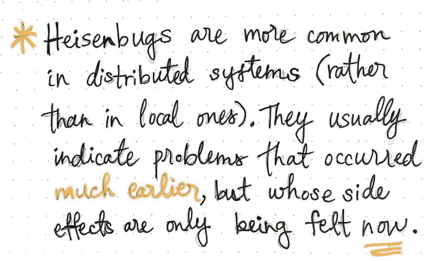
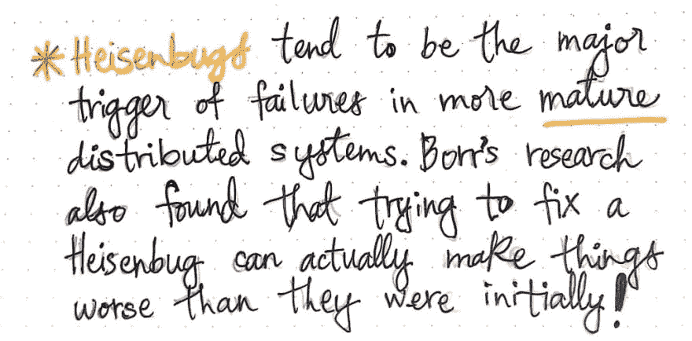

# 消除分布式系统错误

> 原文：<https://dev.to/vaidehijoshi/weeding-out-distributed-system-bugs-9c8>

随着我们对分布式系统了解的越来越多，我们已经看到了事情出错的许多方式。更具体地说，我们已经看到有*那么多*种可能的场景，其中一个大型或系统的一部分可能会发生故障。

由于失败在任何规模的系统中都是不可避免的，我们应该帮自己一个忙，更好地理解它。到目前为止，我们已经在相当抽象的意义上谈论了不同种类的[故障](https://dev.to/vaidehijoshi/fantastic-faults-and-what-to-call-them-2djb)和[故障](https://dev.to/vaidehijoshi/modes-of-failure-part-1-4db1)。然而，现在是我们更具体一点的时候了。当然，我们模糊地理解在一个系统中事情如何出错的不同风格和特征，以及为什么它们在我们的系统中是有问题的(然而是不可避免的)。但是我们如何开始以一种更有形的形式来理解系统中的这些缺陷呢？

为了做到这一点，作为软件的消费者和创造者，我们需要更深入地思考在我们每天都要处理的系统中，故障以不同的方式呈现给我们。对于我们大多数人来说，系统中的故障表现为程序错误。然而，一个 bug 在我们面前出现的方式会对我们更具体地理解它产生很大的影响。

那么，我们到底要处理哪种错误，以及它们如何影响分布式系统的失败？嗯，这就是我们要解决的谜团！

#### (硬件)过去的故障

在我们深入识别今天的 bug 之前，让我们快速回顾一下过去。当想到系统中的失败和错误时，人们很容易不知所措，所以在我们深入研究之前，我们应该花一点时间来看看计算中的错误是如何在这些年中发生变化的。

<figure> 

<figcaption>什么是硬件可靠性？</figcaption>

</figure>

直到 20 世纪 80 年代，计算的主要焦点都在硬件上。更具体地说，这个领域的大部分都集中在如何让硬件变得更好。这仅仅是因为硬件在许多方面是主要的限制因素。例如，如果我们当时想制造一台更快更高性能的机器，我们需要更大的硬件；这是为我们需要的所有电路提供足够空间的唯一方法！如果我们想要更多的电路——每个电路的尺寸都已经很大很高了——那么我们也需要为它们使用大量的电力和散发大量的能量和热量做好准备。

这些问题开始凸显出几十年前系统中可能出现的一些明显的故障。正如[我们已经知道的](https://dev.to/vaidehijoshi/fantastic-faults-and-what-to-call-them-2djb)，硬件故障——比如电路过热，或者网络布线问题导致大范围停电——是导致硬件故障的原因。如果硬件的任何方面出现故障，那么该故障将可能导致系统某种形式的停机，我们知道[会使系统不太可靠](https://dev.to/vaidehijoshi/ready-and-available-distributed-systems-bck)。直到 80 年代，硬件故障仍然是一个真实而普遍的问题。

但如今，情况有所不同。与四十年前相比，我们经历的因硬件故障导致的停机时间要少得多。我们多年的集中努力已经帮助改善了我们现在每天都依赖的硬件！在过去的三十年里，电路的尺寸已经减小，允许我们将更多的电路装入更小的空间，这些电路产生更少的热量，使用更少的能量。电路的生产也变得更加容易和便宜，使得它们总体上更加便宜。这也让我们能够制造更小的设备，比如笔记本电脑、桌子和智能手机，仅举几例。

然而，这并不意味着没有任何硬件问题！即使内部电路更小的小型设备也会出现硬件故障。导致停机的网络问题仍有可能发生，尽管它们发生的频率已经明显下降。硬件磁盘仍然容易出现故障，这使得向其读取(更不用说写入)数据变得很棘手。当然，硬件改进了并不意味着不需要维护和升级；由于这些仍然是需求，它们仍然会导致计划内停机。

<figure> 

<figcaption>硬件发生了怎样的变化？</figcaption>

</figure>

然而，总的来说，我们在硬件方面看到的变化对计算来说是相当积极的。那么，如果硬件有所改进……还有什么可能是分布式系统故障的促成因素呢？为什么，当然是我们亲爱的朋友*软件*！

> 即使在测试最完善的系统中，软件故障也会造成大量的停机时间。我们知道这些“失败”的另一个名字:bug。

尽管硬件有所改进，但正是分布式系统软件中的缺陷导致了意外和计划外的停机时间。许多研究估计，系统中 25%到 35%的停机时间是由软件相关代码中的错误引起的。

<figure> 

<figcaption>软件故障成为分布式系统的一大痛点</figcaption>

</figure>

这个故事有趣的一面是这样一个事实，即使在相当完善的系统中，并且有严格的测试实践，研究发现，与软件相关的停机时间的实际百分比并没有真正*曾经* *减少*超过 25%的阈值！即使经过深思熟虑的测试和质量控制，似乎仍然存在一些缺陷。

#### (软件)当下的问题

在更成熟的系统中仍然存在的 bug——例如那些经过严格测试的——也被称为 ***残留 bug***，它们可以分为两个独立的类别:

<figure> 

<figcaption>两种主要的“残余”软件 bug</figcaption>

</figure>

1.  *，以尼尔斯·玻尔和欧内斯特·卢瑟福的原子核模型命名*
**   ***海森堡*** ，它们被命名为沃纳·海森堡的海森堡测不准原理的双关语。*

 *这两个错误已经被许多不同的计算机科学家研究过；其中最著名的三位包括吉姆·格雷、布鲁斯·林赛和安德里亚(“安妮塔”)·博尔，我们稍后会读到他们的劳动成果。在这两种不同的“残留”错误中，一种肯定比另一种更容易让人理解。所以先从那个开始吧！

***Bohrbug*** 是 bug 中最(全？)程序员在修软件时会遇到。在适当的条件下，Bohrbug 是一种可以可靠复制的 bug。例如，如果我们能够注意到一个软件中出现了一个 bug，并密切观察它发生的情况，如果它是一个 Bohrbug，那么就能够通过重新创建相同的情况来再现它。

<figure> 

<figcaption>Bohrbug:快速定义！</figcaption>

</figure>

Bohrbug 很容易定位并精确定位到代码库的某个部分。作为开发人员，这是一个巨大的福利，因为这意味着我们可以可靠地找到然后*修复*bohr bug，尽管它可能很烦人！

有趣的是，当 Jim Gray 和 Bruce Lindsey 在更成熟的系统中研究 Bohrbugs 时，他们假设这些可复制的小 bug 的频率实际上随着系统变得更老和更稳定而降低。

<figure> 

<figcaption>在一个系统中，随着时间的推移</figcaption>

</figure>

然而，安妮塔·博尔的研究对此增加了一点细微差别。她发现，随着系统变得更加稳定，Bohrbugs 的百分比并没有严格地持续下降；相反，她的研究发现，随着系统中引入的每一次新的升级或定期维护，Bohrbugs 也会略有上升，因为系统中的重大变化仍然很有可能引入*可再现的*bug。

令人欣慰的是，尽管新的 Bohrbugs 可能会随着这些系统范围的变化而引入，但至少它们可以被复制(希望是修复！).但是在软件世界里事情并不总是那么简单(当然)。有些 bug 的行为并不总是一样的…事实上，当我们试图调查它们的时候，有些 bug 的行为似乎有所不同！

#### 处理棘手的、分散的 bug

有一种 bug 与分布式系统特别相关，在本系列文章中，我们终于到了与它面对面的时候了。当然，我说的是海森堡！

<figure> 

<figcaption>海森伯格:快速定义！</figcaption>

</figure>

作为一名程序员，对付一个 ***海森伯格*** 可能会超级令人沮丧。当仔细观察时，这是一个实际上表现*不同*的 bug。当一个人开始研究一个海森伯格时，它可能会改变自己的表现方式。在某些情况下，当一个 Heisenbug 被调试时，它会完全消失。在某些情况下，当为了重现 bug 而重新创建某些条件时，bug 就不会出现了！很沮丧，对吧？

<figure> 

<figcaption>是什么让海森堡如此努力？</figcaption>

</figure>

例如，在生产环境中，诸如数据结构耗尽空间或程序的一部分溢出一些分配的内存之类的错误可能不容易在本地或测试中重现；然而，这个错误会导致系统崩溃，而且是致命的！

这是海森堡如此难以理解的部分原因。实际上很难*推理*它们，因为很难实际定位它们并确定它们。而且，因为它们很难可靠地再现*，它们很难被识别，因此，很难实际解决！*

 *Heisenbug 与分布式系统尤其相关，因为它们更可能出现在分布式系统中，而不是本地化的中央系统中。这些种类的错误实际上是系统中问题和故障的指示器，这些问题和故障比错误出现的时间早得多。

<figure> 

<figcaption>海森堡在分布式系统中常见得多。</figcaption>

</figure>

Heisenbug 通常是一个危险信号，表明不久前系统中出现了其他问题，现在才浮出水面，只是碰巧它以这个 bug 的形式出现。

> 实际上，海森伯格只是一个更早问题的长期副作用。

在更成熟的分布式系统中，是 heisenbug—*而不是*bohr bug——导致重大故障和系统崩溃。如果我们更深入地思考，这就开始有意义了；分布式系统中有许多移动的部分，以及许多相互依赖的依赖关系和节点。看似来自系统中的*一个*节点的故障实际上可能是来自别处的故障的三个节点，但是在整个系统中传播。虽然玻尔 bug 可能很容易复制、定位和推理，但海森 bug 却很难思考和修复。

<figure> 

<figcaption>海森堡在一个系统中，随着时间的推移</figcaption>

</figure>

Anita Borr——我最喜欢的残余 bug 研究员——在她的研究中发现，许多工程师很难理解 Heisenbug，试图修复 Heisenbug 实际上会导致更多的问题！所以，如果你一直觉得海森堡是狡猾的小动物，很难对付，不要担心；这项研究与你的观点一致！

#### 资源

了解分布式系统中的软件故障是很酷的事情，而且你可以了解更多。关于如何在你的系统中处理和防范海森伯格病毒，有很多有趣的研究和文章。如果您想了解更多，请查看下面的一些资源！

1.  可靠的分布式系统:技术、网络服务和应用
2.  为什么电脑会停下来，我们能做些什么？、吉姆·格雷
3.  [分布式系统介绍](https://courses.cs.washington.edu/courses/cse490h/07wi/readings/IntroductionToDistributedSystems.pdf)，华盛顿大学
4.  海森伯格和波尔伯格:为什么他们不一样？、理查德·马丁(？)
5.  [保护应用程序免受海森伯格攻击](https://pdfs.semanticscholar.org/cae7/52b327a2bbd293a6b92530e354a76b82ace2.pdf)，Chris Hobbs

* * ***