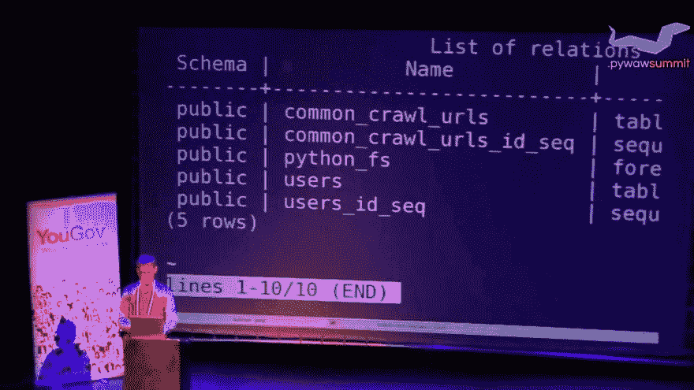

# 大象体内的蛇

> 原文：<https://dev.to/andi/plpythonu-pl-python-on-snake-inside-elephant-mca>

[](https://res.cloudinary.com/practicaldev/image/fetch/s--x2iH6RLZ--/c_limit%2Cf_auto%2Cfl_progressive%2Cq_auto%2Cw_880/https://thepracticaldev.s3.amazonaws.com/i/p4sis6tokttjoouczdyv.jpg)

实际上我们会以另一种方式来看待某些事情；)蛇在大象里面，而不是像《小王子》故事里那样反过来。

好的介绍可以在 youtube 上找到:

[](https://www.youtube.com/watch?v=xkzbE5zon18)

接下来是它的幻灯片:[https://wulczer.org/pywaw-summit.pdf](https://wulczer.org/pywaw-summit.pdf)

# 前奏——你需要在 postgres 里设置什么？

### 如果您在新的 postgres 实例上使用 plpython3u，您可能需要安装/设置以下内容:

```
apt-get update
apt-get install postgresql-plpython3-11 
```

*   注意为你的 postgres 版本安装好的版本:

### psql 内部:

```
CREATE EXTENSION plpython3u; 
```

### 举例趣事

```
create function histogram(a float[], bins int = 10)
returns int[]
as $$
import numpy
return numpy.histogram(a, bins)[0]
$$ language plpython3u; 
```

*   你可能需要在 postgres 机器上安装额外的 python 库(例如上面的`numpy`)，首先安装 pip: `apt-get install python3-pip`

## 重要的事情要记住:

*   把你的函数放在独立的模块中，可以选择模仿 plpython 的魔法，所以这些都是经过测试的