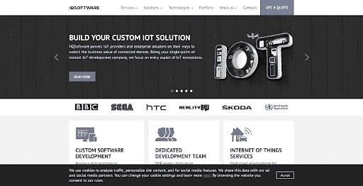
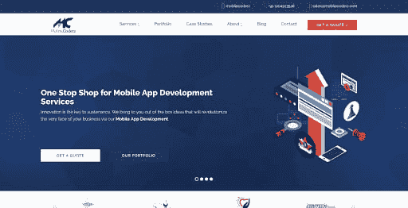
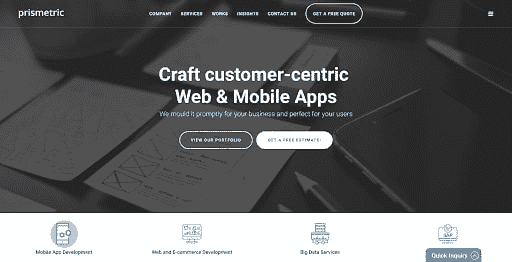
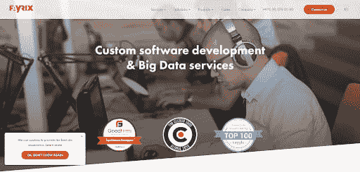
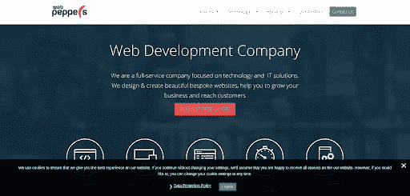
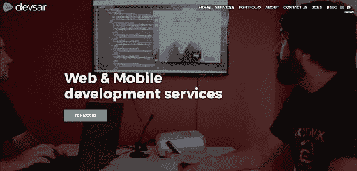
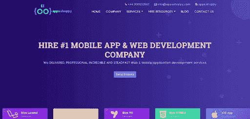
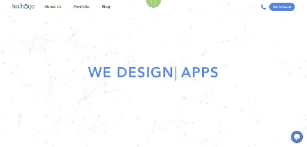

# 2019-20 年寻求的十大全栈开发公司

> 原文：<https://dev.to/nancy67694024/top-10-full-stack-development-companies-to-seek-in-2019-20-21h7>

目前，全栈开发被认为是该领域的主要趋势。它需要对整个设计以及相应网站的实施过程的完全所有权。因此，它为 web 开发带来了完整的解决方案。此外，专业的全栈开发人员能够熟练地实现客户的目标。

由于我们已经被很多全栈开发公司包围，对于企业主来说，识别最好的一个可能会成为一项艰难的任务。因此，本博客中列出的公司是在考虑了各种参数(如已证明的跟踪记录、透明度、诚实度、多元化投资组合、多年经验、退款保证、技术经验等)后入围的。

事实上，一些参考来自评估公司，如**离合器**、 **Goodfirms** 给出最佳名单。

在这篇博文中，你将会看到世界上最好的全栈开发公司的名单。这个列表肯定会节省你的研究时间，以及手工努力。

### 1.[**HQ 软件**](https://hqsoftwarelab.com/?utm_source=dev.to%2Fnancy%2Ffull-stack&utm_medium=ss0305)

#### (顶级全栈开发公司)

*   **价格**:25-49 美元/小时
*   **地点**:美国，爱沙尼亚
*   员工人数 : 50 - 249 人
*   **成立于** : 2001 年

The history of HQSoftware dates back to 2001, when a group of technology enthusiasts came together to create software adapted to the real-world needs of customers, with passion and fun. Today, they mix that ever-green emotion with hard-earned experience to serve customers who remain with us for years, including HTC, Canon, Sega, Honda, BBC and more.
In all industries, they offer customized full stack development to help companies drive their customers, employees and partners through multiple channels. When understanding the business is vital to the success of a project, software development providers choose their dedicated teams to meet specific technical needs or even create complete products from scratch.

### 2. [**估价师**](https://www.valuecoders.com/?utm_source=dev.to%2Fnancy%2Ffull-stack&utm_medium=ss0305)

#### (最佳全栈开发公司)

*   **价格**:10 美元/小时起
*   **地点**:美国印度
*   员工人数:400-450 人
*   **成立于** : 2004 年

ValueCoders is one of the leading full stack development firms certified ISO and CMMI Level 3\. It is the most preferred software development company in India to hire dedicated full-stack web developers. It was established in 2004 and has been offering amazing mobile and web development services across the globe. It has more than 2,500 satisfied and happy customers with a score of 96 out of 100 for the customer retention rate.

### 3.

 **#### (领先的全堆栈开发公司)

*   **价格**:<$ 25/小时
*   **地点**:印度
*   **员工** : 10 - 49 人
*   **成立于** : 2015 年

At MobileCoderz, the emphasis is always on what the client wants and they strive to improve every day. They take pride in the quality of their deliverables and work day and night to make sure there are no problems or delays on their side. They ensure that there are no gaps in understanding the customer's requirements and, therefore, the final product is exactly according to the needs of the customer.
In most cases, they have delivered a final web stack product that not only translates the client's idea but also elevates it to a completely new level, which has allowed us to enjoy a large number of repeat business. Their full stack development team is flexible, which allows us to respond quickly and provide personalized customer service, but large enough to offer business-level projects for leading brands.

### 4. [**棱镜**T3】](https://www.prismetric.com/?utm_source=dev.to%2Fnancy%2Ffull-stack&utm_medium=ss0305)

#### (成长中的全栈开发公司)

*   **价格**:<$ 25/小时
*   **地点**:印度，美国
*   员工人数 : 50 - 249 人
*   **成立于** : 2008 年

Prismetric is a company of two technocrats who have their individual core expertise in mobile solutions, web solutions, CRM solutions and Business Intelligence solutions. Their synergy worked exceptionally well and in a short space of time, the company became a leading provider of full-range technical solutions.
They have obtained a significant client base in the United States, the United Kingdom, Canada, Australia, European countries, the United Arab Emirates, South Africa. Since its inception in 2008, Prismetric is based on the vision 'Custom technology solutions that delight customers'.
The dedicated full stack development team of over 60 highly qualified full stack web developers, experienced project managers and industry consultants solidifies Prismetric's reputation as an off-shore technology company offering superior quality solutions.

### 5. [**法里克斯**](https://fayrix.com/?utm_source=dev.to%2Fnancy%2Ffull-stack&utm_medium=ss0305)

#### (雇佣全栈开发者)

*   **价格**:<$ 25/小时
*   **地点**:以色列
*   **员工**:1000-9999 人
*   **成立于** : 2005 年

Fayrix brings together more than 1,500 IT professionals around the world today. The company's headquarters is located in Herzliya Pitu'akh, Israel, with 10 R&D centers in Eastern Europe. This distributed geography allows them to employ the best talents from around the world. Its mission is to make big data services and high quality custom software development available all over the world and affordable for companies of any size. They provide world class full stack development services to their clients.

### 6. [**网椒**](https://web-peppers.com/?utm_source=dev.to%2Fnancy%2Ffull-stack&utm_medium=ss0305)

#### (雇佣最好的全栈开发人员)

*   **价格**:25-49 美元/小时
*   **地点**:乌克兰，匈牙利
*   **员工** : 10 - 49 人
*   **成立于** : 2013 年

Web Peppers specializes in customized web development and interactive design. They can design your website to be consistent with your company's brand image or help you create a completely new corporate identity. By choosing Web Peppers to take care of the needs of your business, you will benefit from the constant quality of work.
They offer a wide range of web development services that are delivered using the latest technologies with the highest quality. Their main objective is to help their clients to comply with commercial values and to market successfully online. They help you strategically build your brand, improve your global presence on the web and develop more meaningful relationships with your customers.

### 7. [**德弗萨尔**T3】](https://www.devsar.com/?utm_source=dev.to%2Fnancy%2Ffull-stack&utm_medium=ss0305)

#### (雇佣顶级的全栈开发人员)

*   **价格**:25-49 美元/小时
*   **地点**:美国阿根廷
*   **员工** : 10 - 49 人
*   **成立于** : 2010 年

Devsar is a global consulting and full stack development firm specializing in the development of web and mobile applications. Based in Buenos Aires, Argentina and with more than 10 years of operations under our belt, they have delivered IT solutions around the world, providing strategic advice that generates long-term sustainable results.
Focused on the development of responsive, robust and scalable solutions, they have been the IT partner in many new companies and have helped dozens of innovators and entrepreneurs realize their ideas. They can build from simple websites to the largest and most complex project, combining top-level technologies with individual and team experience to meet the needs of our customers.

### 8. [**代号 Brew Labs**](https://www.code-brew.com/?utm_source=dev.to%2Fnancy%2Ffull-stack&utm_medium=ss0305)

#### (最佳全栈开发公司)

*   **价格**:25-49 美元/小时
*   **地点**:印度
*   员工人数 : 200-250 人
*   **成立于** : 2013 年

Code Brew Labs is a focused software product development company which takes the ideas of small businesses and startups needs and requirements to build good quality products. They are a team of more than 60 developers and designers which takes on new challenges related to software product development services.
Since its inception in 2013, Code Brew Labs is growing outstandingly which can be easily understood by their services offered to their clients. Their main focus is on delivering the best user experience while developing and designing products.

### 9. [**应用商店**](https://www.appsshoppy.com/?utm_source=dev.to%2Fnancy%2Ffull-stack&utm_medium=ss0305)

#### (雇佣印度全栈开发者)

*   **价格**:<$ 25/小时
*   **地点**:英国印度
*   **员工** : 10 - 49 人
*   **成立于** : 2010 年

AppsShoppy believes in offering high quality full stack development services along with unmatched support and support. They are a customer oriented and performance oriented company that follows the concept of sustainability and development to offer a change in the quality of your business and services.
They are a dynamic group of creatives, advancement individuals and marketing experts. They continuously improve, work directly and generate lasting results.

### 10. [**特丘戈**T3】](https://www.techugo.com/?utm_source=dev.to%2Fnancy%2Ffull-stack&utm_medium=ss0305)

#### (成长中的印度全栈开发公司)

*   **定价**:
*   **地点**:印度
*   员工人数 : 200-250 人
*   **成立于** : 2015 年

自 2015 年成立以来，Techugo 是顶尖的 IT 开发公司之一，拥有超过 120 名专业的全栈开发人员和设计师，在全球超过 2 个办事处工作。在不到两年的时间里，他们为客户带来了信任，并为各种小型企业和初创企业提供了可用的 IT 解决方案。他们涉及各种行业，如零售、金融、电子商务、医疗保健等。他们的业务主要依赖于移动和网络应用程序开发服务。

另请阅读:[印度十大值得信赖的 Android 应用开发公司](https://yourstory.com/mystory/top-10-trusted-android-app-development-companies-i)

**结论:**

最后，我们列出了 10 家最佳全栈开发公司，供您在 2019-20 年进行下一个 web 开发或移动应用项目时考虑。这 10 多家公司是各自领域的技术先锋，拥有成功执行项目所需的所有技能和技术经验。

*然而，我与大家分享的数据是我对各大全栈开发公司的最佳研究和知识，但该列表仍处于“编辑模式”。你愿意和我们一起列出你的网络开发公司吗？请在下面的评论框中填写贵公司的完整信息。***