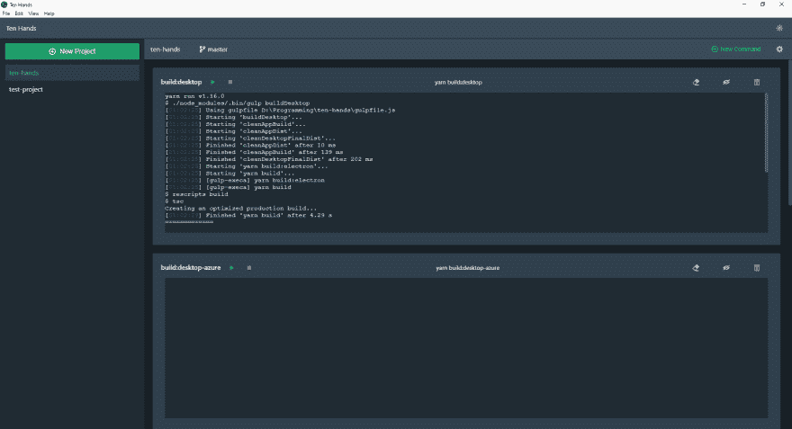
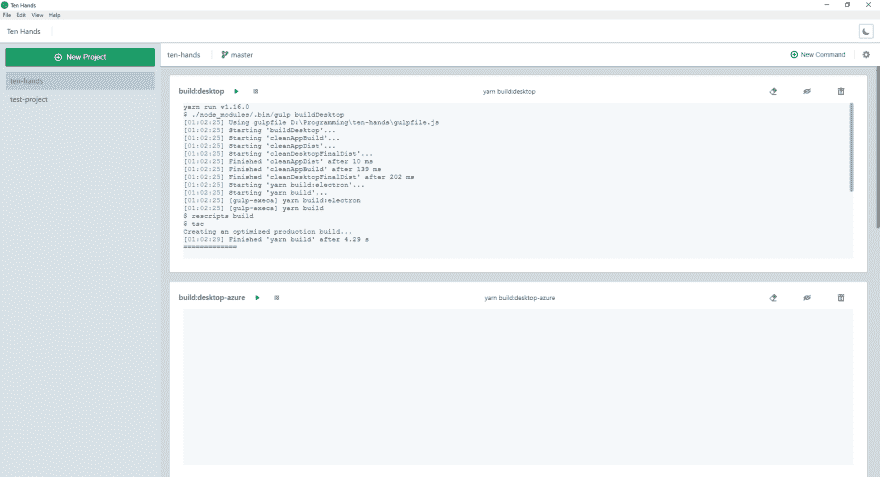

# 启动开源项目。“十只手”:命令行任务组织工具

> 原文：<https://dev.to/saisandeepvaddi/launching-open-source-side-project-ten-hands-a-command-line-task-organizing-tool-598f>

嘿伙计们，

【编辑 1】:十手 2 现已上市。检查 [https://tenhands.app](https://tenhands.app) 和【https://github.com/saisandeepvaddi/ten-hands】T2 是否使用更新版本。

作为开发人员，我们不断打开终端来运行我们的任务，比如 *npm run start* 。

`Ten Hands`是一个应用程序，您可以轻松地添加您的项目，在一个地方添加它们的任务并运行它们。

| 黑暗 | 光 |
| --- | --- |
|  |  |

NodeJS 项目(任何带`package.json`的项目)可以直接上传，它们的`scripts`会自动添加。

如果不是 NodeJS 类型的项目，您可以创建一个任意名称的 Ten Hands 项目，并在其中添加任何在终端中运行的命令。因此，它将有助于您在一个地方频繁地使用命令行任务进行组织。

这一开始是一个教育项目，让我练习 React Hooks 和 TypeScript，对我学习很多东西很有帮助。

这是一个免费的开源项目，可用于 Windows、Linux。deb)和 Mac。自己构建项目也非常容易，可以分两步完成。详情请查看 github 链接。

您也可以在 Github 中投稿(反馈/代码/文档/建议...任何东西)。任何专业水平的人都欢迎贡献/教授/学习。创建问题/PRs，我来看看。

点击这里查看 Github 和产品搜索链接。

[Github](https://github.com/saisandeepvaddi/ten-hands)
[产品搜索](https://www.producthunt.com/posts/ten-hands)