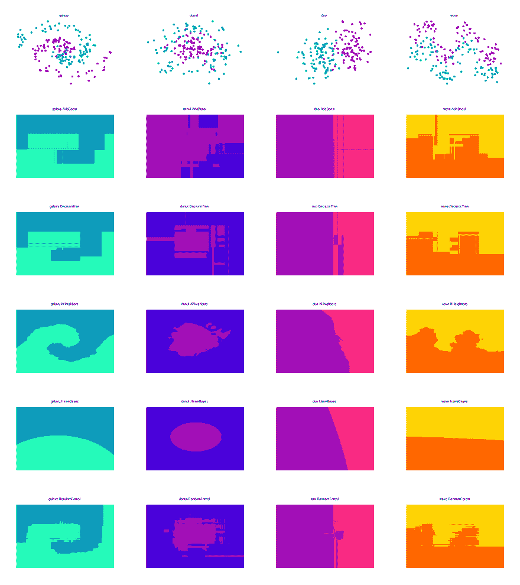
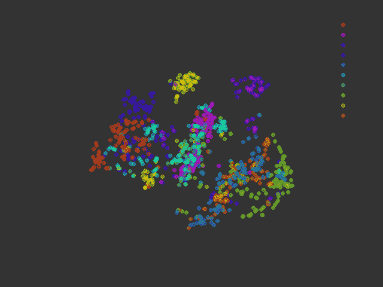
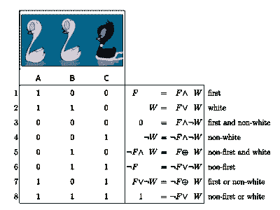

# Rumale 备忘单

> 原文：<https://dev.to/kojix2/rumale-cheat-sheet-4pg7>

🦆🦆🦆🦆🦆🦆🦆🦆🦆🦆🦆🦆🦆🦆🦆🦆🦆🦆🦆
这是一个基于 [DataCamp 的 Scikit-learn cheat sheet](https://s3.amazonaws.com/assets.datacamp.com/blog_assets/Scikit_Learn_Cheat_Sheet_Python.pdf) 的 Rumale 机器学习 cheat sheet。

##  [ yoshoku ](https://github.com/yoshoku) / [ rumale](https://github.com/yoshoku/rumale)

### Rumale 是 Ruby 中的一个机器学习库

<article class="markdown-body entry-content container-lg" itemprop="text">

# 隆隆声

[](https://camo.githubusercontent.com/5506bf80fecaf30623727254e7643cbcac55a6c4bc7c6e12015f64077ad6616c/68747470733a2f2f646c2e64726f70626f7875736572636f6e74656e742e636f6d2f732f6a6f7872756b32373230757236366f2f72756d616c655f6865616465725f3430302e706e67)

[](https://github.com/yoshoku/rumale/actions/workflows/build.yml)[](https://coveralls.io/github/yoshoku/rumale?branch=main)[](https://badge.fury.io/rb/rumale)[](https://github.com/yoshoku/rumale/blob/main/LICENSE.txt)[](https://yoshoku.github.io/rumale/doc/)

Rumale ( **Ru** by **马** chine **le** arning)是一个 Ruby 中的机器学习库 Rumale 提供了与 Python 中的 Scikit-Learn 类似的接口的机器学习算法 Rumale 支持支持向量机逻辑回归、岭、套索、多层感知器、朴素贝叶斯、决策树、梯度树提升、随机森林、K 均值、高斯混合模型、DBSCAN、谱聚类、多维标度、t-SNE、Fisher 判别分析、邻域分量分析、主分量分析、非负矩阵分解、

## 装置

将这一行添加到应用程序的 Gemfile 中:

```
gem 'rumale'
```

Enter fullscreen mode Exit fullscreen mode

然后执行:

```
$ bundle 
```

或者自己安装为:

```
$ gem install rumale 
```

## 证明文件

*   [Rumale API 文档](https://yoshoku.github.io/rumale/doc/)

## 使用

### 例 1。Pendigits 数据集分类

Rumale 提供了加载 libsvm 格式数据集文件的函数。我们首先从 LIBSVM 数据网站下载 pendigits 数据集。

```
$ wget https://www.csie.ntu.edu.tw/~cjlin/libsvmtools/datasets/multiclass/pendigits
$ wget https://www.csie.ntu.edu.tw/~cjlin/libsvmtools/datasets/multiclass/pendigits.t
```

Enter fullscreen mode Exit fullscreen mode

使用线性 SVM 和 RBF 核特征图训练分类器的代码如下。

…Enter fullscreen mode Exit fullscreen mode</article>

[View on GitHub](https://github.com/yoshoku/rumale)

比较量词
[](https://res.cloudinary.com/practicaldev/image/fetch/s--F1PFxJh0--/c_limit%2Cf_auto%2Cfl_progressive%2Cq_auto%2Cw_880/https://thepracticaldev.s3.amazonaws.com/i/k0qmmng3z5pp1dxnt2ic.png)

t-SNE+mnitz[](https://res.cloudinary.com/practicaldev/image/fetch/s--PWxmVc1a--/c_limit%2Cf_auto%2Cfl_progressive%2Cq_66%2Cw_880/https://thepracticaldev.s3.amazonaws.com/i/52loiiymoh6he5bc5poj.gif)

### 我们开始吧！

```
gem install rumale 
```

Enter fullscreen mode Exit fullscreen mode

# 一个基本例子

```
require 'rumale'

ruby_labels = label_array
#  [0,0,0,0,0,1,1,1,1,1,2,2,2,2,2]
ruby_samples = sample_array
#  [[samples_1], [samples_2], [samples_3], .. [samples_n]]

# Convert to Narray.
labels = Numo::Int32.cast(ruby_labels)
samples = Numo::DFloat.cast(ruby_samples)

# Preprocessing The Data
# Encoding Categorical Features, Normalization, etc.

# Create Your Model
model = Rumale::NearestNeighbors::KNeighborsClassifier.new
model.fit(samples, labels)

# Prediction
model.predict(new_samples)

# Evaluation
puts model.score(test_samples, testl_labels) 
```

Enter fullscreen mode Exit fullscreen mode

# 加载数据

将 Ruby 数组转换为 NArray。

```
labels = Numo::Int32[*ruby_array]
# labels = Numo::Int32.cast(ruby_array)
# labels = Numo::Int32.asarray(ruby_array)

samples = Numo::DFloat[*ruby_array]
# samples = Numo::DFloat.cast(ruby_array)
# samples = Numo::DFloat.asarray(ruby_array) 
```

Enter fullscreen mode Exit fullscreen mode

Libsvm file.

```
# Load the training dataset.
samples, labels = Rumale::Dataset.load_libsvm_file('pendigits') 
```

Enter fullscreen mode Exit fullscreen mode

# 预处理数据

## 标准化

[](https://res.cloudinary.com/practicaldev/image/fetch/s--8BZ-U3i8--/c_limit%2Cf_auto%2Cfl_progressive%2Cq_auto%2Cw_880/https://img.shields.io/badge/preprocessing-gold.svg)T3】

```
normalizer = Rumale::Preprocessing::StandardScaler.new
new_training_samples = normalizer.fit_transform(training_samples)
new_testing_samples = normalizer.transform(testing_samples) 
```

Enter fullscreen mode Exit fullscreen mode

## 归一化

[](https://res.cloudinary.com/practicaldev/image/fetch/s--8BZ-U3i8--/c_limit%2Cf_auto%2Cfl_progressive%2Cq_auto%2Cw_880/https://img.shields.io/badge/preprocessing-gold.svg)T3】

```
normalizer = Rumale::Preprocessing::L2Normalizer.new
new_samples = normalizer.fit_transform(samples) 
```

Enter fullscreen mode Exit fullscreen mode

## 二值化

[](https://res.cloudinary.com/practicaldev/image/fetch/s--8BZ-U3i8--/c_limit%2Cf_auto%2Cfl_progressive%2Cq_auto%2Cw_880/https://img.shields.io/badge/preprocessing-gold.svg)T3】

```
na[na >= thresh] = 1
na[na <  thresh] = 0 
```

Enter fullscreen mode Exit fullscreen mode

## 编码分类特征

[](https://res.cloudinary.com/practicaldev/image/fetch/s--8BZ-U3i8--/c_limit%2Cf_auto%2Cfl_progressive%2Cq_auto%2Cw_880/https://img.shields.io/badge/preprocessing-gold.svg)T3】

```
encoder = Rumale::Preprocessing::LabelEncoder.new
labels = Numo::Int32[1, 8, 8, 15, 0]
encoded_labels = encoder.fit_transform(labels)
# => Numo::Int32#shape=[5]
[1, 2, 2, 3, 0]
decoded_labels = encoder.inverse_transform(encoded_labels)
# => [1, 8, 8, 15, 0] 
```

Enter fullscreen mode Exit fullscreen mode

```
encoder = Rumale::Preprocessing::LabelEncoder.new
labels = ["A", "B", "B", "A", "C", "C"]
encoded_labels = encoder.fit_transform(labels)
# => Numo::Int32#shape=[6]
# [0, 1, 1, 0, 2, 2]
decoded_labels = encoder.inverse_transform(encoded_labels)
# => ["A", "B", "B", "A", "C", "C"] 
```

Enter fullscreen mode Exit fullscreen mode

## 一键热编码

[](https://res.cloudinary.com/practicaldev/image/fetch/s--8BZ-U3i8--/c_limit%2Cf_auto%2Cfl_progressive%2Cq_auto%2Cw_880/https://img.shields.io/badge/preprocessing-gold.svg)T3】

```
encoder = Rumale::Preprocessing::OneHotEncoder.new
labels = Numo::Int32[0, 0, 2, 3, 2, 1]
one_hot_vectors = encoder.fit_transform(labels)
# => Numo::DFloat#shape=[6,4]
# [[1, 0, 0, 0], 
#  [1, 0, 0, 0], 
#  [0, 0, 1, 0], 
#  [0, 0, 0, 1], 
#  [0, 0, 1, 0], 
#  [0, 1, 0, 0]] 
```

Enter fullscreen mode Exit fullscreen mode

## 输入缺失值

[](https://res.cloudinary.com/practicaldev/image/fetch/s--8BZ-U3i8--/c_limit%2Cf_auto%2Cfl_progressive%2Cq_auto%2Cw_880/https://img.shields.io/badge/preprocessing-gold.svg)T3】

```
idx = narray.eq(0).where
narray[idx] = Float::NAN
mean = narray.mean(axis:0, nan:true)
axis = narray.new_narray.seq % narray.shape[1]
narray[idx] = mean[axis[idx]] 
```

Enter fullscreen mode Exit fullscreen mode

# 创建你的模型

## 监督学习估计器

### k-NN(k-最近邻)

[](https://res.cloudinary.com/practicaldev/image/fetch/s--RLEQmG8E--/c_limit%2Cf_auto%2Cfl_progressive%2Cq_auto%2Cw_880/https://img.shields.io/badge/supervised-lightcoral.svg)[](https://res.cloudinary.com/practicaldev/image/fetch/s--N3dtTrZ2--/c_limit%2Cf_auto%2Cfl_progressive%2Cq_auto%2Cw_880/https://img.shields.io/badge/Classifier-limegreen.svg)[](https://res.cloudinary.com/practicaldev/image/fetch/s--uHO8GeiA--/c_limit%2Cf_auto%2Cfl_progressive%2Cq_auto%2Cw_880/https://img.shields.io/badge/Regressor-royalblue.svg)

```
Rumale::NearestNeighbors::KNeighborsClassifier.new(n_neighbors: 5) 
Rumale::NearestNeighbors::KNeighborsRegressor.new(n_neighbors: 5) 
```

Enter fullscreen mode Exit fullscreen mode

*   n_neighbors:邻居的数量。

### 线性回归

[](https://res.cloudinary.com/practicaldev/image/fetch/s--RLEQmG8E--/c_limit%2Cf_auto%2Cfl_progressive%2Cq_auto%2Cw_880/https://img.shields.io/badge/supervised-lightcoral.svg)[](https://res.cloudinary.com/practicaldev/image/fetch/s--uHO8GeiA--/c_limit%2Cf_auto%2Cfl_progressive%2Cq_auto%2Cw_880/https://img.shields.io/badge/Regressor-royalblue.svg)T6】

```
Rumale::LinearModel::LinearRegression.new(
  fit_bias: # (Boolean) — The flag indicating whether to fit the bias term.
  bias_scale: # (Float) — The scale of the bias term.
  max_iter: # (Integer) — The maximum number of iterations.
  batch_size: # (Integer) — The size of the mini batches.
  optimizer: # (Optimizer) — The optimizer to calculate adaptive learning rate. If nil is given, Nadam is used.
  random_seed: # (Integer) — The seed value using to initialize the random generator.
) 
```

Enter fullscreen mode Exit fullscreen mode

优化器:AdaGrad，Adam，Nadam，RMSProp，SGD，goldFin

### 山脊回归

[ ](https://res.cloudinary.com/practicaldev/image/fetch/s--RLEQmG8E--/c_limit%2Cf_auto%2Cfl_progressive%2Cq_auto%2Cw_880/https://img.shields.io/badge/supervised-lightcoral.svg) [ ](https://res.cloudinary.com/practicaldev/image/fetch/s--uHO8GeiA--/c_limit%2Cf_auto%2Cfl_progressive%2Cq_auto%2Cw_880/https://img.shields.io/badge/Regressor-royalblue.svg)

L2 正规化

```
Rumale::LinearModel::Ridge.new(
  reg_param: # (Float) — The regularization parameter.
  fit_bias: # (Boolean) — The flag indicating whether to fit the bias term.
  bias_scale: # (Float) — The scale of the bias term.
  max_iter: # (Integer) — The maximum number of iterations.
  batch_size: # (Integer) — The size of the mini batches.
  optimizer: # (Optimizer) — The optimizer to calculate adaptive learning rate. If nil is given, Nadam is used.
  random_seed: # (Integer) — The seed value using to initialize the random generator.
) 
```

Enter fullscreen mode Exit fullscreen mode

### 拉索回归

[ ](https://res.cloudinary.com/practicaldev/image/fetch/s--RLEQmG8E--/c_limit%2Cf_auto%2Cfl_progressive%2Cq_auto%2Cw_880/https://img.shields.io/badge/supervised-lightcoral.svg) [](https://res.cloudinary.com/practicaldev/image/fetch/s--uHO8GeiA--/c_limit%2Cf_auto%2Cfl_progressive%2Cq_auto%2Cw_880/https://img.shields.io/badge/Regressor-royalblue.svg) 
L1 正规化

```
Rumale::LinearModel::Lasso.new(
  reg_param: # (Float) — The regularization parameter.
  fit_bias: # (Boolean) — The flag indicating whether to fit the bias term.
  bias_scale: # (Float) — The scale of the bias term.
  max_iter: # (Integer) — The maximum number of iterations.
  batch_size: # (Integer) — The size of the mini batches.
  optimizer: # (Optimizer) — The optimizer to calculate adaptive learning rate. If nil is given, Nadam is used.
  random_seed: # (Integer) — The seed value using to initialize the random generator.
) 
```

Enter fullscreen mode Exit fullscreen mode

### 逻辑回归

[](https://res.cloudinary.com/practicaldev/image/fetch/s--RLEQmG8E--/c_limit%2Cf_auto%2Cfl_progressive%2Cq_auto%2Cw_880/https://img.shields.io/badge/supervised-lightcoral.svg)[](https://res.cloudinary.com/practicaldev/image/fetch/s--N3dtTrZ2--/c_limit%2Cf_auto%2Cfl_progressive%2Cq_auto%2Cw_880/https://img.shields.io/badge/Classifier-limegreen.svg)T6】

```
Rumale::LinearModel::LogisticRegression.new(
  reg_param: # (Float) — The regularization parameter.
  fit_bias: # (Boolean) — The flag indicating whether to fit the bias term.
  bias_scale: # (Float) — The scale of the bias term. If fit_bias is true, the feature vector v becoms [v; bias_scale].
  max_iter: # (Integer) — The maximum number of iterations.
  batch_size: # (Integer) — The size of the mini batches.
  optimizer: # (Optimizer) — The optimizer to calculate adaptive learning rate. If nil is given, Nadam is used.
  random_seed: # (Integer) — The seed value using to initialize the random generator.
) 
```

Enter fullscreen mode Exit fullscreen mode

### 支持向量机

[](https://res.cloudinary.com/practicaldev/image/fetch/s--RLEQmG8E--/c_limit%2Cf_auto%2Cfl_progressive%2Cq_auto%2Cw_880/https://img.shields.io/badge/supervised-lightcoral.svg)[](https://res.cloudinary.com/practicaldev/image/fetch/s--N3dtTrZ2--/c_limit%2Cf_auto%2Cfl_progressive%2Cq_auto%2Cw_880/https://img.shields.io/badge/Classifier-limegreen.svg)T6】

```
svc = Rumale::LinearModel::SVC.new(
  reg_param: # (Float) —  The regularization parameter.
  fit_bias: # (Boolean) —  The flag indicating whether to fit the bias term.
  bias_scale: # (Float) —  The scale of the bias term.
  max_iter: # (Integer) —  The maximum number of iterations.
  batch_size: # (Integer) —  The size of the mini batches.
  probability: # (Boolean) —  The flag indicating whether to perform probability estimation.
  optimizer: # (Optimizer) —  The optimizer to calculate adaptive learning rate. If nil is given, Nadam is used.
  random_seed: # (Integer) —  The seed value using to initialize the random generator.
) 
```

Enter fullscreen mode Exit fullscreen mode

### 朴素贝叶斯

[ ](https://res.cloudinary.com/practicaldev/image/fetch/s--RLEQmG8E--/c_limit%2Cf_auto%2Cfl_progressive%2Cq_auto%2Cw_880/https://img.shields.io/badge/supervised-lightcoral.svg) [ ](https://res.cloudinary.com/practicaldev/image/fetch/s--N3dtTrZ2--/c_limit%2Cf_auto%2Cfl_progressive%2Cq_auto%2Cw_880/https://img.shields.io/badge/Classifier-limegreen.svg)

*   高斯安 b
*   伯努利 b
*   多项式 b

```
Rumale::NaiveBayes::GaussianNB.new
Rumale::NaiveBayes::BernoulliNB.new(smoothing_param: 1.0, bin_threshold: 0.0)
Rumale::NaiveBayes::MultinomialNB.new(smoothing_param: 1.0) 
```

Enter fullscreen mode Exit fullscreen mode

### 决策树

[](https://res.cloudinary.com/practicaldev/image/fetch/s--RLEQmG8E--/c_limit%2Cf_auto%2Cfl_progressive%2Cq_auto%2Cw_880/https://img.shields.io/badge/supervised-lightcoral.svg)[](https://res.cloudinary.com/practicaldev/image/fetch/s--N3dtTrZ2--/c_limit%2Cf_auto%2Cfl_progressive%2Cq_auto%2Cw_880/https://img.shields.io/badge/Classifier-limegreen.svg)[](https://res.cloudinary.com/practicaldev/image/fetch/s--uHO8GeiA--/c_limit%2Cf_auto%2Cfl_progressive%2Cq_auto%2Cw_880/https://img.shields.io/badge/Regressor-royalblue.svg)

```
Rumale::Tree::DecisionTreeClassifier.new(
  criterion: # (String) —  The function to evaluate spliting point. Supported criteria are ‘gini’ and ‘entropy’.
  max_depth: # (Integer) —  The maximum depth of the tree. If nil is given, decision tree grows without concern for depth.
  max_leaf_nodes: # (Integer) —  The maximum number of leaves on decision tree. If nil is given, number of leaves is not limited.
  min_samples_leaf: # (Integer) —  The minimum number of samples at a leaf node.
  max_features: # (Integer) —  The number of features to consider when searching optimal split point. If nil is given, split process considers all features.
  random_seed: # (Integer) —  The seed value using to initialize the random generator. It is used to randomly determine the order of features when deciding spliting point.
) 
```

Enter fullscreen mode Exit fullscreen mode

```
Rumale::Tree::DecisionTreeRegressor.new(
  criterion: # (String) —The function to evaluate spliting point. Supported criteria are ‘mae’ and ‘mse’.
  max_depth: # (Integer) —The maximum depth of the tree. If nil is given, decision tree grows without concern for depth.
  max_leaf_nodes: # (Integer) —The maximum number of leaves on decision tree. If nil is given, number of leaves is not limited.
  min_samples_leaf: # (Integer) —The minimum number of samples at a leaf node.
  max_features: # (Integer) —The number of features to consider when searching optimal split point. If nil is given, split process considers all features.
  random_seed: # (Integer) —The seed value using to initialize the random generator. It is used to randomly determine the order of features when deciding spliting point.
) 
```

Enter fullscreen mode Exit fullscreen mode

### 外树

### 随机森林

[](https://res.cloudinary.com/practicaldev/image/fetch/s--RLEQmG8E--/c_limit%2Cf_auto%2Cfl_progressive%2Cq_auto%2Cw_880/https://img.shields.io/badge/supervised-lightcoral.svg)[](https://res.cloudinary.com/practicaldev/image/fetch/s--N3dtTrZ2--/c_limit%2Cf_auto%2Cfl_progressive%2Cq_auto%2Cw_880/https://img.shields.io/badge/Classifier-limegreen.svg)[](https://res.cloudinary.com/practicaldev/image/fetch/s--uHO8GeiA--/c_limit%2Cf_auto%2Cfl_progressive%2Cq_auto%2Cw_880/https://img.shields.io/badge/Regressor-royalblue.svg)

```
Rumale::Ensemble::RandomForestClassifier.new(
  n_estimators: # (Integer) —The numeber of decision trees for contructing random forest.
  criterion: # (String) —The function to evalue spliting point. Supported criteria are ‘gini’ and ‘entropy’.
  max_depth: # (Integer) —The maximum depth of the tree. If nil is given, decision tree grows without concern for depth.
  max_leaf_nodes: # (Integer) —The maximum number of leaves on decision tree. If nil is given, number of leaves is not limited.
  min_samples_leaf: # (Integer) —The minimum number of samples at a leaf node.
  max_features: # (Integer) —The number of features to consider when searching optimal split point. If nil is given, split process considers all features.
  random_seed: # (Integer) —The seed value using to initialize the random generator. It is used to randomly determine the order of features when deciding spliting point.
) 
```

Enter fullscreen mode Exit fullscreen mode

```
Rumale::Ensemble::RandomForestRegressor.new(
  n_estimators: # (Integer) —The numeber of decision trees for contructing random forest.
  criterion: # (String) —The function to evalue spliting point. Supported criteria are ‘gini’ and ‘entropy’.
  max_depth: # (Integer) —The maximum depth of the tree. If nil is given, decision tree grows without concern for depth.
  max_leaf_nodes: # (Integer) —The maximum number of leaves on decision tree. If nil is given, number of leaves is not limited.
  min_samples_leaf: # (Integer) —The minimum number of samples at a leaf node.
  max_features: # (Integer) —The number of features to consider when searching optimal split point. If nil is given, split process considers all features.
  random_seed: # (Integer) —The seed value using to initialize the random generator. It is used to randomly determine the order of features when deciding spliting point.
) 
```

Enter fullscreen mode Exit fullscreen mode

### AdaBoost(自适应增强)

[](https://res.cloudinary.com/practicaldev/image/fetch/s--RLEQmG8E--/c_limit%2Cf_auto%2Cfl_progressive%2Cq_auto%2Cw_880/https://img.shields.io/badge/supervised-lightcoral.svg)[](https://res.cloudinary.com/practicaldev/image/fetch/s--N3dtTrZ2--/c_limit%2Cf_auto%2Cfl_progressive%2Cq_auto%2Cw_880/https://img.shields.io/badge/Classifier-limegreen.svg)[](https://res.cloudinary.com/practicaldev/image/fetch/s--uHO8GeiA--/c_limit%2Cf_auto%2Cfl_progressive%2Cq_auto%2Cw_880/https://img.shields.io/badge/Regressor-royalblue.svg)

```
Rumale::Ensemble::AdaBoostClassifier.new(
  n_estimators: # (Integer) —The numeber of decision trees for contructing random forest.
  criterion: # (String) —The function to evalue spliting point. Supported criteria are ‘gini’ and ‘entropy’.
  max_depth: # (Integer) —The maximum depth of the tree. If nil is given, decision tree grows without concern for depth.
  max_leaf_nodes: # (Integer) —The maximum number of leaves on decision tree. If nil is given, number of leaves is not limited.
  min_samples_leaf: # (Integer) —The minimum number of samples at a leaf node.
  max_features: # (Integer) —The number of features to consider when searching optimal split point. If nil is given, split process considers all features.
  random_seed: # (Integer) —The seed value using to initialize the random generator. It is used to randomly determine the order of features when deciding spliting point.
) 
```

Enter fullscreen mode Exit fullscreen mode

```
Rumale::Ensemble::AdaBoostRegressor.new(
  n_estimators: # (Integer) —The numeber of decision trees for contructing random forest.
  threshold: # (Float) —The threshold for delimiting correct and incorrect predictions. That is constrained to [0, 1]
  exponent: # (Float) —The exponent for the weight of each weak learner.
  criterion: # (String) —The function to evalue spliting point. Supported criteria are ‘gini’ and ‘entropy’.
  max_depth: # (Integer) —The maximum depth of the tree. If nil is given, decision tree grows without concern for depth.
  max_leaf_nodes: # (Integer) —The maximum number of leaves on decision tree. If nil is given, number of leaves is not limited.
  min_samples_leaf: # (Integer) —The minimum number of samples at a leaf node.
  max_features: # (Integer) —The number of features to consider when searching optimal split point. If nil is given, split process considers all features.
  random_seed: # (Integer) —The seed value using to initialize the random generator. It is used to randomly determine the order of features when deciding spliting point.
) 
```

Enter fullscreen mode Exit fullscreen mode

## 无监督学习估值器

### PCA(主成分分析)

[](https://res.cloudinary.com/practicaldev/image/fetch/s--zE_H-Wmk--/c_limit%2Cf_auto%2Cfl_progressive%2Cq_auto%2Cw_880/https://img.shields.io/badge/unsupervised-violet.svg)[](https://res.cloudinary.com/practicaldev/image/fetch/s--Go5WGBBN--/c_limit%2Cf_auto%2Cfl_progressive%2Cq_auto%2Cw_880/https://img.shields.io/badge/dimensionality%2520reduction-turquoise.svg)T6】

```
Rumale::Decomposition::PCA.new(
  n_components: # (Integer) —The number of principal components.
  max_iter: # (Integer) —The maximum number of iterations.
  tol: # (Float) —The tolerance of termination criterion.
  random_seed: # (Integer) —The seed value using to initialize the random generator.
) 
```

Enter fullscreen mode Exit fullscreen mode

### NMF(非负矩阵分解)

[](https://res.cloudinary.com/practicaldev/image/fetch/s--zE_H-Wmk--/c_limit%2Cf_auto%2Cfl_progressive%2Cq_auto%2Cw_880/https://img.shields.io/badge/unsupervised-violet.svg)[](https://res.cloudinary.com/practicaldev/image/fetch/s--Go5WGBBN--/c_limit%2Cf_auto%2Cfl_progressive%2Cq_auto%2Cw_880/https://img.shields.io/badge/dimensionality%2520reduction-turquoise.svg)T6】

```
Rumale::Decomposition::NMF.new(
  n_components: # (Integer) —The number of components. 
  max_iter: # (Integer) —The maximum number of iterations. 
  tol: # (Float) —The tolerance of termination criterion. 
  eps: # (Float) —A small value close to zero to avoid zero division error. 
  random_seed: # (Integer) —The seed value using to initialize the random generator. 
) 
```

Enter fullscreen mode Exit fullscreen mode

### T-SNE(T-分布式随机邻居嵌入)

[](https://res.cloudinary.com/practicaldev/image/fetch/s--zE_H-Wmk--/c_limit%2Cf_auto%2Cfl_progressive%2Cq_auto%2Cw_880/https://img.shields.io/badge/unsupervised-violet.svg)[](https://res.cloudinary.com/practicaldev/image/fetch/s--Go5WGBBN--/c_limit%2Cf_auto%2Cfl_progressive%2Cq_auto%2Cw_880/https://img.shields.io/badge/dimensionality%2520reduction-turquoise.svg)T6】

```
Rumale::Manifold::TSNE.new(
  n_components: # (Integer) —The number of dimensions on representation space.
  perplexity: # (Float) —The effective number of neighbors for each point. Perplexity are typically set from 5 to 50.
  metric: # (String) —The metric to calculate the distances in original space. If metric is 'euclidean', Euclidean distance is calculated for distance in original space. If metric is 'precomputed', the fit and fit_transform methods expect to be given a distance matrix.
  init: # (String) —The init is a method to initialize the representaion space. If init is 'random', the representaion space is initialized with normal random variables. If init is 'pca', the result of principal component analysis as the initial value of the representation space.
  max_iter: # (Integer) —The maximum number of iterations.
  tol: # (Float) —The tolerance of KL-divergence for terminating optimization. If tol is nil, it does not use KL divergence as a criterion for terminating the optimization.
  verbose: # (Boolean) —The flag indicating whether to output KL divergence during iteration.
  random_seed: # (Integer) —The seed value using to initialize the random generator.
) 
```

Enter fullscreen mode Exit fullscreen mode

### k 均值聚类

[](https://res.cloudinary.com/practicaldev/image/fetch/s--zE_H-Wmk--/c_limit%2Cf_auto%2Cfl_progressive%2Cq_auto%2Cw_880/https://img.shields.io/badge/unsupervised-violet.svg)[](https://res.cloudinary.com/practicaldev/image/fetch/s--aUC8Jcyz--/c_limit%2Cf_auto%2Cfl_progressive%2Cq_auto%2Cw_880/https://img.shields.io/badge/clustering-deepskyblue.svg)T6】

```
Rumale::Clustering::KMeans.new(
  n_clusters: # (Integer) —The number of clusters.
  init: # (String) —The initialization method for centroids (‘random’ or ‘k-means++’).
  max_iter: # (Integer) —The maximum number of iterations.
  tol: # (Float) —The tolerance of termination criterion.
  random_seed: # (Integer) —The seed value using to initialize the random generator.
) 
```

Enter fullscreen mode Exit fullscreen mode

### DBSCAN(基于密度的带噪声应用空间聚类)

[](https://res.cloudinary.com/practicaldev/image/fetch/s--zE_H-Wmk--/c_limit%2Cf_auto%2Cfl_progressive%2Cq_auto%2Cw_880/https://img.shields.io/badge/unsupervised-violet.svg)[](https://res.cloudinary.com/practicaldev/image/fetch/s--aUC8Jcyz--/c_limit%2Cf_auto%2Cfl_progressive%2Cq_auto%2Cw_880/https://img.shields.io/badge/clustering-deepskyblue.svg)T6】

```
Rumale::Clustering::DBSCAN.new(
  eps: # (Float) —The radius of neighborhood.
  min_samples: # (Integer) —The number of neighbor samples to be used for the criterion whether a point is a core point.
) 
```

Enter fullscreen mode Exit fullscreen mode

# 模型拟合

```
model.fit(samples, labels)
model.fit(samples)
model.fit_transform(x) 
```

Enter fullscreen mode Exit fullscreen mode

# 预测

```
y_pred = model.predict(samples) 
```

Enter fullscreen mode Exit fullscreen mode

# 评估模型的性能

## 分类指标

### 准确度得分

[](https://res.cloudinary.com/practicaldev/image/fetch/s--1sARuGlp--/c_limit%2Cf_auto%2Cfl_progressive%2Cq_auto%2Cw_880/https://img.shields.io/badge/evaluation-mediumslateblue.svg)T3】

```
evaluator = Rumale::EvaluationMeasure::Accuracy.new
puts evaluator.score(ground_truth, predicted) 
```

Enter fullscreen mode Exit fullscreen mode

## 回归指标

### 表示绝对误差，MAE

[](https://res.cloudinary.com/practicaldev/image/fetch/s--1sARuGlp--/c_limit%2Cf_auto%2Cfl_progressive%2Cq_auto%2Cw_880/https://img.shields.io/badge/evaluation-mediumslateblue.svg)T3】

```
evaluator = Rumale::EvaluationMeasure::MeanAbsoluteError.new
puts evaluator.score(ground_truth, predicted) 
```

Enter fullscreen mode Exit fullscreen mode

### 均方误差

[](https://res.cloudinary.com/practicaldev/image/fetch/s--1sARuGlp--/c_limit%2Cf_auto%2Cfl_progressive%2Cq_auto%2Cw_880/https://img.shields.io/badge/evaluation-mediumslateblue.svg)T3】

```
evaluator = Rumale::EvaluationMeasure::MeanSquaredError.new
puts evaluator.score(ground_truth, predicted) 
```

Enter fullscreen mode Exit fullscreen mode

### R2 得分

[](https://res.cloudinary.com/practicaldev/image/fetch/s--1sARuGlp--/c_limit%2Cf_auto%2Cfl_progressive%2Cq_auto%2Cw_880/https://img.shields.io/badge/evaluation-mediumslateblue.svg) 
(决定系数)

```
evaluator = Rumale::EvaluationMeasure::R2Score.new
puts evaluator.score(ground_truth, predicted) 
```

Enter fullscreen mode Exit fullscreen mode

## 聚类指标

### 调整后的兰德指数

[](https://res.cloudinary.com/practicaldev/image/fetch/s--1sARuGlp--/c_limit%2Cf_auto%2Cfl_progressive%2Cq_auto%2Cw_880/https://img.shields.io/badge/evaluation-mediumslateblue.svg)T3】

```
evaluator = Rumale::EvaluationMeasure::AdjustedRandScore.new
puts evaluator.score(ground_truth, predicted) 
```

Enter fullscreen mode Exit fullscreen mode

## 交叉验证

[](https://res.cloudinary.com/practicaldev/image/fetch/s--1sARuGlp--/c_limit%2Cf_auto%2Cfl_progressive%2Cq_auto%2Cw_880/https://img.shields.io/badge/evaluation-mediumslateblue.svg)T3】

```
svc = Rumale::LinearModel::SVC.new
kf = Rumale::ModelSelection::StratifiedKFold.new(n_splits: 5)
cv = Rumale::ModelSelection::CrossValidation.new(estimator: svc, splitter: kf)
report = cv.perform(samples, labels)
mean_test_score = report[:test_score].inject(:+) / kf.n_splits 
```

Enter fullscreen mode Exit fullscreen mode

# 调整你的模型

## 网格搜索

[](https://res.cloudinary.com/practicaldev/image/fetch/s--xjk9q2O5--/c_limit%2Cf_auto%2Cfl_progressive%2Cq_auto%2Cw_880/https://img.shields.io/badge/tuning-crimson.svg)T3】

```
rfc = Rumale::Ensemble::RandomForestClassifier.new(random_seed: 1)

pg = { n_estimators: [5, 10], max_depth: [3, 5], max_leaf_nodes: [15, 31] }

kf = Rumale::ModelSelection::StratifiedKFold.new(n_splits: 5)

gs = Rumale::ModelSelection::GridSearchCV.new(estimator: rfc, param_grid: pg, splitter: kf)
gs.fit(samples, labels)

p gs.cv_results
p gs.best_params 
```

Enter fullscreen mode Exit fullscreen mode

[](https://res.cloudinary.com/practicaldev/image/fetch/s--xjk9q2O5--/c_limit%2Cf_auto%2Cfl_progressive%2Cq_auto%2Cw_880/https://img.shields.io/badge/tuning-crimson.svg) 
网格搜索与管道

```
rbf = Rumale::KernelApproximation::RBF.new(random_seed: 1)
svc = Rumale::LinearModel::SVC.new(random_seed: 1)
pipe = Rumale::Pipeline::Pipeline.new(steps: { rbf: rbf, svc: svc })

pg = { rbf__gamma: [32.0, 1.0], rbf__n_components: [4, 128], svc__reg_param: [16.0, 0.1] }

kf = Rumale::ModelSelection::StratifiedKFold.new(n_splits: 5)

gs = Rumale::ModelSelection::GridSearchCV.new(estimator: pipe, param_grid: pg, splitter: kf)
gs.fit(samples, labels)

p gs.cv_results
p gs.best_params 
```

Enter fullscreen mode Exit fullscreen mode

# 管道

顺序应用变换列表和最终估计器。

```
rbf = Rumale::KernelApproximation::RBF.new(gamma: 1.0, n_coponents: 128, random_seed: 1)
svc = Rumale::LinearModel::SVC.new(reg_param: 1.0, fit_bias: true, max_iter: 5000, random_seed: 1)

pipeline = Rumale::Pipeline::Pipeline.new(steps: { trs: rbf, est: svc })
pipeline.fit(training_samples, traininig_labels)

results = pipeline.predict(testing_samples) 
```

Enter fullscreen mode Exit fullscreen mode

## 参考文献

*   [Rumale 官方参考](https://www.rubydoc.info/gems/rumale)
*   [Python For Data Science 备忘单 Scikit-Learn](https://datacamp-community-prod.s3.amazonaws.com/5433fa18-9f43-44cc-b228-74672efcd116)

### 鸭子标志

[](https://res.cloudinary.com/practicaldev/image/fetch/s--v52gEtpn--/c_limit%2Cf_auto%2Cfl_progressive%2Cq_auto%2Cw_880/https://thepracticaldev.s3.amazonaws.com/i/xumt3284kvb2vy2nrfot.png)

[丑小鸭 _ 定理](https://en.wikipedia.org/wiki/Ugly_duckling_theorem)<sup id="fnref1">T3】1T5】</sup>

[](https://res.cloudinary.com/practicaldev/image/fetch/s--ZoOddoR6--/c_limit%2Cf_auto%2Cfl_progressive%2Cq_auto%2Cw_880/https://qiita-image-store.s3.ap-northeast-1.amazonaws.com/0/144608/93deda48-b81c-96a6-147a-b890cdd1f6ae.png) (维基百科)

* * *

1.  [https://github . com/yoshoku/ru male/issues/4 # issue comment-483495559](https://github.com/yoshoku/rumale/issues/4#issuecomment-483495559)↩