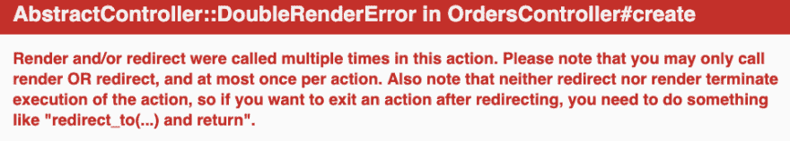

# 向没有 gem 的 Rails 应用程序添加 reCaptcha v3

> 原文：<https://dev.to/morinoko/adding-recaptcha-v3-to-a-rails-app-without-a-gem-46jj>

本文介绍了如何将 Google reCaptcha v3 添加到 Rails 应用程序中，并使用它来验证表单提交。

除了使用 gems 之外，我找不到任何其他关于如何将新 v3 添加到 Rails 的英文文章。这是一个 DIY 的解释，告诉你如何不用宝石就能做到。

起初，我已经尝试了 [recaptcha gem](https://github.com/ambethia/recaptcha) ，但是发现实现很困难，并且不断出现错误，更不用说我并不需要它提供的所有功能。

另一方面, [new_google_recaptcha](https://github.com/igorkasyanchuk/new_google_recaptcha) 非常简单，并提供易于遵循的文档，因此它可能是 DIY 的一个很好的替代方案。

事实上，我在这篇文章中使用了一些与 new_google_recaptcha 相同的技术，还使用了一些我在一篇写得很好的日语操作文章中找到的技术(参见下面的参考资料)。我还试图为初学者(包括我自己)添加大量的解释！)，这样你就知道代码里是怎么回事了。

我们开始吧！

## 入门

如果您还没有为您的站点注册新的 reCaptcha 密钥(您不能使用 reCaptcha v2 中的密钥)。你可以点击以下链接:[https://g.co/recaptcha/v3](https://g.co/recaptcha/v3)。

将密钥添加到您的`credentials.yml.enc`文件(或者其他机密文件，如果您正在使用其他文件的话):

```
# config/credentials.yml.enc

recaptcha_site_key: xxxxxxxxxxxxxxxxxxxxxxxxxxxxxxxxxxxxxxxx
recaptcha_secret_key: xxxxxxxxxxxxxxxxxxxxxxxxxxxxxxxxxxxxxxxx 
```

Enter fullscreen mode Exit fullscreen mode

## 验证 reCaptcha 令牌的方法

在`ApplicationController`中，增加验证 reCaptcha 的方法。你也可以设置一个最低分数。确保你还需要`net/https` :

```
# app/controllers/application_controller.rb

require 'net/https'

class ApplicationController < ActionController::Base
  RECAPTCHA_MINIMUM_SCORE = 0.5

  # ... other methods

  def verify_recaptcha?(token, recaptcha_action)
    secret_key = Rails.application.credentials.dig(:recaptcha_secret_key)

    uri = URI.parse("https://www.google.com/recaptcha/api/siteverify?secret=#{secret_key}&response=#{token}")
    response = Net::HTTP.get_response(uri)
    json = JSON.parse(response.body)
    json['success'] && json['score'] > RECAPTCHA_MINIMUM_SCORE && json['action'] == recaptcha_action
  end
end 
```

Enter fullscreen mode Exit fullscreen mode

`verify_recaptcha?`方法向 Google 的 reCaptcha api ( `https://www.google.com/recaptcha/api/siteverify`)发送一个验证请求，其中包含必需的参数`secret`和`response`(uri 末尾的`?secret=#{secret_key}&response=#{token}`)。稍后在添加 reCaptcha JavaScript 时会传入这个令牌。

Google 将会发回一个类似这样的响应:

```
{
  "success": true|false,      // whether this request was a valid reCAPTCHA token for your site
  "score": number             // the score for this request (0.0 - 1.0)
  "action": string            // the action name for this request (important to verify)
  "challenge_ts": timestamp,
  "hostname": string,         // the hostname of the site where the reCAPTCHA was solved
  "error-codes": [...]
} 
```

Enter fullscreen mode Exit fullscreen mode

在上面的代码中，用`json = JSON.parse(response.body)`解析 JSON，然后我们检查`success`是否为真，`score`是否满足我们的最低分数，以及动作是否与我们想要的动作匹配。如果所有这些测试都通过了，`verify_recaptcha?`将返回`true`。

## 用于 reCaptcha JavaScript 的 Helper 方法

接下来，添加几个助手，将 reCaptcha JavaScript 代码添加到`ApplicationHelper` :

```
# app/helpers/application_helper.rb

module ApplicationHelper
  RECAPTCHA_SITE_KEY = Rails.application.credentials.dig(:recaptcha_site_key)

  def include_recaptcha_js
    raw %Q{
      <script src="https://www.google.com/recaptcha/api.js?render=#{RECAPTCHA_SITE_KEY}"></script>
    }
  end

  def recaptcha_execute(action)
    id = "recaptcha_token_#{SecureRandom.hex(10)}"

    raw %Q{
      <input name="recaptcha_token" type="hidden" id="#{id}"/>
      <script>
        grecaptcha.ready(function() {
          grecaptcha.execute('#{RECAPTCHA_SITE_KEY}', {action: '#{action}'}).then(function(token) {
            document.getElementById("#{id}").value = token;
          });
        });
      </script>
    }
  end
end 
```

Enter fullscreen mode Exit fullscreen mode

`include_recaptcha_js`是 reCaptcha 的基本 JavaScript。稍后我们将把它添加到我们的应用程序`<head>`标签中。`recaptcha_execute(action)`用于执行现场不同操作的 reCaptcha。具体来说，我们将使用它来验证表单提交，因此它包含为 reCaptcha 标记添加隐藏字段的代码。令牌稍后将被发送到控制器，并用我们之前添加的`verify_recaptcha?`方法进行验证。

在上面的`ApplicationHelper`代码中，`raw`方法允许你输出一个字符串，而不用转义所有的标签(参见[文档](https://apidock.com/rails/ActionView/Helpers/RawOutputHelper/raw))。`%Q{}`就像一个双引号字符串，允许你像`#{site_key}`一样插入变量。(参见[文档](https://docs.ruby-lang.org/en/2.0.0/syntax/literals_rdoc.html#label-Strings))。这使得写出字符串更加容易。

## 向视图文件添加 reCaptcha

让我们建立我们的观点。在`application.html.erb`文件中，在`head`标签中添加一个`yield`方法，这将允许我们在必要时插入 reCaptcha JavaScript】

```
# app/views/layouts/application.html.erb

<head>
  # ...other tags

  <%= yield :recaptcha_js %>
</head>

# ...more code 
```

Enter fullscreen mode Exit fullscreen mode

接下来，我们将使用 reCaptcha 来验证基本订单/联系表单的提交。假设我们有以下形式:

```
# app/views/orders/_form.html.erb

<%= form_for @order do |f| %>
  <%= render partial: 'shared/error_messages', locals: { current_object: @order } %>

  <div class="form-group">
    <%= f.label :name %>
    <%= f.text_field :name %>
  </div>
  <div class="form-group">
    <%= f.label :email %>
    <%= f.text_field :email %>
  </div>
  <div class="form-group">
    <%= f.label :address %>
    <%= f.text_field :address, placeholder: true %>
  </div>
  <div class="form-group">
    <%= f.label :phone %>
    <%= f.text_field :phone %>
  </div>
  <div class="form-group">
    <%= f.label :message %>
    <%= f.text_area :message, rows: 10, placeholder: true %>
  </div>
  <%= f.submit t('orders.form.submit'), id: "submit" %>
<% end %> 
```

Enter fullscreen mode Exit fullscreen mode

在表单上方，使用`content_for`包含 reCaptcha JavaScript，以便将其添加到我们的`<head>`标签中的`yield`。我们还将通过在表单末尾添加`recaptcha_execute` Javascript 来验证提交者不是机器人:

```
# app/views/orders/_form.html.erb

<%= content_for :recaptcha_js do %>
  <%= include_recaptcha_js %>
<% end %>

<%= form_for @order do |f| %>
  <%= render partial: 'shared/error_messages', locals: { current_object: @order } %>

  <div class="form-group">
    <%= f.label :name %>
    <%= f.text_field :name %>
  </div>
  <div class="form-group">
    <%= f.label :email %>
    <%= f.text_field :email %>
  </div>
  <div class="form-group">
    <%= f.label :address %>
    <%= f.text_field :address, placeholder: true %>
  </div>
  <div class="form-group">
    <%= f.label :phone %>
    <%= f.text_field :phone %>
  </div>
  <div class="form-group">
    <%= f.label :message %>
    <%= f.text_area :message, rows: 10, placeholder: true %>
  </div>
  <%= f.submit t('orders.form.submit'), id: "submit" %>

  # Let's name the action 'order' since it submits an order
  <%= recaptcha_execute('order') %>
<% end %> 
```

Enter fullscreen mode Exit fullscreen mode

`recaptcha_excute('order')`将发出 reCaptcha execute JavaScipt，当表单被提交时，它将把令牌发送给我们的控制器，这样我们就可以验证它。

## 在控制器中验证提交的 reCaptcha 令牌

在控制器中(在本例中是`OrdersController`),`create`动作处理表单提交:

```
# app/controllers/orders_controller.rb

class OrdersController < ApplicationController

  def create
    @order = Order.new(order_params)

    if @order.save
      OrderMailer.with(order: @order).new_order_email.deliver_later

      flash[:success] = t('flash.order.success')
      redirect_to root_path
    else
      flash.now[:error] = t('flash.order.error_html')
      render 'home/index'
    end
  end

  # other actions...

  private

  def order_params
    params.require(:order).permit(:name, :email, :address, :phone, :message)
  end
end 
```

Enter fullscreen mode Exit fullscreen mode

我们想首先通过使用我们的`verify_recaptcha?`方法:
来验证提交是否有效

```
unless verify_recaptcha?(params[:recaptcha_token], 'order')
  flash.now[:error] = "reCAPTCHA Authorization Failed. Please try again later."
  return render :new
end 
```

Enter fullscreen mode Exit fullscreen mode

表单已经通过我们添加到表单的隐藏输入(使用`recaptcha_execute`助手)从 Google 发送了令牌，所以它在`params`散列中是可用的。令牌和要检查的动作(' order ')在我们的验证方法中是这样传递的:`verify_recaptcha?(params[:recaptcha_token], 'order')`。

如果一切正常，订单就提交了。如果没有，可疑用户将被发送回表单，并显示一条错误消息。

注意，如果你没有在这里的`render :new`前添加`return`，你会得到一个`AbstractController::DoubleRenderError`，因为 Rails 会尝试继续执行动作中的剩余代码。

[](https://res.cloudinary.com/practicaldev/image/fetch/s--DvH1wAMO--/c_limit%2Cf_auto%2Cfl_progressive%2Cq_auto%2Cw_880/https://thepracticaldev.s3.amazonaws.com/i/hybuwh9zf357f4z4eaei.png)

下面是上面插入到控制器的`create`动作中的代码:

```
# app/controllers/orders_controller.rb

class OrdersController < ApplicationController

  def create
    @order = Order.new(order_params)

    unless verify_recaptcha?(params[:recaptcha_token], 'order')
      flash.now[:error] = t('recaptcha.errors.verification_failed')
      return render 'home/index'
    end

    if @order.save
      OrderMailer.with(order: @order).new_order_email.deliver_later

      flash[:success] = t('flash.order.success')
      redirect_to root_path
    else
      flash.now[:error] = t('flash.order.error_html')
      render 'home/index'
    end
  end

  private

  def order_params
    params.require(:order).permit(:name, :email, :address, :phone, :message)
  end
end 
```

Enter fullscreen mode Exit fullscreen mode

编码快乐！

## 引用

*   [谷歌 reCaptcha v3 文档](https://developers.google.com/recaptcha/docs/v3)
*   [new_google_recaptcha gem 文档](https://github.com/igorkasyanchuk/new_google_recaptcha)
*   [关于在 Rails 中实现 reCaptcha 的日本文章](http://kenzo0107.hatenablog.com/entry/2019/02/17/000850)