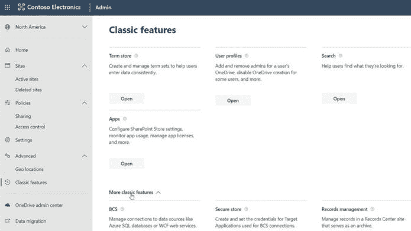
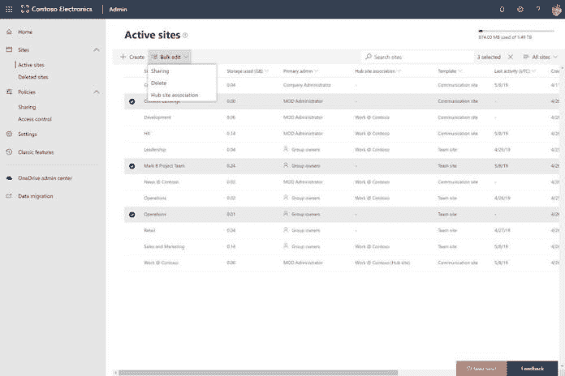
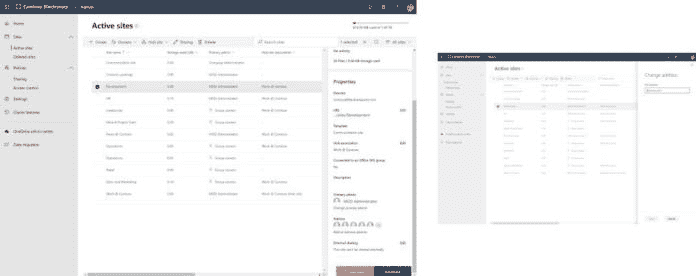
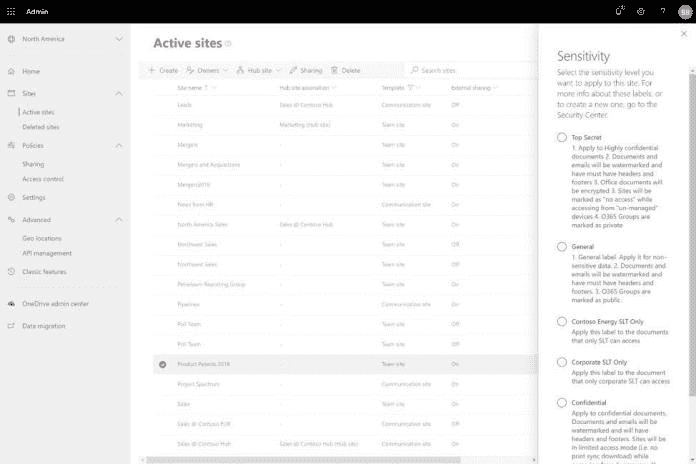
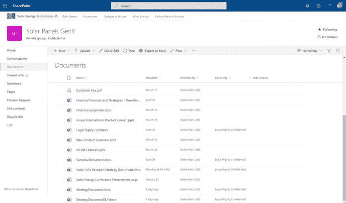
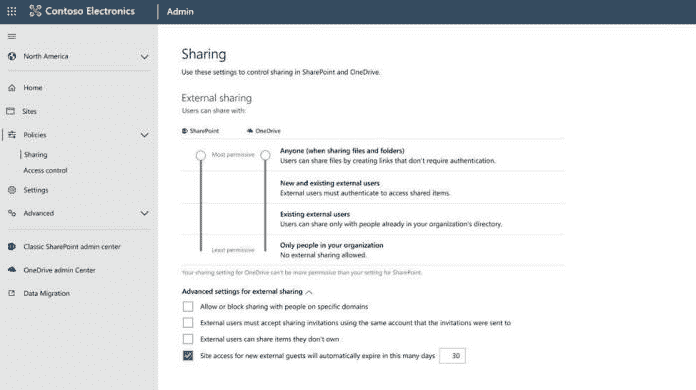
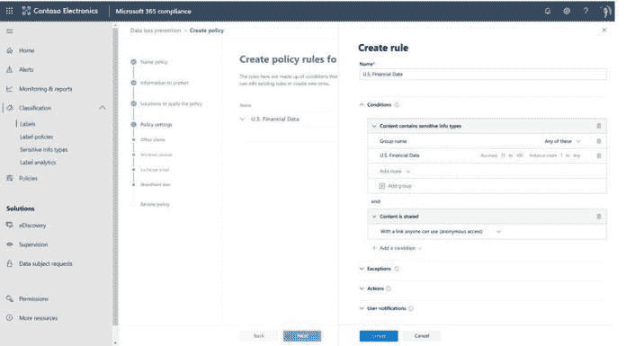

# SharePoint Conference 2019 的 SharePoint 和 Office 365 新功能(第 2 部分)

> 原文：<https://dev.to/mlisidoro/what-s-new-for-sharepoint-and-office-365-from-sharepoint-conference-2019-part-2-o5g>

来自 SharePoint Conference 2019(第二部分)的帖子[SharePoint 和 Office 365 的新功能](https://blogit.create.pt/miguelisidoro/2019/06/05/whats-new-for-sharepoint-and-office-365-from-sharepoint-conference-2019-part-2/)首先出现在[博客 IT](https://blogit.create.pt) 上。

SharePoint 和 Office 365 已经走过了漫长的道路，看到微软这些年来一直在向该平台引入的不断创新，真是令人惊叹！

5 月 21 日至 23 日，微软再次举办了 [SharePoint 大会](https://www.sharepointconference.com)，这是其最大的科技活动之一，展示了微软世界中许多令人兴奋的新功能，包括 SharePoint 和 Office 365。

## 简介

有很多新的公告正在以非常快的速度发布，要跟上所有正在发布的东西是一个挑战！

这篇文章将尝试恢复 SharePoint 和 Office 365 世界的最新公告，以及它对最终用户、it 专业人员和开发人员的意义。

希望你已经准备好乘车，系好安全带，因为有许多新功能即将推出(其中一些可能在撰写本文时已经推出)。虽然不可能谈论所有已经宣布的事情，但我将尝试在两部分系列中恢复一些最大的宣布。这些是我将在这个两部分系列的第二部分中讨论的主要话题:

*   管理员的新功能
*   安全性和合规性方面的新功能
*   SharePoint Server 的新增功能(内部部署)
*   流体框架
*   其他相关公告

要阅读这个帖子系列的第一部分，请点击[这里](https://blogit.create.pt/miguelisidoro/2019/06/05/whats-new-for-sharepoint-and-office-365-from-sharepoint-conference-2019-part-1/)。

## 管理员的新功能

与其他领域一样，这里也有许多针对管理员的新公告。

### SharePoint 管理中心

在一段时间的预览中，现代 SharePoint 管理中心将成为管理 SharePoint Online 的默认体验，包括通过新的现代 UI 管理经典体验。下面是一些最重要的公告。

### 合并视图(即将推出)

有了新的更新，在新的 SharePoint 管理中心体验中，您可以管理与现代 SharePoint 体验和经典功能相关的设置，这意味着无需在现代和经典管理中心之间工作来管理现代和经典设置之间的设置。

### 批量操作(即将推出)

很快就可以对一组站点执行批量操作了。这些操作包括更新站点的共享配置、执行中心站点关联或删除站点。

### 站点 URL 重命名(即将推出)

整个事件中我最喜欢的公告之一！通过 [UserVoice](https://sharepoint.uservoice.com/forums/329214-sites-and-collaboration/suggestions/13217277-enable-renaming-the-site-collection-urls) 进行网站 URL 重命名是最受欢迎的请求之一，很快就可以在 SharePoint 管理中心更改网站 URL。

如果你担心你会有断开的链接，停止担心！对站点 URL 的更改不会产生任何影响，因为对旧 URL 的访问请求将被重定向到新 URL，这意味着用户不需要更新他们的链接和书签。

### SharePoint 站点交换(即将推出)

一个新的 Windows PowerShell cmdlet(Invoke-spositswap)将很快推出，它允许管理员用现有站点替换租户内的根站点，例如 https://contoso.sharepoint.com 的[站点和 https://contoso.sharepoint.com/sites/的](https://contoso.sharepoint.com/)站点。如果您有一个经典站点作为租户的根站点，并且想要用一个现代站点来替换它，这将非常有用。

要了解更多有关管理员公告的信息，请点击[此处](https://techcommunity.microsoft.com/t5/Microsoft-SharePoint-Blog/Updates-to-SharePoint-security-administration-and-migration/ba-p/549585)。

## 安全性和合规性的新特性

如果看到 SharePoint 和 Office 365 引入新协作功能的方式令人印象深刻，那么在 Office 365 平台上的安全性投资也同样令人印象深刻。2017 年，微软推出了一个许可模式，其中包括一个令人印象深刻的安全功能集，名为 [Microsoft 365](https://www.microsoft.com/en-us/microsoft-365/) 。这是一个捆绑包，包括:

*   Windows 10
*   办公室 365
*   企业移动性+安全性

这个包有三种不同的风格:

*   [微软 365 业务](https://www.microsoft.com/en-us/microsoft-365/business)
*   [微软 365 企业版](https://www.microsoft.com/en-us/microsoft-365/enterprise)
*   [微软 365 教育](https://www.microsoft.com/en-us/education/buy-license/microsoft365)

如果你想了解更多关于微软 365 的安全特性，点击[这里](https://www.microsoft.com/en-us/trustcenter/security/office365-security)。

下面是安全性和法规遵从性方面的主要公告。

### SharePoint 网站的敏感性标签(私人预览)

在安全的环境中协作并保护您租户中的信息至关重要，尤其是在您拥有敏感信息的情况下。

通过使用敏感性标签，您可以根据网站的敏感性对 SharePoint 网站应用安全和访问策略。您可以创建敏感性标签(例如:机密文档)并将其与 Microsoft 365 安全和合规中心的策略相关联，以限制用户下载或打印文档，甚至与外部用户共享文档。然后，这些标签可以应用于文件、电子邮件、组、站点和团队，以在您的租户中的信息之间实施一致的策略。

该事件的主要安全声明之一是，只要您拥有文档的编辑权限，很快就可以编辑带有敏感性标签的受保护文档。这是一个重大更新，因为在此更新之前，根本不可能编辑受保护的文档。

### 外部访问到期(预览 Q3 CY19)

此次活动中宣布的另一项重要更新是，租户管理员可以指定外部用户可以访问站点的时间以及与他们共享的内容。一旦过期，外部用户将不再能够访问网站或内容，除非网站所有者延长了他们的访问权限或发送了新的共享邀请。

### DLP 受限分享(私人预览 Q3 CY19)

有了这一新的更新，组织将有可能阻止共享被 DLP(数据丢失防护)标记为敏感内容的匿名链接。

### OneDrive 限制用户访问(私人预览)

将有可能阻止外部用户创建 OneDrive 站点并访问其他用户的 OneDrive 站点。

要了解更多关于安全性和合规性的公告，请点击[此处](https://techcommunity.microsoft.com/t5/Microsoft-SharePoint-Blog/Updates-to-SharePoint-security-administration-and-migration/ba-p/549585)。

要阅读所有关于 SharePoint 和 Office 365 的最新公告，请点击[此处](https://blogit.create.pt/miguelisidoro/2019/06/05/whats-new-for-sharepoint-and-office-365-from-sharepoint-conference-2019-part-2/)。

分享快乐！

来自 SharePoint Conference 2019(第二部分)的帖子[SharePoint 和 Office 365 的新功能](https://blogit.create.pt/miguelisidoro/2019/06/05/whats-new-for-sharepoint-and-office-365-from-sharepoint-conference-2019-part-2/)首先出现在[博客 IT](https://blogit.create.pt) 上。