# 用 Azure 函数构建 DIY ADHD 药物提醒& Twilio

> 原文：<https://dev.to/azure/building-a-diy-adhd-medication-reminder-with-azure-functions-o70>

最近，我一直在玩 Azure 函数来自动化我生活的不同部分。就在今天，当我正在为一个即将到来的工作项目使用函数构建一个演示时，我抬头看了看时钟，发现是下午 4 点。

### 🙋‍♀️:好消息是:当你编码的时候，时间过得很快！

### 🤦‍♀️:坏消息是:没有我的多动症药物，我不能很好地工作，嗯…我忘了服用我的多动症药物。

[](https://i.giphy.com/media/xT1XGXjrQSB337IszC/giphy.gif)

关于我们这些患有多动症的人，我们的工作记忆有问题。如果你不熟悉工作记忆，它是我们记忆的一部分，能够保持信息足够长的时间，以记住接下来的事情，专注于一项任务，或在短期内使用信息(你可以把它想象成一个缓存)。例如，当我在讲一个故事时，我经常会变得兴奋，偏离主题，我的大脑运行它的垃圾收集器，完全忘记我最初在讲什么。此外，在我记得当天的温度之前，我经常要看两到三次天气/问我们的谷歌主页。让我们说我不是《海底总动员》里的多莉，但是……我已经知道在那一刻会完全忘记重要的事情，尤其是像一天吃两次药这样的任务。😣也许**这就是为什么今天下午我开始觉得我的大脑运转变慢了，嗯？**

[](https://i.giphy.com/media/l0D2PvoPVcXGegM1y/giphy.gif)

所以，我停下手头的工作，吃了半片药(我不想凌晨 1 点才睡😳)，写了这篇关于建立你自己的 ADHD 药物(或者，任何你想被提醒的东西)的指南。

# 让我们建造它(在我们忘记之前😅)!

### 第一步:创建 Azure 函数

为了易于理解的视觉效果/截图，我用 Azure 门户创建了这个。也可以使用 [VS 代码](https://docs.microsoft.com/en-us/azure/azure-functions/functions-create-first-function-vs-code/?WT.mc_id=azuredevtoreminderapp-blog-chcondon)、 [Azure CLI](https://docs.microsoft.com/en-us/azure/azure-functions/functions-create-first-azure-function-azure-cli/?WT.mc_id=azuredevtoreminderapp-blog-chcondon) 等。有了 Azure Functions，您可以在本地机器上编码和测试功能，而不必每次想测试时都部署到云上(节省了大量时间！).

要创建 Azure 功能，您可以从入门菜单开始，然后选择功能应用。

[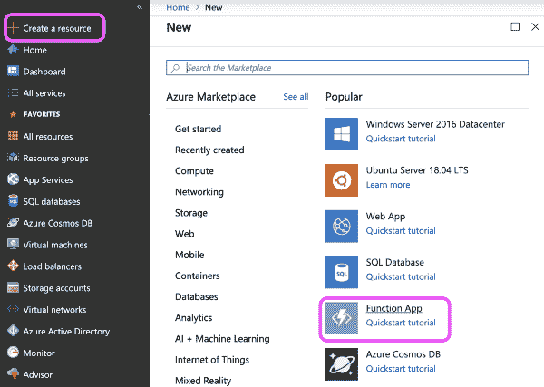](https://res.cloudinary.com/practicaldev/image/fetch/s--8h2DaHXJ--/c_limit%2Cf_auto%2Cfl_progressive%2Cq_auto%2Cw_880/https://thepracticaldev.s3.amazonaws.com/i/gyevy34y36l2py02e2y7.png)

然后你需要在这里填写一些关于你的职能的基本信息。包括应用程序名称、您想要使用的 Azure 订阅、一个[资源组](https://docs.microsoft.com/en-us/azure/azure-resource-manager/resource-group-overview/?WT.mc_id=azuredevtoreminderapp-blog-chcondon)(在这种情况下我正在创建一个新的)、您想要使用的操作系统、[托管计划](https://docs.microsoft.com/en-us/azure/azure-functions/functions-scale/?WT.mc_id=azuredevtoreminderapp-blog-chcondon)(我正在使用消费)、我想要使用的位置(我在加利福尼亚州，所以 West US 2 通常是我的默认值)、我想要使用的运行时堆栈(在这种情况下我正在使用 JavaScript)，并且我可以选择创建新的[存储](https://docs.microsoft.com/en-us/azure/storage/common/storage-introduction/?WT.mc_id=azuredevtoreminderapp-blog-chcondon)或使用在这种情况下，我创建了一个新的。​​

[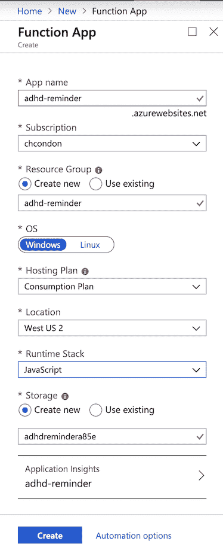](https://res.cloudinary.com/practicaldev/image/fetch/s--JvCOplX4--/c_limit%2Cf_auto%2Cfl_progressive%2Cq_auto%2Cw_880/https://thepracticaldev.s3.amazonaws.com/i/v8qv7hgadhjqh6cqqzin.png)

一旦我完成了所有这些，我就可以开始部署了！等待大约一两分钟，然后观察**部署成功**消息。​

如果你遵循这些步骤，我们有我们的资源！我们只需选择**“转到资源”**即可查看您的新功能应用。现在我们将添加一个新函数。

[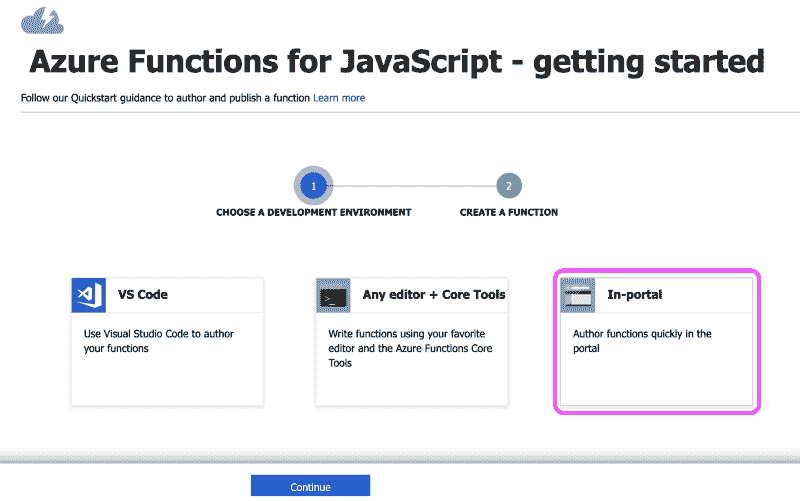](https://res.cloudinary.com/practicaldev/image/fetch/s--bP8E1nyV--/c_limit%2Cf_auto%2Cfl_progressive%2Cq_auto%2Cw_880/https://thepracticaldev.s3.amazonaws.com/i/64ut6v7chdl2oqb3goy5.png)

[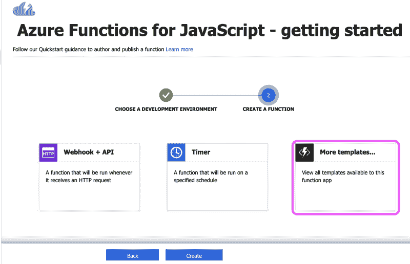](https://res.cloudinary.com/practicaldev/image/fetch/s--ShVAvbIF--/c_limit%2Cf_auto%2Cfl_progressive%2Cq_auto%2Cw_880/https://thepracticaldev.s3.amazonaws.com/i/ucn9jyhkmdhlcpxczogq.png)

当您选择触发定时器时，会出现一个提示，要求您输入功能的**名称**，以及您的触发器的**时间表**。我已经设置了“0 0 15 * * *”，所以我的提醒将在下午 3 点发送(*注意:查看您日志中的时间戳- Azure 使用协调世界时- UTC* )。

[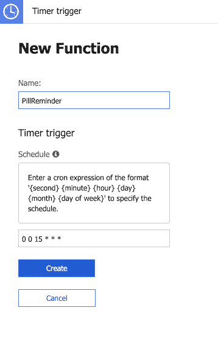](https://res.cloudinary.com/practicaldev/image/fetch/s--ssTrHDHU--/c_limit%2Cf_auto%2Cfl_progressive%2Cq_auto%2Cw_880/https://thepracticaldev.s3.amazonaws.com/i/zvlthn28efuc4wl357pv.png)

但是这个提醒怎么发呢？如果你有一个私人助理，可以每天给你发短信，检查你是否吃药，这不是很好吗？好吧，虽然我们没有时间建造一个机器人助手来为我们跑咖啡，但我们可以使用 Twilio API 来给我们发短信！为此，你需要创建一个 [Twilio](https://www.twilio.com/referral/xBBj30) 账户，并在创建后从那里获取 SID 和 Auth 令牌(☎️ *你可以注册 Twilio，用我的个人代码 CHLOE20* 获得 20 美元)。**我强烈建议立即将它们添加到你的应用程序设置中，这样它们就安全了**(而不是直接添加到你的代码中)。

### 第二步:与 Twilio 整合

[](https://i.giphy.com/media/jPgEkqIWTmYLK/giphy.gif)

您需要将您的**收件人号码**、**发件人号码**(我使用的是从 Twilio 购买的电话号码)以及 **TWILIO_TOKEN** 和 **TWILIO_SID** 添加到配置下的应用程序设置中。正如我之前提到的，我**高度**建议将这些添加到你的[应用设置](https://docs.microsoft.com/en-us/azure/azure-app-configuration/overview/?WT.mc_id=azuredevtoreminderapp-blog-chcondon)中，而不是直接添加到你的代码中，这样它们是安全的。如果你正在寻找一个关于如何/为什么设置 Azure 应用程序的视频演示，请查看这个视频[和 Scott Hanselman](https://azure.microsoft.com/en-us/resources/videos/configuration-and-app-settings-of-azure-web-sites/) 以及 Stefan Schackow[的视频](https://dev.to/shanselman)。

你还需要确保你已经安装了 Twilio。您只需在终端中输入以下内容。

```
npm install twilio 
```

[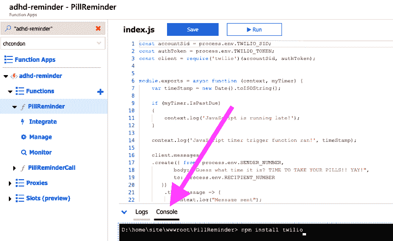](https://res.cloudinary.com/practicaldev/image/fetch/s--VoWUS07a--/c_limit%2Cf_auto%2Cfl_progressive%2Cq_auto%2Cw_880/https://thepracticaldev.s3.amazonaws.com/i/wn8fr7x8qe1c9dapvjoe.png)

### 第三步:写一些代码(快点，在我们太分心之前！😅)

这是代码的一部分👉 [index.js](https://gist.github.com/ChloeCodesThings/344b84004cf0c1584cbff6797f6ea5a1#file-index-js)

正如您所看到的，我已经创建了一个函数来检查我的计时器是否过期(如果是，我会将其写入日志)。然后，我正在创建一个消息(。create ),它将从 SENDER_NUMBER 发送，包括我的邮件正文，并将发送到 RECIPIENT_NUMBER。如果一切按计划进行，“文本成功发送”将被写入我的日志。否则，我会记录错误。

或者，您可以在 function.json 文件中设置[绑定](https://docs.microsoft.com/en-us/azure/azure-functions/functions-bindings-twilio/?WT.mc_id=azuredevtoreminderapp-blog-chcondon)。你可以看看我给这里的那些做的一个要点。[绑定](https://docs.microsoft.com/en-us/azure/azure-functions/functions-bindings-twilio/?WT.mc_id=azuredevtoreminderapp-blog-chcondon)也可以通过 Azure 门户的**集成**部分进行编辑和更新，如下所示:

[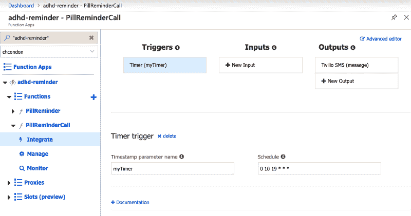](https://res.cloudinary.com/practicaldev/image/fetch/s--fqpwST1C--/c_limit%2Cf_auto%2Cfl_progressive%2Cq_auto%2Cw_880/https://thepracticaldev.s3.amazonaws.com/i/94p7dgrcrqw896g4wbc2.png)

然而，使用我们编写的代码，我们不需要设置绑定——我们可以简单地调用函数，并引用变量(SENDER_NUMBER、TWILIO_SID 等)。)从我们的 app 设置。

[](https://i.giphy.com/media/2XskdWMBUY1yxD6Hcic/giphy.gif)

如你所见，这很简单。创建一条短信，发送它，然后哒哒——提醒已发送！但有一个问题…有时我会因为太分心或专注于一项任务而不会看到一条短信(还有，我的手机会收到很多通知——如果我没有注意到呢？😬).所以，我决定加一个后备计划……一个电话！

打电话的代码类似于发送文本消息，有一些小的变化。

这是代码的一部分👉 [index.js](https://gist.github.com/ChloeCodesThings/8137aa645fd1a5eebaf20e3ad7c69b62#file-index-js)

你会注意到我们的电话代码指的是“TWIML_URL”。这是指我的应用程序设置中的一个 URL，它链接到我在 Twilio 中设置的一个 TwiML Bin。一个 [TwiML Bin](https://www.twilio.com/docs/runtime/tutorials/twiml-bins) 允许我们创建静态 TwiML 文档。他们为我们提供了一个私有的 URL，然后我们可以使用它来配置我们的 Twilio SMS 消息或语音 webhooks。在这种情况下，我使用一个 TwiML Bin](【https://www.twilio.com/docs/runtime/tutorials/twiml-bins】)来保存调用期间应该发生的逻辑。

[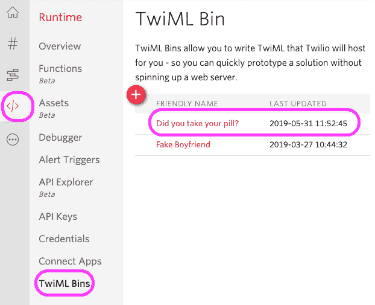](https://res.cloudinary.com/practicaldev/image/fetch/s--gWqdDg7n--/c_limit%2Cf_auto%2Cfl_progressive%2Cq_auto%2Cw_880/https://thepracticaldev.s3.amazonaws.com/i/6z3zc3qz9gaaa6l7bnny.png)

您可以使用 TwiML 创建交互式语音和消息应用程序。下面是我在电话中使用它的一个例子:

[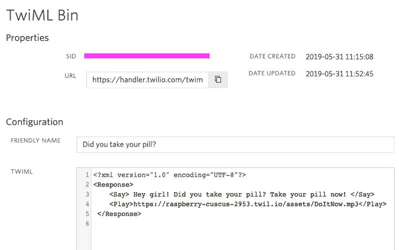](https://res.cloudinary.com/practicaldev/image/fetch/s--YB6ElrNL--/c_limit%2Cf_auto%2Cfl_progressive%2Cq_auto%2Cw_880/https://thepracticaldev.s3.amazonaws.com/i/kn68z4tj5l8hllrdh8cz.png)

TwiML Bin 页面顶部提供的 URL 是我在我的应用程序设置中保护的 URL，名为 **TWIML_URL** (在 index.js 中用于电话提醒功能)。你会注意到我在 TwiML Bin 中使用了类似于 Markdown 的语法。它会说出一条带有药丸提醒的信息(使用)，然后播放一个 MP3(使用)。Mp3 是可选的，但我决定我想要一条消息播放一两分钟，让我找到我的药盒，服用药丸，并在完成后挂断电话。Mp3 是什么？这是它的一个演示:

[https://www.youtube.com/embed/mliMzdK1Nq8](https://www.youtube.com/embed/mliMzdK1Nq8)

Twilio 通过[资产](https://www.twilio.com/docs/runtime/assets)托管 MP3。要创建新资产，只需按+按钮上传 MP3(如果您愿意，您也可以使用 [Twilio 资产](https://www.twilio.com/docs/runtime/assets)向您的提醒文本添加图像！).这个资产是[希亚·拉博夫大喊激励性演讲](https://www.youtube.com/watch?v=ZXsQAXx_ao0)的 MP3，但是你可以把 MP3 做成一首歌，你自己的信息，或者任何你想要的声音！

[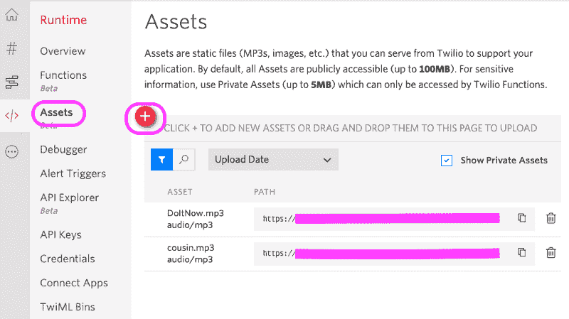](https://res.cloudinary.com/practicaldev/image/fetch/s--d7isJkk0--/c_limit%2Cf_auto%2Cfl_progressive%2Cq_auto%2Cw_880/https://thepracticaldev.s3.amazonaws.com/i/4cvxuub9l36a79f4rogx.png)

### 第四步:测试它(在我们被另一个项目分心之前)！

最后，我们需要测试我们的触发计时器！如果您愿意，可以将您的 Twilio 号码添加到手机的通讯录中。我给我的取名为“💊👩🏻‍⚕️💊“，但是如果你愿意，你也可以把你的名字离散化(奶奶/爸爸/表姐/珍妮弗也可以！).这样，当电话在你设定的时间打来时，你就知道是什么了。

[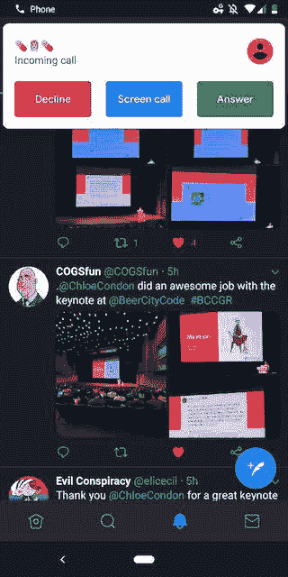](https://res.cloudinary.com/practicaldev/image/fetch/s--5AEqxnpZ--/c_limit%2Cf_auto%2Cfl_progressive%2Cq_auto%2Cw_880/https://thepracticaldev.s3.amazonaws.com/i/zvhont5ac20426ygmofh.jpeg)

为了测试你的调用/文本，你可以简单地在 Azure 门户的每个函数中按下 **Run** 按钮(位于你的 **index.js** 文件的顶部，在 **Save** 旁边)。但是，您还需要测试计时器，以确保文本/呼叫在正确指定的时间发出。很可能你选择的发送电话/短信的时间已经过去，或者还没有发生。您可以在您的 **function.json** 文件中编辑您的函数的计时器，或者点击 **Integrate** 在门户中编辑它。

[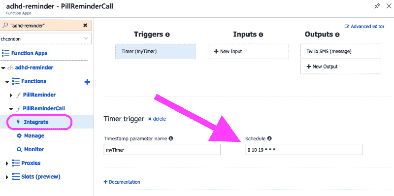](https://res.cloudinary.com/practicaldev/image/fetch/s--1ZkJqyNz--/c_limit%2Cf_auto%2Cfl_progressive%2Cq_auto%2Cw_880/https://thepracticaldev.s3.amazonaws.com/i/tp42i7m26k1pk3j83zib.png)

为避免混淆，请注意:**检查日志中的时间戳，以帮助确定包含**的正确 cron 表达式(否则，您的警报可能会在不正确的时间发送！).你需要确保你的时间符合 Azure 使用的协调世界时(UTC)。

### 第五步:置之不理！⏰

[](https://i.giphy.com/media/fUNGb8eMRelIi9Sit8/giphy.gif)

如果你的函数工作正常，并且在正确的时间发送——恭喜你，你已经构建了一个 [Azure 触发定时器](https://docs.microsoft.com/en-us/azure/azure-functions/functions-bindings-timer/?WT.mc_id=azuredevtoreminderapp-blog-chcondon)！🎉你可以随意定制代码，如果你想帮助自动提醒自己，或者如果你正在寻找更多的点播，你可以看看我的文章，关于使用 Twilio + Azure [创建一个假的男朋友电话/短信。编码快乐！](https://medium.com/microsoftazure/an-ambiverts-guide-to-azure-functions-95931976c565)

[](https://i.giphy.com/media/qK6ccDxjSmmre/giphy.gif)