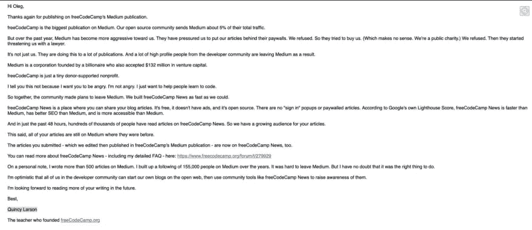

# 为昆西·拉森和自由代码营辩护

> 原文：<https://dev.to/aryanjnyc/in-defense-of-quincy-larson-and-freecodecamp-7ki>

如果你错过了，它 [freeCodeCamp 新闻已经转移到媒体](https://www.freecodecamp.org/forum/t/we-just-moved-off-of-medium-and-onto-freecodecamp-news-heres-how-you-can-use-it/279929)。从那以后，关于侵犯版权和 [@ossia](https://dev.to/ossia) 的动机有了一点骚动。

在我们开始讨论之前，让我们回顾一下。

## 重述

### 中等威胁自由代码营

如上图所示，Quincy 描述了 Medium 在付费墙后获得 freeCodeCamp 的步骤，以利用 freeCodeCamp 新闻博客带来的流量。邮件明确指出:

> 他们迫使我们把我们的文章放在他们的付费墙后面。我们拒绝了。所以他们想买下我们。[……]我们拒绝了。然后他们开始用律师威胁我们。

让 freeCodeCamp 远离媒体的动机很明显:媒体唯一的兴趣就是钱。甚至 [@ben](https://dev.to/ben) 也解释说:

 [## Medium 从来就不是开发者生态系统的一部分

### 本哈尔彭 6 月 3 日 1915 分钟阅读

#meta](/devteam/medium-was-never-meant-to-be-a-part-of-the-developer-ecosystem-25a0)

### freeCodeCamp 移出介质

2019 年 5 月 27 日，freeCodeCamp 宣布他们脱离媒体。我不可能比 [@ossia](https://dev.to/ossia) 本人更好的描述 freeCodeCamp 的 move off Medium:[https://www . freeCodeCamp . org/forum/t/we-just-moved-off-of-Medium-on-freeCodeCamp-news-heres-how-you-can-use-it/279929](https://www.freecodecamp.org/forum/t/we-just-moved-off-of-medium-and-onto-freecodecamp-news-heres-how-you-can-use-it/279929)。

总而言之，freeCodeCamp 使用了 [Ghost 博客平台](https://ghost.org/)作为 freeCodeCamp 新闻的主页。他承认 freeCodeCamp 团队“仍在修复相当多的 bug。”

### [@ben](https://dev.to/ben) 写到了 freeCodeCamp 移动到介质

在…里

 [## 我担心 FreeCodeCamp 刚刚退出 Medium 的举动

### 本哈尔彭 5 月 28 日 193 分钟阅读

#meta #news #freecodecamp #writing](/ben/i-m-concerned-with-the-move-that-freecodecamp-just-pulled-by-leaving-medium-io8)explains that:

> FreeCodeCamp 似乎已经拔掉了插头，带走了每个人的媒体内容，在不同的上下文中显示，清除了规范的 URL，同时剥夺了作者以任何方式编辑、删除或管理的能力。

他在推特上发布了他的文章:

> 本·哈尔彭🤗@ bendhalpenFreeCodeCamp 刚刚离开 Medium，连同那些已经贡献给出版物的文章——没有通知，而且据我所知违反了他们已经同意的条款。
> 
> 这个我写的比较多。请告诉我我是否遗漏了什么:
> 
> [dev.to/ben/i-m-concer…](https://t.co/Idrib73Vs9)2019 年 5 月 28 日下午 18:4684260

to 29K+ of his followers. In the thread, he accuses freeCodeCamp of literally stealing content without the consent of the copyright holder:

> 本·哈尔彭🤗@ bendhalpen[@ tylermcginnis](https://twitter.com/tylermcginnis)从来没有人问过你是否同意搬家。这实际上是未经版权所有者同意而窃取内容。我现在非常担心 FCC 在法律上暴露给多方，包括媒体和每个作家。22:06PM-2019 年 5 月 28 日06

and breaking the law

> 本·哈尔彭🤗@ bendhalpen[@ ossia](https://twitter.com/ossia)我不担心它是否具有竞争性，我担心它是对信任的严重违反，并且可能违反法律。在某种程度上，它触动了我们，因为一些受影响的人是我们公司的员工或我们平台的成员。2019 年 5 月 28 日下午 19:44110

## 个人见解

@ossia 清楚地表明了他离开媒体的动机。很明显，Medium 希望将 freeCodeCamp 的博客帖子货币化，而 freeCodeCamp(以他们通常的方式)相信开放的互联网和免费阅读的博客帖子。

[@ben](https://dev.to/ben) 关注 freeCodeCamp 和那些为 freeCodeCamp 出版物创作内容的人。然而，我不明白为什么要在整个开发者社区面前公开这个问题。如果这种担忧是真实的，为什么要吹呢？为什么不私下接近 [@ossia](https://dev.to/ossia) ，或者更好的是，安排一次 [@ossia](https://dev.to/ossia) 在场的公开讨论？为什么指责 [@ossia](https://dev.to/ossia) 是“在解决这个问题上过于轻率？”

> 本·哈尔彭🤗@ bendhalpen[@ tylermcginnis](https://twitter.com/tylermcginnis)我明白你的想法，但这是一次需要进行的谈话。不管更广泛的意图是什么，零同意的出版是严重混乱的。我试着给出疑点利益，但是他们在解决这个问题上非常轻率。21:56PM-2019 年 5 月 28 日18

泰勒·麦金尼斯指出，[@本](https://dev.to/ben)的文章“感觉有点不成熟，而且显然是有益的”:

> 泰勒麦金尼斯[@ tylermcginnis](https://dev.to/tylermcginnis)[@ bendhalpern](https://twitter.com/bendhalpern)(这可能会过于苛刻，但这不是我的本意，我❤️ [dev.to](https://t.co/4TOOvh3aWb) )但你的帖子明显感觉有点过早和美德。设置完成后，(除非我遗漏了什么)你的观点现在对我都无效，因为我可以修复提到的一切。2019 年 5 月 28 日 21 点 49 分09

and I completely agree.

对 [@ben](https://dev.to/ben) 来说，这种喧嚣是一种对感知竞争的游戏(尽管 [@ossia 承诺它不会成为 dev.to](https://twitter.com/ossia/status/1133457561070579712) 的竞争对手)，并提升他作为内容创作者倡导者的地位。

从 Medium 到他们自己平台的 freeCodeCamp 迁移并不顺利。作者链接存在问题，正在进行修补。犯了错误。然而，考虑到 [freeCodeCamp](https://www.freecodecamp.org) 为开发者社区所做的一切(阅读:为任何人提供一个学习 web 开发的免费平台)，我们作为一个开发者社区应该给他们的小型非营利组织带来好处。

最后，请随意分享你对这个问题的想法。不要让“内容创造者”告诉你，如果“你从来没有做过内容创造者”，那就很难理解

> 林赛·科帕🐞@ little kope[@ 0x aeternum](https://twitter.com/0xaeternum)[@ graeme _ fulton](https://twitter.com/graeme_fulton)[@ bendhalpen](https://twitter.com/bendhalpern)[@ ossia](https://twitter.com/ossia)[@ freeCodeCamp](https://twitter.com/freeCodeCamp)实际上，他是在为许多在 freeCodeCamp 的媒体博客上发表文章的内容创作者辩护。我对他处理这件事的方式印象深刻。如果你从未做过内容创作者，这可能很难理解。2019 年 5 月 28 日 20:50 分056

or that you’re not at liberty to criticize @ben

> 林赛·科帕🐞@ little kope[@ 0x aeternum](https://twitter.com/0xaeternum)[@ bendhalpern](https://twitter.com/bendhalpern)如果你不是一个内容创作者，还没有看到你的流量受到这种变化的影响有多严重，我不认为你可以随意批评 Ben 的合理批评。2019 年 5 月 29 日下午 17:4301

最重要的是，不要让“内容创建者”让你觉得你的问题和顾虑“花费了很多时间”

> 林赛·科帕🐞@ little kope[@ 0x aeternum](https://twitter.com/0xaeternum)[@ bendhalpern](https://twitter.com/bendhalpern)请阅读 Ben 最初发布的文章以及评论了解详情。你浪费了我很多时间。如果你想了解更多，你也可以给我寄钱，我有一个 venmo！2019 年 5 月 29 日下午 18:2402

不要让你的声音被窒息。

我和 [@ossia](https://dev.to/ossia) 在一起。✊