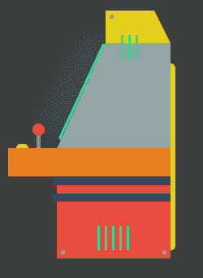
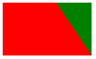
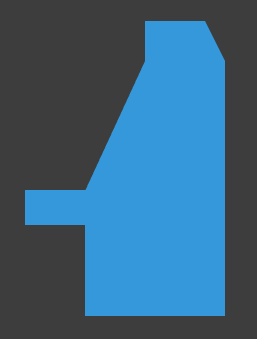
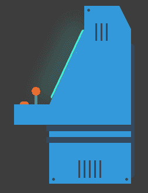

# 纯 CSS 的动画街机

> 原文：<https://dev.to/pixmy/animated-arcade-with-pure-css-5hn1>

### **大家好**

今天我们将学习如何用纯 CSS 制作一个街机，看看最后的结果:

[https://codepen.io/Pixmy/embed/YxMOoZ?height=600&default-tab=result&embed-version=2](https://codepen.io/Pixmy/embed/YxMOoZ?height=600&default-tab=result&embed-version=2)

首先，让我们来看看是哪些独立的数字共同造就了这个街机。为了更好地解释这一点，我将依靠这张图片。

[](https://res.cloudinary.com/practicaldev/image/fetch/s--u3j5Q7os--/c_limit%2Cf_auto%2Cfl_progressive%2Cq_auto%2Cw_880/https://thepracticaldev.s3.amazonaws.com/i/2am2qsd7he68mhj7rlr8.png)

让我们从制作一直到顶部的黄色图形开始，我们还要添加螺丝(紫色圆圈)和面板。

```
<div class='machine'>
 <div class='top'></div>
</div> 
```

带有“machine”类的 div 将是我们的主容器，“top”将是我们的黄色图形。接下来，我们需要一点 CSS

```
body{
  background-color:#3d3d3d;
}

.machine{
  width:140px; 
  padding-top:40px;
/*Not needed, CSS only if you want to center vertically and horizontally*/
  position: absolute;
  top: 50%; left: 50%;
  transform: translate(-50%,-50%);
  animation:shake .4s infinite;
/*Not needed, CSS only if you want to center vertically and horizontally*/
}

.top{
   width: 60px;
   height: 0px;
   border-right:20px solid transparent;
   border-left: 0px solid transparent;
   border-bottom: 40px solid #3498db;
   position:absolute;
   right:0;
   top:0;
} 
```

为了制作我们的第一个图形，首先，我们需要设置主容器，在这种情况下，我们的 arcade 的总宽度为 140px。顶部的黄色图形有点棘手，因为其中一个边被切掉了，为了达到这个效果，我们将在边界上使用一个技巧。我用下图来解释一下。

[](https://res.cloudinary.com/practicaldev/image/fetch/s--42nF6Uc0--/c_limit%2Cf_auto%2Cfl_progressive%2Cq_auto%2Cw_880/https://thepracticaldev.s3.amazonaws.com/i/jxyppi7w1vvm282t4dyy.png)

我们需要定义一个宽度，在我们的例子中是 60px，但我们不需要定义一个高度，而是我们将使用 border-bottom 作为我们的高度(图像中的红色元素)和 border-right(绿色元素)，border-right 是我们想要删除的部分，以达到这种效果，这就是为什么我们在 border-color 和 boom 中设置“transparent ”!我们有了第一个元素。

[](https://res.cloudinary.com/practicaldev/image/fetch/s---8sMvTf_--/c_limit%2Cf_auto%2Cfl_progressive%2Cq_auto%2Cw_880/https://thepracticaldev.s3.amazonaws.com/i/rztoedn4pe99xhv3rudg.png)

现在，让我们按照与上一个图形相同的原则，将下一个图形添加到我们的拱廊(灰色图形)中。

```
<div class='machine'>
 <div class='top'></div>
 <div class='screen'></div>
</div> 
```

让我们用类“screen”向我们的 HTML 添加另一个 div，并且在我们的 CSS 中也添加:

```
.screen {
    width:80px;
    height: 0px;
    border-right: 0px solid transparent;
    border-left: 60px solid transparent;
    border-bottom: 130px solid #3498db;
} 
```

这将添加另一个数字在黄色的下面，我们使用了和第一个一样的方法，但是这次我们使用了左边的边框而不是右边的。

对于灰色下面的两个图(橙色和红色)，它们只是简单的具有高度和宽度的 div，所以让我们继续添加两个 div 到我们的 HTML“table”和“bottom”中。

```
<div class='machine'>
 <div class='top'></div>
 <div class='screen'></div>
 <div class='table'></div>
 <div class='bottom'></div>
</div> 
```

并且还添加了这个 CSS:

```
.bottom{
  width:140px;
  height:100px;
  transform:translateY(-10px);
  background-color:#3498db;
}
.table{
  width:200px;
  height:35px;
  transform:translate(-60px,-1px);
  background-color:#3498db;
} 
```

我们将使用 transform:translate 规则，以便在正确的位置容纳图形。现在我们的街机应该是这样的:

[](https://res.cloudinary.com/practicaldev/image/fetch/s--s9s-l_at--/c_limit%2Cf_auto%2Cfl_progressive%2Cq_auto%2Cw_880/https://thepracticaldev.s3.amazonaws.com/i/cayteaxyri9fa9egk920.png)

我们现在已经有了设置所有小细节的框架，让我们从在桌面上添加按钮和操纵杆开始。在表中添加两个 div，分别带有类“button”和“stick”。

```
<div class='machine'>
     <div class='top'></div>
     <div class='screen'></div>
     <div class='table'>
        <div class='button'></div>
        <div class='stick'></div>
     </div>
     <div class='bottom'></div>
</div> 
```

在我们的 CSS 中，我们将定义高度、宽度、背景，并使用 translate:transform 将图形放置在正确的位置。我们将在 stick 中使用:after 伪元素，以便将圆放置在 stick 的顶部。

```
.button{
  height:5px;
  width:15px;
  background-color:#f1c40f;
  transform:translate(10px,-5px);
  border-top-right-radius:5px;
  border-top-left-radius:5px;
}

.stick{
  height:20px;
  width:5px;
  background-color:#7f8c8d;
  transform:translate(35px,-25px);
}

.stick:after{
  content:"";
  border-radius:50%;
  height:15px;
  width:15px;
  background-color:#e74c3c;
  position:absolute;
  margin-top:-10px;
  margin-left:-5px;
} 
```

厉害！现在让我们添加屏幕。在 html 中添加另一个类为“monitor”的 div。

```
<div class='machine'>
     <div class='monitor'></div>
     <div class='top'></div>
     <div class='screen'></div>
     <div class='table'>
        <div class='button'></div>
        <div class='stick'></div>
     </div>
     <div class='bottom'></div>
</div> 
```

在我们的 CSS 中，将“monitor”设置为一个独立的元素，旋转 25 度，这样它就可以适合我们的街机了。

```
.monitor{
  position:absolute;
  height:130px;
  border-top-left-radius:5px;
  border-bottom-left-radius:5px;
  width:3px;
  margin-left:29px;
  transform:rotate(25deg);
  margin-top:-5px;
  background-color:rgb(66, 244, 220);
  box-shadow: -10px 0px 35px 5px rgba(66, 244, 220, .5);
} 
```

我们快完成了！是时候给街机添加所有的小细节了，让它看起来更好，为了做到这一点，我们将添加 div 的“螺丝”，“面板”和“线”类，如下所示:

```
<div class='machine shake-slow'>
  <div class='shine'></div>
  <div class='top'>
    <div class='screw screwTop'></div>
    <div class='panels'>
      <div class='panel'></div>
      <div class='panel'></div>
      <div class='panel'></div>
    </div>
  </div>
  <div class='screen'></div>
  <div class='table color'>
    <div class='button'></div>
    <div class='stick'></div>
  </div>
  <div class='bottom color'>
    <div class='line'></div>
    <div class='line'></div>
    <div class='screw screwleftBottom'></div>
    <div class='panels'>
      <div class='panel'></div>
      <div class='panel'></div>
      <div class='panel'></div>
      <div class='panel'></div>
      <div class='panel'></div>
    </div>
    <div class='screw screwRight'></div>
  </div>
</div> 
```

要制作螺丝，我们需要在 CSS 中添加一个“screw”类，该类将拥有每个螺丝的属性，我们将把它设置为一个绝对图形，放在我们想要的任何地方，之后我们可以给每个螺丝添加一个顶部/底部和左/右。

```
.screw{
  height:5px;
  width:5px;
  border-radius:50%;
  background-color:#34495e;
  position:absolute;
}

.screwleftBottom{
  bottom:5px;
  left:5px;
}

.screwRight{
  bottom:5px;
  right:5px;
}

.screwTop{
  top:5px;
  left:5px;
} 
```

对于面板和线条，我们将遵循相同的概念

```
 .panels{
  margin:0 auto;
  text-align:center;
}

.panel{
  height:30px;
  width:3px;
  display:inline-block;
  margin-right:2px;
  margin-top:30px;
  background-color:#34495e;
}

.line{
  background-color:#34495e;
  height:10px;
  width:150px;
  transform:translate(-5px);
  margin-top:10px;
}

.machine:after{
  content:"";
  position:absolute;
  height:230px;
  width:6px;
  border-top-right-radius:10px;
  border-bottom-right-radius:10px;
  background-color:#34495e;
  margin-left:100%;
  margin-top:-250px;
}

.line{
  background-color:#34495e;
  height:10px;
  width:150px;
  transform:translate(-5px);
  margin-top:10px;
} 
```

你完了！它应该是这样的:

[](https://res.cloudinary.com/practicaldev/image/fetch/s--vl4j5cW8--/c_limit%2Cf_auto%2Cfl_progressive%2Cq_auto%2Cw_880/https://thepracticaldev.s3.amazonaws.com/i/kxgevaggmnyy44dw3njc.png)

现在，如果你想变得更有趣，你可以在街机上添加动画

```
@keyframes moveStick{
  0%{transform:translate(35px,-24px) rotate(0deg);}
  30%{transform:translate(35px,-24px) rotate(10deg);}
  60%{transform:translate(35px,-24px) rotate(-10deg);}
}

@keyframes push{
  0%{height:5px;}
  50%{height:4px;
  transform:translate(10px,-4px);}
}

@keyframes shake{
  0%{transform: translate(-50%,-51%) rotate(0deg);}
  30%{transform: translate(-51%,-50%) rotate(1deg);}
  60%{transform: translate(-49%,-50%) rotate(-1deg);}
}

.stick{
  animation: moveStick .5s infinite;
}

.button{
  animation:push .2s infinite;
}

.machine{
  animation:shake .4s infinite;
} 
```

希望你喜欢这篇文章，如果你有任何问题，欢迎给我留言。 :D