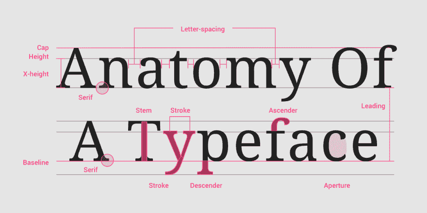

# 使用 TypoGraphy.js 处理 web 字体

> 原文：<https://dev.to/graphqleditor/handling-web-fonts-with-typography-js-mc3>

### 字体的重要性

交流在网页设计中起着至关重要的作用。在网络环境中，交流通常意味着文本。由于网站试图传达给最终用户的信息的主要部分是以书面语言的形式，现代网页设计开始对排版施加越来越大的压力，排版在过去几年开始成为设计系统的主要元素。

好的排版是一个平庸网站与优秀网站的区别，因为它让阅读变得更加愉快，从而使关键内容更容易传达给用户。

[](https://res.cloudinary.com/practicaldev/image/fetch/s--v4tSidKQ--/c_limit%2Cf_auto%2Cfl_progressive%2Cq_auto%2Cw_880/https://thepracticaldev.s3.amazonaws.com/i/e894w9vazubb2907smlu.png)

##### 来源:[了解排版](https://material.io/design/typography/understanding-typography.html#type-properties)

### 排版 JS

实现一个微小的设计变化可能会成为一场真正的噩梦，因为它可能会变成大量的重新计算和 CSS 变化。那么如何保持你的[排版](https://material.io/design/typography/understanding-typography.html)紧凑呢？

Typography.js 附带帮助，这使得为您的项目创建独特的设计更加容易，因为您所需要做的就是为 [Typography.js API](https://github.com/KyleAMathews/typography.js) 提供一个配置，它将为所有块和行内元素生成 CSS。TypoGraphy.js 将注意许多细节，即确保间距美观，这将提高你的产品的总体 UX 价值。

### 用法

**排版. js 主题**是简单的 Javascript 对象& **排版插件**是扩展或修改核心排版引擎的功能。这些功能可以修改不同网站元素的样式。

我们来看看基本的 JS 用法:

```
import Typography from 'typography'

const typography = new Typography({
  baseFontSize: '18px',
  baseLineHeight: 1.45,
  headerFontFamily: ['Avenir Next', 'Helvetica Neue', 'Segoe UI', 'Helvetica', 'Arial', 'sans-serif'],
  bodyFontFamily: ['Georgia', 'serif'],
  // See below for the full list of options.
})

// Output CSS as string.
typography.toString()

// Or insert styles directly into the <head> (works well for client-only
// JS web apps.
typography.injectStyles() 
```

### 如何使用主题

目前，大约有 30 个主题被维护，准备好为你的项目挑选。这些主题作为 NPM 包单独发布。让我们看看主题在一个[字体设计-主题-github](https://github.com/KyleAMathews/typography.js/tree/master/packages/typography-theme-github) 例子中的用法。首先，您需要使用
将包保存到您的项目中

```
npm install --save typography-theme-github 
```

然后在初始化时导入并传递到排版中

```
import Typography from 'typography'
import githubTheme from 'typography-theme-github'

const typography = new Typography(githubTheme) 
```

如前所述，主题是 javascript 对象，很容易定制，例如，如果你想改变 github 主题的字体大小，只需:

```
import Typography from 'typography'
import funstonTheme from 'typography-theme-github'
githubTheme.baseFontSize = '22px' // was 20px.

const typography = new Typography(githubTheme) 
```

你可以在这里玩可用的主题:
[【http://kyleamathews.github.io/typography.js/】](http://kyleamathews.github.io/typography.js/)

[](https://res.cloudinary.com/practicaldev/image/fetch/s--TvLyCfMw--/c_limit%2Cf_auto%2Cfl_progressive%2Cq_66%2Cw_880/sample.gif)