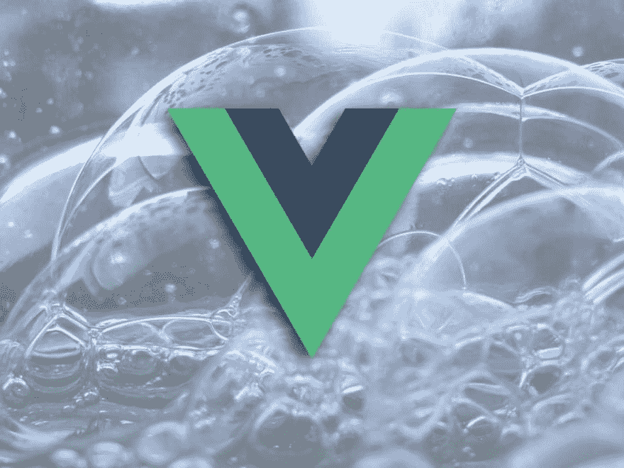
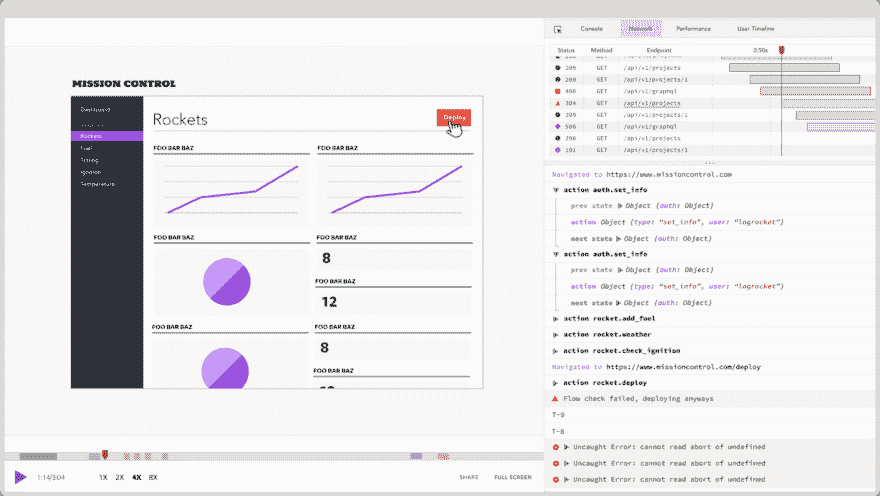

# 用 ES6+清理你的 Vue.js 代码

> 原文：<https://dev.to/bnevilleoneill/cleaning-up-your-vue-js-code-with-es6-4069>

[](https://res.cloudinary.com/practicaldev/image/fetch/s--YcmaqsQo--/c_limit%2Cf_auto%2Cfl_progressive%2Cq_auto%2Cw_880/https://thepracticaldev.s3.amazonaws.com/i/wdvlpt9yk752gtz617i6.jpeg)

ES6 是 web 向前迈出的一大步，它引入了许多新特性，解决了所有 JavaScript 开发人员面临的各种难题。但是它的一些特性特别适合于解决使用 Vue.js 开发时出现的问题。我们将了解每个功能的工作原理，以及它为您的应用程序和网站解决了什么问题。事不宜迟，我们开始吧！

### 特性 1:方法定义速记

我想说的第一个特性有一个纯粹的美学效果，但是它确实有助于使你的代码尽可能的可读。ES6 引入了这个简写来更简洁地为对象分配功能，我们在 Vue 中一直为方法、计算属性、观察器和生命周期方法这样做。这里有一个例子说明如何将它应用到你的 Vue 代码中:

```
// Without shorthand
{
    methods: {
        getValue: function() { // ... }
    },
    computed: {
        halfValue: function() { // ... }
    },
    created: function() { // ... }
}

// With ES6 shorthand
{
    methods: {
        getValue() { // ... }
    },
    computed: {
        halfValue() { // ... }
    },
    created() { // ... }
} 
```

Enter fullscreen mode Exit fullscreen mode

同样，这是一个很小的变化，但是对于可读性来说会有很大的不同。

### [T4】](https://logrocket.com/signup/)

### 特征二:解构

析构是 ES6 中添加的一个特性，它使得从对象中提取属性并将其赋给变量变得更加容易。在我们开始研究这如何在我们的 Vue 代码中帮助我们之前，这里有一个关于对象析构如何工作的非常基本的例子:

```
const person = { name: 'Jake', email: 'jake@example.com', phone: '555-555-5555' }

// With destructuring
const { name, email, phone } = person

// Without destructuring
const name = person.name
const email = person.email
const phone = person.phone 
```

Enter fullscreen mode Exit fullscreen mode

上面的两个例子(有/没有析构)完全一样。使用析构的版本只是一个更干净的代码模式来达到相同的结果。

那么如何在你的 Vue 代码库中使用析构呢？在 Vue 中，析构主要表现在两个方面:从`this`析构属性，以及从作用域插槽接收属性。让我们浏览一下每一个用例。

#### 解构来自`this`

在 Vue 中，要引用 Vue 或组件实例上的数据、方法或任何东西，可以使用`this`。但是有时不需要反复引用`this`就可以访问那些实例属性。让我向您展示一个很好的小技巧，将属性从`this`拉到您的本地函数作用域:

```
data() {
    return {
        endpoint: 'example.com/api',
    }
},
methods: {
    postForm() { // this is just an example method we can call in submitForm }
    submitForm() {
        // Without destructuring
        const endpoint = this.endpoint
        const postForm = this.postForm

        // With destructuring
        const { endpoint, postForm } = this
  }
} 
```

Enter fullscreen mode Exit fullscreen mode

这种模式不仅允许我们使用不带`this`前缀的变量，还让我们清楚地知道我们的函数所依赖的数据和/或方法。

#### 作用域插槽

插槽允许我们将模板传递到组件中，作用域插槽允许组件向这些模板提供一些组件数据。如果您不熟悉作用域插槽，这可能没有多大意义，但是希望这个例子至少可以加强析构的工作方式，以及如何在许多不同的场景中使用它

```
<!-- Without Destructuring -->
<User v-slot="slotProps">
    <div>Name: {{ slotProps.name }}</div>
    <div>Email: {{ slotProps.email }}</div>
</User>

<!-- With Destructuring -->
<User v-slot="{ name, email }">
    <div>Name: {{ name }}</div>
    <div>Email: {{ email }}</div>
</User> 
```

Enter fullscreen mode Exit fullscreen mode

与“从`this`析构”模式不同，析构我们的槽属性不仅允许我们在不使用`slotProps`前缀的情况下访问我们的变量，而且它准确地向我们显示了我们通过槽接受的属性。

### 功能#3:函数数组方法

ES6 引入了许多内置于阵列原型中的新方法。这些方法允许您以不同的方式与数组中的数据进行交互，比如转换每个项目(`map`)、对数组进行排序或过滤数组。我在 Vue 应用中常用的最喜欢的数组方法是`filter`、`map`、`forEach`和`includes`。这里有一个使用`filter` :
的例子

```
computed: {
    // Without "filter" functional array method
    oldFilteredItems() {
        const filtered = []
        for (const item in this.items) {
            if(item.value > 10) {
                filtered.push(item)
            }
        }
        return filtered
    },
    // With "filter" functional array method
    filteredItems() {
        return this.items.filter((item) => item.value > 10)
    }
} 
```

Enter fullscreen mode Exit fullscreen mode

这减少了我们必须编写(和阅读)的代码！)从七行到只有一行！

### 功能#4:箭头功能

在我们学习箭头函数，它们是如何工作的，以及如何在你的 Vue 代码中使用它们之前，让我们看看它们解决的问题。看看下面的代码:

```
data() {
    return {
        scrolled: false
    }
},
mounted() {
    window.addEventListener('scroll', function() {
        this.scrolled = true
    })
} 
```

Enter fullscreen mode Exit fullscreen mode

这个代码不起作用。为什么？因为当你创建一个新函数时，`this`的值被重新绑定为等于函数实例而不是 Vue 实例。如果您曾经遇到过这个问题，您可能已经尝试了以下方法来解决这个问题:

```
mounted() {
    var self = this
    window.addEventListener('scroll', function() {
        self.scrolled = true
    })
} 
```

Enter fullscreen mode Exit fullscreen mode

虽然这确实“修复”了问题，但是让`var self = this`散落在代码中绝对不是理想的，尤其是当这是一个可以用(drumroll please) … arrow 函数解决的问题时！

箭头函数与标准函数非常相似，但一个关键的区别是箭头函数不重新绑定`this`，这在 Vue 应用中非常有帮助！这是之前例子的更新版本，我们用一个箭头函数替换了标准函数，这样`this`就不会被重新绑定:

```
mounted() {
    window.addEventListener('scroll', () => {
        this.scrolled = true
    })
} 
```

Enter fullscreen mode Exit fullscreen mode

我发现在编写 Vue 应用时，遵循以下规则很有帮助:在 Vue 组件中，`this`应该总是引用 Vue 实例。如果您使用箭头函数，这并不难实现，而且它使您的代码更容易理解。

如果你不熟悉箭头函数，它们绝对值得学习。虽然它们在这种情况下特别有用，但它们也允许您编写更简洁的函数，这适用于更多的情况。它们的另一个好处是与数组方法成对出现！如果你看看我在**特性#4** 中的`filteredItems`函数，你会发现我使用了一个箭头函数作为`filter`数组方法的第一个参数！

### 包装完毕

在我结束之前，我想谈谈我是如何着手确定这四个改进的，以及你如何学会发现你的代码库中可以改进的地方。这里有几个小技巧！

#### 寻找重复

并不是所有的重复都是不好的，但是在代码中看到任何重复的东西都会让你想知道是否有机会进行良好的抽象，或者学习一种新的模式或语言特性来解决你正在处理的问题。

#### 注意语言变化

如果您没有跟上 JavaScript 的变化，就不可能知道您可以通过使用数组方法来简化代码中的许多循环。也就是说，你不必“深入”每一个新事物，但要努力意识到在你正在使用的语言中有什么是可用的。然后，当你遇到一个问题时，希望你会想起一个解决你所面临的问题的语言特性。

#### 读取别人的代码

如果你在一个团队中工作，要求和他们一起评审别人的代码，或者要求他们评审你的代码。看到其他人的代码，或者他们对你的代码的评论，会让你了解到其他人是如何以不同的方式做事的。当你看到一个你不认识的代码模式时，找出它是什么，如果它有意义，就把它应用到你的代码中。

### 进一步阅读

*   [一个非常简单的 JavaScript 对象析构介绍](https://wesbos.com/destructuring-objects/)
*   [JavaScript:初学者用的箭头函数](https://codeburst.io/javascript-arrow-functions-for-beginners-926947fc0cdc)
*   [播客——20 个 JavaScript 数组和对象方法让你成为更好的开发者](https://syntax.fm/show/043/20-javascript-array-and-object-methods-to-make-you-a-better-developer)

* * *

### Plug: [LogRocket](https://logrocket.com/signup/) ，一款适用于网络应用的 DVR

### [T4】](https://logrocket.com/signup/)

LogRocket 是一个前端日志工具，可以让你回放问题，就像它们发生在你自己的浏览器中一样。LogRocket 不需要猜测错误发生的原因，也不需要向用户询问截图和日志转储，而是让您重放会话以快速了解哪里出错了。它可以与任何应用程序完美配合，不管是什么框架，并且有插件可以记录来自 Redux、Vuex 和@ngrx/store 的额外上下文。

除了记录 Redux 操作和状态，LogRocket 还记录控制台日志、JavaScript 错误、堆栈跟踪、带有头+正文的网络请求/响应、浏览器元数据和自定义日志。它还使用 DOM 来记录页面上的 HTML 和 CSS，甚至为最复杂的单页面应用程序重新创建像素级完美视频。

[免费试用](https://logrocket.com/signup/)。

* * *

帖子[用 ES6+](https://blog.logrocket.com/cleaning-up-your-vue-js-code-with-es6/) 清理你的 Vue.js 代码最先出现在 [LogRocket 博客](https://blog.logrocket.com)上。