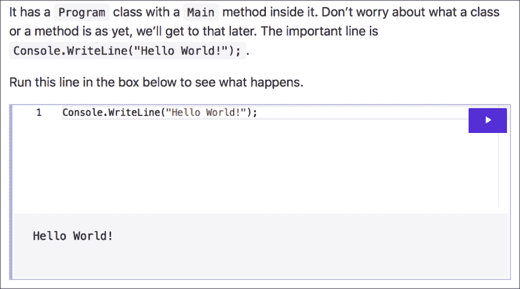
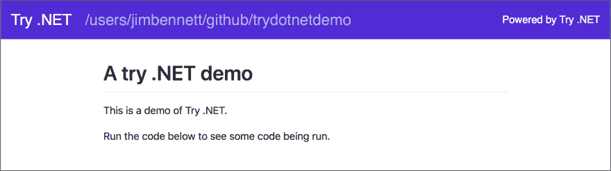
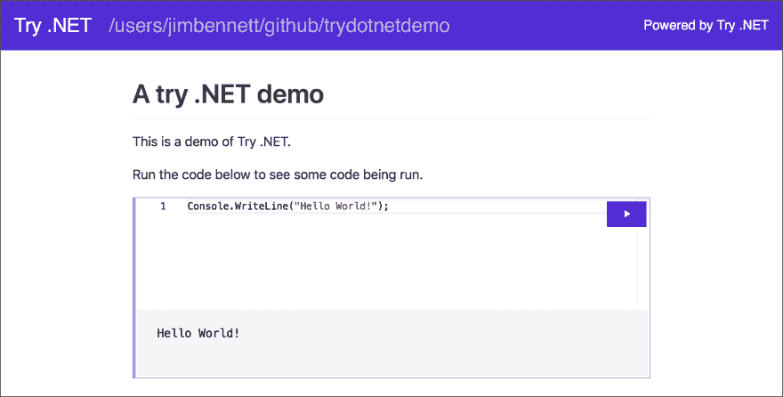
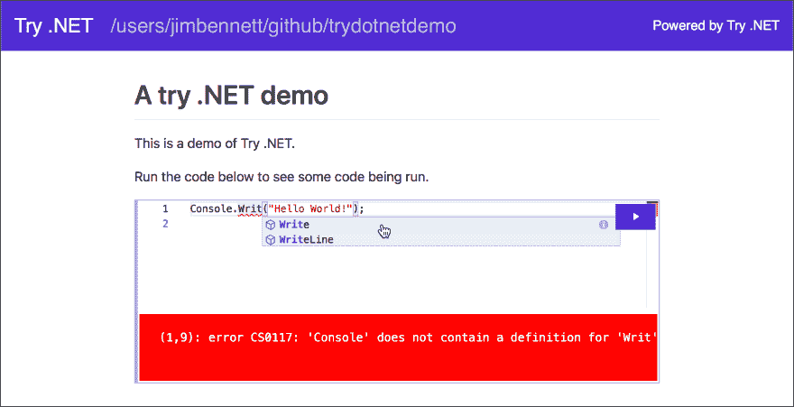
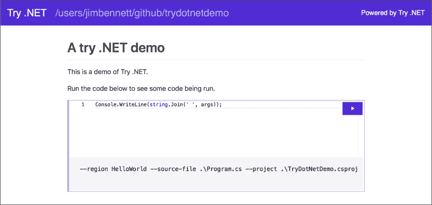
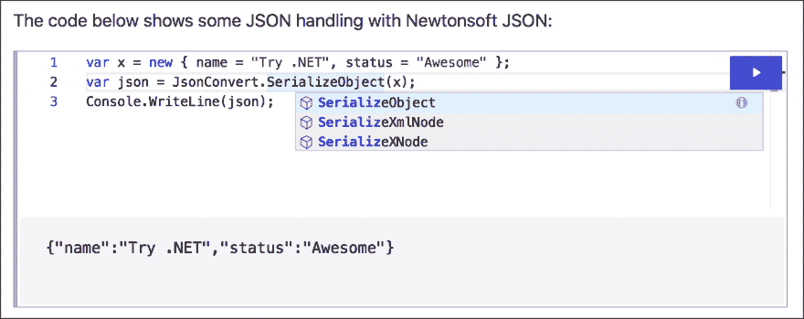

# 尝试尝试。网

> 原文：<https://dev.to/dotnet/trying-out-try-net-ckn>

试一试。NET 是一个来自。允许你在浏览器中尝试. NET。你可以把它看作是一种创造互动的方式。NET 文档使用。网芯。

## 什么叫尝试。网

在浏览器中编写代码的体验本身并不新鲜，开发人员已经能够在浏览器中尝试 C#代码片段[一段时间了，但这是不同的。试试看。NET 是不同的，因为它允许您:](https://dotnet.microsoft.com/learn/dotnet/in-browser-tutorial/1/?WT.mc_id=devto-blog-jabenn)

*   混合代码和 markdown，然后作为一个网页运行，在那里你可以阅读 markdown 并编辑和运行代码
*   用代码创建项目，获取包依赖关系，无论需要什么，然后只暴露你希望人们关注的部分

> 注意-试试。NET 目前只支持 C#，但是 F#显然是最受欢迎的改进。

### 混合码和降价

假设您想要创建一个教程项目来展示如何用 C#做一些事情。在过去，您可以编写指令并提供代码片段供读者运行，方法是创建一个项目，然后将代码添加到该项目中的一个`.cs`文件中，然后从命令行运行它。

带着尝试。NET 中，您可以创建一个链接到现有项目中一段代码的 markdown 文件。然后，读者可以从浏览器内部运行该代码。他们还可以使用完整的智能感知来编辑代码，如果有什么东西没有写出来，就会得到编译器错误，并且通常会处理代码。

[](https://res.cloudinary.com/practicaldev/image/fetch/s--DaRX7ohE--/c_limit%2Cf_auto%2Cfl_progressive%2Cq_auto%2Cw_880/https://thepracticaldev.s3.amazonaws.com/i/8xrq2t5eez4zqo1cf0lp.png)

### 只表面自己需要的东西

当运行代码时，你通常需要一些模板——一个`main`方法，一些`using`指令，诸如此类的东西。如果您想运行依赖于外部包或安装代码的更高级的代码，您需要一种方法来引入这些包或运行安装代码。这可能很复杂，并且用与你想教的内容不相关的代码填满代码窗口。

试试看。NET 通过在幕后提供一个 C#项目来解决这个问题，您可以按照自己的意愿进行设置。然后你写下所有你需要的代码，然后使用`#region`指令显示你想在 markdown 中显示的部分——是的，这是一个很好的理由。

## 创造你的第一次尝试。网络项目

试试看。NET 是一个全球性的。NET 工具，您可以使用:
从终端或命令行安装它

```
dotnet tool install --global dotnet-try 
```

Enter fullscreen mode Exit fullscreen mode

它支持。NET Core 2.1，但对于所有最好的东西来说，安装 3.0 是值得的。

您可以使用
启动演示项目

```
dotnet try demo 
```

Enter fullscreen mode Exit fullscreen mode

但我认为从头开始创建一个项目并经历它是如何运行的会很有趣。

### 创建一个 dotnet 项目

从一个简单的 dotnet 控制台应用程序开始:

```
dotnet new console -o TryDotNetDemo 
```

Enter fullscreen mode Exit fullscreen mode

在我的例子中，我把我的应用程序叫做`TryDotNetDemo`。在 [Visual Studio 代码](https://code.visualstudio.com/?WT.mc_id=%20devto-blog-jabenn)中打开这个项目，然后在项目中添加一个名为`README.MD`的新文件。这是一个标准的 read me markdown 文件，和你在 GitHub 中使用的一样。

给这个文件添加一些 markdown 来显示一个简单的标题和简介:

```
# A try .NET demo

This is a demo of Try .NET.

Run the code below to see some code being run. 
```

Enter fullscreen mode Exit fullscreen mode

从 Visual Studio 代码终端运行以下命令:

```
dotnet try 
```

Enter fullscreen mode Exit fullscreen mode

您的代码将被编译，并在浏览器中启动，您将看到您的降价呈现。

[](https://res.cloudinary.com/practicaldev/image/fetch/s--lxBraRYj--/c_limit%2Cf_auto%2Cfl_progressive%2Cq_auto%2Cw_880/https://thepracticaldev.s3.amazonaws.com/i/rvg319y8nu5g3j919dos.png)

### 添加一些代码

现在我们有一些降价，让我们添加一些代码。一个简单的 *Hello World* 就可以了。

打开`Program.cs`文件。默认的`main`方法只有一行将`Hello World`写到控制台。

```
using System;

namespace TryDotNetDemo
{
    class Program
    {
        static void Main(string[] args)
        {
            Console.WriteLine("Hello World!");
        }
    }
} 
```

Enter fullscreen mode Exit fullscreen mode

我们想要 markdown 中的`Console.WriteLine`调用，但不想要其余的代码，那么我们该怎么做呢？

我们添加一个区域！使用有意义的名称，在命名的区域块中换行。

```
#region HelloWorld Console.WriteLine("Hello World!");
#endregion HelloWorld 
```

Enter fullscreen mode Exit fullscreen mode

接下来，向 markdown 中添加一个空代码块:

```
 ```cs --region HelloWorld --source-file .\Program.cs --project .\TryDotNetDemo.csproj
``` 
```

Enter fullscreen mode Exit fullscreen mode

让我们来分解这个降价模块:

```
 ```cs
``` 
```

Enter fullscreen mode Exit fullscreen mode

这些是代码块的开始和结束部分，用三个反勾号表示。结束的三个反勾号需要在新的一行上。`cs`部分告诉 markdown 渲染器，这个块中的代码是 C#代码。

```
--region HelloWorld 
```

Enter fullscreen mode Exit fullscreen mode

这告诉尝试。NET 来寻找一个名为`HelloWorld`的区域，并将该区域中的所有代码放入呈现的 markdown 中。

```
--source-file .\Program.cs 
```

Enter fullscreen mode Exit fullscreen mode

这告诉尝试。NET 在`Program.cs`代码文件中寻找这个区域。

```
--project .\TryDotNetDemo.csproj 
```

Enter fullscreen mode Exit fullscreen mode

最后一个选项告诉 Try。NET 的代码来自于`TryDotNetDemo.csproj`文件，所以这个项目需要编译和运行。

如果 Visual Studio 代码终端中正在运行的会话仍在运行，则终止该会话，然后重新启动它。

```
dotnet try 
```

Enter fullscreen mode Exit fullscreen mode

现在，您将在浏览器中看到您的代码，您可以使用紫色的 run 按钮来运行它。

[](https://res.cloudinary.com/practicaldev/image/fetch/s--2n7dme3X--/c_limit%2Cf_auto%2Cfl_progressive%2Cq_auto%2Cw_880/https://thepracticaldev.s3.amazonaws.com/i/qwxfjgyki7h1cotqrpg6.png)

这很酷——但是更酷的是你可以编辑这段代码。玩一玩——你会得到完整的智能感知和 *ctrl+space* 自动完成，如果你的代码没有编译，你会得到适当的编译器错误——行号基于浏览器中的代码，而不是在`.cs`文件中。

[](https://res.cloudinary.com/practicaldev/image/fetch/s--UG2OtErG--/c_limit%2Cf_auto%2Cfl_progressive%2Cq_auto%2Cw_880/https://thepracticaldev.s3.amazonaws.com/i/o7e4xf7ljtn6siawia6k.png)

### 发生什么事了

当您的代码运行时，它将编译包含您所做的任何代码更改的控制台应用程序。如果编译失败，您会看到错误，否则控制台应用程序会正常运行——运行`main`方法，控制台的任何输出都会显示在您的代码下面。

## 创建更高级的项目

第一个例子运行了一段代码，但是如果你想拥有多个可以编辑的方法，比如在一个多部分或多页的教程中，该怎么办呢？当每次都运行`main`方法时，该如何工作呢？

答案以命令行参数的形式出现。当尝试时。NET 运行您的控制台应用程序，它将区域名称、源文件和项目文件作为命令行参数传递给应用程序。要看到这一点，您可以将参数转储到控制台并重新启动代码。

```
Console.WriteLine(string.Join(' ', args)); 
```

Enter fullscreen mode Exit fullscreen mode

[](https://res.cloudinary.com/practicaldev/image/fetch/s--ms8UIeP_--/c_limit%2Cf_auto%2Cfl_progressive%2Cq_auto%2Cw_880/https://thepracticaldev.s3.amazonaws.com/i/u7m3fqbrtqh44yb8aoaj.png)

您将看到 6 个参数:

```
--region HelloWorld --source-file .\Program.cs --project .\TryDotNetDemo.csproj 
```

Enter fullscreen mode Exit fullscreen mode

这些是添加到降价中的`cs`代码块的附加参数。

您可以使用这些参数来指导您的代码。一个好的模式是在您的`main`方法中打开区域，然后调用不同的方法。

```
static void Main(string[] args)
{
    switch (args[1])
    {
        case "HelloWorld":
            HelloWorld();
            break;
        case "Addition":
            Addition();
            break;
    }
}

static void HelloWorld()
{
    #region HelloWorld
    Console.WriteLine("Hello World!");
    #endregion HelloWorld
}

static void Addition()
{
    #region Addition
    int a = 1;
    int b = 2;
    int c = a + b;
    Console.WriteLine($"{a} + {b} = {c}");
    #endregion Addition
} 
```

Enter fullscreen mode Exit fullscreen mode

然后，您可以在 markdown 中显示这两种方法:

```
# A try .NET demo

This is a demo of Try .NET.

Run the code below to see some code being run.

```cs --region HelloWorld --source-file .\Program.cs --project .\TryDotNetDemo.csproj
```

The code below shows addition:

```cs --region Addition --source-file .\Program.cs --project .\TryDotNetDemo.csproj
``` 
```

Enter fullscreen mode Exit fullscreen mode

当运行`HelloWorld`区域时，控制台应用程序被调用，`"HelloWorld"`作为第二个参数被传递给应用程序(第一个参数是`--region`参数)。在`main`方法中的`switch`语句获得这个信息，并且只运行`HelloWorld`方法。类似地，`Addition`区域将`"Addition"`传递给应用程序，并且只运行`Addition`方法。

这允许你把你的应用程序分解成许多方法，这些方法可以在你的 markdown 中独立调用。

## 加包呢？

这个完全支持！只需像平常一样将包添加到 C#项目中，并在代码中使用它。

```
static void Json()
{
    #region Json
    var x = new { name = "Try .NET", status = "Awesome" };
    var json = JsonConvert.SerializeObject(x);
    Console.WriteLine(json);
    #endregion Json
} 
```

Enter fullscreen mode Exit fullscreen mode

```
The code below shows some JSON handling with Newtonsoft JSON:

```cs --region Json --source-file .\Program.cs --project .\TryDotNetDemo.csproj
``` 
```

Enter fullscreen mode Exit fullscreen mode

当您在浏览器中运行这段代码时，它将使用`Newtonsoft.Json.JsonConvert`将匿名对象序列化为字符串。您甚至可以在编辑器中获得这个包的完整智能感知。

[](https://res.cloudinary.com/practicaldev/image/fetch/s--kEo1ep1_--/c_limit%2Cf_auto%2Cfl_progressive%2Cq_auto%2Cw_880/https://thepracticaldev.s3.amazonaws.com/i/246kg4x1nm0nlrlkdsnb.png)

* * *

所有的代码都可以在 GitHub 这里找到-[github.com/jimbobbennett/TryDotNetDemo](https://github.com/jimbobbennett/TryDotNetDemo)。

你也可以在[上了解更多。网博](https://devblogs.microsoft.com/dotnet/creating-interactive-net-documentation/?WT.mc_id=%20devto-blog-jabenn)。