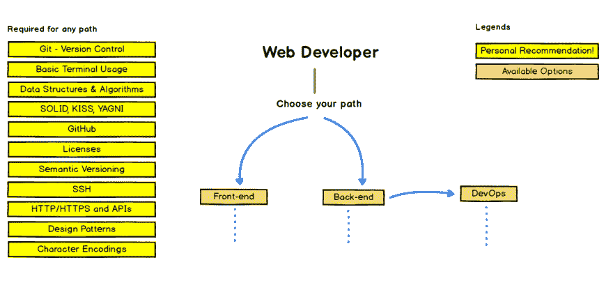
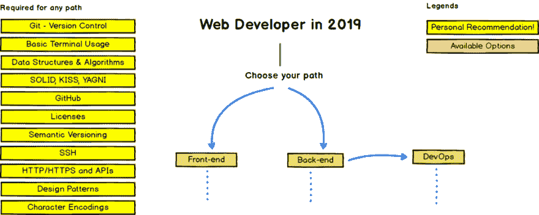
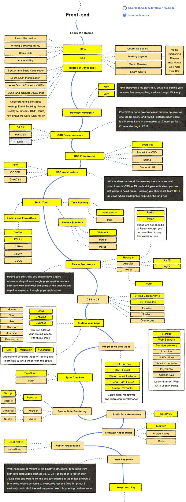
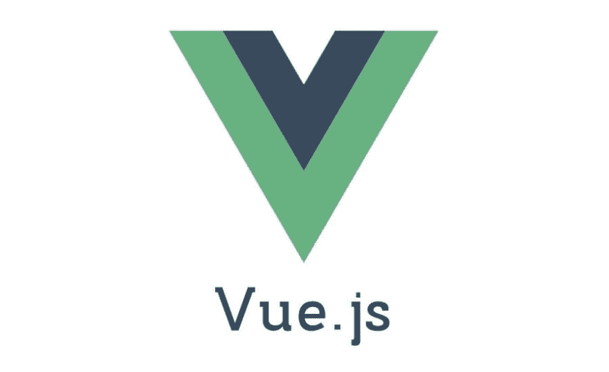
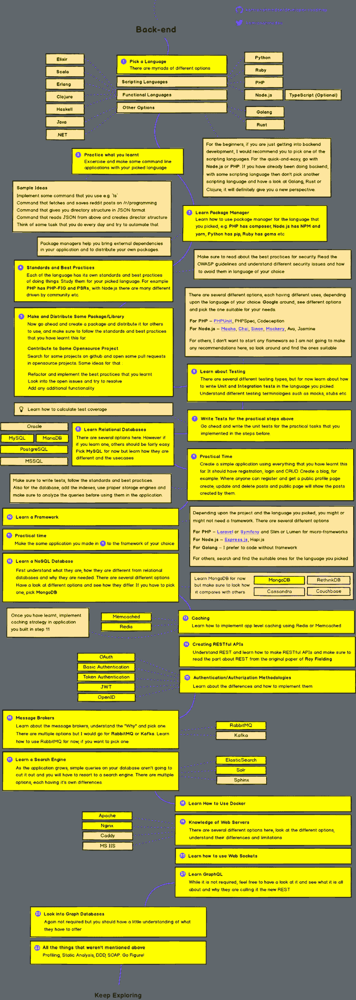
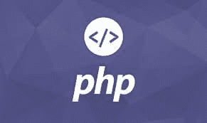

# 2022 年网络发展(前端+后端)路线图

> 原文：<https://dev.to/javinpaul/the-2019-web-development-frontend-backend-roadmap-4le2>

*披露:这篇文章包括附属链接；如果您从本文提供的不同链接购买产品或服务，我可能会收到报酬。*

你们好，我希望你们在 2022 年过得很好。我相信你们现在都已经制定了自己的目标，并在思考如何实现这些目标。如果你的目标之一是学习编程或在 2022 年成为一名网络开发人员，那么今天我有很棒的东西要和你分享，那就是 T2 2022 年网络开发人员路线图。

这是如何在 2022 年成为一名 web 开发人员的绝佳例证，并指导你如何在 2022 年学习和掌握 Web 开发。

这是学习前端、后端和所有其他 Web 开发人员应该知道的东西的不同途径的集合。你不仅会了解网络开发，还会了解对所有程序员和软件开发人员都很重要的基本编程知识。

路线图也分为 3 个部分，第一部分是关于每个 web 开发人员都应该知道的**常用技能**，而第二和第三部分是关于 web 开发的两个主要领域**前端**和**后端**开发。

您可以学习前端或后端，或者两者都学，这取决于您的选择。如果你想成为一名 [FullStack Web 开发人员](https://javarevisited.blogspot.com/2019/01/10-web-development-frameworks-fullstack-developer-should-learn.html)，那么你必须学习前端和后端，这是不可避免的。

在前端你也可以选择学习你想要的框架，如[反应](https://javarevisited.blogspot.com/2018/08/top-5-react-js-and-redux-courses-to-learn-online.html)、[角度](https://javarevisited.blogspot.com/2018/06/5-best-courses-to-learn-angular.html)或 [Vue.js](https://medium.com/javarevisited/top-5-online-courses-to-learn-vue-js-in-2021-249e66b60646) ，你不需要学习所有的框架，只需要学习你喜欢的。如果你问我的建议，Vue.js 在 2022 年是比其他两个更好的选择，但这些仍然比 Vue.js 更常用。

顺便说一句，你可能以前见过这个路线图。这本关于如何成为一名 web 开发人员的令人敬畏的可视化指南是由 [Kamranahmedse](https://github.com/kamranahmedse) 创建的，并发布在他的 GitHub 知识库[上。这是我最喜欢的地方之一，我已经把它收藏起来，准备以后再去。](https://github.com/kamranahmedse/developer-roadmap)

去年，在网上冲浪时，我偶然发现了这个优秀的网页。我首先在那里发现了 DevOps 路线图，并立即成为 Kamran Ahmed 的粉丝。事实上，我已经把这些路线图打印出来，放在我的桌子上作为日常参考。

顺便说一句，路线图告诉你要学什么，但没有告诉你如何学习以及在哪里可以学到这些技能。我试图通过提供一些有用的[课程](http://www.java67.com/2018/08/top-10-free-java-courses-for-beginners-experienced-developers.html)和[书籍](http://www.java67.com/2015/03/10-books-every-programmer-and-software-engineer-read.html)的链接来补充这一部分，你可以用来学习成为一名 web 开发人员所需的[技术](http://www.java67.com/2018/01/top-10-web-mobile-and-big-data-framework-libraries-technologies-programmers-should-learn-in-2018.html)、[编程语言](http://www.java67.com/2017/12/10-programming-languages-to-learn-in.html)、[框架](http://www.java67.com/2018/02/top-10-open-source-frameworks-and-libraries-java-web-developers.html)和[库](http://www.java67.com/2019/01/top-10-javascript-frameworks-and-libraries-for-web-developers.html)，并且在这个路线图中提到了。

### 2022 年成为网页开发者图解指南

不管怎样，这就是你要开始的地方。正如我以前说过的，你可以选择前端或后端路径，这取决于你的兴趣。不管怎样，有八条黄色的建议是你必须学会的，这些是每个程序员都应该知道的常识。

[https://github.com/kamranahmedse/developer-roadmap](https://github.com/kamranahmedse/developer-roadmap)

**任一路径的推荐学习方式**

**1。Git**
最流行的版本控制系统之一。没有 Git 的生活已经不可能了。你可以从 Udemy 上的 [**查看 Git 完整指南**](https://click.linksynergy.com/deeplink?id=JVFxdTr9V80&mid=39197&murl=https%3A%2F%2Fwww.udemy.com%2Fgit-complete%2F) 开始。

**2。SSH**
它允许你删除登录到另一个主机，另一个流行的网络概念，每个 web 开发人员都应该知道。

**3。HTTP / HTTPS**

**4。基本终端用法 Linux 命令行基础知识**
不仅仅是一个 web 开发人员，对于任何程序员来说，Linux 命令行都是非常非常重要的，我强烈建议你花些时间去学习它们。Udemy 上的 [**Linux 命令行基础**](https://click.linksynergy.com/deeplink?id=JVFxdTr9V80&mid=39197&murl=https%3A%2F%2Fwww.udemy.com%2Flinux-command-line-volume1%2F) 课程是一个很好的起点，如果你喜欢免费课程，你可以使用这些免费的 Linux 课程开始学习 Linux。

**5。数据结构和算法**
这些是任何程序的组成部分，更好的算法和数据结构知识是你下一份工作或做好当前工作的关键。

如果你对学习算法和数据结构感兴趣，我建议你选择你理解的编程语言的课程。

例如，对于 Java 开发人员来说[数据结构和算法:使用 Java](https://click.linksynergy.com/deeplink?id=JVFxdTr9V80&mid=39197&murl=https%3A%2F%2Fwww.udemy.com%2Fdata-structures-and-algorithms-deep-dive-using-java%2F) 进行深入研究是一个很好的开始。

同样，对于 JavaScript 开发者来说，柯尔特·斯蒂尔的 [JavaScript 算法和数据结构 Masterclass](https://click.linksynergy.com/deeplink?id=JVFxdTr9V80&mid=39197&murl=https%3A%2F%2Fwww.udemy.com%2Fjs-algorithms-and-data-structures-masterclass%2F) 是一个很好的例子。

而且，如果你使用 Python，那么 Python 中的[算法和数据结构是一个不错的选择。](https://click.linksynergy.com/deeplink?id=JVFxdTr9V80&mid=39197&murl=https%3A%2F%2Fwww.udemy.com%2Falgorithms-and-data-structures-in-python%2F)

而且，如果你不介意从资源中学习，那么你也可以从这个[免费算法课程](https://javarevisited.blogspot.com/2018/01/top-5-free-data-structure-and-algorithm-courses-java--c-programmers.html)的列表开始。

7 .**。字符编码**它基本上告诉你的浏览器如何显示你的数据。

**8。毫无疑问，每个程序员都应该知道 Git 和 GitHub，因为它们是版本控制和代码库的标准。如果你想学习和掌握 [Git](https://dzone.com/articles/top-5-free-courses-to-learn-git-and-github-in-2019) 和 [Github](https://hackernoon.com/top-5-free-courses-to-learn-git-and-github-best-of-lot-2f394c6533b0) ，可以查看这些[免费 Git 课程](https://javarevisited.blogspot.com/2018/01/5-free-git-courses-for-programmers-to-learn-online.html)。**

## 2022 年前端开发者路线图

如果你想在 2022 年成为前端开发者，那么你应该遵循下面的前端开发者路线图。你应该把重点放在黄色方框上，它突出了重要的学习内容，并从那里开始学习。在路线图下面，你会找到书籍和课程等其他资源来帮助你学习。

[https://github . com/kamranahmedse/developer-roadmap/blob/mastimg/frontend . png](https://github.com/kamranahmedse/developer-roadmap/blob/mastimg/frontend.png)

### 1。Web 开发基础

很明显，如果你想成为一名 web 开发人员，那么你应该了解互联网、web 应用程序、HTTP 之类的协议以及一般的 Web 开发的基础知识。谢天谢地，有很多课程，你不仅能学到这些，还能学到更多。

我为所有想学习 Web 开发的程序员推荐以下资源:

1.  [科尔特钢铁公司的网络开发者训练营](https://click.linksynergy.com/deeplink?id=JVFxdTr9V80&mid=39197&murl=https%3A%2F%2Fwww.udemy.com%2Fthe-web-developer-bootcamp%2F)
2.  [Angela Yu 的 2022 年网络开发者训练营](https://click.linksynergy.com/deeplink?id=JVFxdTr9V80&mid=39197&murl=https%3A%2F%2Fwww.udemy.com%2Fthe-complete-web-development-bootcamp%2F)
3.  [高级 Web 开发人员训练营](https://click.linksynergy.com/deeplink?id=JVFxdTr9V80&mid=39197&murl=https%3A%2F%2Fwww.udemy.com%2Fthe-advanced-web-developer-bootcamp%2F)

### 2。HTML 和 CSS

HTML 和 CSS 是任何网站的支柱。HTML 提供了结构，而 CSS 提供了风格，帮助他们看起来更好，更具视觉吸引力。如果你想成为一个严肃的前端开发人员，那么你必须掌握这两个，首先，你可以查看这些免费的 HTML 和 CSS 课程在线学习。

### 3。Java Script 语言

就像面向对象编程的四大支柱，我指的是[抽象](https://javarevisited.blogspot.com/2017/04/difference-between-abstraction-and-encapsulation-in-java-oop.html)、[封装](https://javarevisited.blogspot.com/2012/03/what-is-encapsulation-in-java-and-oops.html)、[多态](http://javarevisited.blogspot.sg/2011/08/what-is-polymorphism-in-java-example.html)、[继承](http://www.java67.com/2016/03/top-21-java-inheritance-interview-Questions-Answer-Programming.html)，web 开发有三大支柱，即——HTML、CSS、JavaScript。

前两者提供了结构和风格，但正是 JavaScript 通过增加指导性使它们变得生动。对于一个现代 Java 开发人员来说，学习 [JavaScript](https://javarevisited.blogspot.com/2018/06/top-10-courses-to-learn-javascript-in.html) 是非常重要的，值得庆幸的是，有许多课程可供你学习初级和高级 JavaScript，以下是一些建议:

1.  【2022 年完整的 JavaScript 课程
2.  [高级 JavaScript 和 ES6 初学者指南](https://click.linksynergy.com/deeplink?id=JVFxdTr9V80&mid=39197&murl=https%3A%2F%2Fwww.udemy.com%2Fadvanced-javascript-course%2F)

### 4。以打字打的文件

就像我们有 [C](https://medium.com/javarevisited/10-best-c-programming-courses-for-beginners-2c2c1f6bcb12) 和 [C++](http://www.java67.com/2018/02/5-free-cpp-courses-to-learn-programming.html) 一样，TypeScript 可以被认为是 JavaScript++虽然它没有 C++流行。

[TypeScript](https://javarevisited.blogspot.com/2018/07/top-5-courses-to-learn-typescript.html) 的好处是它在 JavaScript 代码中增加了类型安全，这意味着您可以在开发阶段捕捉到讨厌的 JavaScript 类型相关错误。

这也使得为 JavaScript 开发面向对象的代码变得容易。如果你想学习打字稿， [**理解打字稿**](https://click.linksynergy.com/deeplink?id=JVFxdTr9V80&mid=39197&murl=https%3A%2F%2Fwww.udemy.com%2Funderstanding-typescript%2F) 是一个很好的开始课程，如果你需要更多的选择或免费的替代品，这里有另一个列表，列出一些[免费打字稿课程](http://www.java67.com/2018/05/top-5-free-typescript-courses-to-learn.html)开始。

### 5。有角的

人们使用普通的 HTML、CSS 和 JavaScript 构建网站的日子已经一去不复返了。如今大部分工作都是由像 [Angular](https://javarevisited.blogspot.com/2018/06/5-best-courses-to-learn-angular.html) 、 [React JS](https://javarevisited.blogspot.com/2018/10/the-2018-react-developer-roadmap.html) 或 Vue.js 这样的框架完成的

它们不仅提供了一个存储代码的结构，还使得快速开发 web 应用程序变得容易。

Angular 由 Google 支持，因此学习 Angular 对于任何现代 Web 开发人员来说都是一个不错的选择。如果你想学习 Angular，没有比 Max 的 [**Angular 更好的课程了 Udemy 上的**](https://click.linksynergy.com/deeplink?id=JVFxdTr9V80&mid=39197&murl=https%3A%2F%2Fwww.udemy.com%2Fthe-complete-guide-to-angular-2%2F) 完全指南。

### 7。反应 JS

类似于 [Angular](https://hackernoon.com/top-10-angular-courses-tutorials-and-books-for-web-developers-e8a8e2c490c2) , [React](https://hackernoon.com/the-2018-react-js-roadmap-4d0a43814c02) 也是一个开发 web 应用的流行库。它允许您编写可重用的组件，然后您可以使用这些组件来创建现代外观的交互式网页。

就像 Angular 得到了谷歌的支持一样，React 得到了脸书的支持，因此非常受欢迎。如果你想学习 React，那么你可以加入斯蒂芬·格里德的 [Modern React with Redux](https://click.linksynergy.com/deeplink?id=JVFxdTr9V80&mid=39197&murl=https%3A%2F%2Fwww.udemy.com%2Freact-redux%2F) 或者马克斯的[React-Udemy 上的完整指南](https://click.linksynergy.com/deeplink?id=JVFxdTr9V80&mid=39197&murl=https%3A%2F%2Fwww.udemy.com%2Freact-the-complete-guide-incl-redux%2F)。两者都是学习在线反应的优秀课程。

以下是链接:

1.  [现代反应与还原](https://click.linksynergy.com/deeplink?id=JVFxdTr9V80&mid=39197&murl=https%3A%2F%2Fwww.udemy.com%2Freact-redux%2F)
2.  [反应-完整指南](https://click.linksynergy.com/deeplink?id=JVFxdTr9V80&mid=39197&murl=https%3A%2F%2Fwww.udemy.com%2Freact-the-complete-guide-incl-redux%2F)

### 8。view . js-检视. js

Vue 或 Vue JS 去年真的加快了速度，越来越多的人推荐和使用 Vue.js。我仍然是 Vue 的初学者，可能需要一些时间来学习和迁移到基于 Vue 的应用程序。但是，如果你已经做出了决定，你可以从 Udemy 上的 [**Vue.js Essentials**](https://click.linksynergy.com/deeplink?id=JVFxdTr9V80&mid=39197&murl=https%3A%2F%2Fwww.udemy.com%2Fvuejs-2-essentials%2F) 课程开始。

## 2022 年后端开发者路线图

如果你想在 2022 年成为后端开发者，那么你可以遵循这个后端开发者路线图。同样，您可以从黄色方框开始，这些方框突出显示了您需要学习的关键[技术](https://javarevisited.blogspot.com/2018/02/top-10-highest-paying-technical-jobs-programmers-software-developers.html)，然后在此基础上成长。在路线图下面，你会找到一些辅助材料以及课程和书籍的链接来帮助你学习。如果你最终购买了任何非免费课程，我也会赚一些佣金。

[https://github . com/kamranahmedse/developer-roadmap/blob/mastimg/back end . png](https://github.com/kamranahmedse/developer-roadmap/blob/mastimg/backend.png)

### 1。节点. js

开发 web 应用程序的后端有很多选择，比如你可以使用 Java 和 Spring，也可以使用 [Python](https://javarevisited.blogspot.com/2018/12/10-free-python-courses-for-programmers.html) + [Django](https://javarevisited.blogspot.com/2019/04/top-5-python-web-development-frameworks.html) ，但是最近几年 Node.js 已经成为首选。

NodeJS 最棒的一点是它允许你只用一种编程语言——JavaScript——就能开发一个完整的 web 应用程序。

如果你想走 Node 路线，那么 [**由**](http://javarevisited.blogspot.sg/2018/01/top-5-nodejs-and-express-js-online-courses-for-web-developers.html)**[罗布·帕西瓦尔](https://medium.com/@techedrob)和[安德鲁·米德](https://medium.com/@andrewmead)主讲的** 完整 Node.js 开发者课程是最好的开始。

### 2。Java 语言(一种计算机语言，尤用于创建网站)

我主要是一名 Java 开发人员，学习过 Web 开发和其他编程语言，因此在开发后端时，我的首选是 Java。你可以使用[核心 Java](http://www.java67.com/2018/08/top-10-free-java-courses-for-beginners-experienced-developers.html) 或者 [Java + Spring](https://javarevisited.blogspot.com/2018/06/top-6-spring-framework-online-courses-Java-programmers.html) Boot 来编写一个尖端的、高性能的后端。如果你想学习 Java 和 Spring route，这里有几门课程可以让你快速入门。

1.  [完整的 Java Masterclass](https://click.linksynergy.com/fs-bin/click?id=JVFxdTr9V80&subid=0&offerid=323058.1&type=10&tmpid=14538&RD_PARM1=https%3A%2F%2Fwww.udemy.com%2Fjava-the-complete-java-developer-course%2F)
2.  [Spring 框架 5:初学者到大师](https://click.linksynergy.com/fs-bin/click?id=JVFxdTr9V80&subid=0&offerid=323058.1&type=10&tmpid=14538&RD_PARM1=https%3A%2F%2Fwww.udemy.com%2Fspring-framework-5-beginner-to-guru%2F)

### 3。计算机编程语言

[Python](https://javarevisited.blogspot.com/2018/05/10-reasons-to-learn-python-programming.html) 是另一种牛逼的语言，充满了强大的框架和库。如果你想使用 [Python](https://hackernoon.com/top-5-courses-to-learn-python-in-2018-best-of-lot-26644a99e7ec) 开发后端，那么你可以使用 Django，这是一个面向 Python 程序员的全栈 web 开发框架。

首先，这里有几门学习 Python 和 Django 的课程:

1.  [完整的 Python 训练营](https://click.linksynergy.com/deeplink?id=JVFxdTr9V80&mid=39197&murl=https%3A%2F%2Fwww.udemy.com%2Fcomplete-python-bootcamp%2F)
2.  [Python 和 Django 全栈 Web 开发者训练营](https://click.linksynergy.com/deeplink?id=JVFxdTr9V80&mid=39197&murl=https%3A%2F%2Fwww.udemy.com%2Fpython-and-django-full-stack-web-developer-bootcamp%2F)

### 4。红宝石

Ruby 是另一种非常适合 web 开发的强大语言。它有一个很棒的框架，叫做 Rails，让创建 Web 应用程序变得非常容易和快速。如果你想从 Ruby 开始，你可以在 Udemy 上查看完整的 Ruby on Rails 开发者课程 。

这是最好的资源之一，如果你需要更多的选择，并且不介意从免费资源中学习，你也可以看看这些免费的 Ruby 和 Rails 课程。

### 5。PHP 和 MySQL

忘记人们对 PHP 的任何负面评价。这仍然是编写服务器端代码的最简单的方法，许多，几乎 50%的互联网运行在 PHP 和 MySQL 栈上。

如果你有兴趣学习 PHP，可以查看 Udemy 上的 [**PHP 初学者**](https://click.linksynergy.com/deeplink?id=JVFxdTr9V80&mid=39197&murl=https%3A%2F%2Fwww.udemy.com%2Fphp-for-complete-beginners-includes-msql-object-oriented%2F) 课程。如果你需要更多的选择和免费资源，你也可以查看我列出的[免费 PHP 和 MySQL 课程](http://www.java67.com/2018/02/5-free-php-and-mysql-courses-for-web-developers.html)作为开始。

以上就是关于**如何在 2022 年**成为一名 Web 开发者的全部内容。这是一个很好的资源，因为它强调了成为你一直想成为的网络开发者的几条途径。

不过，如果你在某个地方卡住了，如果有任何困惑，你可以随时在这里问，我们会尽可能地回答你的问题。

如果你是第一次接触[编程](https://javarevisited.blogspot.com/2019/03/top-5-online-courses-to-learn-to-code.html#axzz5kKVMEdwb)世界，不要让这个例子和大量的技术吓到你。这只是一个指南，你可以选择不同的途径来学习 Web 开发，并成为一名 [Web 开发人员](https://medium.com/javarevisited/10-things-aspiring-web-developers-should-learn-in-2021-6747bfbfc12e)，你可以选择你喜欢的途径并坚持下去。

其他**编程篇**你可能喜欢的
[2022 年 Java 程序员应该学会的 10 件事](https://javarevisited.blogspot.com/2017/12/10-things-java-programmers-should-learn.html#axzz5atl0BngO)
[2022 年你可以学会的 10 种编程语言](http://www.java67.com/2017/12/10-programming-languages-to-learn-in.html)
[每个 Java 开发者都应该知道的 10 个工具](http://www.java67.com/2018/04/10-tools-java-developers-should-learn.html)
[学习 Java 编程语言的 10 个理由](http://javarevisited.blogspot.sg/2013/04/10-reasons-to-learn-java-programming.html)
[10 个框架 Java 和 Web 开发者应该学会的 2022 年](http://javarevisited.blogspot.sg/2018/01/10-frameworks-java-and-web-developers-should-learn.html)
[成为更好的 Java 开发者的 10 个技巧 2022 年要学的框架](http://javarevisited.blogspot.sg/2018/05/10-tips-to-become-better-java-developer.html)
[2022 年要学 Python 的 10 个理由](https://javarevisited.blogspot.com/2018/05/10-reasons-to-learn-python-programming.html)
[10 个测试库每个 Java 开发者都应该知道的](https://javarevisited.blogspot.sg/2018/01/10-unit-testing-and-integration-tools-for-java-programmers.html)
[6 个 JavaScript 框架你可以学习成为一个真正的 Fullstack 开发者](https://medium.com/javarevisited/top-6-javascript-frameworks-you-can-learn-to-become-a-truly-fullstack-developer-27561a8cf2e0)

### 期末备注

感谢您阅读本文。你可能会想，有这么多东西要学，有这么多课程要参加，但你不需要担心。

很有可能你已经知道了大部分内容，也有很多有用的免费资源供你使用，我还在这里和那里链接了它们以及最佳资源，这些资源当然不是免费的，但很值钱。

我是 Udemy 课程的特别粉丝，不是因为如果你最终购买任何课程我都会得到报酬，而是因为它们非常实惠，并且以很小的金额提供了很多价值，但你可以自由选择你想要的课程。

说到底，你应该对这里提到的事情有足够的知识和经验。

祝您的 Web 开发之旅好运！当然**不会很容易**，但是通过遵循这个路线图和指南，你离成为你一直想成为的 Web 开发者又近了一步

如果你喜欢这篇文章，那么请考虑在 twitter 上关注我。如果你想在每篇新帖子上得到通知，也别忘了在 Twitter 上关注 [**javarevisited**](https://twitter.com/javarevisited)

祝你的 Web 开发之旅一切顺利，非常感谢 [Kamran Ahmed](https://medium.com/@kamranahmedse) 制作了如此精彩的内容。

> 附:如果你被这里给出的信息淹没了，只想做一件事，稍后再回来看路线图，就加入柯尔特钢铁 的 Web 开发者训练营 [**，这是一切的要点，没有比这更好的资源来学习 2022 年的 Web 开发了。**](https://click.linksynergy.com/deeplink?id=JVFxdTr9V80&mid=39197&murl=https%3A%2F%2Fwww.udemy.com%2Fthe-web-developer-bootcamp%2F)