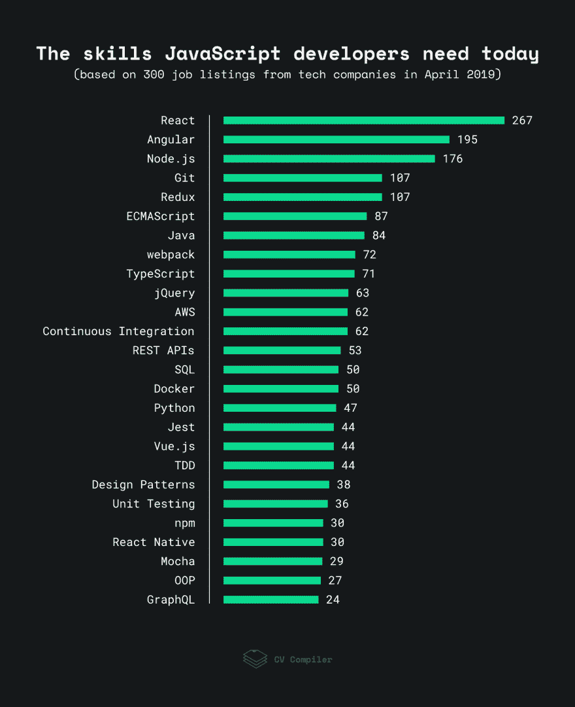

# 初级 JavaScript 开发人员需要学习的 5 大技能

> 原文：<https://dev.to/kball/top-5-skills-to-learn-as-a-junior-javascript-developer-1o4a>

最近，在 JS Party#77 的第二部分，我和杰罗德、[达薇亚](https://twitter.com/shortdiv)、[尼克](https://twitter.com/nicknisi)进行了一次关于 JavaScript 开发人员需求技能的谈话。

这是 JavaScript 世界中反复出现的主题，因为变化太快了，很难知道应该关注什么。

这场讨论的推动力是最近一篇名为[框架的游戏:2019 年 JavaScript 趋势](https://cvcompiler.com/blog/game-of-frameworks-javascript-trends-of-2019/)的研究和分析文章，其中 CVCompiler 的团队分析了 300 份 JavaScript 开发人员的工作规范，并提取了最常见的术语。这是他们发现的图表:

在对包含诸如“Java”之类的东西开怀大笑之后(工作规范编写者会混淆 Java 和 JavaScript 吗？)和诸如“OOP”和“设计模式”等一系列通用术语，我们开始深入讨论哪些是真正重要和有用的技能。

由此产生的信息太好了，不能被埋没在 [show 抄本](https://changelog.com/jsparty/77)中，所以这里是:作为初级 JavaScript 开发人员需要重点学习的 5 个关键技能:

另外，对于每一项技能，我还链接了一些相关的资源。其中一些链接是附属链接，这意味着如果你决定购买我推荐的产品，我可能会收到佣金。如果你宁愿我没有收到佣金，那也很酷，只要谷歌资源而不是使用我的链接。🙂

## 1。掌握 JavaScript 的基础知识。

人们很容易被最新最棒的框架或者一大堆乱七八糟的术语所吸引，但是正如 Divya 所说:

> 对于一个可能比较新的人，或者刚刚开始学习技能的人来说，这真的让人不知所措。我和很多参加过训练营的人或者刚从学校毕业的人聊过，他们问我“我应该关注什么？”通常，我的回答就像“只要真正擅长 Javascript，或者你想做的任何事情……”因为我认为风格会变来变去。有很多框架出现了。React 现在很流行，但是谁知道五年后会发生什么

#### 资源

*   FreeCodeCamp 有一套惊人的[课程可以免费获得](https://learn.freecodecamp.org/)，从他们的[基础 JavaScript](https://learn.freecodecamp.org/javascript-algorithms-and-data-structures/basic-javascript/) 课程开始，并从那里向上发展。
*   雄辩的 JavaScript 是一本关于 JavaScript 的优秀书籍，可以从网上免费获得，或者从亚马逊获得[的印刷版](https://amzn.to/2JS1LPh)
*   如果你更喜欢视频课程，我推荐 Udemy 上的[完整 JavaScript 课程 2019](http://bit.ly/zd-complete-javascript) 。定期的销售使它的成本降到 12 美元左右。

## 2。深入了解 1 框架(可能会做出反应)

通过挖掘一系列公司的工程职业发展图表(感谢您 [progression.fyi](https://www.progression.fyi/) 收集了大量这些图表),我们可以看到，在开发人员职业生涯的前 5 年，他们通常在特定专业领域的能力水平越来越高。

至于选择哪种框架……正如最初的博客文章所强调和 Jerod 所总结的那样，从乔布斯的角度来看:

> 如果你打算只选择一个并深入研究，似乎 React 是 2019 年你的最佳选择。

#### 资源

*   React 手册是 Freecodecamp 博客上关于 React 的 80/20 介绍，旨在让你快速开始使用 React。
*   [全栈反应](https://www.fullstackreact.com/articles/)。一个博客和一份时事通讯都有很好的深入的 React 文章
*   [React 播客](https://reactpodcast.simplecast.fm/)。如果你对播客感兴趣，这个由[陈宸](https://twitter.com/chantastic)又名 Chantastic 制作的很棒。
*   如果你正在寻找一门课程，[Modern React with Redux【2019 更新】](http://bit.ly/zd-modern-react)是我刚开始使用 React 时参加的 React 课程，更新了新内容，以处理最新和最棒的功能。

## 3。寻找更大的图片模式

2019 年前端开发的一件大事是，尽管框架丰富，但我们也开始看到一些跨框架的大趋势。这对开发人员来说是个好消息，因为这意味着当你深入一个框架时，你仍然可以学到一些技能，如果需要的话，这些技能可以转化到其他人身上。

今年早些时候，我强调了这些大趋势中的五个大趋势，但在这一集里，有两个关键趋势出现了:

> 面向组件的开发。把事物想象成一组可以交互和即插即用的组件。React 在做那件事，Angular 在做那件事，Vue 在做那件事，Ember 在做那件事，Dojo 在做那件事，Mithril 在做那件事，Svelte 在做那件事……这就是我们要走的路。
> 
> 类似地，像声明式编码这样的事情……我们越来越多地向组件的声明式范例转移，我们不是强制性地做我们想做的事情。“事情应该是这样的”，并让框架来处理如何和何时。这是另一个地方，只要你在那里工作，这意味着也许不要专注于 jQuery…但如果你在做 React，这些技能将再次翻译。

##### 资源

*   关于面向组件开发的主题， [Robin Wieruch](https://www.robinwieruch.de/) 最近有一些很棒的文章，包括[一篇关于可重用组件的文章](https://www.robinwieruch.de/react-reusable-components/)和一篇关于[提升状态的文章](https://www.robinwieruch.de/react-lift-state/)
*   Kent C. Dodds 有一篇关于[高级反应组件模式](https://kentcdodds.com/blog/advanced-react-component-patterns)的很棒的文章。
*   VueMastery 上的[高级组件](https://www.vuemastery.com/courses/advanced-components/the-introduction)介绍了许多与组件相关的设计模式和技术。

## 4。如果你做的是后端，学习快速

调查中最引人注目的部分之一是有多少后端技术被强调，包括 JavaScript 和非 JavaScript。如果你在使用 Node 的 JavaScript 世界中，似乎有一个明显的赢家。尼克:

> 似乎一切都源于表达，在某种程度上，至少在我看来…
> 
> 我目前正在使用一个名为 NestJS 的项目，它就像 Express 周围的一个 TypeScript 包装器，但它使它更有棱角(这是我对它的描述)，这是一种好的方式。

##### 资源

*   FreeCodeCamp 有一个专注于 [Node 和 Express](https://learn.freecodecamp.org/apis-and-microservices/basic-node-and-express) 的免费课程，作为他们 API 和微服务认证的一部分。
*   [Just Express](http://bit.ly/zd-just-express) 是一门 Udemy 课程，有 16 个小时的重点深入内容，完全专注于 Express。

## 5。一两年后，开始关注数据流

我在我指导过的工程师身上看到过这种情况…处理数据管理(无论是前端还是后端)是一开始需要掌握的比较棘手的事情之一。在最初的一两年里，你可以避免它，或者只考虑单个组件环境中的数据，但是最终你需要真正掌握数据。

我觉得达薇亚说得好。

> 我认为，尤其是因为它超越了仅仅处理小功能，你必须考虑整体架构，以及它是否可伸缩和可维护；这些是你必须考虑的事情——数据如何流动，后端的架构是什么，它如何向前端提供数据，前端如何与后端联络，等等？理解这一点需要一点经验，在不同的应用程序上工作过，体验过各种事物…是的，通常你的级别越高，期望你知道如何去做，以及如何解决这些问题。

##### 资源

*   JavaScript 中的状态管理是一篇开始考虑状态管理的好文章。
*   [Flux 的详细研究:React.js 应用程序架构](https://www.cabotsolutions.com/2017/01/detailed-study-flux-react-js-application-architecture)是我所见过的最好的公开文章，有助于深入理解主导现代前端开发的数据架构。
*   GraphQL 之路是 GraphQL 上的免费书籍(尽管它需要电子邮件注册),这是后端和前端之间接口的最热门趋势之一。

* * *

好了，这是初级开发人员需要重点学习的 5 件事的概要。

对这些推荐背后的人感兴趣？想听听他们对网络社区中其他精彩事物的吹捧吗？想听一场关于 git 壁球 vs 合并的对决吗？在这里听完整集👇

 [# 这只是 JavaScript ️](/jsparty/it-s-just-javascript)  [## JS 党](/jsparty)   

<audio id="audio" data-episode="it-s-just-javascript" data-podcast="jsparty"><source src="https://cdn.changelog.com/uploads/jsparty/77/js-party-77.mp3" type="audio/mpeg"> Your browser does not support the audio element.</audio>

           <input type="range" name="points" id="volumeslider" value="50" min="0" max="100" data-show-value="true">      1x  initializing... × 

* * *

如果前端开发是你关心的事情，你可能也会对我的每周时事通讯《星期五前端》感兴趣。每周五我会发出 15 个链接，链接到 CSS/SCSS、JavaScript 和其他各种精彩的前端新闻中的最佳文章、教程和公告。在这里报名:[https://zendev.com/friday-frontend.html](https://zendev.com/friday-frontend.html)