# 开始使用新的 Kotlin Azure 函数原型和 IntelliJ 理念

> 原文：<https://dev.to/azure/get-started-with-the-new-kotlin-azure-functions-archetype-and-intellij-idea-33h>

# 开始使用新的 Kotlin Azure 函数原型和 IntelliJ 理念

| 作者 | [戴夫·格洛弗](https://developer.microsoft.com/en-us/advocates/dave-glover?WT.mc_id=devto-blog-dglover)，微软云开发者倡导者 |
| --- | --- |
| 开源代码库 | [开始使用新的 Kotlin Azure 函数原型和 IntelliJ](https://github.com/gloveboxes/Create-a-Kotlin-Azure-Function-with-IntelliJ) |
| 平台 | [Azure 功能](https://docs.microsoft.com/en-us/azure/azure-functions?WT.mc_id=devto-blog-dglover) |
| 程序设计语言 | 我的锅 |
| 日期 | 截至 2019 年 6 月 |

这是创建 Kotlin Azure 函数的端到端演练。

Kotlin 是一种新兴的开发语言，在最近的堆栈溢出开发者调查中被评为最受欢迎的语言之一。它正在成为 Android 开发的默认语言，并受到那些投资 Java 并寻找更现代的 JVM 语言的人的关注。

## 1。参考文献

*   [用 Java 和 IntelliJ 创建你的第一个 Azure 函数](https://docs.microsoft.com/en-us/azure/azure-functions/functions-create-maven-intellij?WT.mc_id=devto-blog-dglover)
*   [Azure Functions Java 开发者指南](https://docs.microsoft.com/en-us/azure/azure-functions/functions-reference-java?WT.mc_id=devto-blog-dglover)
*   【Azure Java 函数库
*   [Azure Maven 原型](https://github.com/microsoft/azure-maven-archetypes)
*   [注册 Azure 函数绑定扩展](https://docs.microsoft.com/bs-latn-ba/azure/azure-functions/functions-bindings-register?WT.mc_id=devto-blog-dglover)
*   用于 Azure 功能的 Maven 插件
*   [Azure IntelliJ 工具包](https://docs.microsoft.com/en-us/java/azure/intellij/azure-toolkit-for-intellij?view=azure-java-stable&WT.mc_id=devto-blog-dglover)

## 2。建立你的开发环境

要使用 Java 和 IntelliJ 开发功能，请安装以下软件:

*   Java 开发者工具包第八版 (JDK)
*   [Apache Maven](https://maven.apache.org) ，版本 3.0 或更高
*   [IntelliJ IDEA](https://www.jetbrains.com/idea/download) ，社区或终极版本
*   用于 IntelliJ 的 Azure 工具包(可选)
*   [Azure CLI](https://docs.microsoft.com/cli/azure?WT.mc_id=devto-blog-dglover)
*   [Azure Functions 核心工具，第二版](https://docs.microsoft.com/en-us/azure/azure-functions/functions-run-local?WT.mc_id=devto-blog-dglover)

> JAVA_HOME 环境变量必须设置为 JDK 的安装位置，以完成本文中的步骤。

## 3。创建一个 Kotlin Azure 函数项目

1.  从 IntelliJ IDEA 中，选择**创建新项目**。
2.  在**新项目**窗口中，从左侧窗格中选择 **Maven** 。
3.  选中**从原型**创建复选框，然后为[azure-functions-kot Lin-Archetype](https://mvnrepository.com/artifact/com.microsoft.azure/azure-functions-kotlin-archetype)选择**添加原型**。
4.  在**添加原型**窗口中，填写如下字段:

    *   *GroupId*:com . Microsoft . azure
    *   artifact id:azure-functions-kot Lin-原型
    *   *版本*:使用来自[中央存储库](https://mvnrepository.com/artifact/com.microsoft.azure/azure-functions-kotlin-archetype)的最新版本

    选择**确定**，然后选择**下一个**。
    [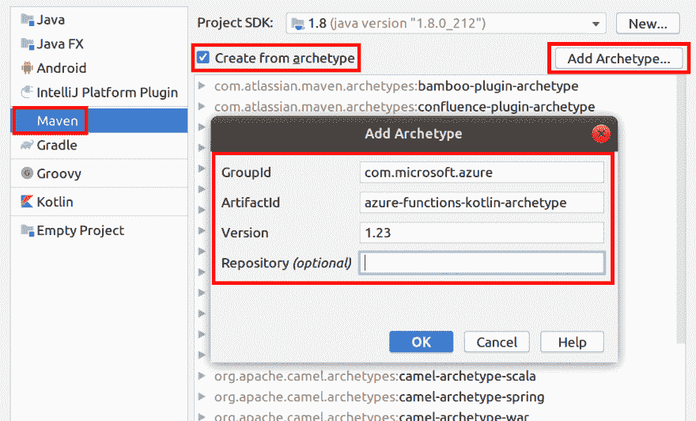](https://res.cloudinary.com/practicaldev/image/fetch/s--yB_GTxrl--/c_limit%2Cf_auto%2Cfl_progressive%2Cq_auto%2Cw_880/https://raw.githubusercontent.com/gloveboxes/Create-a-Kotlin-Azure-Function-with-IntelliJ/masterhttps://raw.githubusercontent.com/gloveboxes/Create-a-Kotlin-Azure-Function-with-IntelliJ/master/resources/create-new-project.png)

5.  输入当前项目的详细信息，然后选择**下一步**。
    [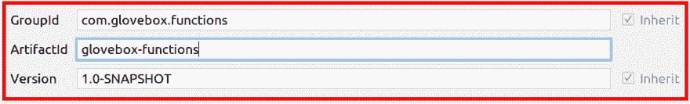](https://res.cloudinary.com/practicaldev/image/fetch/s--fIJ23iul--/c_limit%2Cf_auto%2Cfl_progressive%2Cq_auto%2Cw_880/https://raw.githubusercontent.com/gloveboxes/Create-a-Kotlin-Azure-Function-with-IntelliJ/masterhttps://raw.githubusercontent.com/gloveboxes/Create-a-Kotlin-Azure-Function-with-IntelliJ/master/resources/create-new-project-properties.png) 
    定义项目的 GroupId 和 ArtifactId 此信息被添加到项目 pom.xml 中。ArtifactId 构成 pom.xml 文件中 Azure 函数名称的一部分。更多信息请参见[创建新的 Maven 项目](https://www.jetbrains.com/help/idea/2018.3/maven-support.html?utm_content=2018.3&utm_medium=link&utm_source=product&utm_campaign=IC#create_new_maven_project)

6.  确认 Maven 项目设置，选择**下一步**。
    T3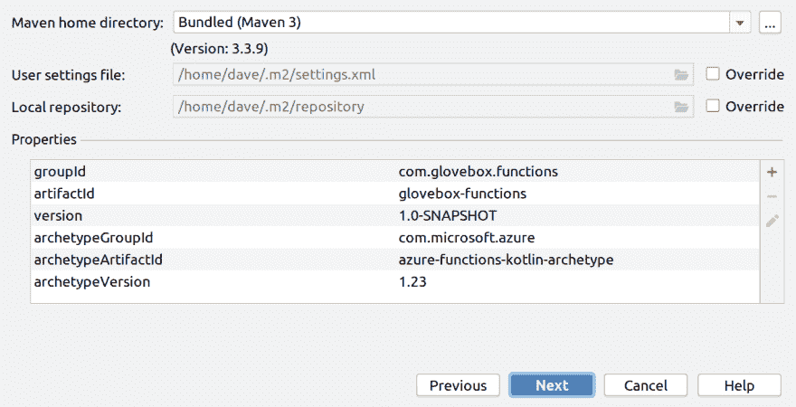T5】

7.  确认项目名称和位置，选择**完成**。
    [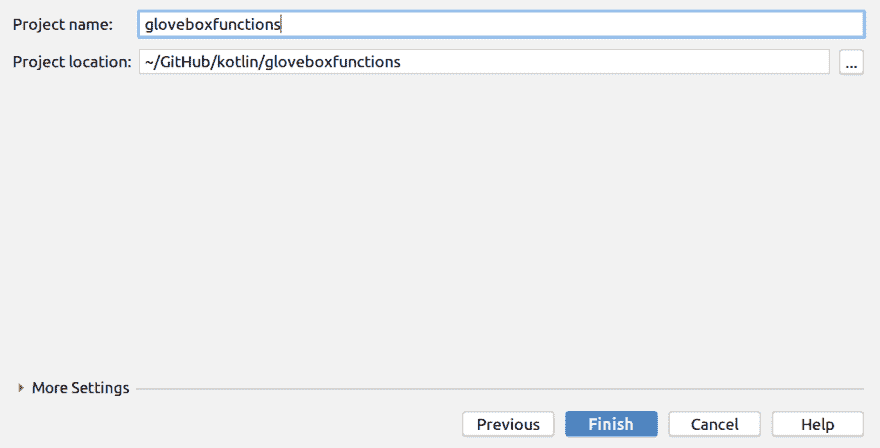](https://res.cloudinary.com/practicaldev/image/fetch/s--Xzip6dgI--/c_limit%2Cf_auto%2Cfl_progressive%2Cq_auto%2Cw_880/https://raw.githubusercontent.com/gloveboxes/Create-a-Kotlin-Azure-Function-with-IntelliJ/master/resources/create-new-project-confirmation.png) 
    项目结构将被创建。

Maven 在一个新文件夹中创建项目文件，其名称与项目 *ArtifactId* 值相同。项目生成的代码是一个简单的 [HTTP 触发的](https://docs.microsoft.com/en-us/azure/azure-functions/functions-bindings-http-webhook?WT.mc_id=devto-blog-dglover)函数，它回显触发 HTTP 请求的主体。

## 4。启用自动导入

[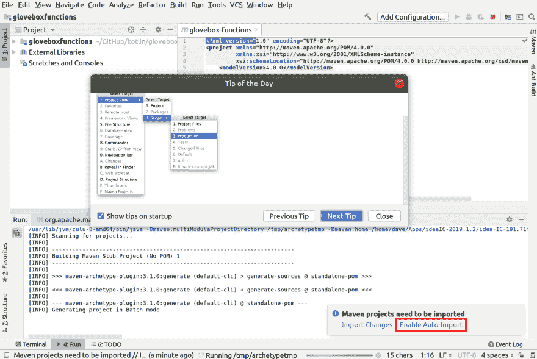](https://res.cloudinary.com/practicaldev/image/fetch/s--w62uKvhC--/c_limit%2Cf_auto%2Cfl_progressive%2Cq_auto%2Cw_880/https://raw.githubusercontent.com/gloveboxes/Create-a-Kotlin-Azure-Function-with-IntelliJ/master/resources/create-new-project-enable-auto-import.png)

## 5。天蓝色配置

默认情况下，创建项目时会打开 pom.xml 文件。

您可以在 pom.xml 文件中更改以下项目属性

1.  Azure 功能应用名称
2.  Azure 功能应用程序区域

运行以下命令获取完整的区域列表。通过返回的 JSON 数组中的“name”字段选择位置。

```
az account list-locations 
```

[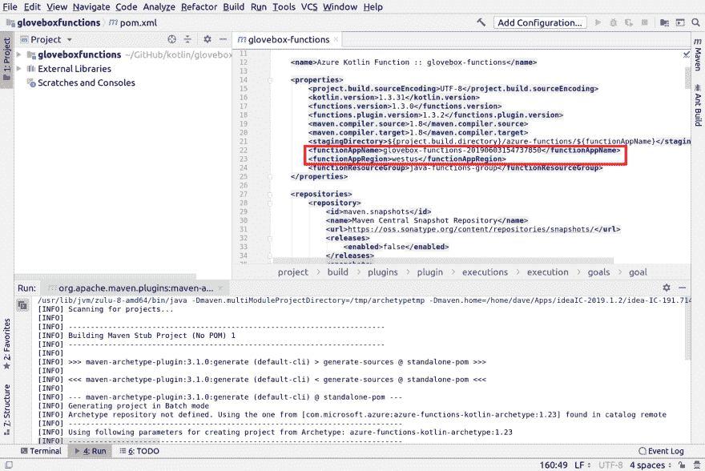](https://res.cloudinary.com/practicaldev/image/fetch/s--y-aWlj8R--/c_limit%2Cf_auto%2Cfl_progressive%2Cq_auto%2Cw_880/https://raw.githubusercontent.com/gloveboxes/Create-a-Kotlin-Azure-Function-with-IntelliJ/master/resources/create-new-project-skelton.png)

## 6。打开默认的 Http 触发器

Azure Functions Maven 原型将创建一个示例 Http 触发器。您将通过导航 **src** 项目目录找到它。

[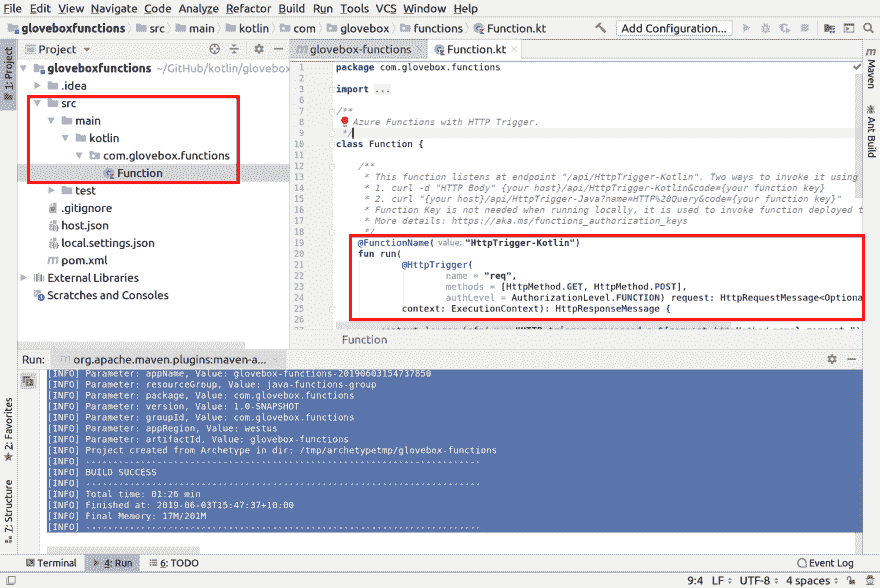](https://res.cloudinary.com/practicaldev/image/fetch/s--_GqAW48w--/c_limit%2Cf_auto%2Cfl_progressive%2Cq_auto%2Cw_880/https://raw.githubusercontent.com/gloveboxes/Create-a-Kotlin-Azure-Function-with-IntelliJ/master/resources/project-default-http-trigger.png)

## 7。清理并打包项目

从 Maven 弹出选项卡中，展开**生命周期**，然后运行**清理**，接着运行**打包**命令。这将构建 Kotlin 项目。

[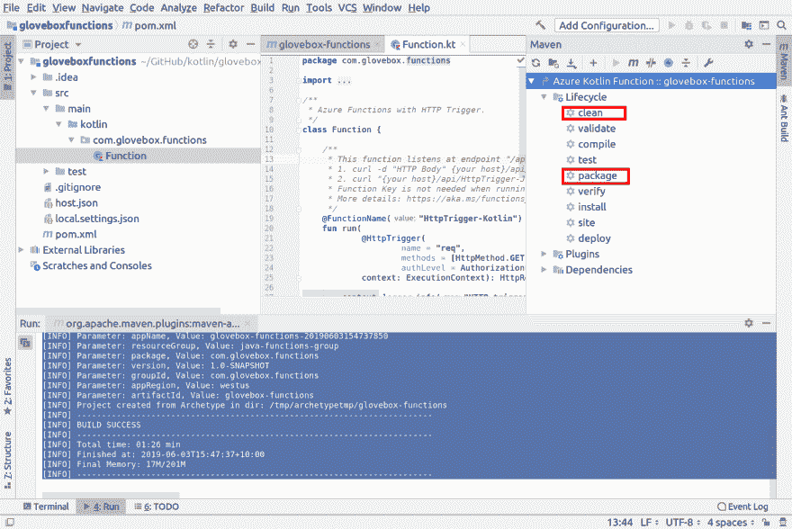](https://res.cloudinary.com/practicaldev/image/fetch/s--J2q2UFYf--/c_limit%2Cf_auto%2Cfl_progressive%2Cq_auto%2Cw_880/https://raw.githubusercontent.com/gloveboxes/Create-a-Kotlin-Azure-Function-with-IntelliJ/master/resources/project-clean-package.png)

## 8。执行 Azure 功能运行

从 Maven 弹出标签中，展开**插件**，然后展开**azure-功能**，再选择**azure-功能:运行**。这将启动 Azure Functions 核心工具并引导你的 Kotlin Azure 函数。

要测试该功能，请单击[http://localhost:7071/API/http trigger-kot Lin](http://localhost:7071/api/HttpTrigger-Kotlin)链接

[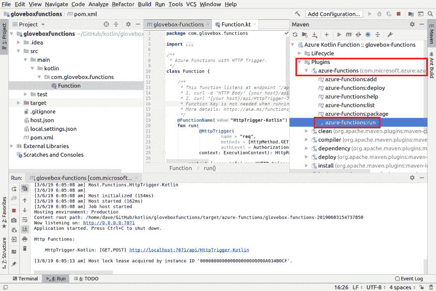](https://res.cloudinary.com/practicaldev/image/fetch/s--Z-6WSU_x--/c_limit%2Cf_auto%2Cfl_progressive%2Cq_auto%2Cw_880/https://raw.githubusercontent.com/gloveboxes/Create-a-Kotlin-Azure-Function-with-IntelliJ/master/resources/project-azure-functions-run.png)

**提示**:该函数在端口 7071 上名为 **func** 的本地进程的上下文中运行。有时这个过程不能正常结束。如果发生这种情况，那么下次运行该函数时，它会报错端口 7071 已经打开。您需要从操作系统的任务/进程管理器中手动关闭**功能**进程。

## 9。在查询字符串上传递一个参数

在浏览器中，将名称参数添加到查询字符串中。比如[http://localhost:7071/API/http trigger-kot Lin？name=dave](http://localhost:7071/api/HttpTrigger-Kotlin?name=dave) 您将看到网页回显传入的 name 值。

[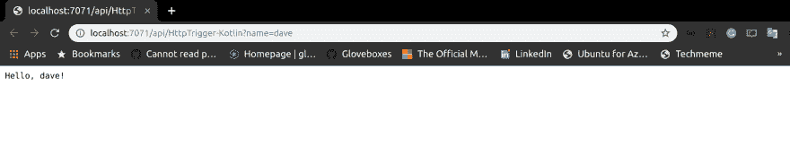](https://res.cloudinary.com/practicaldev/image/fetch/s--LMCWkqa0--/c_limit%2Cf_auto%2Cfl_progressive%2Cq_auto%2Cw_880/https://raw.githubusercontent.com/gloveboxes/Create-a-Kotlin-Azure-Function-with-IntelliJ/master/resources/project-test-http-trigger.png)

或者，您可以在新的终端窗口中使用 curl 从命令行触发该功能:

```
curl -w '\n' -d Dave http://localhost:7071/api/HttpTrigger-Kotlin 
```

## 10。停止功能

单击停止图标停止运行该功能。

[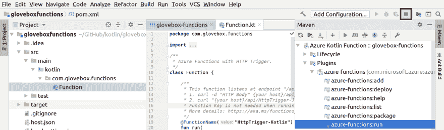](https://res.cloudinary.com/practicaldev/image/fetch/s--QIwDMe4q--/c_limit%2Cf_auto%2Cfl_progressive%2Cq_auto%2Cw_880/https://raw.githubusercontent.com/gloveboxes/Create-a-Kotlin-Azure-Function-with-IntelliJ/master/resources/project-azure-functions-stop.png)

## 11。启用调试

鼠标右键点击 **azure-functions:运行** Maven 原型并选择**创建‘手套箱-功能’...**

[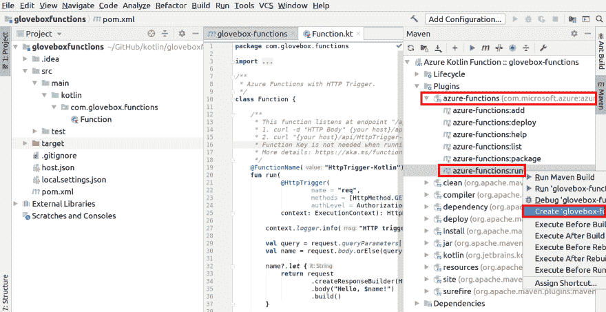](https://res.cloudinary.com/practicaldev/image/fetch/s--BU87-eH_--/c_limit%2Cf_auto%2Cfl_progressive%2Cq_auto%2Cw_880/https://raw.githubusercontent.com/gloveboxes/Create-a-Kotlin-Azure-Function-with-IntelliJ/master/resources/project-enable-debug-azure-function-maven-debug.png)

## 12。创建运行/调试配置

1.  重命名配置以突出显示**包**将在 azure-functions:run 之前运行。
2.  将 **-DenableDebug** 添加到命令行。

[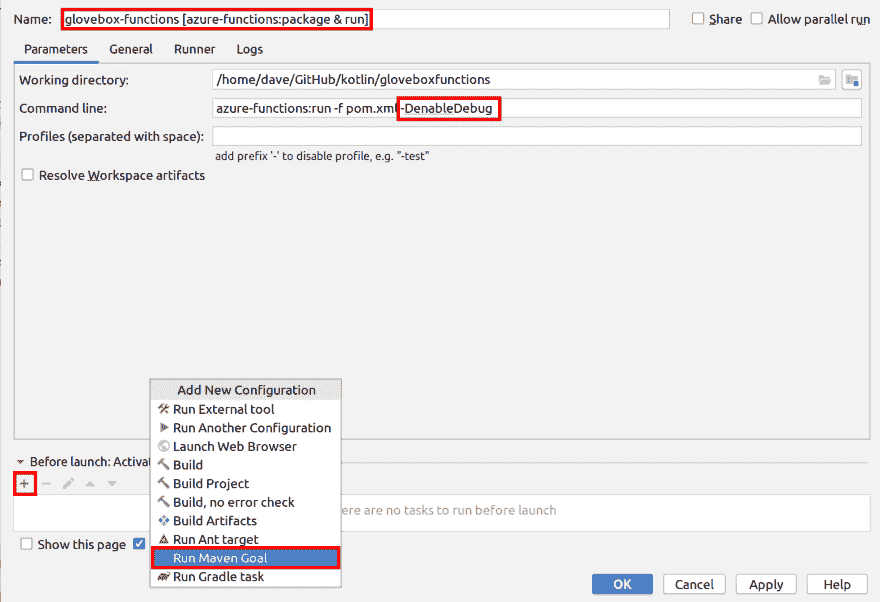](https://res.cloudinary.com/practicaldev/image/fetch/s--m6ziYrH3--/c_limit%2Cf_auto%2Cfl_progressive%2Cq_auto%2Cw_880/https://raw.githubusercontent.com/gloveboxes/Create-a-Kotlin-Azure-Function-with-IntelliJ/master/resources/project-enable-debug-azure-function-maven-debug-configure.png)

添加**包**

[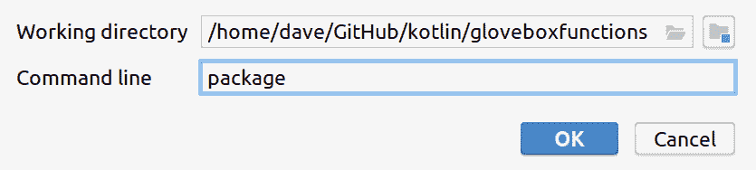](https://res.cloudinary.com/practicaldev/image/fetch/s--9T_55cbS--/c_limit%2Cf_auto%2Cfl_progressive%2Cq_auto%2Cw_880/https://raw.githubusercontent.com/gloveboxes/Create-a-Kotlin-Azure-Function-with-IntelliJ/master/resources/project-run-edit-configurations-add-package.png)

点击**确定**。

[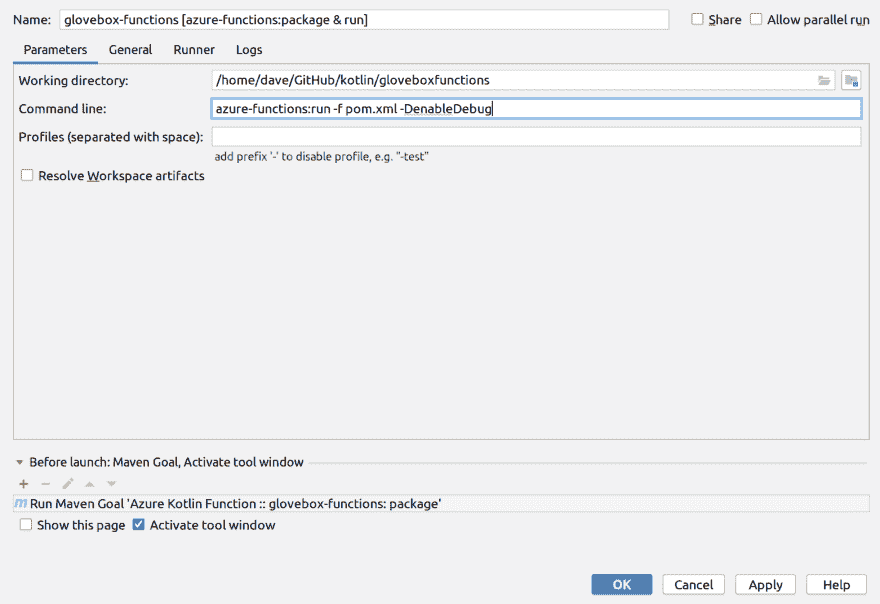](https://res.cloudinary.com/practicaldev/image/fetch/s--jnxjQWtl--/c_limit%2Cf_auto%2Cfl_progressive%2Cq_auto%2Cw_880/https://raw.githubusercontent.com/gloveboxes/Create-a-Kotlin-Azure-Function-with-IntelliJ/master/resources/project-run-edit-configurations-completed.png)

点击**确定**

## 13。启用 JVM 调试器附加

从**运行**菜单，选择**编辑配置**

[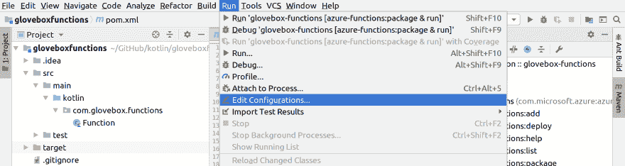](https://res.cloudinary.com/practicaldev/image/fetch/s--uRE9g0Pt--/c_limit%2Cf_auto%2Cfl_progressive%2Cq_auto%2Cw_880/https://raw.githubusercontent.com/gloveboxes/Create-a-Kotlin-Azure-Function-with-IntelliJ/master/resources/project-run-edit-configurations.png)

## 14。添加新配置

点击 **+** 符号，然后选择**遥控**。

[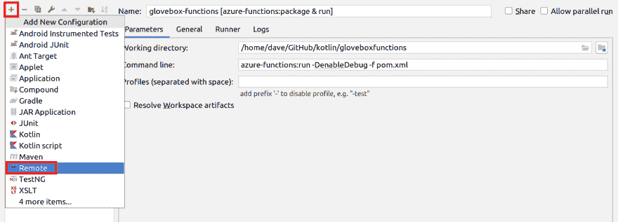](https://res.cloudinary.com/practicaldev/image/fetch/s--khc0Nvds--/c_limit%2Cf_auto%2Cfl_progressive%2Cq_auto%2Cw_880/https://raw.githubusercontent.com/gloveboxes/Create-a-Kotlin-Azure-Function-with-IntelliJ/master/resources/project-run-edit-configurations-add-remote-config.png)

## 15。命名新配置

在这种情况下，该配置被命名为**附加调试器**

[](https://res.cloudinary.com/practicaldev/image/fetch/s--XJz7oJOV--/c_limit%2Cf_auto%2Cfl_progressive%2Cq_auto%2Cw_880/https://raw.githubusercontent.com/gloveboxes/Create-a-Kotlin-Azure-Function-with-IntelliJ/master/resources/project-run-edit-configurations-add-remote-attach-debugger.png)

点击**确定**

## 16。在 Kotlin Azure 函数源码中设置断点

[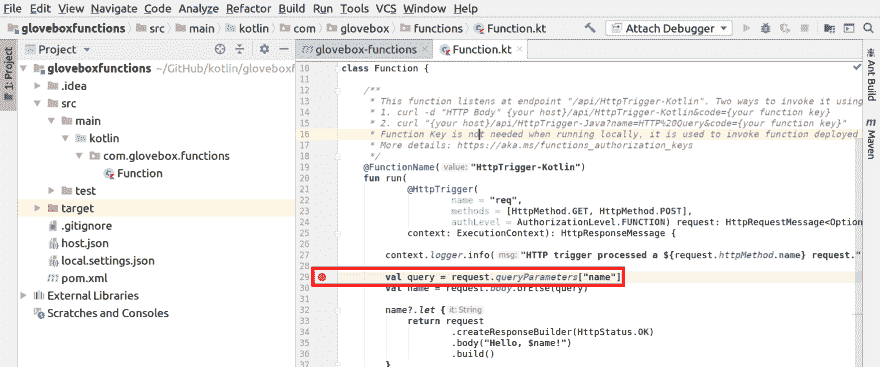](https://res.cloudinary.com/practicaldev/image/fetch/s--5z48qMTE--/c_limit%2Cf_auto%2Cfl_progressive%2Cq_auto%2Cw_880/https://raw.githubusercontent.com/gloveboxes/Create-a-Kotlin-Azure-Function-with-IntelliJ/master/resources/project-debug-set-breakpoint.png)

## 17。运行调试器启用配置

从**运行/调试配置选择器**中选择 Maven azure-functions:运行配置。然后单击绿色的开始图标或按 Shift+F10。

[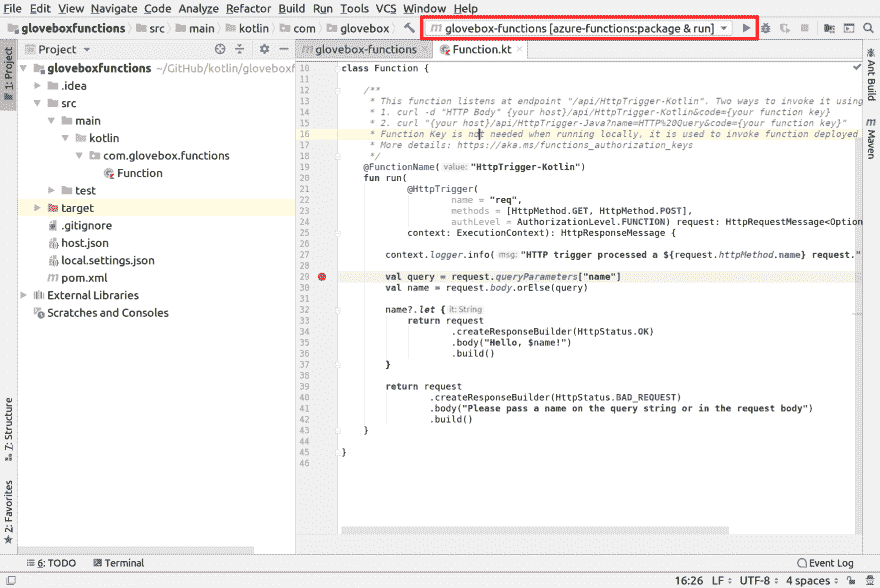](https://res.cloudinary.com/practicaldev/image/fetch/s--P6MsDK1y--/c_limit%2Cf_auto%2Cfl_progressive%2Cq_auto%2Cw_880/https://raw.githubusercontent.com/gloveboxes/Create-a-Kotlin-Azure-Function-with-IntelliJ/master/resources/project-debug-run-debug-enabled-maven.png)

## 18。附上调试器

从**运行/调试配置选择器**中选择**附加调试器**配置，点击绿色启动调试器图标或按 Shift+F9。

[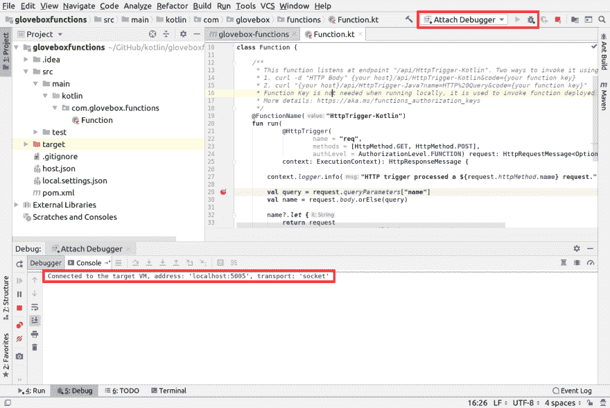](https://res.cloudinary.com/practicaldev/image/fetch/s--wtjH6l2z--/c_limit%2Cf_auto%2Cfl_progressive%2Cq_auto%2Cw_880/https://raw.githubusercontent.com/gloveboxes/Create-a-Kotlin-Azure-Function-with-IntelliJ/master/resources/project-debug-debugger-attached.png)

## 19。在调试模式下启动 Http 触发器

1.  选择**运行**选项卡。

2.  点击[http://localhost:7071/API/Http Trigger-Kotlin](http://localhost:7071/api/HttpTrigger-Kotlin)链接，启动 Http 触发器。

[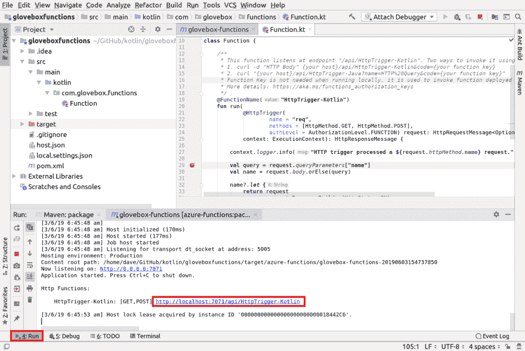](https://res.cloudinary.com/practicaldev/image/fetch/s--ftOcQiiM--/c_limit%2Cf_auto%2Cfl_progressive%2Cq_auto%2Cw_880/https://raw.githubusercontent.com/gloveboxes/Create-a-Kotlin-Azure-Function-with-IntelliJ/master/resources/project-debug-switch-to-run.png)

## 20。用调试器单步调试 Http 触发器 Azure 函数

使用调试器控件，逐句通过 Azure 函数代码。

[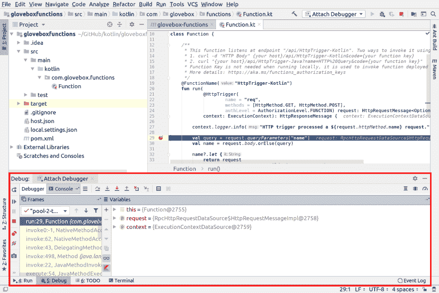](https://res.cloudinary.com/practicaldev/image/fetch/s--xFrrNmq0--/c_limit%2Cf_auto%2Cfl_progressive%2Cq_auto%2Cw_880/https://raw.githubusercontent.com/gloveboxes/Create-a-Kotlin-Azure-Function-with-IntelliJ/master/resources/project-debug-step-through-code.png)

## 21。停止调试器和 Azure 功能

单击停止图标分离调试器并停止 Azure 功能

[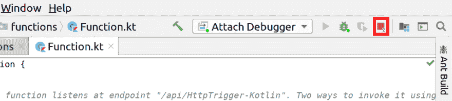](https://res.cloudinary.com/practicaldev/image/fetch/s--pVcoAwfp--/c_limit%2Cf_auto%2Cfl_progressive%2Cq_auto%2Cw_880/https://raw.githubusercontent.com/gloveboxes/Create-a-Kotlin-Azure-Function-with-IntelliJ/master/resources/project-debugger-stop.png)

## 22。添加新的 Azure 函数触发器

[azure-functions:添加](https://docs.microsoft.com/en-us/java/api/overview/azure/maven/azure-functions-maven-plugin/readme?view=azure-java-stable#azure-functionsadd&WT.mc_id=devto-blog-dglover)

azure-functions:add Maven 原型支持以下触发器类型。

*   HTTP 触发器
*   Azure 存储 Blob 触发器
*   Azure 存储队列触发器
*   定时器触发器
*   事件网格触发器
*   事件中心触发器
*   Cosmos DB 触发器
*   服务总线队列触发器
*   服务总线主题触发器

从 Maven 弹出菜单中的插件下，选择 **azure-functions:add**

[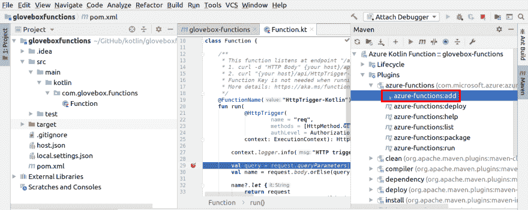](https://res.cloudinary.com/practicaldev/image/fetch/s--JdGW5k3J--/c_limit%2Cf_auto%2Cfl_progressive%2Cq_auto%2Cw_880/https://raw.githubusercontent.com/gloveboxes/Create-a-Kotlin-Azure-Function-with-IntelliJ/master/resources/azure-function-add.png)

## 23。将 Kotlin Azure 功能部署到 Azure

[azure-功能:部署](https://docs.microsoft.com/en-us/java/api/overview/azure/maven/azure-functions-maven-plugin/readme?view=azure-java-stable#azure-functionsdeploy&WT.mc_id=devto-blog-dglover)

将暂存目录部署到目标 Azure 功能。如果目标 Azure Functions 尚不存在，将会创建它。

[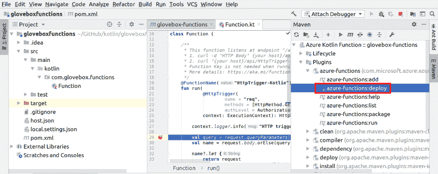](https://res.cloudinary.com/practicaldev/image/fetch/s--uY26gKYF--/c_limit%2Cf_auto%2Cfl_progressive%2Cq_auto%2Cw_880/https://raw.githubusercontent.com/gloveboxes/Create-a-Kotlin-Azure-Function-with-IntelliJ/master/resources/azure-function-deploy.png)

## 祝贺你

你已经创建了你的第一个基于 Kotlin 的 Azure 函数

[](https://res.cloudinary.com/practicaldev/image/fetch/s---Ky_kICb--/c_limit%2Cf_auto%2Cfl_progressive%2Cq_auto%2Cw_880/https://raw.githubusercontent.com/gloveboxes/Create-a-Kotlin-Azure-Function-with-IntelliJ/master/resources/congratulations.jpg)

## 接下来

试用[使用 Kotlin Azure 功能和 SignalR 构建无服务器物联网解决方案](https://dev.to/azure/building-a-serverless-iot-solution-with-kotlin-azure-functions-and-signalr-2lpg)

[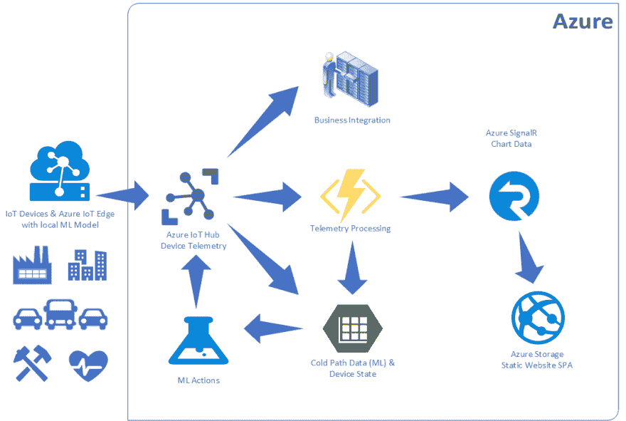](https://res.cloudinary.com/practicaldev/image/fetch/s--QEScOovI--/c_limit%2Cf_auto%2Cfl_progressive%2Cq_auto%2Cw_880/https://raw.githubusercontent.com/gloveboxes/Create-a-Kotlin-Azure-Function-with-IntelliJ/master/resources/iot-solution-architecture.png)