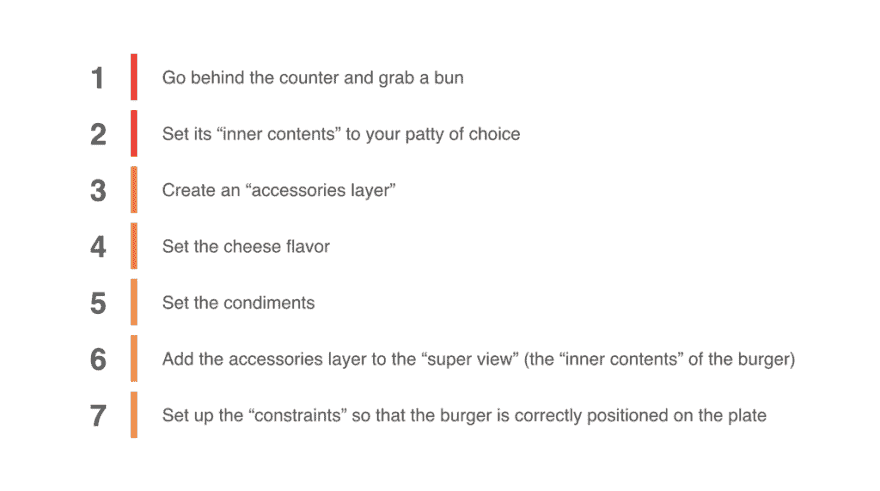
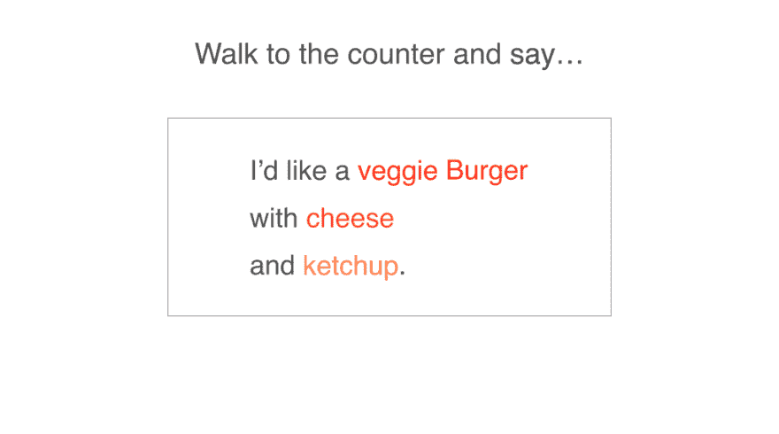

# SwiftUI 是声明性的。那是什么意思？

> 原文：<https://dev.to/andrewcbancroft/swiftui-is-declarative-what-does-that-mean-4eek>

“声明性”是 Swift UI 的四个核心原则之一。

除了理所当然地认为声明性只是比*或其他什么*更“好”之外，用视觉来理解声明性思维方式怎么样？

想象你自己在一家餐馆里(无论是坐下来吃饭还是吃快餐)。

当你想吃汉堡时，哪一项最能描述你的行为？

或者…

说**你想要什么**(也就是“声明性的”)是你在餐馆最有可能做的事情。

这正是您在使用 SwiftUI 时使用的方法。

## 总结

