# 如何在聊天信息服务中使用 SMS

> 原文：<https://dev.to/nickparsons/how-to-use-sms-with-a-chat-messaging-service-1jem>

我们这个时代的交流是支离破碎的。一些最受欢迎的交流媒介已经朝着迎合非常特定的最终用户的方向发展，并且创建了一个“秘密俱乐部”,你可以说，联系开始变得越来越困难。我们有 [Facebook Messenger](https://messenger.facebook.com) 和 [WhatsApp](https://www.whatsapp.com/) ，苹果专有的 iMessage 和谷歌的 Messages，然后还有 [Slack](https://slack.com) ，针对志同道合的社区和商业用例，仅举几例。

在[流](https://getstream.io/chat/)的时候，我们认为是时候重新开始统一人们了。在 T2，像脸书这样的平台正努力将一些媒体，如短信和 Facebook Messenger 整合到一起，但是这种结合通常很尴尬，也没有什么吸引力😬(老实说，谁想让脸书控制我们生活中的更多事情，甚至是*？).*

Stream 的聊天信息服务通过使用 webhooks 来实现灵活性，让**你**决定你希望如何将人们聚集在一起，以及你的数据应该如何流动。有了 webhooks，开发者就可以利用我们的消息服务来构建他们所能想到的任何交流平台。所以，很自然地，我心想，“我能想象出什么样的*？🤔*

 *在分析了我的习惯后，我意识到我经常错过重要的 Slack 消息，只是因为推送通知并不总是能引起我的注意(例如，如果我在电脑上打开了 Slack，但我已经离开了它，我有时会错过重要的通知)。另一方面，我经常检查我的短信，以确保我没有错过最新和最棒的群组对话。👯‍

就在那时，我灵光一现。

💡我想在聊天服务和短信之间架起一座桥梁。而且，通过使用 [Stream Chat 的 webhooks](https://getstream.io/chat/docs/#webhooks) 和 [Twilio 的 SMS](https://www.twilio.com/sms) 功能，这个问题似乎不再是一个挑战，而是一个有趣的难题。

在本教程中，我将详细说明我是如何构建一个由 Twilio 和 Stream Chat 支持的双向聊天的。为了让它更刺激，我将引用 Kanye West 的话(来自 [https://kanye.rest](https://kanye.rest/) 😎)的自动回复机器人，我决定在项目中建立。

下面先睹为快，看看项目结束时你会得到什么(左边是网络界面，右边是我的手机短信):

[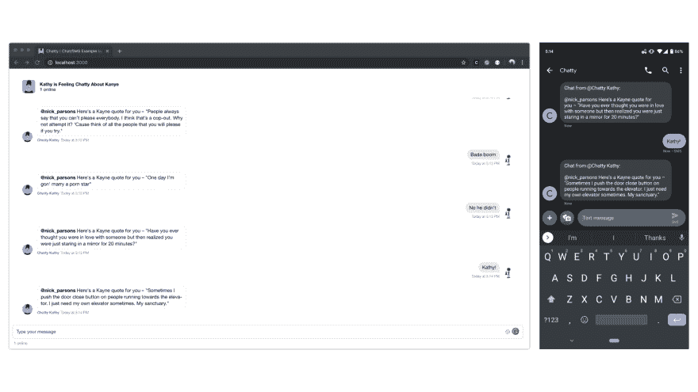](https://res.cloudinary.com/practicaldev/image/fetch/s--fKvXzgYy--/c_limit%2Cf_auto%2Cfl_progressive%2Cq_auto%2Cw_880/https://cdn-images-1.medium.com/max/3840/1%2AG0HG4MBmoEq6mW48kMkePw.png)

**先决条件**:

*   [无服务器](https://serverless.com)

*   [Ngrok](https://ngrok.com/)

*   JavaScript 体验

*   Node.js(最好是最新版本)

*   [纱线](https://yarnpkg.com)或 npm

*   MongoDB 本地或具有 [MongoDB Atlas](https://atlas.mongodb.com) 的帐户

    > *如果你想跳过本教程，尝试一下这项被称为“聊天”的服务，你可以通过访问网上的**【https://chatty-kathy.netlify.com】**并向**702–820–5110**发送短信“**开始**”来实现。*

**目录**:

1.  创建一个免费的流聊天试用

2.  创建一个 Twilio 短信帐户

3.  从 GitHub 克隆 Web Repo

4.  设置 MongoDB

5.  从 GitHub 克隆无服务器 Repo

6.  去营救吧

7.  启动无服务器 Lambda

8.  配置 Twilio SMS 网站

## 1。创建一个免费的流聊天试用💬

流聊天一般是付费服务；然而，Stream 提供 14 天免费试用，不需要信用卡。我们将使用这个免费试用版来构建我们的应用程序。

前往[https://getstream.io/chat](https://getstream.io/chat)，点击底部附近的“开始试用”按钮(就在 UI 套件上方)。

然后，按照步骤设置您的帐户。一旦完成配置，就前往位于[https://getstream.io/dashboard](https://getstrea.io/dashboard)的仪表板，创建一个应用程序——任何名称都可以，但请尽情享受乐趣，让它个性化吧！

[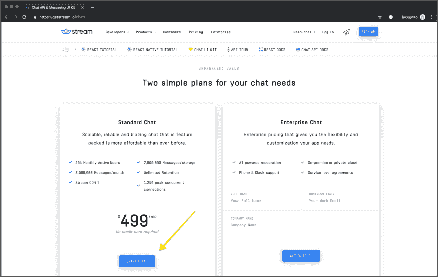](https://res.cloudinary.com/practicaldev/image/fetch/s--epIcmERj--/c_limit%2Cf_auto%2Cfl_progressive%2Cq_auto%2Cw_880/https://cdn-images-1.medium.com/max/3260/1%2AVFs-97nXWDZUfOKovkl2pw.png)

创建应用程序后，单击应用程序名称。默认视图是“Feeds ”,因此请通过单击顶部的链接导航到“Chat”部分。

[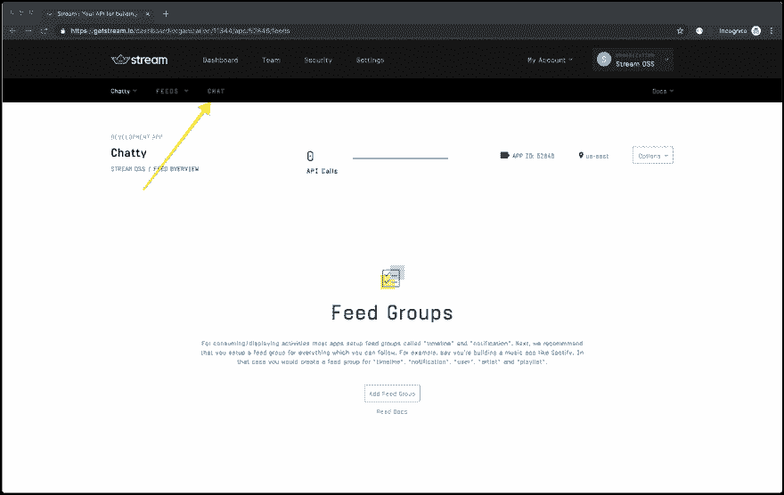](https://res.cloudinary.com/practicaldev/image/fetch/s--KMAPLxBA--/c_limit%2Cf_auto%2Cfl_progressive%2Cq_auto%2Cw_880/https://cdn-images-1.medium.com/max/3260/1%2ApI8fn7h3wyDWMabmQCUMMg.png)

一旦你进入你的组织的聊天部分，收集**应用访问密钥**部分下的**密钥**和**秘密**——你会想要保留这些密钥，因为你在后面的部分会需要它们。

## 2。创建一个 Twilio 短信帐户📱

为了使这一部分简短，我将把创建 Twilio 帐户的任务交给您。此链接将为您指出正确的方向。一旦你设置了你的账户，记下你的 **SID** 和**授权令牌**，这两个都可以在 Twilio 仪表盘上找到。

> 对此，试算表是绰绰有余的。没有必要输入你的信用卡或购买一个号码，除非你想延长本教程。

[](https://res.cloudinary.com/practicaldev/image/fetch/s--5Tls87dv--/c_limit%2Cf_auto%2Cfl_progressive%2Cq_auto%2Cw_880/https://cdn-images-1.medium.com/max/3260/1%2AC_OtCTDJmMkJYGlwj60RAg.png)

## 3。从 GitHub ⌨克隆 Web Repo

要开始使用 Chatty，让我们从 GitHub 克隆 web repo。这将在样式、设置身份验证、视图等方面为我们节省很多步骤。确保您在一个工作目录中，并运行以下命令:

```
$ git clone https://github.com/GetStream/stream-chat-chatty-web web 
```

Enter fullscreen mode Exit fullscreen mode

克隆完成后，进入 web 目录并运行 yarn:

```
$ cd web && yarn 
```

Enter fullscreen mode Exit fullscreen mode

现在，创建您的`.env`文件，并将以下内容放入您的环境文件中(填充了一些变量，但我们会在过程中处理其余的内容):

```
REACT_APP_STREAM_KEY=YOUR_STREAM_KEY
REACT_APP_AUTH_ENDPOINT=YOUR_AUTH_ENDPOINT
REACT_APP_TWILIO_NUMBER=YOUR_TWILIO_NUMBER
REACT_APP_CHANNEL_TYPE=messaging
REACT_APP_CHANNEL_NAME=chatty-kathy 
```

Enter fullscreen mode Exit fullscreen mode

## 4。设置 MongoDB 🕹

对于这一步，您有两种选择。如果你运行的是 macOS，安装和运行 MongoDB 最简单的方法是使用下面的命令安装 MongoDB 和[家酿](https://brew.sh/) :

```
$ brew install mongodb 
```

Enter fullscreen mode Exit fullscreen mode

后面跟着这个命令来启动它:

```
$ brew services start mongodb 
```

Enter fullscreen mode Exit fullscreen mode

运行时，可以连接到本地运行的数据库服务器，默认端口:

```
mongodb://localhost 
```

Enter fullscreen mode Exit fullscreen mode

如果你被卡住了，MongoDB 在他们的网站上提供了一套很棒的指令。

> 或者，您可以使用 MongoDB Atlas 创建一个帐户。MongoDB Atlas 将免费处理所有必要的设置和基础设施。你可以在 https://atlas.mongodb.com 注册 MongoDB Atlas。

## 5。从 github 克隆无服务器 Repo

我们将使用 AWS Lambda 来处理来自 Stream 和 Twilio 的传入 webhooks，用于聊天消息和 SMS。

为此，我们将使用无服务器在本地运行 AWS Lambda。首先，使用以下命令克隆 repo:

```
$ git clone git@github.com:GetStream/stream-chat-chatty-serverless.git serverless 
```

Enter fullscreen mode Exit fullscreen mode

接下来，进入`serverless`目录并运行 yarn 来安装依赖项:

```
$ cd serverless && yarn 
```

Enter fullscreen mode Exit fullscreen mode

然后，您将希望在您的`serverless.yml`文件中处理一些缺失的环境变量。在`serverless`目录下，打开`serverless.yml`文件，相应地编辑 yaml 的环境块:

```
environment:
    DB_CONN: YOUR_MONGODB_CONNECTION_STRING
    DB_NAME: CHATTY
    DB_COL: users
    TWILIO_SID: YOUR_TWILIO_SID
    TWILIO_TOKEN: YOUR_TWILIO_TOKEN
    TWILIO_NUMBER: YOUR_TWILIO_NUMBER
    STREAM_KEY: YOUR_STREAM_KEY
    STREAM_SECRET: YOUR_STREAM_SECRET
    CHANNEL_TYPE: messaging
    CHANNEL_NAME: chatty-kathy 
```

Enter fullscreen mode Exit fullscreen mode

## 6。去营救🕵

如果你对 ngrok 不熟悉，你应该花点时间去看看他们在[https://ngrok.com](https://ngrok.com)的网站。简而言之，这是一个真正令人敬畏的服务，它将你的本地服务器(在防火墙后面)向公共互联网开放。

例如，我们将在下一节本地启动我们的无服务器 Lambda 函数。Ngrok 将允许我们绑定到一个端口(我们特定的 Lambda 将在端口 8000 上运行)并返回一个可公开访问的 URL。我们将使用这个 URL 来允许来自 Stream Chat 和 Twilio 的网络链接。

如果你没有安装 ngrok，可以在这里下载[。Ngrok 运行在多个操作系统上，所以如果你没有运行 macOS 也没关系。安装完成后，在您的终端中运行以下命令来绑定到端口 8000:](https://ngrok.com/download) 

```
$ ngrok http 8000 
```

Enter fullscreen mode Exit fullscreen mode

如果一切顺利，您应该会看到以下屏幕，其中包含一个可公开访问的 URL(HTTP 和 HTTPS):

[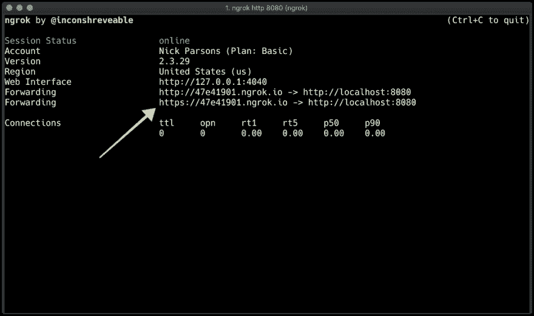](https://res.cloudinary.com/practicaldev/image/fetch/s--FrRadgl7--/c_limit%2Cf_auto%2Cfl_progressive%2Cq_auto%2Cw_880/https://cdn-images-1.medium.com/max/2076/1%2ANsmbWPS1tkq7qq0iY0C6cA.png)

现在您已经启动了 ngrok，它将侦听任何到端口 8000 的传入连接，而不管服务器是否已经启动和运行。也就是说，让我们继续前进，这样我们就可以在本地使用无服务器离线启动我们的 Lambda。

## 7。启动无服务器 Lambda🐑

将 repo 克隆到`serverless`目录并安装了我们的依赖项后，移动到`serverless`目录(注意，您需要在一个新的选项卡中这样做，以便 ngrok 保持运行并监听端口 8000)并运行命令`yarn start`。您应该会在终端中看到如下所示的输出:

[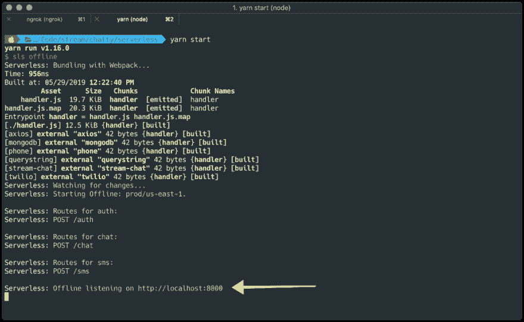](https://res.cloudinary.com/practicaldev/image/fetch/s--ZLJ3Yh9r--/c_limit%2Cf_auto%2Cfl_progressive%2Cq_auto%2Cw_880/https://cdn-images-1.medium.com/max/2076/1%2A6qsKkT7K0yBsRSUM3GBykQ.png)

你的 Lambda 现在已经启动并运行了！

让我们在接下来的两节中配置我们的 webhooks

## 8。配置流聊天 Webhook🎣

回到[https://getstream.io/dashboard](https://getstream.io/dashboard)，点击“聊天”标签。向下滚动到“聊天事件”部分，并将 webhook 切换设置为“活动”。

对于 Webhook 网址，一定要在你的 ngrok HTTPS 网址后面加上`/chat`(例如，我的聊天 ngrok 网址是`https://47e41901.ngrok.io/chat`)。这将确保正确的处理程序收到您的聊天消息。

点击右上角的“保存”按钮。

[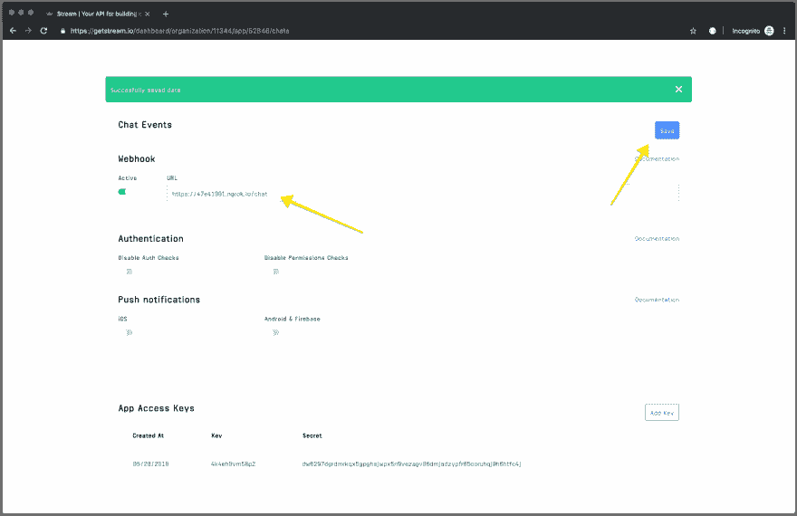](https://res.cloudinary.com/practicaldev/image/fetch/s--iJUU6ctd--/c_limit%2Cf_auto%2Cfl_progressive%2Cq_auto%2Cw_880/https://cdn-images-1.medium.com/max/3318/1%2AmhEqf5wD3N-hXZWGzCYfNg.png)

接下来，我们将配置 Twilio。

## 9。配置 Twilio SMS Webhook📲

因为我们没有配置项目，所以您需要这样做。回到 Twilio 仪表盘，点击“可编程短信”标签(在左边第二个)。

[](https://res.cloudinary.com/practicaldev/image/fetch/s--XhyYIzxQ--/c_limit%2Cf_auto%2Cfl_progressive%2Cq_auto%2Cw_880/https://cdn-images-1.medium.com/max/3318/1%2AqqrRIalLHJTxBuY1Jkb3Tw.png)

接下来，点击“短信”,然后创建一个新项目。我的叫做“聊天”，所以我已经配置了一个。应该会有一个红色的“+”大按钮，把你送到正确的方向。

[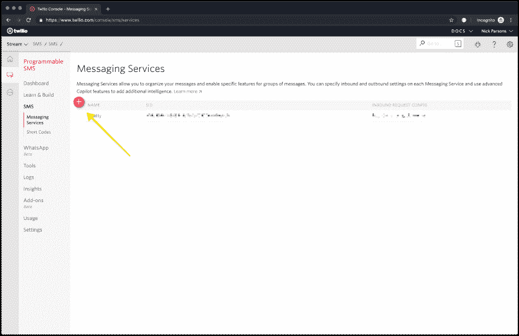](https://res.cloudinary.com/practicaldev/image/fetch/s--hSBS1sdl--/c_limit%2Cf_auto%2Cfl_progressive%2Cq_auto%2Cw_880/https://cdn-images-1.medium.com/max/3318/1%2AbxHHpz9wVMezskJHFT86og.png)

运行配置步骤，并使用**聊天机器人/双向互动**作为您的用例。然后，在“入站设置”下，指定您的 ngrok URL，在末尾加上`/sms`(例如，我的 ngrok 出站 HTTP POST 请求 URL 是`https://47e41901.ngrok.io/sms`。

[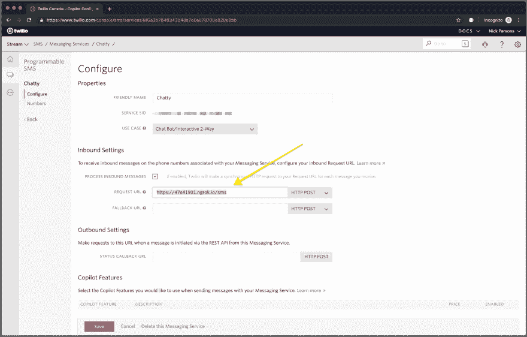](https://res.cloudinary.com/practicaldev/image/fetch/s--_bN6psh0--/c_limit%2Cf_auto%2Cfl_progressive%2Cq_auto%2Cw_880/https://cdn-images-1.medium.com/max/3318/1%2A-QvUNMRgsfQK6MLyuk-F2Q.png)

> 确保选中“处理入站邮件”复选框以启用 webhooks。

仅此而已！让我们继续…

## 10。Web 环境配置🌎

现在我们几乎已经准备好了配置所需的一切，让我们继续为我们的 web 环境变量更新我们的`.env`文件。

打开`.env`文件，放入您的 Stream、Twilio 和 auth route(如`https://47e41901.ngrok.io/auth`)凭证。

一旦完成，您就可以使用`yarn start`命令启动应用程序了！

[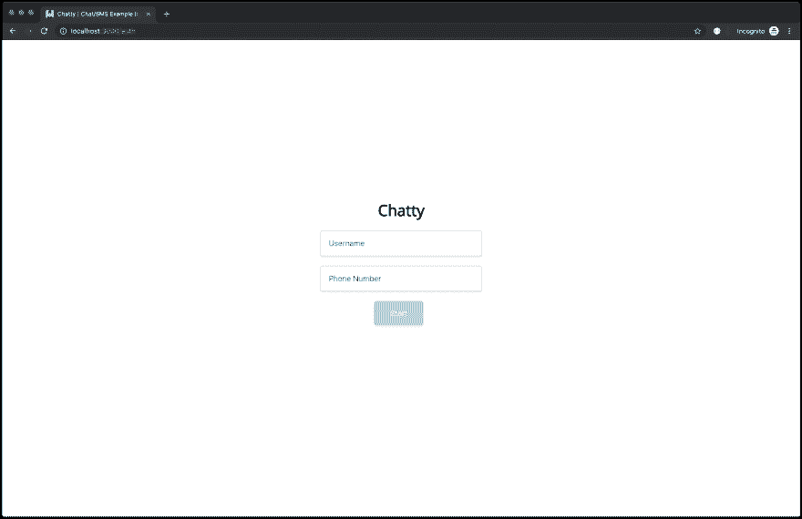](https://res.cloudinary.com/practicaldev/image/fetch/s--mcUxu2C4--/c_limit%2Cf_auto%2Cfl_progressive%2Cq_auto%2Cw_880/https://cdn-images-1.medium.com/max/3318/1%2A_Y6tNJGEW4qYw9zawygxIg.png)

如果一切顺利，您应该会看到一个简单的登录屏幕，在这里您可以输入您的用户名和电话号码。输入您的信息并点击“开始”，您将看到一个聊天屏幕，您可以在那里聊天。如果你幸运的话，机器人凯西甚至可能会引用坎耶·韦斯特的一些有趣的话。

[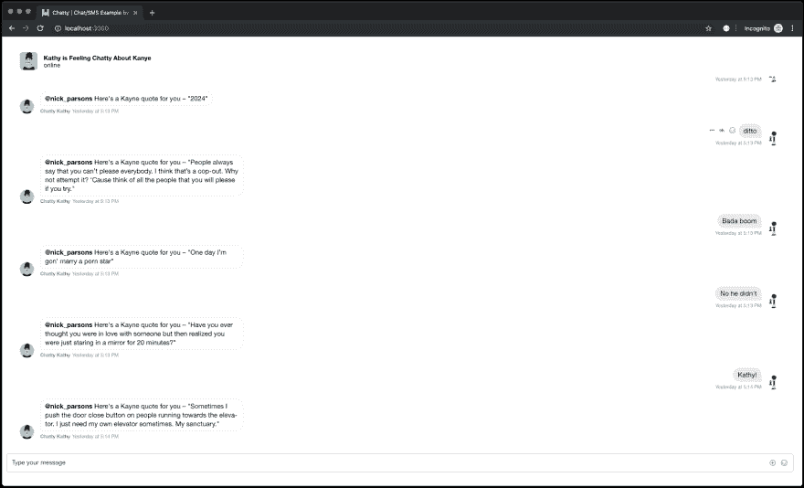](https://res.cloudinary.com/practicaldev/image/fetch/s--kBQVS7cl--/c_limit%2Cf_auto%2Cfl_progressive%2Cq_auto%2Cw_880/https://cdn-images-1.medium.com/max/3640/1%2AXlQNnhaEfxu7Zj2Ev5d4tA.png)

## 分解架构🗺

现在我们已经完成了启动和运行的所有步骤，您可能想知道所有这些是如何工作和组合在一起的。该架构相当简单——所有东西都是双向流动的，这使得该架构非常容易理解。这里有一个快速分类:

1.  用户使用他们的用户名和电话号码登录

2.  用户数据被发送到 Stream 和 AWS Lambda 进行存储，并将用户令牌返回给 web 以供使用

3.  网络上的所有交互都直接发送到 Stream chat，然后通过 websocket 传输到 Lambda，在那里进行处理和路由

4.  如果有@提示音，用户会通过移动设备上的 Twitter 得到通知

5.  然后，移动设备上的用户可以回复，通过 Twilio 发送回来，然后发送到 Lambda，最后通过 Stream Chat 返回，到达用户的 web 客户端

[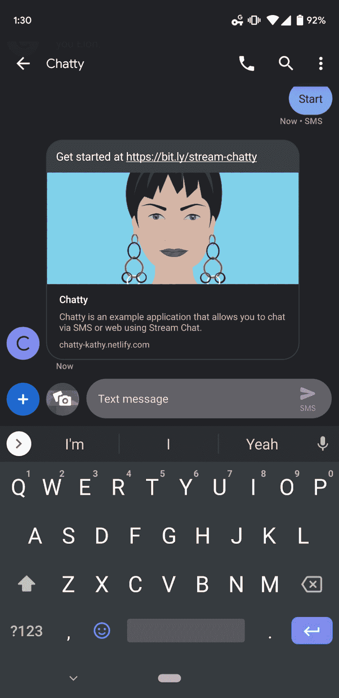](https://res.cloudinary.com/practicaldev/image/fetch/s--2ETuOK5S--/c_limit%2Cf_auto%2Cfl_progressive%2Cq_auto%2Cw_880/https://cdn-images-1.medium.com/max/2000/1%2AjaAjdiVQlgK30l-jAcQoaw.png)

## 网页💾

网络由两个主要文件组成——第一个是`Login.js`(由几个文件支持),第二个是`Chat.js`，所有的聊天魔术都在这里发生。

`Login.js`处理数据收集(**电子邮件**和**密码**)。当用户点击“Start”按钮时，一个 POST 被发送到 Lambda，用户被存储在 MongoDB 数据库中。然后在流聊天中创建一个用户，流生成的令牌与用户数据(ID、姓名等)一起返回。).回调收到令牌后，它会存储在 sessionStorage 中，以便在我们的聊天中使用。

```
 import React, { Component } from "react";
import InputMask from "react-input-mask";
import mobile from "is-mobile";
import axios from "axios";

import "./App.css";

class Login extends Component {
  constructor(props) {
    super(props);

    this.state = {
      loading: false,
      name: "",
      number: ""
    };

    this.initStream = this.initStream.bind(this);
  }

  async initStream() {
    await this.setState({
      loading: true
    });

    const auth = await axios.post(process.env.REACT_APP_AUTH_ENDPOINT, {
      name: this.state.name
        .split("  ")
        .join("_")
        .toLowerCase(),
      number: this.state.number
    });

    if (mobile()) {
      return window.open(
        `sms://${process.env.REACT_APP_TWILIO_NUMBER}?body=Hi, ${
          auth.data.user.name
        } here! How is everyone doing?`,
        "_system"
      );
    }

    sessionStorage.setItem("userData", JSON.stringify(auth.data.user));
    sessionStorage.setItem("tokenData", auth.data.token);

    await this.setState({
      loading: false
    });

    this.props.history.push("/");
  }

  handleChange = e => {
    this.setState({
      [e.target.name]: e.target.value
    });
  };

  render() {
    return (
      <div className="login-root">
        <div className="login-card">
          <h1>Chatty</h1>
          <InputMask
            type="text"
            placeholder="Username"
            name="name"
            onChange={e => this.handleChange(e)}
          />
          <br />
          <InputMask
            {...this.props}
            type="tel"
            placeholder="Phone Number"
            name="number"
            onChange={e => this.handleChange(e)}
            mask="+1\ 999-999-9999"
            maskChar="  "
          />
          <br />
          <button onClick={this.initStream}>Start</button>
        </div>
      </div>
    );
  }
}

export default Login; 
```

Enter fullscreen mode Exit fullscreen mode

Chat.js 从 sessionStorage 中提取用户和令牌数据，然后为用户启动新的聊天。我正在使用我们的 [Stream Chat React 组件](https://getstream.github.io/stream-chat-react/)来实现这一点，而且，我必须说，这是一项简单的任务。

```
 import React, { Component } from "react";
import {
  Chat,
  Channel,
  ChannelHeader,
  Thread,
  Window,
  MessageList,
  MessageInput
} from "stream-chat-react";
import { StreamChat } from "stream-chat";

import "./App.css";
import "stream-chat-react/dist/css/index.css";

class App extends Component {
  constructor(props) {
    super(props);

    const { id, name, image } = JSON.parse(sessionStorage.getItem("userData"));

    this.client = new StreamChat(process.env.REACT_APP_STREAM_KEY);

    this.client.setUser(
      {
        id,
        name,
        image
      },
      sessionStorage.getItem("tokenData")
    );

    this.channel = this.client.channel(
      process.env.REACT_APP_CHANNEL_TYPE,
      process.env.REACT_APP_CHANNEL_NAME,
      {
        image: "https://i.imgur.com/LmW57kB.png",
        name: "Kathy is Feeling Chatty About Kanye"
      }
    );
  }

  render() {
    return (
      <Chat client={this.client} theme={"messaging light"}>
        <Channel channel={this.channel}>
          <Window>
            <ChannelHeader />
            <MessageList />
            <MessageInput />
          </Window>
          <Thread />
        </Channel>
      </Chat>
    );
  }
}

export default App; 
```

Enter fullscreen mode Exit fullscreen mode

## λ🧞‍♂️

Lambda 由三个主要函数和一个存储 MongoDB 连接状态的辅助函数组成——所有这些都存储在一个名为`handler.js`的文件中。

Connect 建立并存储 MongoDB 连接状态。这很有帮助，因为 Lambda 会缓存一段时间，如果可能的话，重用一个连接是个好习惯。

```
async function connect(uri) {
    // check if database connection is cached
    if (cached && cached.serverConfig.isConnected()) {
        return Promise.resolve(cached);
    }

    // database name
    const dbName = process.env.DB_NAME;

    // connect to database
    return MongoClient.connect(uri, { useNewUrlParser: true }).then(client => {
        // store in cache and return cached variable for re-use
        cached = client.db(dbName);
        return cached;
    });
} 
```

Enter fullscreen mode Exit fullscreen mode

Auth 接受一个姓名和电子邮件作为 POST 参数。从那里，它建立一个数据库连接，并在流聊天中创建一个用户。一旦创建了用户，就会生成一个令牌，用户对象和令牌都会返回给客户端。

```
export const auth = async event => {
    // extract params from body
    const { name, number } = JSON.parse(event.body);

    // establish database connection (cached)
    const db = await connect(process.env.DB_CONN);

    const phoneNumber = phone(number)[0];

    // initialize stream chat
    const stream = new StreamChat(
        process.env.STREAM_KEY,
        process.env.STREAM_SECRET
    );

    if (!name || !number) {
        // respond with 200
        return {
            statusCode: 400,
            headers: {
                'Access-Control-Allow-Origin': '*',
            },
            body: JSON.stringify({ error: 'Missing name or number.' }),
        };
    }

    try {
        // create or update the user based on their phone number
        const { value } = await db
            .collection(process.env.DB_COL)
            .findOneAndUpdate(
                {
                    number: phoneNumber,
                },
                {
                    $setOnInsert: {
                        name,
                        number: phoneNumber,
                        active: true,
                        updated: new Date(),
                    },
                },
                {
                    upsert: true, // important so that it creates a user if they don't exist
                    returnOriginal: false, // important so that it always returns the data
                }
            );

        // add index to phone number
        await db
            .collection(process.env.DB_COL)
            .createIndex({ number: 1 }, { unique: true });

        // setup user object for storage
        const user = {
            id: value._id.toString(),
            name: value.name,
            number: value.number,
            role: 'user',
            image: 'https://i.imgur.com/Y7reRnC.png',
        };

        // generate token and update users
        const token = stream.createToken(user.id);
        await stream.updateUsers([user]);

        // respond with 200
        return {
            statusCode: 200,
            headers: {
                'Access-Control-Allow-Origin': '*',
            },
            body: JSON.stringify({ user, token }),
        };
    } catch (error) {
        console.log(error);
        return error;
    }
}; 
```

Enter fullscreen mode Exit fullscreen mode

SMS 处理来自 Twilio 的 webhooks，处理消息并将其转发到流聊天频道。用户可以在任何时候用“停止”来关闭消息。

```
export const sms = async event => {
    // extract body (querystring format coming from twilio)
    const { From, Body } = qs.parse(event.body);

    // establish database connection
    const db = await connect(process.env.DB_CONN);

    // initialize twilio client
    const client = new twilio(process.env.TWILIO_SID, process.env.TWILIO_TOKEN);

    // initialize stream client
    const stream = new StreamChat(
        process.env.STREAM_KEY,
        process.env.STREAM_SECRET
    );

    // create the channel
    const channel = stream.channel(
        process.env.CHANNEL_TYPE,
        process.env.CHANNEL_NAME
    );

    try {
        // lookup the user based on their incoming phone number
        const user = await db.collection(process.env.DB_COL).findOne({
            number: From,
        });

        // only trigger response if the incoming message includes start
        if (Body && Body.toLowerCase().includes('start')) {
            await client.messages.create({
                body: 'Get started at https://bit.ly/stream-chatty',
                to: From,
                from: process.env.TWILIO_NUMBER,
            });

            // respond with 200
            return {
                statusCode: 200,
                headers: {
                    'Access-Control-Allow-Origin': '*',
                },
                body: JSON.stringify({ status: 'OK' }),
            };
        }

        // deactivate user
        if (Body && Body.toLowerCase().includes('stop')) {
            // set user active status to false so they don't get any additional texts
            await db
                .collection(process.env.DB_COL)
                .updateOne({ _id: From }, { $set: { active: false } });

            // let the user know that they have been removed
            await client.messages.create({
                body: 'Sorry to see you go!', // message body for sms
                to: From, // incoming twilio number
                from: process.env.TWILIO_NUMBER, // twilio outbound phone number
            });

            // respond with 200
            return {
                statusCode: 200,
                headers: {
                    'Access-Control-Allow-Origin': '*',
                },
                body: JSON.stringify({ status: 'OK' }),
            };
        }

        // update acting user
        await stream.updateUsers([
            {
                id: user._id,
                name: user.name,
                role: 'user',
            },
        ]);

        // send a message
        await channel.sendMessage({
            text: Body,
            user: {
                id: user._id,
                name: user.name,
                image: 'https://i.imgur.com/Y7reRnC.png',
            },
            number: user.number,
            context: 'sms',
        });

        // respond with 200
        return {
            statusCode: 200,
            headers: {
                'Access-Control-Allow-Origin': '*',
            },
            body: JSON.stringify({ status: 'OK' }),
        };
    } catch (error) {
        console.log(error);
        return error;
    }
}; 
```

Enter fullscreen mode Exit fullscreen mode

Create 内部的逻辑更丰富一些。这个特殊的功能接受来自流聊天的 webhooks，并在用户被提到的任何时候给他们发送 SMS。这背后的整个想法是让用户更新直接消息，但避免嘈杂的聊天消息通过。

```
export const chat = async event => {
    // extract the message body and setup the database
    const data = JSON.parse(event.body);

    // establish database connection (cached)
    const db = await connect(process.env.DB_CONN);

    // initialize twilio messages
    const client = new twilio(process.env.TWILIO_SID, process.env.TWILIO_TOKEN);

    // initialize stream chat
    const stream = new StreamChat(
        process.env.STREAM_KEY,
        process.env.STREAM_SECRET
    );

    // create the channel
    const channel = stream.channel(
        process.env.CHANNEL_TYPE,
        process.env.CHANNEL_NAME
    );

    try {
        // only allow events that are not read, etc.
        if (data.type !== 'messages.read' && data.message) {
            const message = data.message;

            // and only allow @ mentions (check if mentioned users array has mentions)
            if (message.mentioned_users.length > 0) {
                const mentioned = message.mentioned_users;

                // loop through all of the messaged users
                for (const mention in mentioned) {
                    // run a quick lookup against their user id
                    const user = await db
                        .collection(process.env.DB_COL)
                        .findOne({
                            _id: new ObjectID(mentioned[mention].id),
                        });

                    // only attempt to send a message if the user is active
                    if (user.active && message.user.id !== user._id) {
                        // send sms with twilio
                        await client.messages.create({
                            body: `Chat from @${data.user.name}:\n\n${
                                message.text
                            }`, // from user with message text on newline
                            to: user.number, // phone number from database
                            from: process.env.TWILIO_NUMBER, // twilio outbound phone number
                        });
                    }
                }
            }

            if (data.user.id !== 'kathy') {
                // send a random response
                const random = await axios.get('https://api.kanye.rest');

                // send a message
                await channel.sendMessage({
                    user: {
                        id: 'kathy',
                        name: 'Chatty Kathy',
                        image: 'https://i.imgur.com/LmW57kB.png',
                    },
                    text: `@${data.user.name} Here's a Kayne quote for you – "${
                        random.data.quote
                    }"`,
                    mentioned_users: [data.user.id],
                    context: 'random',
                });
            }
        }

        // respond with 200
        return {
            statusCode: 200,
            headers: {
                'Access-Control-Allow-Origin': '*',
            },
            body: JSON.stringify({ status: 200 }),
        };
    } catch (error) {
        console.log(error);
        return error;
    }
}; 
```

Enter fullscreen mode Exit fullscreen mode

## 最后的想法🤔

在这篇文章中，我们已经了解了使用流聊天和 Twilio SMS 构建消息服务的内部工作原理。前端由 React 使用 Stream Chat React 组件构建，而后端完全由 AWS Lambda 构建，由无服务器提供支持。

如果你想让这个项目更上一层楼，增加一些东西比如彩信支持将是一个很好的主意。您还可以[了解如何在 AWS](https://github.com/GetStream/stream-chat-chatty-serverless) 上启动无服务器，这一点我们在本教程中没有涉及，因为我们使用 ngrok 连接了服务之间的通信。

我希望这篇教程对你有所帮助，并鼓励你在下面的评论中提出任何想法或问题。

如果你想了解更多关于流聊天的知识，你会喜欢我们在[https://getstream.io/chat/get_started/](https://getstream.io/chat/get_started/)的 API 之旅。我们也有很多流行的[语言和框架](https://github.com/GetStream/stream-sdks)的各种 SDK，包括 [iOS / Swift](https://getstream.io/tutorials/ios-chat/) 。

编码快乐！✌*