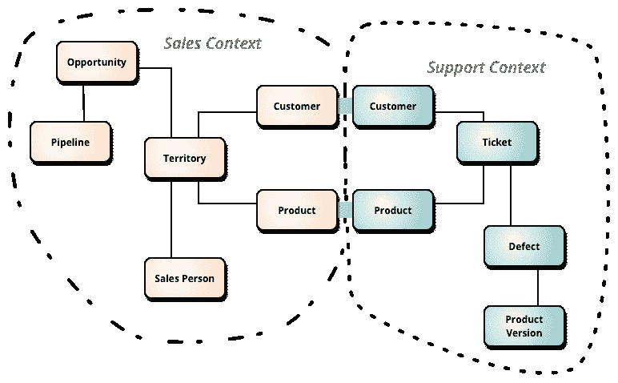

# 将您的(Phoenix)上下文重组为用例

> 原文：<https://dev.to/luizdamim/reorganizing-your-phoenix-contexts-as-use-cases-g71>

上下文是一个很好的概念，可以帮助你在你的应用程序的不同区域之间定义明确的边界。Phoenix Contexts 没有什么新的或具体的东西，它只是由 Eric Evans 在优秀的[领域驱动设计:解决软件核心的复杂性](https://www.amazon.com/Domain-Driven-Design-Tackling-Complexity-Software/dp/0321125215/ref=nav_signin?crid=2VP1T4HLLN3YK&keywords=domain+driven+design&qid=1559488367&s=gateway&sprefix=domain+driven+d%2Caps%2C273&sr=8-1&)中定义的[有界上下文](https://martinfowler.com/bliki/BoundedContext.html)的子集——标识和组织。

[](https://res.cloudinary.com/practicaldev/image/fetch/s--hzl5YxRu--/c_limit%2Cf_auto%2Cfl_progressive%2Cq_auto%2Cw_880/https://luizdamim.com/static/9b03f9f58a3d496febdabc9b0d33af9e/57e09/contexts.png)

在这篇文章中，我将向你展示另一种组织你的上下文的方法，将*动作*提取到它们自己的**用例**模块中，以传达更好的清晰性并使需求明确。

## 什么是用例？

> 用例是对用户如何在你的网站上执行任务的书面描述。它从用户的角度概述了系统响应请求时的行为。每个用例被表示为一系列简单的步骤，从用户的目标开始，到目标实现时结束。——[Usability.gov](https://www.usability.gov/how-to-and-tools/methods/use-cases.html)

换句话说，用例是某个用户/参与者在您的应用程序上执行的操作，比如 UI 中的按钮点击、通过 CLI 输入的命令，甚至是来自外部 API 的响应。这是演员做的事情，并期望有副作用:数据改变，发送电子邮件，后台计算。

当您使用它的生成器创建或更新上下文时，Phoenix 已经创建了三个通用的*用例*:函数`create_*/1`、`update_*/2`和`delete_*/1`。在带有`Client`和`Order`的`Sales`上下文中，Phoenix 定义了以下功能:

*   `create_client/1`
*   `update_client/2`
*   `delete_client/1`
*   `create_order/1`
*   `update_order/2`
*   `delete_order/1`

现在将订单项目、付款、地址和结帐的概念添加到上下文中。再加上其他必要的配套功能，如数据验证、策略验证、外部数据获取、电子邮件发送和[事件记录](https://luizdamim.com/blog/tracking-changes-with-context-using-phoenix-and-ecto)，功能数量将会急剧增加。

[](https://res.cloudinary.com/practicaldev/image/fetch/s--zDoytAkW--/c_limit%2Cf_auto%2Cfl_progressive%2Cq_auto%2Cw_880/https://luizdamim.com/static/67625b09748efeb121a7437a8b3ff88a/0abfa/scumbagbrain.jpg)

在 Elixir 的单个模块中定义所有这些函数在技术上没有错，但是随着上下文变得越来越大，你会开始有太多的函数彼此相关，但是与父概念的关系不太紧密。建立所有这些功能的精神状态的认知开销太大了。

## 编写用例

编写用例的步骤:

1.  确定用户可以执行的操作
2.  将每个动作提取到它自己的用例模块中
3.  ...
4.  利润！

不是开玩笑，就是这样。这里有一个取消订单的例子:

```
defmodule AlchemyReaction.Sales.CancelOrderManually do
  @moduledoc """
  Cancels an order with the given reason and notifies the client via email.
  """
  use Ecto.Schema
  import Ecto.Changeset
  alias Ecto.Multi

  alias AlchemyReaction.Sales.Order

  embedded_schema do
    field :reason
  end

  def changeset(attrs) do
    %__MODULE__{}
    |> cast(attrs, [:reason])
    |> validate_required([:reason])
    |> validate_length(:reason, min: 10)
  end

  def call(%Ecto.Changeset{valid?: true} = changeset, %{order: order, actor: actor} = _deps) do
    data = apply_changes(changeset)

    Multi.new()
    |> Multi.update(:order, Order.changeset(order, %{status: "cancelled"}))
    |> Multi.run(:audit, &cancel_order_audit(&1, &2, data.reason, actor))
    |> Multi.run(:email, &notify_client(&1, &2, actor))
  end

  defp cancel_order_audit(_repo, %{order: order}, reason, actor) do
    # ...
  end

  defp notify_client(_repo, %{order: order}, actor) do
    # ...
  end
end 
```

编写用例的主要好处是:

**代码组织和清晰度**

通过查看文件结构，您可以知道，或者至少有一个想法，每个上下文做什么。您还可以将[子上下文](https://luizdamim.com/blog/tracking-changes-with-context-using-phoenix-and-ecto)文件夹中的用例分组到更大的上下文中，以便更好地组织。在这种情况下，`CancelOrderManually`将被嵌套在子上下文`order`中，并被命名为`AlchemyReaction.Sales.Orders.CancelOrderManually`。

**你明确了需求**

很明显，手工取消订单需要一个原因，即订单被取消以及执行取消的操作者。这里我将`order`和`actor`作为对`call/2`函数的依赖来传递，因为我在外部加载它们，主要是为了检查权限，但是你可以在模式中定义`order_id`和`actor_id`，并在用例中加载它们。

请记住，需求因执行环境而异。客户支持部门的操作员手动取消订单需要原因，但欺诈检测部门的分析师可能不需要原因。这是一个可怕的例子，但我希望我能使你度过难关。

还要注意的是，这些需求与执行用例的需求密切相关，与角色和权限无关。客户支持部门的操作员和欺诈检测部门的分析师都有权手动取消订单。

**使用用例构建表单**

变更集充当构建表单的数据结构，就像您以传统方式使用`Order`模式一样(您将需要手动设置`as`名称空间和提交`method`，因为`form_for/x`助手无法从该结构中进行推断)。

您将执行用例的需求从底层实现中分离出来，因为一个变更经常会跨越多个模式。

**重用和编写用例很容易**

你必须总是从`call/2`函数返回一个`Ecto.Multi`。永远是一个强烈的词，但我真的是说永远！

> 埃克托。Multi 使得将应该在单个数据库事务中执行的操作打包成为可能，并提供了一种在不实际执行排队操作的情况下自省这些操作的方法。每个操作都有一个唯一的名称，在成功或失败的情况下可以识别其结果。——[埃克托。多文档](https://hexdocs.pm/ecto/Ecto.Multi.html)

通过总是返回一个 multi，你可以重用其他用例，通过将它们附加/合并到父 multi 中，将它们组合在一起。想象一下取消一个订单，你也必须取消付款，把商品放回库存，或者安排一封电子邮件邀请用户在两周内再次购买。给定其他上下文，这些用例中的每一个都可以单独执行。

即使没有数据库操作，我也会使用`Ecto.Multi`。开启/关闭未使用交易的成本可以忽略不计。

`Ecto.Multi`是爱。`Ecto.Multi`是生活。❤️ ❤️ ❤️

**不要让你的用例变得通用或者(过度)可配置**

用例的一个主要好处是它反映了应用程序中一个单一的、已定义的、有限的执行路径。如果你试图让它足够通用来处理多个用例，那么你就失去了清晰和上下文的好处。

有一个标志来指示在执行用例之后应该发送电子邮件通知是可以的。有多个选项和旋钮导致多个执行路径和输出是一个危险信号。

## 识别一个用例

这是最难的部分。这是一个持续的过程，通过分析应用程序用户的日常工作和不时出现的关键案例，来映射和理解[数据变化的原因和方式](https://luizdamim.com/blog/tracking-changes-with-context)。

[](https://res.cloudinary.com/practicaldev/image/fetch/s--gJiuDQLm--/c_limit%2Cf_auto%2Cfl_progressive%2Cq_auto%2Cw_880/https://luizdamim.com/static/cb234194798fc7a5013242d6534e7ace/55e04/use-the-verbs.jpg)

注意他们使用的语言，尤其是动词。动词表示动作，而动作是你感兴趣的。

如果你第一次(或第二次，或第三次)没做对也没关系。但重要的是你要不断完善...

用例的其他一些例子:

*   `Sales`上下文:`ShipOrder`、`RefundOrder`、`ChangeShippingAddress`、`CancelOrderViaPaymentGateway`(命名比较难)；
*   `Accounts`上下文:`ChangePrimaryEmail`、`ChangePassword`、`DeactivateAccount`、`ConfirmEmailAddress`、`SetPreferredPaymentMethod`、`SetPreferredShippingAddress`；

## 结论

用传统方式写这么多代码来做同样的事情似乎很麻烦。我没有任何衡量标准，但我的感觉是，它不会更多，甚至可能是相同的。你不仅仅是输入代码，你还要映射应用程序的每一个操作和过程，识别和记录每一个执行路径。

多年来，我在用 Elixir、Ruby 甚至 PHP 编写的应用程序中非常成功地使用了这个用例概念。