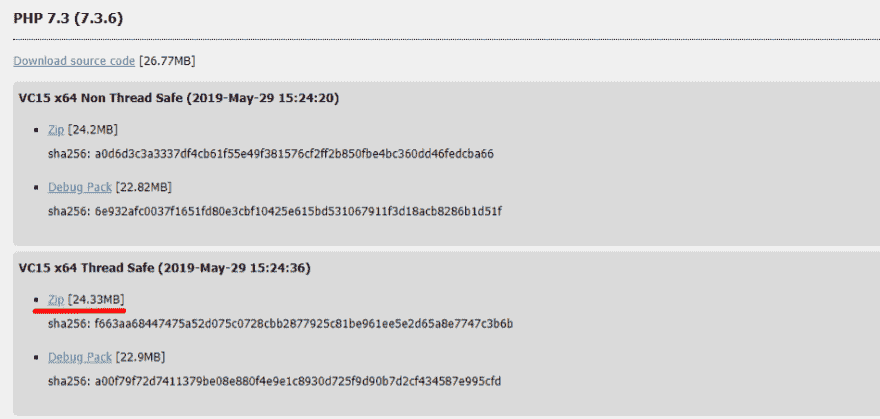
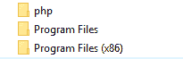
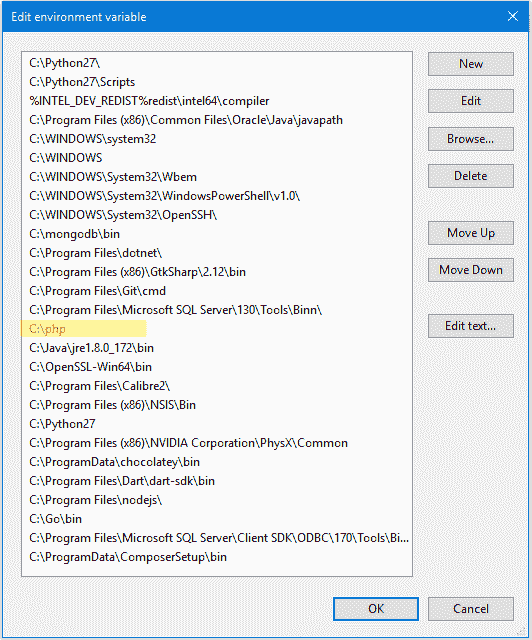
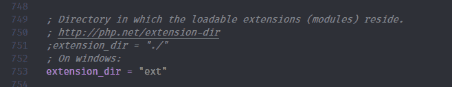
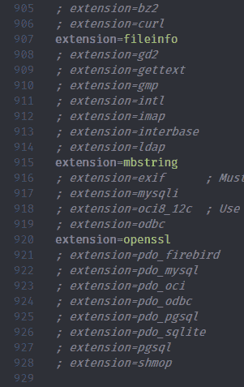
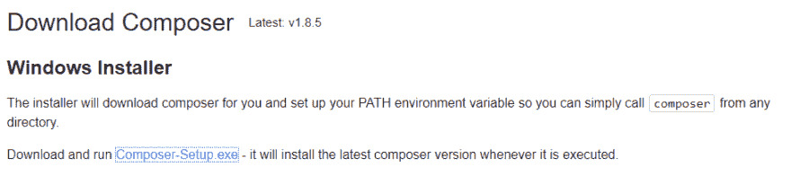

# 第一次在 Windows 上安装 PHP 和 Laravel

> 原文：<https://dev.to/davdaarn/first-time-ever-installing-php-and-laravel-on-windows-jun-2019-3i4>

今天我决定尝试在我的个人机器上建立一个 Laravel 环境。我在以前的工作中做了一点点 Laravel 编码，但我想从头开始构建一些可以用于投资组合项目的东西。我在 YouTube 上找到了一个很好的教程，但开始两个小时后，我仍然只看了 8 分钟。我错过了一个关键的步骤，我不断遇到问题。最后，一切都超级容易修复，但我记录了安装过程，以供将来参考，希望这也能为其他人节省一些悲伤。

作为免责声明，我在 Windows 上使用截至 2019 年 6 月的最新软件版本。里程可能有所不同。

首先要做的是[下载](https://www.php.net/)并设置 PHP。我下载的是 7.1.30 版本。

[](https://res.cloudinary.com/practicaldev/image/fetch/s--4G8Ie81Y--/c_limit%2Cf_auto%2Cfl_progressive%2Cq_auto%2Cw_880/https://raw.githubusercontent.com/davdaarn/assets/master/assets/blog_post1/php_download.png)

接下来创建一个文件夹，您希望 PHP 放在其中。我在 c 盘的根目录下创建了我的。

[](https://res.cloudinary.com/practicaldev/image/fetch/s--CTkCfRTq--/c_limit%2Cf_auto%2Cfl_progressive%2Cq_auto%2Cw_880/https://raw.githubusercontent.com/davdaarn/assets/master/assets/blog_post1/php_folder.png)

下载完 PHP 文件后，将 zip 文件的内容解压到新文件夹中。并将文件夹位置添加到您的`PATH`中。

[](https://res.cloudinary.com/practicaldev/image/fetch/s--F1rFcgZ2--/c_limit%2Cf_auto%2Cfl_progressive%2Cq_auto%2Cw_880/https://raw.githubusercontent.com/davdaarn/assets/master/assets/blog_post1/env.PNG)

接下来复制/重命名`php.ini-development`文件，将其命名为`php.ini`。这个文件的存在非常重要。

[](https://res.cloudinary.com/practicaldev/image/fetch/s--zjzQv2pP--/c_limit%2Cf_auto%2Cfl_progressive%2Cq_auto%2Cw_880/https://raw.githubusercontent.com/davdaarn/assets/master/assets/blog_post1/php_directory.png)

在新创建的文件中，通过搜索并取消注释以下代码行来配置扩展:

```
extension_dir = "ext"
extension=openssl
extension=mbstring
extension=fileinfo 
```

[](https://res.cloudinary.com/practicaldev/image/fetch/s--dAqXy4qy--/c_limit%2Cf_auto%2Cfl_progressive%2Cq_auto%2Cw_880/https://raw.githubusercontent.com/davdaarn/assets/master/assets/blog_post1/extension_dir.png)

[](https://res.cloudinary.com/practicaldev/image/fetch/s--ufRu9xQb--/c_limit%2Cf_auto%2Cfl_progressive%2Cq_auto%2Cw_880/https://raw.githubusercontent.com/davdaarn/assets/master/assets/blog_post1/extensions.png)

上面的前两行代码解决了通过 Composer 安装 Laravel 时出现的错误:

```
[Composer\Exception\NoSslException] 
```

通过修改`ini`文件以包含必要的扩展名，这个*应该*阻止 composer 在安装期间试图修改文件。

接下来安装[作曲](https://getcomposer.org/download/)。对我来说，下载`exe`并接受默认设置就足够了。

[](https://res.cloudinary.com/practicaldev/image/fetch/s--oJozajcu--/c_limit%2Cf_auto%2Cfl_progressive%2Cq_auto%2Cw_880/https://raw.githubusercontent.com/davdaarn/assets/master/assets/blog_post1/composer_installer.png)

安装 Composer 后运行:

```
composer global require laravel/installer 
```

那你应该会跑:

```
laravel new myFirstProject 
```

希望你不会犯错误。如果您确实遇到任何错误，很可能是由于`ini`文件和缺少扩展名的问题。

我知道这个安装过程非常简单，几乎不需要指南(可能有更好的安装方法)。但是对于 PHP 的世界来说，设置过程对我来说有点陌生，所以我有点犹豫。希望这能帮助到一些人。