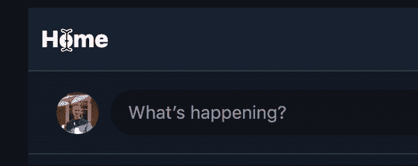

# 检测 Web 上的全选

> 原文：<https://dev.to/chromiumdev/detecting-select-all-on-the-web-2alo>

在网络上，点击 Cmd/Ctrl-A(或以另一种方式触发“全选”)有两种不同的操作模式。

如果您的焦点在一个`<textarea>`、`<input>`或任何标有`contentEditable`的元素内，也就是说，键入键将在那里输入文本，那么 Select All 将选择该元素的所有内容。太好了！但其他方面却...

## 问题

🚨如果用户关注页面的不可编辑部分，他们会选择页面的所有内容。

[](https://res.cloudinary.com/practicaldev/image/fetch/s--HQgHdtEu--/c_limit%2Cf_auto%2Cfl_progressive%2Cq_66%2Cw_880/https://thepracticaldev.s3.amazonaws.com/i/8zrap2bml7178v4yrh2i.gif)

对于一个以为主要特色的网站用户来说，一个大的编辑器(就像一个博客创作界面！)，这可能会令人沮丧。`<textarea>`的内容会看起来👀挑选...因为在某种程度上，它*是*，作为整个页面被选中的副产品，但是:

*   键入(或粘贴)不会替换内容
*   copy 将复制整个页面，包括 UI 元素的文本

## 解

让我们检测用户何时触发全选，并将他们的选择重定向到您选择的编辑器。这个解决方案已经在 [Emojityper](https://emojityper.com) 上就位。😂⌨️

如果你读过[我的其他帖子](https://dev.to/chromiumdev/-native-undo--redo-for-the-web-3fl3)，你可能会记得我不是一个直接挂钩键盘事件的狂热爱好者——有许多方法可以触发全选，并不是所有的方法都是点击 Ctrl/Cmd-A。

因此，解决方案有三个步骤:

1.  向页面添加两个隐藏但可选择的元素
2.  监听 [`selectionchange`事件](https://developer.mozilla.org/en-US/docs/Web/API/Document/selectionchange_event)
3.  在你的编辑器上调用`.focus()`。

### 1。隐藏元素

给你的页面添加两个隐藏元素，它们是可选的，但是不可见的(不是`display: none`——它们需要在页面上*),用 CSS 比如:* 

```
.extent {
  position: fixed;
  opacity: 0;
  user-select: auto;  /* to always allow select-all */
}
.extent::after {
  content: '\200b';   /* zero-width space */
} 
```

Enter fullscreen mode Exit fullscreen mode

然后我们在页面的顶部和底部添加这些内容(这也可以用 JS 编程来完成):

```
<body>
<div class="extent"></div>

<!-- your regular page here -->
<p><a href="https://dev.to/samthor">@samthor</a></p>
<textarea id="input"></textarea>

<div class="extent"></div>
</body> 
```

Enter fullscreen mode Exit fullscreen mode

### 2。JavaScript 监听器

通过监听`selectionchange`事件，我们可以检测两个元素是否在同一个手势中被选中。因为我们的`extent`元素是透明的、固定的，并且没有宽度，所以用户不能通过拖动来选择它们。

代码是这样的:

```
document.addEventListener('selectionchange', (ev) => {
  const isExtent = (node) => {
    return node instanceof Element && node.classList.contains('extent');
  };

  // check the selection extends over two extent nodes (top and bottom)
  const s = window.getSelection();
  if (s.anchorNode === s.focusNode || !isExtent(s.anchorNode) || !isExtent(s.focusNode)) {
    return;
  }

  // clear page's selection (this isn't perfect and a user may see
  // a flash of selection anyway- use selectstart + rAF to fix this)
  s.removeAllRanges();
  // TODO: focus code goes here
}); 
```

Enter fullscreen mode Exit fullscreen mode

### 3。焦点🔍

终于可以专注点什么了！在调用上面的`s.removeAllRanges()`之后，运行如下代码:

```
 const main = document.querySelector('textarea#main');  // or whatever you want to focus
  main.focus();
  main.setSelectionRange(0, main.value.length); 
```

Enter fullscreen mode Exit fullscreen mode

这将通过程序选择`textarea#main`的全部内容。你也可以选择用全选手势做一些有创意的事情！谁知道呢！🤔

## 谢谢！

这里有一个代码笔，它将代码放在一起进行演示。👍

一个相关的概念是 [`user-select: none`](https://dev.to/lynnewritescode/5-css-tips-you-didnt-know-you-needed-nb3#prevent-highlighting) ，它禁止对页面的某些部分进行选择。虽然具有类似应用程序的复杂 web 应用程序可以使用它，但它不是“全选”问题的解决方案。

这只是我们可以利用的许多手势之一:例如，这是一篇名为 Web 的[原生撤销&重做的帖子的后续，该帖子涵盖了如何在撤销堆栈中插入自定义事件。而且，如果你想检测页面中打开的“查找”,请关注这个空间——](https://dev.to/chromiumdev/-native-undo--redo-for-the-web-3fl3)[open Find](https://www.chromestatus.com/feature/6636647374389248)事件即将到来。

four