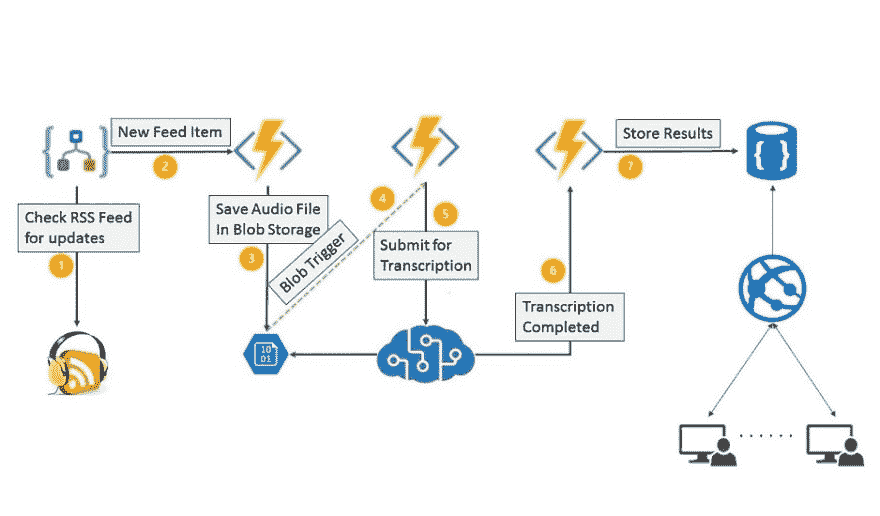
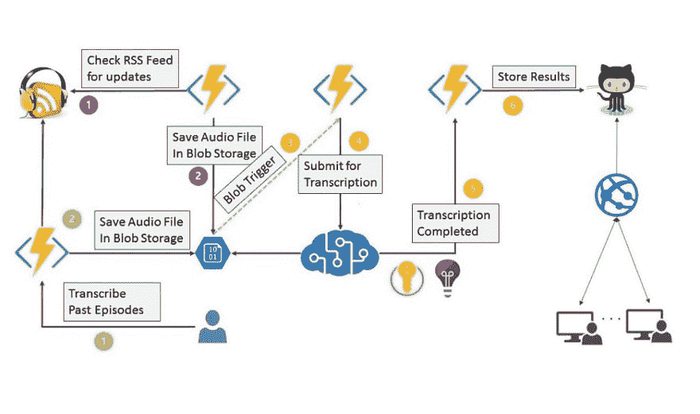

# HanselMinutes-Plus-Plus:我如何在一周内在 Azure 上构建一个播客转录服务

> 原文：<https://dev.to/gurucharan94/hanselminutes-plus-plus-how-i-built-a-podcast-transcription-service-on-azure-in-a-week-8mb>

这是一个关于我如何想尝试来自 Azure Cognitive Services 的语音到文本服务的故事，最终我建立了一个播客转录服务的原型，**自动转录你的播客的任何新片段，并在你的音频旁边显示同步的转录，使你的播客更容易访问。**

抄本为播客主持人和听众提供了多种好处。更重要的是，这是正确的做法，因为它使你的网页内容更容易被访问。你可以在 [Podcast Accessibility](https://podcast-accessibility.com/) 了解更多信息。

如果你想看到这一点，看看 **[Hanselminutes++](https://hanselminutesplusplus.azurewebsites.net)** (在 Azure 上运行免费计划)，这是流行的 [Hanselminutes 播客](https://www.hanselminutes.com/)的最小克隆，具有同步的转录。

你也可以在 github 上找到源代码[。](https://github.com/GuruCharan94/az-podcast-transcriber)

HanselMinutes 的转录是人工智能驱动的，大约 85%-90%准确(粗略计算)，并且在完成后以大约 1 美元/小时的音频价格非常实惠。

## 故事时间

微软 Build 2019 的会议/对话转录展示一直萦绕在我的脑海中，所以我想尝试一下。尽管会议转录服务需要定制设备，但我喜欢我所看到的批量转录服务。我决定尝试一下，这就是接下来发生的事情。

### 1。天蓝色批量转录

我按照[文档](https://docs.microsoft.com/en-in/azure/cognitive-services/speech-service/batch-transcription)在美国西部地区的**标准 S0** 计划上创建了一个新的语音服务实例。在用我的订阅密钥授权请求之后，我决定开始从 [Swagger 页面](https://westus.cris.ai/swagger/ui/index)向转录端点发出 POST 请求。

```
{
  "recordingsUrl": "<SAS URI of Blob>",
  "models": [],
  "locale": "en-US",
  "name": "Title of the episode",
  "description": "An optional description of the episode",
  "properties": {
    "ProfanityFilterMode": "Masked",
    "PunctuationMode": "DictatedAndAutomatic"
  }
} 
```

我意识到我必须为`recordingsUrl`字段输入有效的 Azure Blob SAS URI。因此，我从 Hanselminutes 下载了一个 mp3 文件，用 storage explorer 将它们上传到存储帐户，生成 SAS URI 并发出请求。

《Hanselminutes》每集时长 30 分钟，录制每集几乎用了同样的时间。我了解到，我可以注册一个 [webhook](https://docs.microsoft.com/en-us/azure/cognitive-services/speech-service/webhooks) ，一旦结果完成，就会在那里发布，从而避免不断轮询 API 来检查转录是否完成。

**边评:**我尝试转录 2018 年和 2019 年的所有 Hanselminutes 集，但转录某些集时出现了问题，[我在 StackOverflow 上有一个关于它的问题。](https://stackoverflow.com/questions/56329927/azure-cognitive-services-batch-transcription-api-responds-with-error-message)我还有一些关于请求限制和 blob 存储支持的问题，这些问题在文档中并不清楚。

### 2。Azure 函数

我得到了我的第一个转录结果，我很高兴我所看到的。现在，我想转录几集，并意识到下载 mp3 文件，上传到 Azure 存储，然后发出转录请求很快成为一项乏味的任务。我的开发人员的大脑迫切需要类似于 [Azure Functions](https://docs.microsoft.com/en-us/azure/azure-functions/) 的东西，所以我写了一些。

#### 2.1 Http 触发功能

*   在触发请求中接受 mp3 文件的 URL
*   以流形式下载 mp3 文件。
*   上传到存储帐户。

#### 2.2 天蓝色 Blob 触发函数

每当存储帐户中有扩展名为 *.mp3* 的新 blob 时，都会触发此功能。

*   为 blob 生成 SAS URI
*   向转录端点发出转录请求

#### 2.3 HTTP 触发的 Azure 功能

这个函数在转录过程完成时接收 HTTP 回调

*   处理转录结果。
*   最初，我想简单地查看成绩单
*   后来(当我开始构建 Hanselminutes 克隆时)决定将它们存储在 Azure CosmosDB 中。

### 3。Azure Logic 应用程序

我仍然需要播客每集音频文件的链接。我知道我可以从 RSS 提要中得到它，我决定选择无代码解决方案，使用 [RSS 连接器](https://docs.microsoft.com/en-us/azure/connectors/connectors-create-api-rss)解析 RSS 提要。虽然我说的是无代码解决方案，但事实是我想尝试逻辑应用程序。；) ;)

#### 3.1 自定义 RSS 源

Hanselminutes 是一个每周一次的播客，但是我需要一个更新更频繁的 RSS 源，并且在我的日程表上。我决定用我的 [Lorem RSS Feed](http://lorem-rss.herokuapp.com/) 的分支建立我自己的 RSS Feed，在那里我只有定期更新的 Feed 项目。

出于开发目的，我在我的假 RSS 提要上触发了一个更新检查，当我的提要有更新时，从 Hanselminutes 提要向 HTTP 触发的 azure 函数 HTTP POST 项目。不漂亮，但目前还管用。

### 4。Azure Web 应用程序和 CosmosDB

我在互联网上搜索，看看 Hanselminutes 是否已经有转录，我只找到一些破碎/过时的链接。我猜抄本曾经存在过，但现在不再存在了。对我来说，这是一个很好的借口，可以用转录来构建一个最小的 Hanselminutes 克隆。我决定使用 [CosmosDB](https://docs.microsoft.com/en-us/azure/cosmos-db/introduction) 来存储脚本，并更新了 Azure 函数来将结果存储在 CosmosDB 中，并构建了一个与 CosmosDB 对话的 ASP NET 核心 Web 应用程序。

<figure>[](https://res.cloudinary.com/practicaldev/image/fetch/s--kDaz7mmr--/c_limit%2Cf_auto%2Cfl_progressive%2Cq_auto%2Cw_880/https://www.gurucharan.in/asseimg/hanselminutes-clone/v1.jpg) 

<figcaption>高层概述初始版本</figcaption>

</figure>

## 费用

*   Azure Cognitive Services 的核心转录服务在标准计划中花费 **1 美元/小时**的音频。

*   Azure Storage 、 [Azure Functions](https://azure.microsoft.com/en-in/pricing/details/functions/) 和 [Logic Apps](https://azure.microsoft.com/en-in/pricing/details/logic-apps/) 相对来说非常便宜，你可以将它们视为免费的增值服务。

*   我把抄本存储在 Azure Cosmos DB 上，它有一个复杂的定价模型，价格相当高，起价大约是每月 24 美元(T2)。继续阅读了解下一版本如何在下一版本中解决这个问题。

*   Hanselminutes 克隆版托管在 Azure 应用服务上，但如果你托管一个播客，你就已经有自己的网站了。

## 计划下一个版本

*   显然，Azure CosmosDB 是一个主要的成本障碍，随着播客的流行，成本可能会迅速飙升。我正在考虑[将转录结果直接发布到 github](http://www.levibotelho.com/development/commit-a-file-with-the-github-api/) 中，而不是存储在 CosmosDB 中。这使得抄本成为“开源”的，并使机构群体的贡献有助于提高准确性，更重要的是大幅降低成本。

*   Logic App 上的 RSS 连接器是一个很好的快速入门工具，但它引入了很多限制和“代码味道”。我决定用这个库替换 RSS 连接器[。](https://github.com/codehollow/FeedReader/)

*   我计划提供两个独立的 Azure 功能，一个转录新的剧集，另一个转录来自你的存档的剧集。

*   编辑体验也可以更好。事实上，如果有一个独立的编辑器运行在 github 页面上，能够导入和编辑 Azure 生成的语音到文本结果，并在以后适应其他转录引擎，那就太好了。**导入您的成绩单➡️修改➡️导出。发送拉取请求。**

*   区分说话者的能力将是巨大的，但“不是今天”…**【2019 年 6 月 17 日更新】:Azure 语音服务现在支持[说话者二进制化](https://cognitive.uservoice.com/forums/555925-speaker-recognition-api/suggestions/34823824-add-support-for-speaker-diarization-for-untrained?tracking_code=d20ff299ba13b35ae06e9d299e59bf73)。**

我预计下一个版本会像下面的图片一样成形，一旦项目到达那里，转录成本将大约为 **1 美元/小时**，这是 Azure 转录服务的成本。补充你工作流程的其他增值的东西只需要很少的预算就可以得到。没有更多的提交您的音频文件进行转录，我们将在 24 小时内通过电子邮件向您发送转录，您可以稍后添加到您的网站。

<figure>[](https://res.cloudinary.com/practicaldev/image/fetch/s--YASsGy2z--/c_limit%2Cf_auto%2Cfl_progressive%2Cq_auto%2Cw_880/https://www.gurucharan.in/asseimg/hanselminutes-clone/v2.jpg) 

<figcaption>
高层概述下一版本
</figcaption>

</figure>

## 结束语

它始于我想在一个星期六的早上尝试批量转录 API，看看它是否有任何好处。经过一周的努力，我来到了这里。虽然这是一个有趣的副业，但考虑到下面的事实，我对这个结果很满意。

*   我知道语音转文本人工智能魔术的内部原理吗？号码

*   忘记人工智能吧。我不知道如何自己实现同步滚动。在放弃之前，我花了整整 4-6 个小时来构建 scrollTo 库。反正我也不擅长 JS。

*   我写的唯一“原始代码”是触发与音频同步的滚动的逻辑。就这样。大约 50 行 javascript 代码。其余的代码大部分直接来自 Azure 文档。

站在巨人和他们的抽象概念的肩膀上是一段有趣的旅程，我想看看我能走多远。