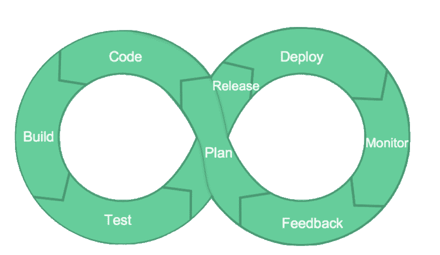

# 作为一名开发人员，您应该了解 Ops

> 原文：<https://dev.to/canelasevero/as-a-dev-you-should-know-ops-3bkh>

## 引起 DevOps。

有些人会说，你应该学习它只是因为你应该，故事结束。但事情没那么简单。不管你的理由是什么，我认为你应该学习它成为一个更好的开发者，并促进你的技术事业。

## 让我们快速看一下 DevOps

想想“很久以前”就存在的传统开发与运营目标(希望你今天已经不再处理这个问题了):开发人员因发布特性和做出改变而获得奖励，而运营人员因保持稳定而获得奖励，因此改变是敌人。

大量的方法被创造或借用，以消除这种冲突，比如[无可指责的事后分析](https://landing.google.com/sre/sre-book/chapters/postmortem-culture/)和[只是文化](https://books.google.com.br/books/about/Just_Culture.html?id=ZA0uXmtR96MC&redir_esc=y)。另一个例子是错误预算，其中 SLA 和 SLO 定义了某样东西必须有多稳定，以及它“必须”有多不稳定。这样做是为了削减成本，同时鼓励变革。

这些与精益实践相结合，反映了 DevOps 的文化和组织支柱。它们至关重要，但经常被一些人忽视。其他支柱使用自动化来减少重复性任务，并通过监控、观察和使用这些数据作为指导，使用更好的数据来改进智能决策。

考虑到这一点，我想说 DevOps 不仅仅是开发人员了解运营。

那么，如果不是因为 DevOps，作为一名开发人员，您为什么需要了解一些操作呢？我现在会试着给你四个理由，以一种更加面向职业的氛围来回答这个问题。也许你的公司或你目前的职位不需要这些知识，但知道这些知识会让你成为一个更好的整体开发人员，帮助你编写更好的服务，给你更多的“力量”。

## 1-你可以参与重要的技术决策/讨论

Ops 知识可以为你打开许多扇门。如果你的公司有一个架构指导委员会或者类似的机构，拥有这样的知识可能会在你成为其中的一员，或者甚至将事情提交给委员会讨论的过程中起到很大的作用。您可能对与堆栈、架构甚至业务相关的决策有发言权。

比方说，在某些情况下和某些服务中，当涉及到响应时，您的公司有一点延迟。一个可能的解决方案是重新实现这些服务和架构的一部分。然而，这可能非常耗时，需要付出大量努力。一个更好的选择可能是进行软件和基础设施架构的混合变更，希望花费更少的精力。你可能会从“混杂”的知识中独自找到这个解决方案。然后你可以让更多的人来讨论这个话题。

## 2-你可以写出更好的服务

同样，您可以为服务中出现的关于架构和代码的问题提供更好的答案，Ops 知识可以让您预见必然会发生的问题。

您的开发可以真正模块化，并专注于您的服务正在解决的问题。但是，对于具有真正高 SLO 和 SLA 的应用程序来说，可视化关于您的服务如何与其他服务以及与支持它的系统交互的问题的能力是至关重要的。这使得您的服务既可靠又可用。

希望你有一些运营或系统管理员的经验，你也会觉得有必要让你的服务引人注目。有了可操作性和可观察性，您就可以让人们在压力较小的情况下随时待命。

## 3-随叫随到可以让你在编码时万无一失

我在这里说的不仅仅是运营知识，还有随叫随到的运营经验。有了足够的信息，你开始看到系统中最容易出故障的薄弱环节和部分。这对你有影响，你开始感觉到它，当你回到编码的时候，它会影响你写出更好的代码。

这一条和第二条差不多，但我相信随叫随到的体验带来了只有 it 才能带来的东西:对服务可操作性的同理心。第二项指的是你可以通过阅读或听人说而获得的 Ops 知识。这一条指的是从你自己的经历中获得的知识，以及如何在以后的代码编写中使用这些知识。

## 4-你可以成为你代码生命周期的一部分

你可以写你的代码，然后[测试它](https://medium.com/@copyconstruct/testing-microservices-the-sane-way-9bb31d158c16)；你知道如何 CI/CD 它，你知道如何在生产中操作它。你也知道如何[观察](https://twitter.com/mipsytipsy/status/1086366949682995200)一切。我不是说你每次都要做所有这些事情，但是你有诀窍，而且可能以前做过。

你的公司不应该期望每个人都知道所有这些事情。但是了解他们可能会给你很大的回报。因此，你的公司应该鼓励这种追求。

# 那么，我们该如何着手呢？

我希望我已经说服你学了一些操作。如果你不知道怎么做，这里有一些选择:

### 参考文献

我喜欢这所学校。有很多主题缺少内容，但你仍然可以使用它作为一个主题列表，在互联网上进一步研究，也许可以找到一些书籍和文章。

我可以推荐很多专门的工具书籍，但是你最好根据你的公司使用的东西和你想学的东西来找。

对于更一般的学习，你可以得到[云系统管理实践](https://www.amazon.com/Practice-Cloud-System-Administration-Practices/dp/032194318X)和 [UNIX Linux 系统管理手册](https://www.amazon.com/UNIX-Linux-System-Administration-Handbook/dp/0134277554)。

对于 Linux 来说， [Linux 编程接口系统手册](https://www.amazon.com/Linux-Programming-Interface-System-Handbook/dp/1593272200/ref=sr_1_1?crid=VX920BJV6BJ2&keywords=linux+programming+interface&qid=1559098222&s=gateway&sprefix=linux+pro%2Caps%2C311&sr=8-1)是一本很棒的书。主要是作为参考。

关于网络，你可以阅读 Tanenbaum 的[计算机网络。](https://www.amazon.com/Computer-Networks-Tanenbaum-International-Economy/dp/9332518742)

你可以阅读这些关于可观测性的参考资料:[蜂窝 io 实现可观测性指南](https://www.honeycomb.io/resources/guide-achieving-observability/)和[分布式系统可观测性](https://www.oreilly.com/library/view/distributed-systems-observability/9781492033431/ch01.html)。

我知道这看起来很多，但不要被它吓倒！记住，没有必要全部读完。这里是学习操作的最佳方法:

### 做就是了！

看看你的公司是否给你机会去尝试其他职位，然后去争取。寻求指导，有时试着随叫随到。如果你身边有人知道一些事情，与他们交谈并分享你所知道的可能是最好的学习方法。只要你有扎实的开发技能，运营经验的加入可以帮助你取得更大的成就！