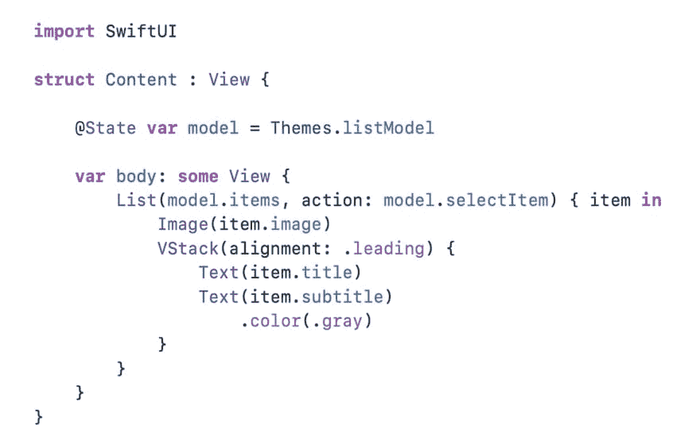

# Web 开发者:有了 SwiftUI，你会考虑学习 Swift 吗？

> 原文：<https://dev.to/wes/web-developers-with-swiftui-would-you-consider-moving-to-native-development-3ce1>

苹果刚刚宣布了 SwiftUI，这是一种“利用 Swift 的力量在所有苹果平台上构建用户界面的简单方法”。

这是一种创建本地视图的声明式方法。它非常类似于组件系统，如 React 和 Flutter。

你对此感到好奇吗？你会考虑进入原生开发吗？

如果他们在网上发布了一个版本呢？

*编辑:更改标题以反映“学习 Swift ”,而不是转移到苹果的 iOS 平台。跨平台也是多样性。*