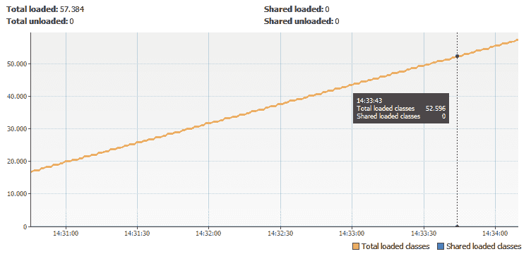
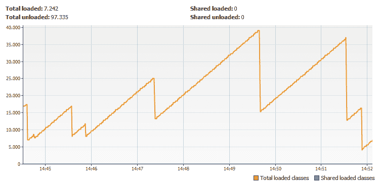

# JDBC 的 Java 内存泄漏

> 原文：<https://dev.to/vepo/java-memory-leak-for-jdbc-5dnn>

# 上下文

我已经使用定制的类加载器编写了一个引擎。为此，只需创建一个新的 [URLClassLoader](https://docs.oracle.com/javase/7/docs/api/java/net/URLClassLoader.html) ，加载一个 jar 并执行您想要的代码，然后关闭 URLClassLoader。如果新的类装入器不能访问当前的类装入器，那么装入的类就不能访问您的代码。很好！非常好！

```
URL[] jars = new URL[] { /* The jars to be loaded */ }; //
try (URLClassLoader classLoader = new URLClassLoader(jars)) {
    Job job = classLoader.loadClass(Job.class.getName());
    job.execute();
} 
```

# 问题

但是...我们无法控制从外部 Jar 加载的代码。这就是问题所在。所以如果你想避免内存泄漏，你的自定义类加载器应该被垃圾收集器释放。如果加载的代码使用 JDBC，你很快就会得到一个 OutOfMemoryError，所有的东西都会崩溃！不好！

# 原因

当 JDBC 加载驱动程序时，他们假设你将只使用一个类加载器，所以它创建一个对你的类加载器的引用。这个引用防止垃圾收集器从内存中移除自定义的类加载器。

[](https://res.cloudinary.com/practicaldev/image/fetch/s--okmG03eQ--/c_limit%2Cf_auto%2Cfl_progressive%2Cq_auto%2Cw_880/https://thepracticaldev.s3.amazonaws.com/i/789mmfr2dkp8ezgm2p91.png)

因此，即使您创建了类加载器，也要执行代码并关闭它。加载类的总数永远不会减少。

# 如何解决？

要解决这个问题，我们必须在执行后立即注销所有 JDBC 驱动程序，然后关闭 URLClassLoader。

```
URL[] jars = new URL[] { /* The jars to be loaded */ }; //
try (URLClassLoader classLoader = new URLClassLoader(jars)) {
  Job job = classLoader.loadClass(Job.class.getName());
  job.execute();
  Collections.list(DriverManager.getDrivers()).forEach(driver -> {
    try {
      DriverManager.deregisterDriver(driver);
    } catch (SQLException e) {
      logger.error("Error unregistering driver!", e);
    }
  });
} 
```

现在，让我们寻找加载的类:

[](https://res.cloudinary.com/practicaldev/image/fetch/s--G98RNbj8--/c_limit%2Cf_auto%2Cfl_progressive%2Cq_auto%2Cw_880/https://thepracticaldev.s3.amazonaws.com/i/xzaa7ftdokc0078tg9n5.png)

# 可能出现的问题

1.  如果执行的代码创建了任何线程，则 URLClassLoader 没有资格进行垃圾回收。
2.  如果一些库创建了线程，同样的问题从#1 开始。
3.  MongoDb 客户端创建一个线程。😫