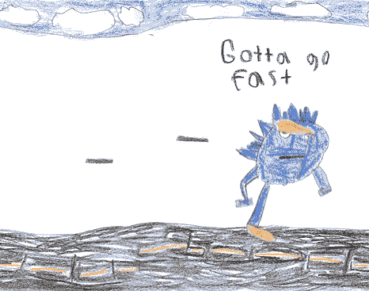

# 你在推特上为自己的过去感到羞耻吗？

> 原文：<https://dev.to/vicentdev/are-you-ashamed-about-your-past-on-twitter-5605>

嗨，开发者们！你在推特上为自己的过去感到羞耻吗？你想拥有消除你在网上所有坏名声的灵丹妙药吗？再也不用担心了！现在你可以用一个程序删除你所有的推文和收藏夹！而且是开源的！！！以下是链接:

[https://github.com/llinaresvicent/twitter_deleter](https://github.com/llinaresvicent/twitter_deleter)

PS:你觉得代码怎么样？有什么改进的办法吗？