# 在 IBM Cloud 上部署 scikit-learn 模型

> 原文：<https://dev.to/ibmdeveloper/deploy-sckilit-learn-models-on-ibm-cloud-3f5g>

[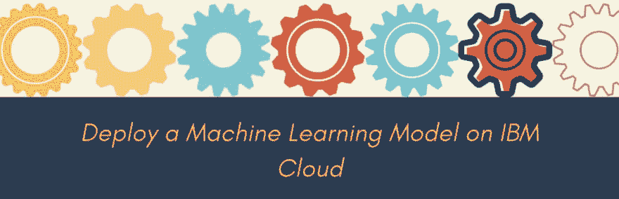](https://res.cloudinary.com/practicaldev/image/fetch/s--b4PAgtL6--/c_limit%2Cf_auto%2Cfl_progressive%2Cq_auto%2Cw_880/https://cdn-images-1.medium.com/max/1024/1%2AOkkUVLS2F18wOvQbJil0Tg.png)

我[上周](https://dev.to/ibmdeveloper/data-science-without-much-coding-that-s-the-future-like-it-or-not-578c)写了数据科学行业如何走向无代码的前景，其中**一些平凡的和度量驱动的任务正在自动化，中间决策正在为数据科学家做出**。不要误解我。作为一名实践数据科学家，您仍然需要了解不同的模型、超参数，并对整个过程有一种直觉。您仍将花费大部分时间清理数据和维护模型。最后，在这些工具成熟到足以获得数据科学家的信任之前，我们将需要一种方法来部署已经过社区审查的手写和开源模型。一个很好的例子是 [IBM 模型资产交易所](https://developer.ibm.com/exchanges/models?cm_mmc=OSocial_Blog-_-Developer_IBM+Developer-_-WW_WW-_-ibmdev-OInfluencer-Medium-USL-ibm-max&cm_mmca1=000037FD&cm_mmca2=10010797)。

因此，让我们来看看我们在上一篇文章中使用 Watson Studio Model Builder 特性自动创建的同一个模型。相反，我们将使用 scikit-learn 创建一个线性回归模型，然后在 IBM Cloud 上保存、部署和管理它。概括地说，我提出了数据科学项目的以下生命周期…

[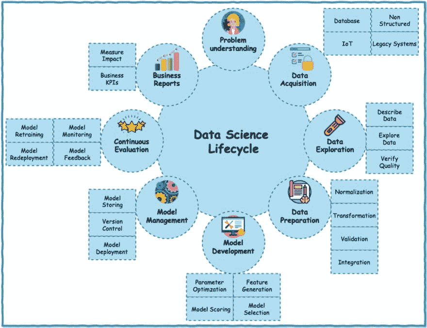](https://res.cloudinary.com/practicaldev/image/fetch/s--UGVlQjRA--/c_limit%2Cf_auto%2Cfl_progressive%2Cq_auto%2Cw_880/https://cdn-images-1.medium.com/max/1024/1%2AacMwkK4ibmtbz6SIDq91gg.jpeg)

和以前一样，我们看到了标有**模型部署和模型管理**的圆圈。为了简洁起见，我故意不对数据集进行任何预处理或清理，并跳过特征选择和模型选择/评分。我们将简单地生成最简单的 scikit-learn **线性回归**模型，如下所示。如果你想把它复制到你的项目中，你可以从这个 [github 库](https://github.com/lidderupk/watson-studio-ml/blob/master/assets/housing-regression.ipynb)中获取代码。

[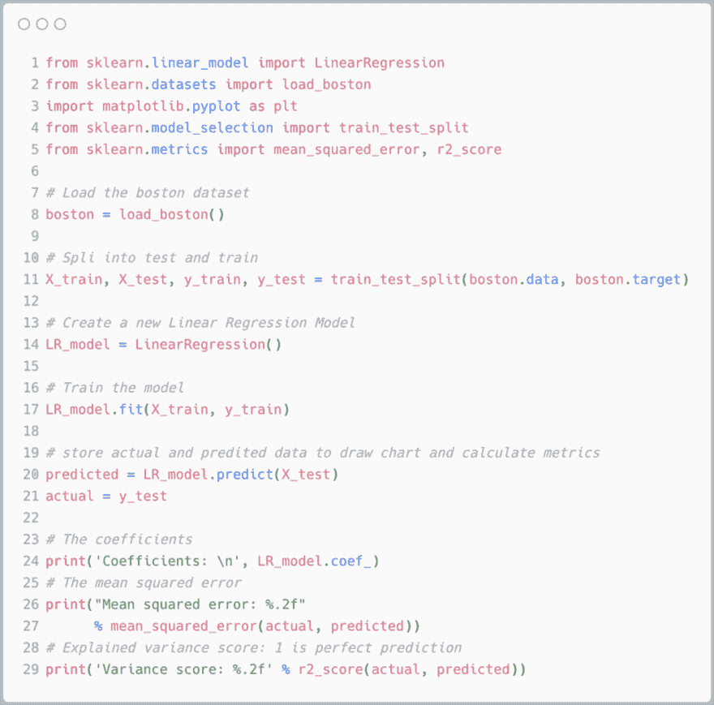](https://res.cloudinary.com/practicaldev/image/fetch/s--ccx1PN6r--/c_limit%2Cf_auto%2Cfl_progressive%2Cq_auto%2Cw_880/https://cdn-images-1.medium.com/max/1024/1%2ASGptN_fdYiNcWc85dhLE5g.png) 

<figcaption>创建线性回归模型</figcaption>

从下面的指标可以看出，这不是最好的模型。但是现在可以了。重点是能够部署您的模型。

```
Coefficients: 
 [ -1.56053402e-01 5.13699772e-02 5.82438860e-02 2.01467441e+00
 -1.80634645e+01 3.87160744e+00 -5.82508110e-03 -1.52533524e+00
 2.88260126e-01 -1.14467685e-02 -9.77473854e-01 9.87278339e-03
 -5.31623043e-01]
Mean squared error: 33.03
Variance score: 0.69 
```

下一步是在 IBM Cloud 上保存模型。下面的代码就是这样做的…

[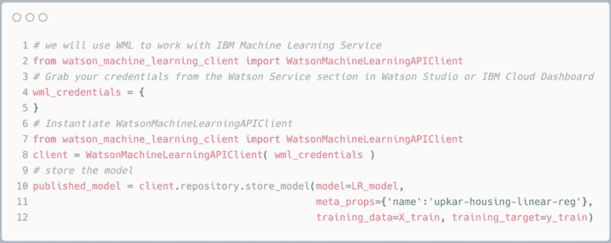](https://res.cloudinary.com/practicaldev/image/fetch/s--SHF_e41X--/c_limit%2Cf_auto%2Cfl_progressive%2Cq_auto%2Cw_880/https://cdn-images-1.medium.com/max/1024/1%2AwlSQz4VSpIrY8XUZ9KRVrQ.png)

同样，如果您想将代码复制到您的项目中，您可以从这个 [github 库](https://github.com/lidderupk/watson-studio-ml/blob/master/assets/housing-regression.ipynb)中获取代码。您可以从您的帐户下的沃森机器学习服务获取您的服务证书，如下所示…

[](https://res.cloudinary.com/practicaldev/image/fetch/s--Brd3xKbU--/c_limit%2Cf_auto%2Cfl_progressive%2Cq_66%2Cw_880/https://cdn-images-1.medium.com/max/1024/1%2AJqbNgOaC5OpkRawY1Eo_Ag.gif)

最后，我们将按如下方式部署模型…

[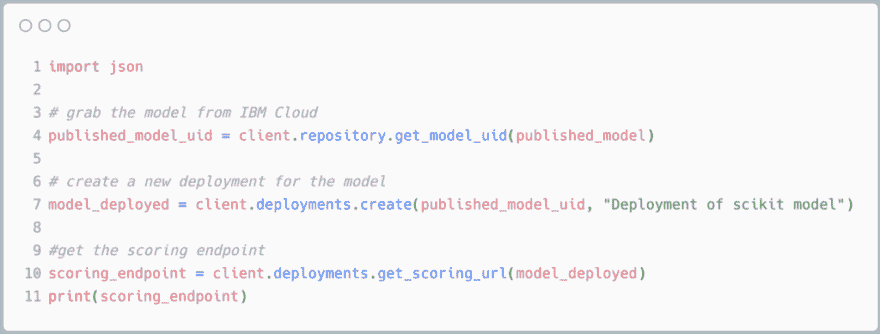](https://res.cloudinary.com/practicaldev/image/fetch/s--N0olUeYx--/c_limit%2Cf_auto%2Cfl_progressive%2Cq_auto%2Cw_880/https://cdn-images-1.medium.com/max/1024/1%2AwtMbrInaOmPahvtONGQaFA.png)

单元应该打印出**初始化**，然后**部署 _ 成功**。它还应该打印出评分网址。我已经把它从下面的截图中删除了。

[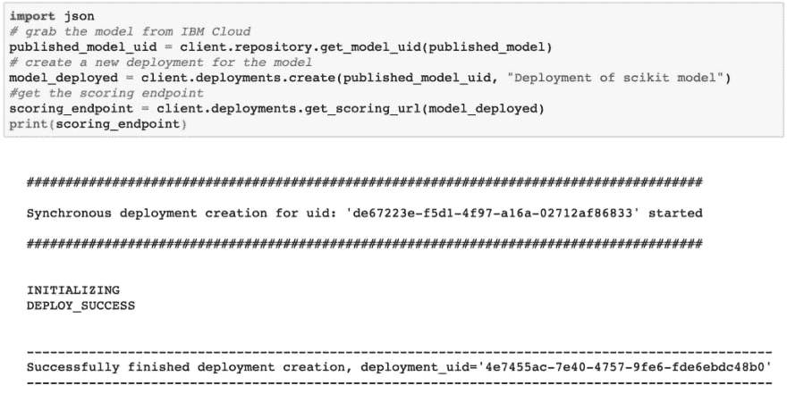](https://res.cloudinary.com/practicaldev/image/fetch/s--VqGfc1JV--/c_limit%2Cf_auto%2Cfl_progressive%2Cq_auto%2Cw_880/https://cdn-images-1.medium.com/max/1024/1%2Anqe8G_YGx7OCt-wTcrtn7w.png)

就是这样！你做到了。您刚刚在 IBM Cloud 上部署了一个 scikit-learn 模型。这不是有史以来最伟大的模式，但嘿，这是你的，你的朋友现在可以使用它！

[](https://res.cloudinary.com/practicaldev/image/fetch/s--ZUw6UxDy--/c_limit%2Cf_auto%2Cfl_progressive%2Cq_66%2Cw_880/https://cdn-images-1.medium.com/max/600/1%2AXZiKlkrcEGAABkm9BsN-sw.gif)

现在，您可以根据模型进行预测/评分，如下所示…

[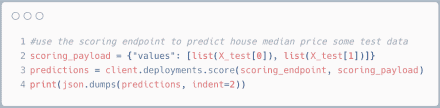](https://res.cloudinary.com/practicaldev/image/fetch/s--wkwJToSD--/c_limit%2Cf_auto%2Cfl_progressive%2Cq_auto%2Cw_880/https://cdn-images-1.medium.com/max/1024/1%2Anfx8kBdjEyPekl1j-PCxpA.png)

最后，为了证明我没有说谎，你应该看看 Watson Studio 中部署的模型。

[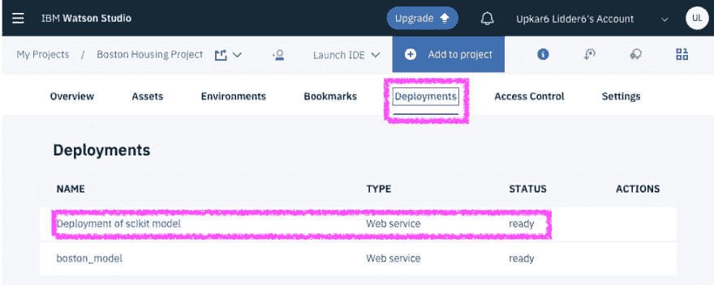](https://res.cloudinary.com/practicaldev/image/fetch/s--Nbk1DwNl--/c_limit%2Cf_auto%2Cfl_progressive%2Cq_auto%2Cw_880/https://cdn-images-1.medium.com/max/986/1%2Ax93sJlexIUGZH4gif_yxUQ.png)

您可以使用部署中的 test 选项卡来测试模型，如下所示…

[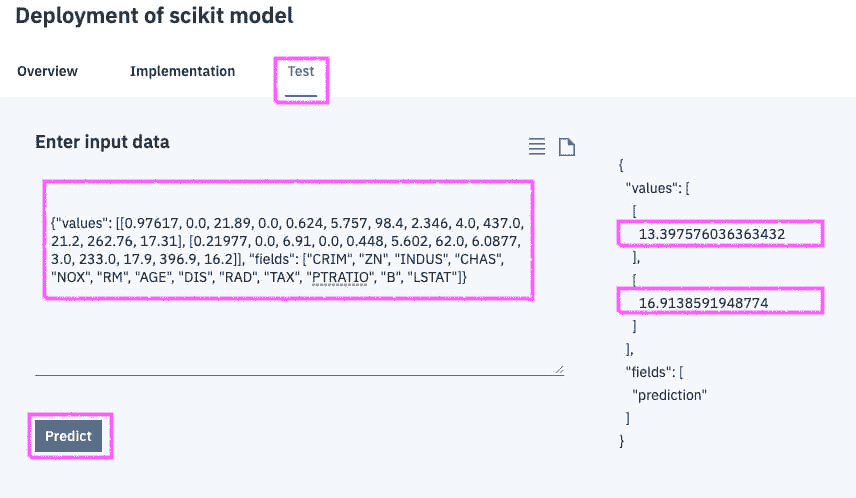](https://res.cloudinary.com/practicaldev/image/fetch/s--WAIVvHr---/c_limit%2Cf_auto%2Cfl_progressive%2Cq_auto%2Cw_880/https://cdn-images-1.medium.com/max/856/1%2AoB4SqacuL245FHns0fKN_A.png) 

<figcaption>检验 scikit-learn 线性回归模型</figcaption>

我从波士顿测试数据中得到 JSON 输入，如下…

```
import json
testjson = {}
testjson['fields'] = list(boston.feature\_names)
testjson['values'] = [list(X\_test[0]), list(X\_test[1])]
json.dumps(testjson) 
```

结果在…

```
{"values": [[0.97617, 0.0, 21.89, 0.0, 0.624, 5.757, 98.4, 2.346, 4.0, 437.0, 21.2, 262.76, 17.31], [0.21977, 0.0, 6.91, 0.0, 0.448, 5.602, 62.0, 6.0877, 3.0, 233.0, 17.9, 396.9, 16.2]], "fields": ["CRIM", "ZN", "INDUS", "CHAS", "NOX", "RM", "AGE", "DIS", "RAD", "TAX", "PTRATIO", "B", "LSTAT"]} 
```

我还用 postman 测试了同一个模型。第一步是从 IBM Cloud 获取令牌

[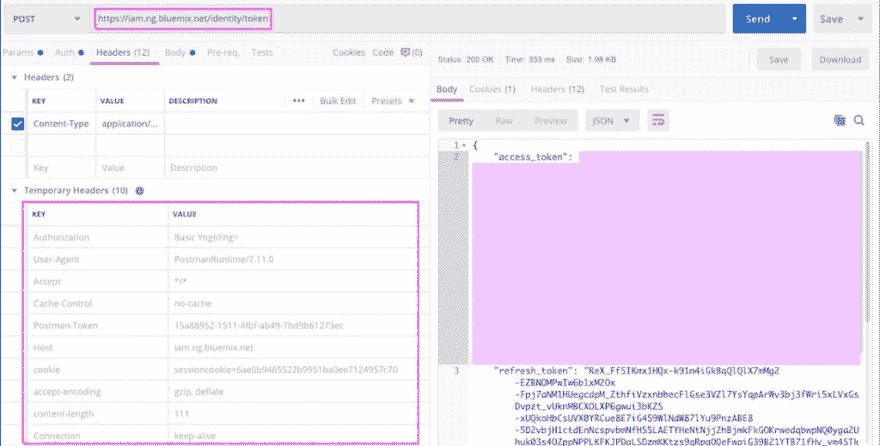](https://res.cloudinary.com/practicaldev/image/fetch/s--ibzH8XWt--/c_limit%2Cf_auto%2Cfl_progressive%2Cq_auto%2Cw_880/https://cdn-images-1.medium.com/max/1024/1%2AdU0xwjzY8R-sleLmdzzQCw.png) 

<figcaption>用邮递员</figcaption>

拿到令牌

第二步是使用评分 URL，使用上面的无记名授权中的令牌进行预测。

[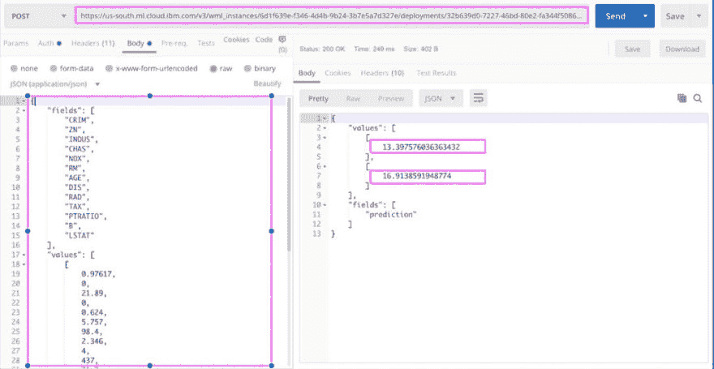](https://res.cloudinary.com/practicaldev/image/fetch/s--qRdpBr8h--/c_limit%2Cf_auto%2Cfl_progressive%2Cq_auto%2Cw_880/https://cdn-images-1.medium.com/max/1024/1%2ANuU2ib9rfESabJQpT85rTw.png) 

<figcaption>用邮递员评分模型</figcaption>

请继续关注本系列的下一篇文章。我们将研究 IBM 的一些开源深度学习模型，并使用 Node-RED 来测试它们。他们很有趣！

后续步骤

1.  注册 IBM Cloud，亲自体验一下吧！——[http://bit.ly/waston-ml-sign](http://bit.ly/waston-ml-sign)
2.  您还可以在[数据科学管道上深入了解员工流失](https://developer.ibm.com/patterns/data-science-life-cycle-in-action-to-solve-employee-attrition-problem?cm_mmc=OSocial_Blog-_-Developer_IBM+Developer-_-WW_WW-_-ibmdev-OInfluencer-Medium-USL-employee-attrition-model-ensemble-learning&cm_mmca1=000037FD&cm_mmca2=10010797)的代码模式。

感谢[亚当·马萨奇](https://medium.com/u/fe353759d0c)在 PyData LA 闲逛并把我介绍给 WML！感谢 [Max Katz](https://medium.com/u/bf01a11701fe) 主持我们的在线聚会。