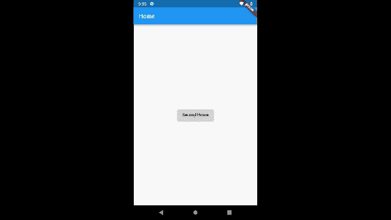

# 颤振:高级路由和导航第一部分

> 原文：<https://dev.to/nitishk72/flutter-advance-routing-and-navigator-part-1-547l>

### 颤振:高级路由和导航器(上)

*   Flutter 高级路由—第 1 部分:仅讨论路由
*   [Flutter Advance Routing —第二部分](https://blog.usejournal.com/flutter-advance-routing-and-navigator-971c1e97d3d2?source=friends_link&sk=eb6af8894f3efe8c8d0e5ca496a3d5a8):仅谈数据共享

首先，我将从基本路由开始。你也可以在 flutter 网站上找到基本路线。

管理多个屏幕的核心概念和类

1.  **Route**:Route 是对一个 app 的“屏幕”或“页面”的抽象，Navigator 是一个管理路线的小部件。
2.  **Navigator** :创建一个维护子部件的基于堆栈的历史的部件。导航器可以推送和弹出路线来帮助用户从一个屏幕移动到另一个屏幕
3.  **素材页路径**:用*平台自适应过渡*替换整个屏幕的模态路径。

> 什么是平台适应性转变？

从一个屏幕转到其他屏幕时看到的过渡。

> **对于 Android** ，页面的入口过渡是向上滑动页面并淡入。退出转换是相同的，但方向相反。

> **对于 iOS** ，页面从右侧滑入，反向退出。当另一页进入覆盖它时，该页也会在视差中向左移动

> 这种转变的发生仅仅是因为 **MaterialPageRoute** 。您也可以修改此过渡。要修改此过渡，您需要使用 MaterialPageRoute 或 PageRouteBuilder。

[https://www.youtube.com/embed/JP54-SQ66UI](https://www.youtube.com/embed/JP54-SQ66UI)

移动应用程序通常显示被称为“屏幕”或“页面”的全屏元素。在 Flutter 中，这些元素被称为**路线**，它们由一个**导航器**小部件管理。导航器管理一堆路由对象，并提供管理堆栈的方法，如 [Navigator.push](https://docs.flutter.io/flutter/widgets/Navigator/push.html) 和 [Navigator.pop](https://docs.flutter.io/flutter/widgets/Navigator/pop.html) 。

> 示例 1:简单路由

在这个例子中，你可以看到我正在使用方法 [Navigator.push](https://docs.flutter.io/flutter/widgets/Navigator/push.html) 路由到新屏幕，使用 [Navigator.pop](https://docs.flutter.io/flutter/widgets/Navigator/pop.html) 返回。

Navigator 维护基于堆栈的路线历史，以及堆栈顶部的任何内容，即我们应用程序中的当前页面。

[**Navigator.push**](https://docs.flutter.io/flutter/widgets/Navigator/push.html) 带两个参数(BuildContext，Route < T >)。在 Route 的地方，我们使用了 **MaterialPageRoute** ，它用一个**平台自适应过渡**代替了整个屏幕。

#### 了解过渡等待明天

```
import 'package:flutter/material.dart';

void main() {
  runApp(MaterialApp(
    home: HomePage(),
  ));
}

class HomePage extends StatelessWidget {
  @override
  Widget build(BuildContext context) {
    return Scaffold(
      appBar: AppBar(
        title: Text('Home'),
      ),
      body: new Center(
        child: RaisedButton(
          onPressed: () {
            Route route = MaterialPageRoute(builder: (context) => SecondHome());
            Navigator.push(context, route);
          },
          child: Text('Second Home'),
        ),
      ),
    );
  }
}

class SecondHome extends StatelessWidget {
  @override
  Widget build(BuildContext context) {
    return Scaffold(
      appBar: AppBar(
        title: Text('Second Hoem'),
      ),
      body: new Center(
        child: RaisedButton(
          onPressed: () {
            Navigator.pop(context);
          },
          child: Text('Go Back'),
        ),
      ),
    );
  }
} 
```

> 示例 2:命名路由

在这个例子中，你可以看到我使用方法 [Navigator.pushNamed](https://docs.flutter.io/flutter/widgets/Navigator/pushNamed.html) 路由到新屏幕，使用 [Navigator.pop](https://docs.flutter.io/flutter/widgets/Navigator/pop.html) 返回。导航器维护基于堆栈路线历史

[**navigator . push named**](https://docs.flutter.io/flutter/widgets/Navigator/pushNamed.html)带两个必选参数(BuildContext，String，{Object})和一个可选参数。代替字符串，我们传递我们在**路线**中预定义的字符串。

如果你对 [expressjs](https://expressjs.com/) 有任何想法，那么它看起来对你来说非常熟悉。

正如我在前面告诉你的，MaterialPageRoute 负责页面转换，在这个完整的代码中，我没有使用这个 MaterialPageRoute，那么你可能很难改变页面转换。

> 我将在这篇文章的后面讨论 **onGenerateRoute** 来帮助你。您可以自定义过渡和命名路线。

```
import 'package:flutter/material.dart';

void main() {
  runApp(MaterialApp(
    initialRoute: '/',
    routes: <String, WidgetBuilder>{
      '/': (context) => HomePage(),
      '/second': (context) => SecondHome(),
    },
  ));
}

class HomePage extends StatelessWidget {
  @override
  Widget build(BuildContext context) {
    return Scaffold(
      appBar: AppBar(
        title: Text('Home'),
      ),
      body: new Center(
        child: RaisedButton(
          onPressed: () {
            Navigator.pushNamed(context, '/second');
          },
          child: Text('Second Home'),
        ),
      ),
    );
  }
}

class SecondHome extends StatelessWidget {
  @override
  Widget build(BuildContext context) {
    return Scaffold(
      appBar: AppBar(
        title: Text('Second Home'),
      ),
      body: new Center(
        child: RaisedButton(
          onPressed: () {
            Navigator.pop(context);
          },
          child: Text('Go Back'),
        ),
      ),
    );
  }
} 
```

这是基本的路由，现在我想告诉你一些关于上面的例子。

1.  如果在您的路线 **'** / **'** 中存在，则不强制定义初始路线。它会将“/”作为初始路径，如果您希望初始路径不同于“/”，那么您可以定义。

> 下面的例子将运行并打开主页

```
MaterialApp(
  routes: <String, WidgetBuilder>{
    '/': (context) => HomePage(),
    '/second': (context) => SecondHome(),
  },
) 
```

1.  初始路线和家是完全一样的，你可以在任何地方使用任何人。你只需要注意，如果你是初始路线，那么你已经定义了**路线**或**路线。**路由中不一定要有“/”。

> 下面的例子将运行并打开第二页

```
MaterialApp(
  home: SecondHome(),
  routes: <String, WidgetBuilder>{
    '/home': (context) => HomePage(),
    '/second': (context) => SecondHome(),
  },
), 
```

1.  如果您想在任何路径不匹配时显示 404 未找到链接错误屏幕，那么您可以使用**未知路径。**

```
MaterialApp(
  home: SecondHome(),
  routes: <String, WidgetBuilder>{
    '/home': (context) => HomePage(),
    '/second': (context) => SecondHome(),
  },
  onUnknownRoute: (RouteSettings setting) {
    # To can ask the RouterSettings for unknown router name.
    String unknownRoute = setting.name ;
    return new MaterialPageRoute(
                builder: (context) => NotFoundPage()
    );
  }
), 
```

> 示例 3 : onGenerateRoute

这里你可以看到我正在使用 **MaterialPageRoute** ，现在你可以很容易地修改过渡动画。在这种情况下，您不需要在 GenerateRoute 上创建路线，它会为您创建路线。从技术上来说，路由是存在的，但不是由您初始化的。

> onGenerateRoute:为给定的路线设置
> 创建一条路线

```
MaterialApp(
  home: SecondPage(),
  onGenerateRoute: (RouteSettings settings) {
    switch (settings.name) {
      case '/':
        return MaterialPageRoute(builder: (context)=> HomePage());
        break;
      case '/second':
        return MaterialPageRoute(builder: (context)=> SecondPage());
        break;
    }
  },
), 
```

这是一个完整的自定义屏幕过渡。您可以在 IDE 中复制并粘贴以查看示例。请记住，当您更改页面过渡时，所有操作系统都会发生变化。默认转换取决于平台。

> 带演示的完整源代码

[](https://res.cloudinary.com/practicaldev/image/fetch/s--WAJD4PRc--/c_limit%2Cf_auto%2Cfl_progressive%2Cq_66%2Cw_880/https://cdn-images-1.medium.com/max/640/1%2AwE04wcG1kk-_G9_GqpzIcg.gif)T3】

```
import 'package:flutter/material.dart';

void main() {
  runApp(
    MaterialApp(
      home: HomePage(),
      onGenerateRoute: (RouteSettings settings) {
        switch (settings.name) {
          case '/':
            return SlideRightRoute(widget:HomePage());
            break;
          case '/second':
            return SlideRightRoute(widget:SecondHome());
            break;
        }
      },
    ),
  );
}
class HomePage extends StatelessWidget {
  @override
  Widget build(BuildContext context) {
    return Scaffold(
      appBar: AppBar(
        title: Text('Home'),
      ),
      body: new Center(
        child: RaisedButton(
          onPressed: () {
            Navigator.pushNamed(context, '/second');
          },
          child: Text('Second Home'),
        ),
      ),
    );
  }
}
class SecondHome extends StatelessWidget {
  @override
  Widget build(BuildContext context) {
    return Scaffold(
      appBar: AppBar(
        title: Text('Second Home'),
      ),
      body: new Center(
        child: RaisedButton(
          onPressed: () {
            Navigator.pop(context);
          },
          child: Text('Go Back'),
        ),
      ),
    );
  }
}

class SlideRightRoute extends PageRouteBuilder {
  final Widget widget;
  AppSlideRightRoute({this.widget})
      : super(
    pageBuilder: (BuildContext context, Animation<double> animation,
        Animation<double> secondaryAnimation) {
      return widget;
    },
    transitionsBuilder: (BuildContext context,
        Animation<double> animation,
        Animation<double> secondaryAnimation,
        Widget child) {
      return new SlideTransition(
        position: new Tween<Offset>(
          begin: const Offset(1.0, 0.0),
          end: Offset.zero,
        ).animate(animation),
        child: child,
      );
    },
  );
} 
```

你可以关注我，了解我的活动。

*   [nitishk72 -概述](https://github.com/nitishk72/)
*   [尼提什·库马尔·singh🇮🇳(@尼提什克 72_) |推特](https://twitter.com/nitishk72_)
*   尼提什·库马尔·辛格——开发者——GDG·贾朗德哈尔| LinkedIn

> 我想我需要写这篇文章的第二部分，因为还有很多内容要讲。

如果你喜欢或学到了什么，请在任何地方的推特上告诉我

* * *