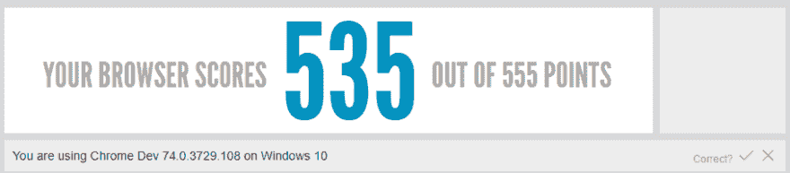
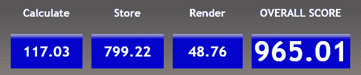
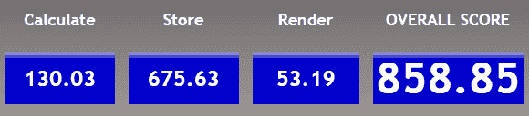

# 进入铬叉的勇敢新世界！

> 原文：<https://dev.to/koskila/enter-the-brave-new-world-of-chromium-forks-3llp>

阅读时间:6 分钟。

我正在为我的内容尝试一种新的、更长的格式——在下面的评论区告诉我你的想法！

这篇文章解释了我发现的唯一一种冷静的加密货币举措之一——基本注意力令牌——以及与之紧密结合的浏览器 Brave。这不是一篇非常技术性的文章，而是一篇从用户角度出发的实用概述，还夹杂着一些政治性的闲聊。

**注意:**如果你只想跳过所有戏谑，下载诘问浏览器，[点击这个](https://www.koskila.net/?p=3302#download)。

## 前言

就不同的加密货币而言，在过去几年中有过几次跌宕起伏。疯狂的牛市见证了郁金香狂热般的热潮，投资于任何被称为**ICO**(**初始硬币发行**的简称)的东西，主要是由外行人投资，他们对加密货币了解很多，但足够贪婪以追逐快钱，并且没有足够的教育来审查项目。我不打算更深入地研究行为科学或经济学，但我承认我对这种趋势非常反感，我屏蔽了几十个“密码骗子”和#HODLGANG 的成员。

无论如何，让我们不要谈政治——我发现加密货币很吸引人，但没有多少项目看起来足够可持续和/或方便来激发我的兴趣。我在几种主要货币中的少量头寸不应该足以让我过于偏颇——但我的立场一直是，这支大篷车中的大多数跟风者只是掉下了悬崖，而不是飞向月球。

我不感兴趣的一个重要原因也是芬兰的税法，它似乎讨厌加密货币，让合法拥有和交易加密货币成为一种痛苦……但我们也不要走到那一步——这是另一场等待发生的政治斗争！

你开始看到这里的模式了吗？因为这是我注意到的加密货币的一个不幸之处:即使我们完全忘记了所有的投机取巧者，加密领域的许多话题都是高度分裂的、极端的和非构象的。虽然这确实提供了一些非常有趣的辩论和非常有趣的播客，但它并没有那么有建设性。它不会累积…任何东西。或者任何人。

这就是为什么我决定远离关于密码领域的原则和政治的争论，而纯粹专注于实用价值。

这让我想到了这篇文章的主题(花了我一些时间，嗯？):勇者浏览器，以及**蝙蝠**、**基础注意力令牌**。

## BAT 是什么？

BAT 是加密货币项目中少有的有意义的例子。这不是唯一的一个(甚至不接近)，但它确实有很多可取之处——我将在这里快速浏览一下。

那蝙蝠是什么？这是一个开源的、去中心化的广告交换平台，建立在**以太坊**平台上。代币旨在重视和奖励平台内用户的关注。简而言之:广告主为了吸引用户的注意力，向网站发布者支付 BAT。

BAT 生态系统包括 Brave，这是一个开源的、以隐私为中心的浏览器，旨在阻止追踪器和恶意软件。它是基于 Chromium 构建的，开源引擎 Google Chrome 也是基于 Chromium 构建的。然而，尽管 Chrome 是为了尽可能多地收集用户信息以用于广告目的(像大多数谷歌产品一样)，但 Brave 是为了隐私和可持续的广告商业模式而建立的，消费者在其中也扮演着积极的角色。这与其他一些平台形成鲜明对比，在这些平台上，消费者只是牛。

它利用区块链技术来匿名和安全地跟踪用户的注意力，并相应地奖励发布者。最终，该项目旨在解决数字广告中的欺诈和不透明问题，同时让广告对各方都具有商业可行性。

## 勇者喜欢用什么？

这款浏览器时尚、速度相对较快，并且内置了一个很棒的广告拦截器(他们在谷歌之前就已经这么做了，而且做得比谷歌好得多)。虽然谷歌隐藏了一些竞争对手，以进一步巩固其地位，但 Brave 同样删除了所有内容——最近，谷歌正在删除大多数广告拦截器扩展使用的 API，因此浏览器的广告拦截能力之间的差异似乎只会越来越大。

好吧，这些都很酷，但不可否认的是，这些都没那么有趣。需要更酷的东西来使浏览器成为一个可行的选择，对吗？一些实际上有用的噱头，使它区别于其他铬叉？

嗯，幸好有！

Brave 有趣的地方在于**内置的小费系统**:根据你在 we 网站上花费的时间和你的手动操作，你可以使用内置的加密货币 BAT 给内容创作者和网站小费。

勇敢奖励小费菜单的一个例子——除非你想，否则你实际上永远不需要访问它，因为这个过程几乎是自动的！

虽然这款浏览器总体来说使用起来很愉快(它拥有谷歌 Chrome 的优点，加上更好的性能、蝙蝠和广告拦截)，但小费非常容易，也是一个不错的补充。

使用 BATs 很容易，入门也做得很好——你确实需要创建一个本地加密货币钱包，但浏览器会引导你完成这个过程。

我还注册成为了一名发布者——这是另一个简单的过程——从访问我网站的人那里接收提示。这很有效:虽然还没有那么多勇敢的用户，但是那些使用浏览器的用户似乎给了很多小费！

总而言之，浏览器最大的好处是它(相当)独立于其他厂商。谷歌已经统治了足够大的互联网份额，所以我们不需要他们窥探我们。

### 勇者的表现令人印象深刻

那么，与竞争对手相比，这款浏览器表现如何呢？嗯，看下面几个考试成绩…

Html5test 在其 HTML5 功能中给了 Brave 535/555 分——就像它对最新版本的 Chrome 所做的那样。现在分歧在那里，那么，[https://html5test.com/index.html](https://html5test.com/index.html)

在开始之前，我阅读了其他人的经验。像 Verge 这样的网站似乎证实了我最初的想法:即使它们是用相同的核心构建的，实现也有足够的差异，因此 Brave 和 Chrome 之间存在性能差异:

> Brave 确实比 Chrome 快，而且因为它的其他行为和 Chrome 一样，所以它是我使用的最快的浏览器。––Chrome 和 Vivaldi 是相似的，尽管 Vivaldi 需要更长的时间来启动，对我来说，这很重要，因为我经常退出浏览器来清除一大堆标签，然后重新启动它。Firefox 仍然是最慢的选择，在基准测试中表现最差。
> 
> [边缘](https://www.theverge.com/2019/3/4/18249623/brave-browser-choice-chrome-vivaldi-replacement-chromium)

然后我测试了 speed-battle.com 的表现。公平地说，结果差异很大，所以我认为这相当不可靠——但在连续进行的测试中，Brave 从未得到比 Chrome 更差的结果，而是以高出 30-300 分的总分击败了它(取决于运行情况，相差 5-30 %)。

Brave 获得了比最新的 Chrome 版本更好的性能评级。在该地点进行测试:[http://www.speed-battle.com/speedtest_e.php](https://www.speed-battle.com/speedtest_e.php)

将此与最新的 Chrome 进行比较:

最新的 Chrome build(版本 74.0.3729.169(正式版)(64 位))成绩不断比 Brave 差 30-300 分。[http://www.speed-battle.com/speedtest_e.php](http://www.speed-battle.com/speedtest_e.php)

请注意，像这样的测试不会很有说服力。反正**在实践和日常使用中，勇者是滑头**。我想这才是最重要的。

* * *

## 试勇敢？

勇敢很酷——如果你想试试，你可以从这里下载:[https://brave.com/kos048](https://brave.com/kos048)

如果你从上面的链接下载浏览器，并开始使用它，我会得到一些奖励。这也是支持网站的好方法——随着流量在过去几个月里成倍增长，我的主机也变得越来越贵。所以，谢谢你的考虑！:)

#### 与“进入铬叉的勇敢新世界！”：

*   微软许可证欺诈的可怕剖析([https://www . KOS Kila . net/the-terrible-Anatomy-of-a-Microsoft-License-Fraud/](https://www.koskila.net/the-scary-anatomy-of-a-microsoft-license-fraud/))
*   SharePoint 本地化——全面的操作指南！([https://www.koskila.net/how-to-sharepoint-localization/](https://www.koskila.net/how-to-sharepoint-localization/)
*   为 SharePoint 网站集启用自定义脚本的 5 种方法([https://www . KOS Kila . net/how-to-enable-Custom-Scripts-for-a-SharePoint-online-site-collection/](https://www.koskila.net/how-to-enable-custom-scripts-for-a-sharepoint-online-site-collection/))

进入铬叉的美丽新世界！作者[安提·k·科斯凯拉](https://www.koskila.net/author/koskila/)最先出现在 [#SharePointProblems](https://www.koskila.net) 。

这篇文章是从 Koskila.net 的 RSS 提要中自动抓取的，然后被修改以更好地在这个频道中工作——所有这些都是相当实验性的。