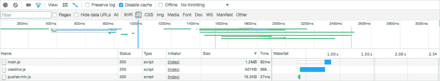
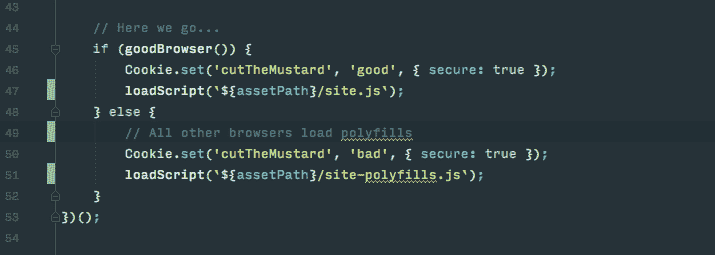

# 渐进式增强的性能优势

> 原文：<https://dev.to/browserlondon/the-performance-benefits-of-progressive-enhancement-258e>

[渐进式增强](https://www.browserlondon.com/blog/2012/10/23/what-is-progressive-enhancement/)致力于为所有用户提供核心的“设备无关”体验。从一个随处可用的坚实基础开始——HTML——我们确保我们的应用程序适用于尽可能广泛的受众。这鼓励我们将应用程序缩减到它们的*基本*功能，无论是阅读新闻还是发送和接收信息。一旦我们确信这种核心体验对每个人都有用，我们就可以开始[层的造型](https://www.browserlondon.com/blog/2015/04/07/theming-with-sass/)和交互，为支持它的设备提供更好的体验。

<figure> 

<figcaption>简单的 HTML，前后 CSS 和 JavaScript。</figcaption>

</figure>

虽然渐进式增强是内容驱动网站的一种流行技术，但它在现代网络应用程序中经常被忽略，因为它降低了更“动态”的功能的优先级，这些功能可能无法在旧设备上工作。然而，虽然渐进增强的主要优势传统上被认为是可靠性和兼容性，但采用 PE 友好的心态也有许多性能优势，这使得它更值得在您的下一个应用程序中考虑。

## 更快的互动时间

许多现代应用利用客户端框架(如 [Angular](https://angularjs.org/) 和 [React](https://facebook.github.io/react/) )来提供他们的“核心”体验。这通常需要将完整的应用程序下载到设备上才能使用，从而导致用户在较慢的连接上长时间延迟。

<figure> 

<figcaption>一个大型 JavaScript 捆绑包延迟了交互时间。</figcaption>

</figure>

虽然客户端呈现对于回头客或动态特性来说很好，但提供简单的 HTML 仍然是将应用程序送到用户手中的最快方式。无需等待下载和执行大文件——您可以立即使用没有任何依赖性的 HTML。从简单的 HTML/CSS 开始，你让你的用户尽快与你的应用程序交互。

## 非阻塞字体加载

网络字体近年来变得非常流行，但是加载它们的最佳方式仍然是一个有争议的问题。当浏览器下载字体时，立即将它们提供给每个人可能会导致臭名昭著的不可见文本的“[闪烁](https://css-tricks.com/fout-foit-foft/)，这在一些浏览器(如 iOS Safari)上导致不可见内容，只要字体需要下载。

<figure> 

<figcaption>它就在那里，你只是看不见而已。</figcaption>

</figure>

相反，我们可以使用已经可用的“系统”字体(如 Arial ),然后只在我们确定我们的自定义字体已经准备好并受支持时才替换它。这意味着无论设备或网络能力如何，内容将始终可见。这可能会在第一次访问时分散注意力，因为字体会在几秒钟后明显改变，但这比隐藏内容更好。

这是渐进增强的基本原则——从可靠快速的体验开始，然后尽可能“分层”增强。

## 有条件加载

网络上一些最令人印象深刻的功能模仿了本地应用，比如实时聊天和“所见即所得”编辑器。不幸的是，这些通常是非常大和复杂的文件，通常是 JavaScript，这导致了较慢的站点和较大的下载。

采用 PE 友好的方法意味着确保这些动作背后的核心功能(例如输入内容、发送表单)不依赖于外部文件或 JavaScript。然后，在后台，我们可以“逐步”加载这些功能的增强版本，并在准备就绪时将它们换出。更好的是，我们可以仅在相关的时加载这些资产*，而不是(例如)如果页面上没有所见即所得编辑器。*

<figure> 

<figcaption>一个简单的文本区域，点击</figcaption>

</figure>

时成为所见即所得的编辑器

这意味着用户不需要等待应用程序中的核心功能。如果他们使用慢速设备或网络连接，他们仍然可以使用简单版本的功能，无需等待。

## 有选择性

我们可以通过更有选择性地选择谁来接收“增强”特性，从而进一步有条件地加载这些特性。

许多旧浏览器对现代功能的支持很差，经常需要添加大型的帮助程序库(称为“polyfills”)来填补空白。这通常意味着为访问者提供比他们需要的更大的文件，只是为了迎合最小的公分母。

相反，我们可以采用 BBC 称之为“[切芥末](http://responsivenews.co.uk/post/18948466399/cutting-the-mustard)的技术。当我们的网站加载时，我们可以运行一个简单的测试，检查“现代”功能的存在，然后根据结果加载适当的文件。现代的浏览器得到现代的代码，旧的浏览器得到更大的向后兼容的代码，而*非常*旧的浏览器没有得到任何增强。

通过预先检查，我们可以确保用户只下载和运行适当的代码。更好的是，由于基本功能在没有增强功能的情况下仍然可用，用户仍然可以在后台与页面进行交互。

## 还有一件事

当然，逐渐增强的应用程序还有许多其他好处。你的应用程序将更能容忍错误——如果一个奇特的新功能出了问题，你的用户很有可能仍然能够用“基本”版本完成他们的任务。

渐进式增强也有助于节省跨设备测试的时间，因为您可以放心地知道，您的应用程序只会在受支持的功能上分层。几乎每个人都保证有功能性体验，不管是什么浏览器或设备。

尽管每个人都赞赏更好的性能和弹性，渐进增强仍然是一个有争议的问题。一些开发人员认为这种方法限制了他们提供动态体验的能力，尤其是那些模仿本地应用程序的体验。许多现代工具和框架，如 React 和 Angular，完全是用 JavaScript 编写的。虽然这些提供了快速的“类似应用程序”的体验，但它们也(通常)不适用于禁用 JavaScript 的客户，或者解析脚本有问题的客户。其他人认为渐进增强的未来在于网络弹性，由于基于[服务工作者](https://developers.google.com/web/fundamentals/getting-started/primers/service-workers)的 [PWAs](https://www.browserlondon.com/blog/2019/04/15/current-state-progressive-web-app-pwa/) 等新技术，确保页面“离线”工作。

像所有的技术和方法一样，渐进式改进不需要教条式地遵循，与其说是规则，不如说是指导方针。然而，这是一种有价值的思维方式，可以帮助所有用户改进您的应用程序，而不仅仅是那些速度较慢或功能较弱的设备上的用户。

* * *

帖子[渐进增强的性能优势](https://www.browserlondon.com/blog/2017/03/14/performance-benefits-progressive-enhancement/)首先出现在[浏览器伦敦](https://www.browserlondon.com)上。